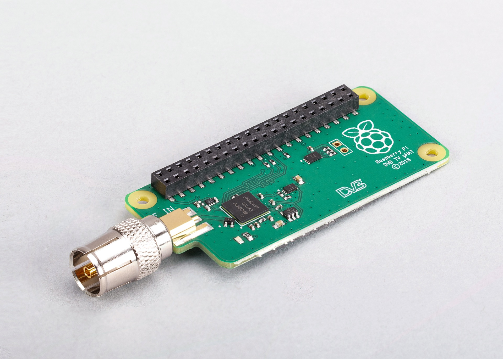
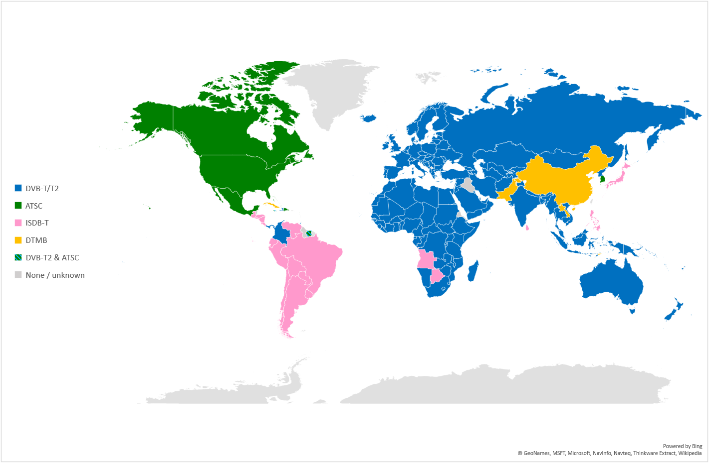

== About the TV HAT

.The Raspberry Pi TV HAT

The Raspberry Pi TV HAT allows you to receive digital terrestrial TV broadcast systems, using an onboard DVB-T and DVB-T2 tuner, on a Raspberry Pi. With the board you can receive and view TV on a Raspberry Pi, or create a TV server that allows you to stream received TV over a network to other devices. The TV HAT can be used with any 40-pin Raspberry Pi board as a server for other devices on the network. Performance when receiving and viewing TV on the Pi itself can vary, and we recommend using a Raspberry Pi 2 or later for thi spurpose

Key features:

* Sony CXD2880 TV tuner
* Supported TV standards: DVB-T2, DVB-T
* Reception frequency: VHF III, UHF IV, UHF V
* Channel bandwidth:
** DVB-T2: 1.7MHz, 5MHz, 6MHz, 7MHz, 8MHz
** DVB-T: 5MHz, 6MHz, 7MHz, 8MHz

== About DVB-T

WARNING: The TV HAT does not support ASTC, the digital TV standard used in North America.

Digital Video Broadcasting – Terrestrial (DVB-T) is the DVB European-based consortium standard for the broadcast transmission of digital terrestrial television. There are other digital TV standards used elsewhere in the world, e.g. ATSC which is used in North American. However the TV HAT only supports the DVB-T and DVB-T2 standards.

.DTT system implemented or adopted (Source: DVB/EBU/BNE DTT Deployment Database, March 2023)

== Setup Instructions

Follow our xref:../computers/getting-started.adoc[getting started] documentation and set up the Raspberry Pi with the newest version of Raspberry Pi OS operating system

Connect the aerial adaptor to the TV HAT and with the adaptor pointing away from the USB ports, press the HAT gently down over the Raspberry Pi's GPIO pins, and place the spacers at two or three of the corners of the HAT, and tighten the screws through the mounting holes to hold them in place. Then connect the TV HAT's aerial adaptor to the cable from your TV aerial.

The software we recommend to decode the streams (known as multiplexes, or muxes for short) and view content is called TVHeadend. The TV HAT can decode one mux at a time, and each mux can contain several channels to choose from. Content can either be viewed on the Raspberry Pi to which the TV-HAT is connected, or sent to another device on the same network.

Boot your Raspberry Pi and then go ahead open a terminal window, and run the following two commands to install the `tvheadend` software:

[source, bash]
----
$ sudo apt update
$ sudo apt install tvheadend
----

During the `tvheadend` installation, you will be asked to choose an administrator account name and password. You'll need these later, so make sure to pick something you can remember.

On another computer on your network, open up a web browser and type the following into the address bar: `http://raspberrypi.local:9981/extjs.html`

This should connect to `tvheadend` running on the Raspberry Pi. Once you have connected to `tvheadend` via the browser, you will be prompted to sign in using the account name and password you chose when you installed `tvheadend` on the Raspberry Pi. 

A setup wizard should appear.

You will be first ask to set the language you want `tvheadend` to use, and then to set up network, user, and administrator access. If you don't have specific preferences, leave *Allowed network* blank, and enter an asterisk (*) in the *username* and *password* fields. This will let anyone connected to your local network access `tvheadend`.

You should see a window titled *Network settings*. Under *Network 2*, you should see `Tuner: Sony CDX2880 #0 : DVB-T #0`. For *Network type*, choose `DVB-T Network`. The next window is *Assign predefined muxes to networks*; here, you select the TV stream to receive and decode. Under Network 1, for predefined muxes, select your local TV transmitter.

NOTE: Your local transmitter can be found using the https://www.freeview.co.uk/help[Freeview website]. Enter your postcode to see which transmitter should give you a good signal.

When you click *Save & Next*, the software will start scanning for the selected mux, and will show a progress bar. After about two minutes, you should see something like:

[source, bash]
----
Found muxes: 8
Found services: 172
----

In the next window, titled *Service mapping*, tick all three boxes: *Map all services*, *Create provider tags*, and *Create network tags*. You should see a list of TV channels you can watch, along with the programmes they're currently showing. 

To watch a TV channel in the browser, click the little TV icon to the left of the channel listing, just to the right of the *i* icon. This brings up an in-browser media player. Depending on the decoding facilities  built into your browser and the type of stream being played, you may find that playback can be jerky. In these cases, we recommend using a local media player as the playback application.

To watch a TV channel in a local media player, e.g. https://www.videolan.org/vlc[VLC], you'll need to download it as a stream. Click the `i` icon to the left of a channel listing to bring up the information panel for that channel. Here you can see a stream file that you can download.

NOTE: `tvheadend` is supported by numerous apps, such as TvhClient for iOS, which will play TV from the Raspberry Pi.
