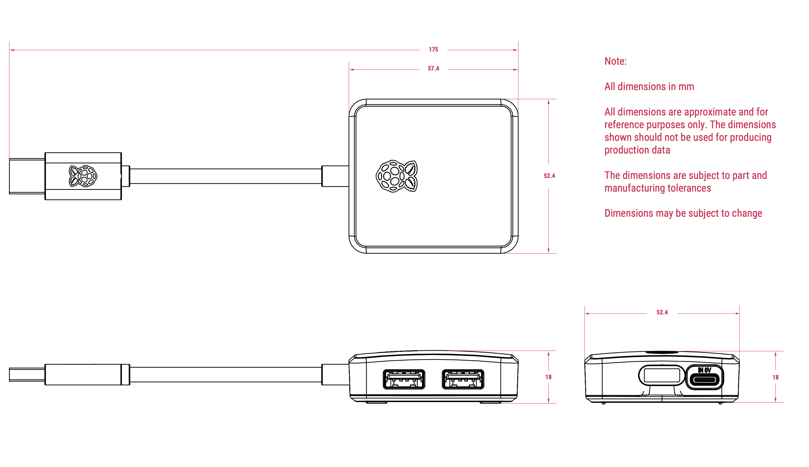

== About

The https://www.raspberrypi.com/products/usb-3-hub/[Raspberry Pi USB 3 Hub] provides extra connectivity for your devices, extending one USB-A port into four. An optional external USB-C power input supports high-power peripherals. You can use the USB 3 Hub to power low-power peripherals, such as most mice and keyboards, using no external power.

.The Raspberry Pi USB 3.0 Hub
image::images/usb-3-hub-hero.png[width="80%"]

== Specification

* 1× upstream USB 3.0 Type-A male connector on 8 cm captive cable
* 4× downstream USB 3.0 Type-A ports
* Data transfer speeds up to 5Gbps
* Power transfer up to 900 mA (4.5 W); optional external USB-C power input provides up to 5V @ 3A for high-power downstream peripherals
* Compatible with USB 3.0 and USB 2.0 Type-A host ports

.Physical specification

