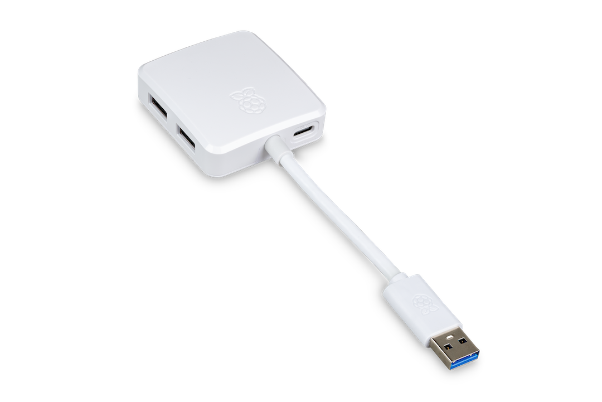
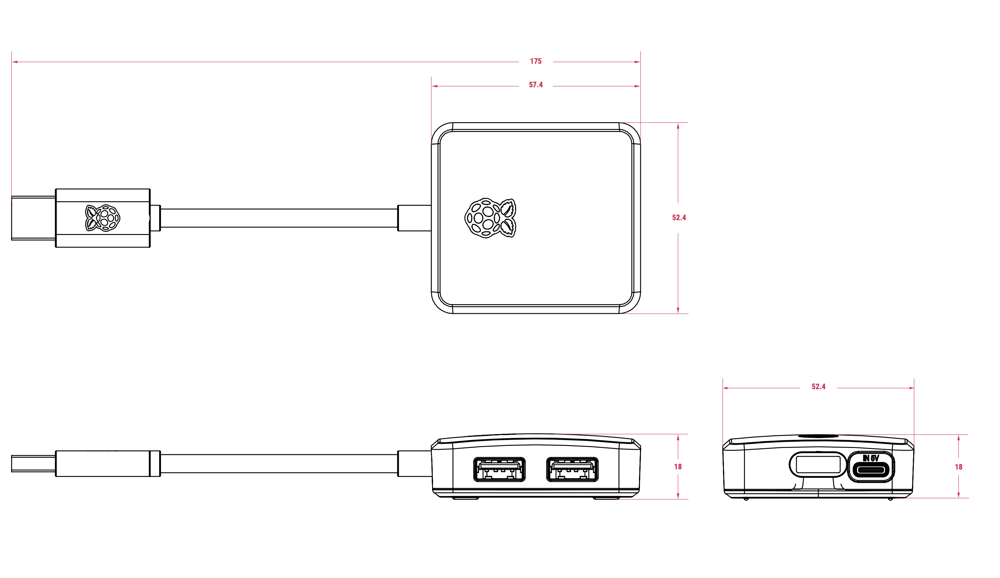
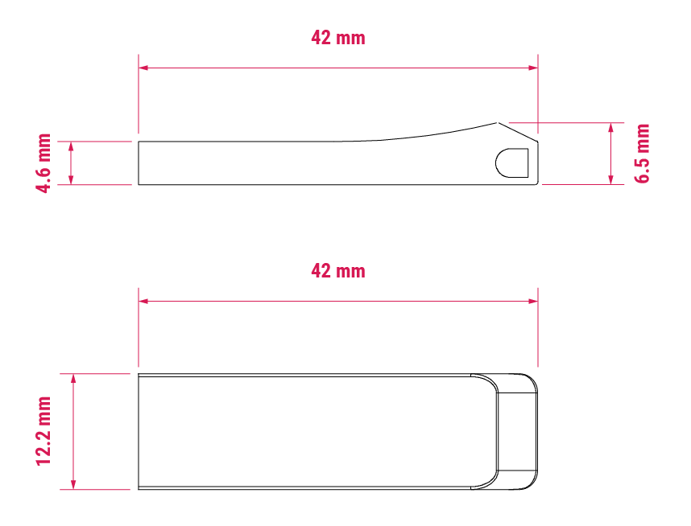

Raspberry Pi offers the following high-quality, reliable USB accessories for use with Raspberry Pi and other computers:

* Raspberry Pi <<hub>> for expanding USB connectivity.
* Raspberry Pi <<flashdrive>> for portable storage.

[[hub]]
== USB 3 Hub

The Raspberry Pi USB 3 Hub provides extra connectivity to your devices by extending one USB-A port into four USB-A ports. Devices connected through the USB 3 Hub are recognised as if they were connected directly to the host system, whether that's a Raspberry Pi device or other computers.

When bus-powered, the USB 3 Hub can draw up to 900 mA (4.5 W) of power from its upstream USB port. This 4.5 W is shared across all four downstream USB 3.0 ports, which is sufficient for low-power peripherals, such as most mice and keyboards.

To support high-power peripherals and devices, the USB 3 Hub also includes an optional USB-C power input that can be used to provide external power to the downstream ports if needed.

.The Raspberry Pi USB 3 Hub

=== USB 3 Hub features
The Raspberry Pi USB 3 Hub provides USB expansion, with high-speed data transfer, flexible power options, and compatibility with USB 3.0 and USB 2.0 ports. Key specifications related to these features are summarised in the following table.

.Raspberry Pi USB 3 Hub features and corresponding specifications
[cols="1,3", options="header"]
|===
|Feature |Specification

|*USB expansion*
|Provides four downstream USB 3.0 Type-A ports; an upstream USB 3.0 Type-A connector on an 8 cm captive cable.

|*Speed*
|Provides data transfer speeds up to 5 Gb/s.

|*Power*
|Supplies up to 900 mA at 5 V (4.5 W) drawn from the device the hub is connected to; when self-powered through the optional USB-C power input, supplies up to 5 V at 3 A (15 W).

|*Compatibility*
|Works with USB 3.0 Type-A ports and is backward compatible with USB 2.0.
|===

=== USB 3 Hub dimensions

The following image depicts the approximate physical dimensions of the Raspberry Pi USB 3 Hub in millimetres (mm). Including the cable and USB-A connector, the total length is approximately 175 mm. The hub itself is approximately 57.4 mm × 52.4 mm × 18 mm.

.Mechanical diagram of the Raspberry Pi USB 3 Hub; all measurements are approximate and in millimetres (mm); the dimensions shown are subject to change and not to be used for production purposes

[[flashdrive]]
== Flash Drive

The Raspberry Pi Flash Drive is a USB 3.0 memory stick that provides portable storage for transferring files, creating backups, or running operating systems. The Flash Drive is available in two storage capacities (128 GB or 256 GB) and uses non-volatile flash memory to retain data when disconnected.

.The Raspberry Pi Flash Drive
image::images/flash-drive-hero.png[width="80%"]

=== Flash Drive features

The Raspberry Pi Flash Drive is lightweight and travel-friendly, with a compact, metal design that can attach to a keyring or lanyard. It provides portable storage with reliable performance for both capacity options, and is compatible with USB 3.0 and USB 2.0. Key specifications related to these features are summarised in the following table.

.Raspberry Pi Flash Drive features and corresponding specifications
[cols="1,3", options="header"]
|===
|Feature |Specification

|*Compact form factor*
|Weighs less than 6 grams; for dimensions, see <<flashdrive-dimensions>>.

|*Storage options*
|Available in 128 GB and 256 GB capacities using non-volatile flash memory.

|*Performance*
|Varies depending on storage capacity. For details, see <<performance, Table 3>>.

|*Compatibility*
|Works with USB 3.0 Type-A ports and is backward compatible with USB 2.0.
|===

The Flash Drive is capable of high input/output operations per second (IOPS) for fast access to small files. It also offers responsive performance for computing tasks such as booting operating systems and running applications. The following table summarises the key performance features of the Raspberry Pi Flash Drive based on whether you choose the 128 GB or the 256 GB storage capacity option.

[[performance]]
.Raspberry Pi Flash Drive performance features based on the chosen storage capacity
[cols="2,1,1", options="header"]
|===
|Performance feature |128 GB |256 GB

|*4 kB random reads*
|16,000 IOPS
|18,000 IOPS

|*4 kB random writes*
|21,000 IOPS
|22,000 IOPS

|*Sequential write speed (sustained)*
|75 MB/s
|150 MB/s
|===

[[flashdrive-dimensions]]
=== Flash Drive dimensions

The following image depicts the approximate physical dimensions of the Raspberry Pi Flash Drive in millimetres (mm). The Flash Drive is approximately 42 mm × 12.2 mm. At its thickest, the Flash Drive is approximately 6.5 mm high; at its thinnest (the USB end), the Flash Drive is approximately 4.6 mm.

.Mechanical diagram of the Raspberry Pi Flash Drive; all measurements are approximate and in millimetres (mm); the dimensions shown are subject to change and not to be used for production purposes
