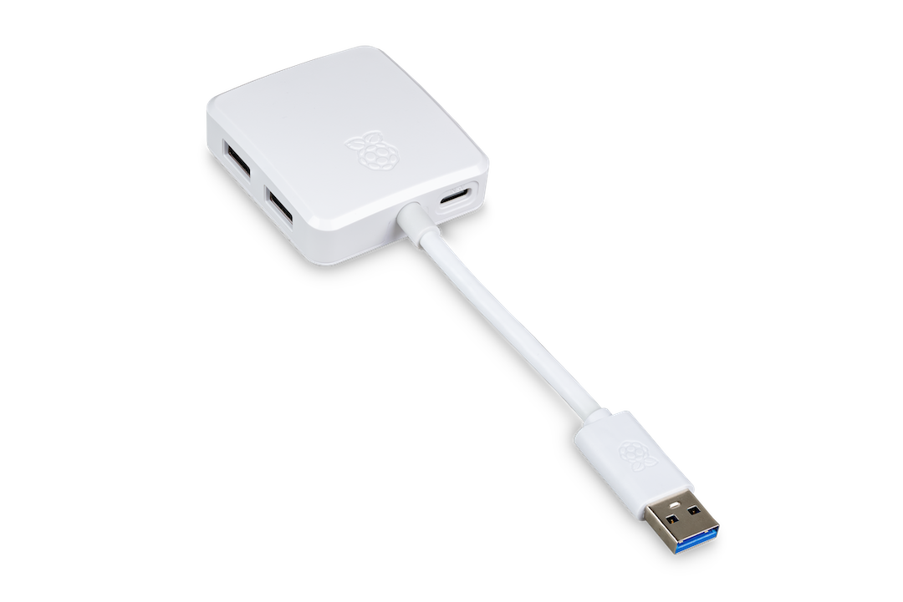
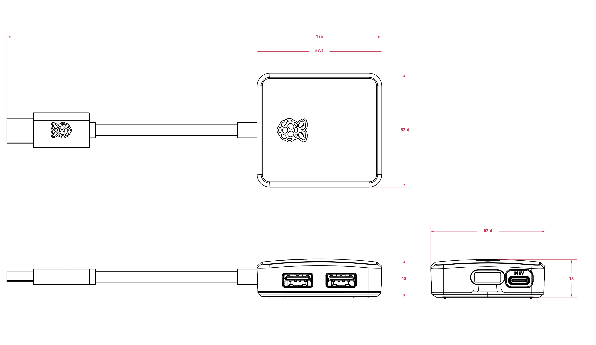
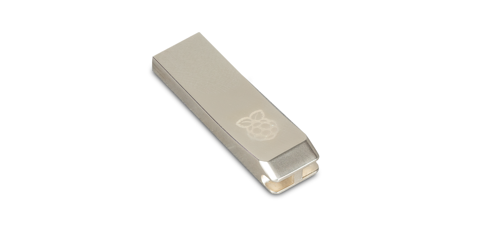
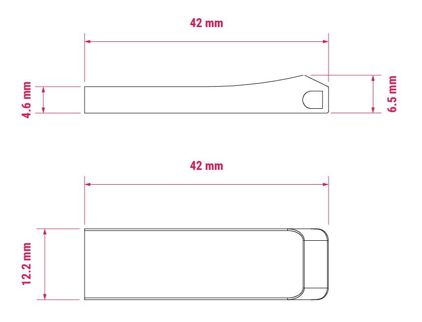

Raspberry Pi offers the following high-quality, reliable USB accessories for use with Raspberry Pi and other computers:

* Raspberry Pi <<hub>> for expanding USB connectivity.
* Raspberry Pi <<flashdrive>> for portable storage.

[[hub]]
== USB 3 Hub

The Raspberry Pi USB 3 Hub provides extra connectivity to your devices by extending one USB-A port into four USB-A ports. Devices connected through the USB 3 Hub are recognised as if they were connected directly to the host system, whether that's a Raspberry Pi device or other computers.

When bus-powered, the USB 3 Hub can draw up to 900 mA (4.5 W) of power from its upstream USB port. This 4.5 W is shared across all four downstream USB 3.0 ports, which is sufficient for low-power peripherals, such as most mice and keyboards.

To support high-power peripherals and devices, the USB 3 Hub also includes an optional USB-C power input that can be used to provide external power to the downstream ports if needed.

.The Raspberry Pi USB 3 Hub

=== USB 3 Hub features
The Raspberry Pi USB 3 Hub provides USB expansion, with high-speed data transfer, flexible power options, and compatibility with USB 3.0 and USB 2.0 ports. Key specifications related to these features are summarised in the following table.

.Raspberry Pi USB 3 Hub features and corresponding specifications
[cols="1,3", options="header"]
|===
|Feature |Specification

|*USB expansion*
|Provides four downstream USB 3.0 Type-A ports; an upstream USB 3.0 Type-A connector on an 8 cm captive cable.

|*Speed*
|Provides data transfer speeds up to 5 Gb/s.

|*Power*
|Supplies up to 900 mA at 5 V (4.5 W) drawn from the device the hub is connected to; when self-powered through the optional USB-C power input, supplies up to 5 V at 3 A (15 W).

|*Compatibility*
|Works with USB 3.0 Type-A ports and is backward compatible with USB 2.0.
|===

=== USB 3 Hub dimensions

The following image depicts the approximate physical dimensions of the Raspberry Pi USB 3 Hub in millimetres (mm). Including the cable and USB-A connector, the total length is approximately 175 mm. The hub itself is approximately 57.4 mm × 52.4 mm × 18 mm.

.Mechanical diagram of the Raspberry Pi USB 3 Hub; all measurements are approximate and in millimetres (mm); the dimensions shown are subject to change and not to be used for production purposes

[[flashdrive]]
== Flash Drive

The Raspberry Pi Flash Drive is a USB 3.0 memory stick that provides portable storage for transferring files, creating backups, or running operating systems. The Flash Drive is available in two storage capacities (128 GB or 256 GB) and uses non-volatile flash memory to retain data when disconnected.

.The Raspberry Pi Flash Drive

=== Flash Drive features

The Raspberry Pi Flash Drive is lightweight and travel-friendly, with a compact, metal design that can attach to a keyring or lanyard. It provides portable storage with reliable performance for both capacity options, and is compatible with USB 3.0 and USB 2.0. Key specifications related to these features are summarised in the following table.

.Raspberry Pi Flash Drive features and corresponding specifications
[cols="1,3", options="header"]
|===
|Feature |Specification

|*Compact form factor*
|Weighs less than 6 grams; for dimensions, see <<flashdrive-dimensions>>.

|*Storage options*
|Available in 128 GB and 256 GB capacities using non-volatile flash memory.

|*Performance*
|Varies depending on storage capacity. For details, see <<performance, Table 3>>.

|*Compatibility*
|Works with USB 3.0 Type-A ports and is backward compatible with USB 2.0.

|*SMART reporting*
|Supports ATA-style health reports readable through tools like `smartctl`. For more information, see <<smart-information>>.
|===

The Raspberry Pi Flash Drive provides high input/output operations per second (IOPS) for fast access to small files. It also offers responsive performance for computing tasks such as booting operating systems and running applications. The following table summarises the key performance features of the Raspberry Pi Flash Drive for each storage capacity (128 GB or 256 GB).

[[performance]]
.Raspberry Pi Flash Drive performance features based on the storage capacity
[cols="2,1,1", options="header"]
|===
|Performance feature |128 GB |256 GB

|*4 kB random reads*
|16,000 IOPS
|18,000 IOPS

|*4 kB random writes*
|21,000 IOPS
|22,000 IOPS

|*Sequential write speed (sustained)*
|75 MB/s
|150 MB/s
|===

[[smart-information]]
=== Flash Drive SMART reporting

The USB controller used in the Raspberry Pi Flash Drive supports 12-byte ATA pass-through SCSI commands and can provide an assessment of the drive's own health.

==== View SMART data
The recommended application for reading and displaying a SMART report is `smartctl`, which is included in the `smartmontools` package. To display the complete SMART report, run the following command:

[source,bash]
----
sudo smartctl -d sat,12 -x /dev/sda
----
The `-d sat,12` option instructs `smartctl` to communicate with the USB controller using the SAT-12 ATA pass-through protocol.

==== SMART attribute descriptions

The following table describes the SMART attributes reported by the Raspberry Pi Flash Drive. Attributes marked as *Unused* are reserved and don't report any information.

NOTE: `smartmontools` doesn't assign vendor-unique field names to USB devices because the application treats USB mass-storage devices as a bridge to an ATA hard drive.

.SMART attributes reported by the Raspberry Pi Flash Drive
[cols="1,1,3,4, options="header"]
|===
|*ID (hex)* | *ID (decimal)*|  *Attribute name* | *Description*
|01  |   1 | Read Error Rate| Rate of errors when reading data from flash memory
|05  |   5 | Reallocated Sectors Count| Number of bad sectors that have been replaced by spare blocks
|09  |   9 | Power-On Hours| Total hours the drive has been powered on
|0C  |  12 | Power Cycle Count| Number of times the drive has been powered on and off
|A0  | 160 | Uncorrectable Read/Write Sector Count| Number of sectors that couldn't be corrected during read/write operations
|A1  | 161 | Number of Valid Spare Blocks| Remaining usable spare blocks reserved for replacing bad blocks
|A3  | 163 2+| Unused
|A4  | 164 | Total Erase Count| Total number of flash block erase operations
|A5  | 165 | Maximum Erase Count| Highest erase count across all flash blocks
|A6  | 166 | Minimum Erase Count| Lowest erase count across all flash blocks
|A7  | 167 | Average Erase Count| Average erase cycles across all flash blocks
|A8  | 168 2+| Unused
|A9  | 169 | Remaining Life| Remaining lifespan percentage of the device
|B5  | 181 | Total Program Fail Count| Total number of failed data programming attempts to flash
|B6  | 182 | Total Erase Fail Count| Total number of failed flash block erase attempts
|BB  | 187 | Uncorrectable Error Count| Total uncorrectable errors detected by the controller
|C0  | 192 | Power-Off Retract Count| Number of unexpected power losses
|C2  | 194 | Temperature| Current drive temperature in Celsius
|C4  | 196 | Reallocation Event Count| Number of times the drive attempted to reallocate bad sectors
|C7  | 199 | Ultra DMA CRC Error Count| Communication errors between drive and host (cable/interface issues)
|F1  | 241 | Total GiB Written| Total amount of data written to the drive, rounded down to the nearest GiB
|F2  | 242 | Total GiB Read| Total amount of data read from the drive, rounded down to the nearest GiB.
|F5  | 245 | Unused
|===

[[flashdrive-dimensions]]
=== Flash Drive dimensions

The following image depicts the approximate physical dimensions of the Raspberry Pi Flash Drive in millimetres (mm). The Flash Drive is approximately 42 mm × 12.2 mm. At its thickest, the Flash Drive is approximately 6.5 mm high; at its thinnest (the USB end), the Flash Drive is approximately 4.6 mm.

.Mechanical diagram of the Raspberry Pi Flash Drive; all measurements are approximate and in millimetres (mm); the dimensions shown are subject to change and not to be used for production purposes
