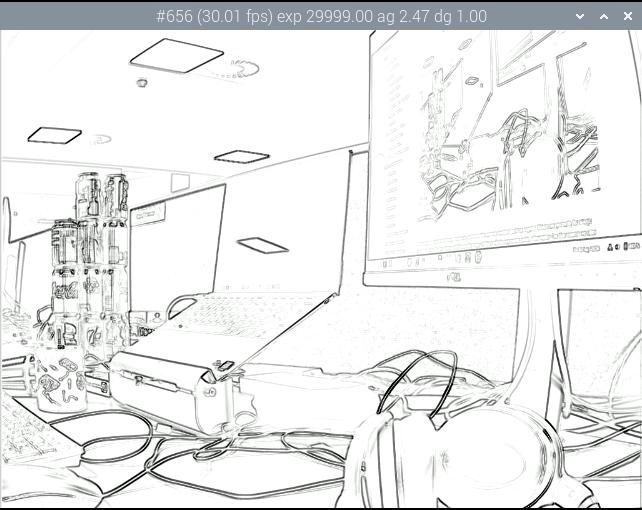
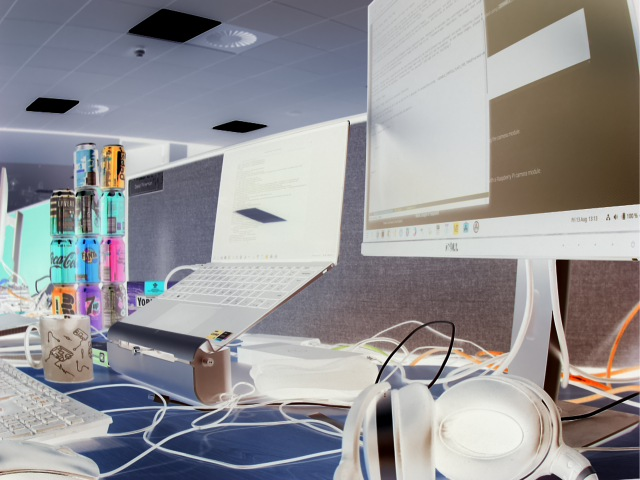
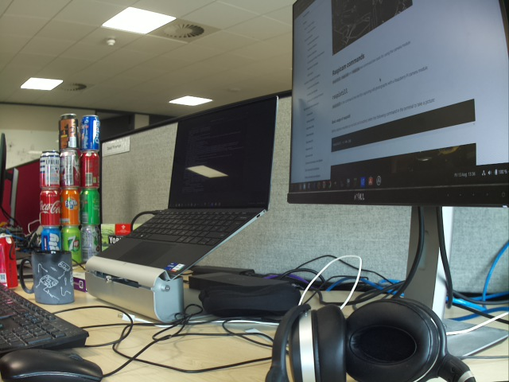
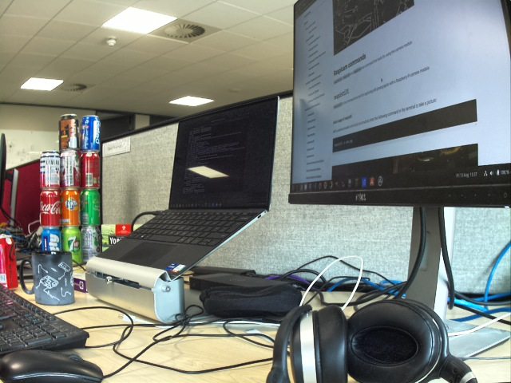
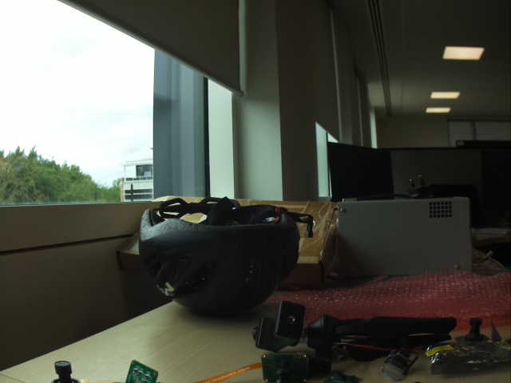
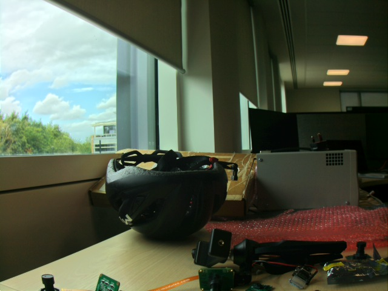

=== Post-Processing

`libcamera-apps` share a common post-processing framework. This allows them to pass the images received from the camera system through a number of custom image processing and image analysis routines. Each such routine is known as a _post-processing stage_ and the description of exactly which stages should be run, and what configuration they may have, is supplied in a JSON file. Every stage, along with its source code, is supplied with a short example JSON file showing how to enable it.

For example, the simple _negate_ stage (which "negates" all the pixels in an image, turning light pixels dark and vice versa) is supplied with a `negate.json` file that configures the post-processing pipeline to run it:

`libcamera-hello --post-process-file /path/to/negate.json`

TIP: Example JSON files can be found in the `assets` folder of the `libcamera-apps` repository at https://github.com/raspberrypi/libcamera-apps/tree/main/assets[].

The negate stage is particularly trivial and has no configuration parameters of its own, therefore the JSON file merely has to name the stage, with no further information, and it will be run. Thus `negate.json` contains

----
{
    "negate":
    {
    }
}
----

To run multiple post-processing stages, the contents of the example JSON files merely need to be listed together, and the stages will be run in the order given. For example, to run the Sobel stage (which applies a Sobel filter to an image) followed by the negate stage we could create a custom JSON file containing

----
{
    "sobel_cv":
    {
        "ksize": 5
    },
    "negate":
    {
    }
}
----

The Sobel stage is implemented using OpenCV, hence `cv` in its name. Observe how it has a user-configurable parameter, `ksize` that specifies the kernel size of the filter to be used. In this case, the Sobel filter will produce bright edges on a black background, and the negate stage will turn this into dark edges on a white background, as shown.

Some stages actually alter the image in some way, and this is their primary function (such as _negate_). Others are primarily for image analysis, and while they may indicate something on the image, all they really do is generate useful information. For this reason we also have a very flexible form of _metadata_ that can be populated by the post-processing stages, and this will get passed all the way through to the application itself.

Image analysis stages often prefer to work on reduced resolution images. `libcamera-apps` are able to supply applications with a ready-made low resolution image provided directly by the ISP hardware, and this can be helpful in improving performance.

Furthermore, with the post-processing framework being completely open, Raspberry Pi welcomes the contribution of new and interesting stages from the community and would be happy to host them in our `libcamera-apps` repository. The stages that are currently available are documented below.

NOTE: The `libcamera-apps` supplied with the operating system will be built without any optional 3rd party libraries (such as OpenCV or TensorFlow Lite), meaning that certain post-processing stages that rely on them will not be enabled. To use these stages, please follow the instructions for xref:camera_software.adoc#building-libcamera-and-libcamera-apps[building `libcamera-apps` for yourself].

==== `negate` stage

The `negate` stage requires no 3rd party libraries.

On a Raspberry Pi 3 device or a Raspberry Pi 4 running a 32-bit OS, it may execute more quickly if recompiled using `-DENABLE_COMPILE_FLAGS_FOR_TARGET=armv8-neon`. (Please see the xref:camera_software.adoc#building-libcamera-and-libcamera-apps[build instructions].)

The `negate` stage has no user-configurable parameters.

Default `negate.json` file:

----
{
    "negate":
    {
    }
}
----

Example:

==== `hdr` stage

The `hdr` stage implements both HDR (high dynamic range) imaging and DRC (dynamic range compression). The terminology that we use here regards DRC as operating on single images, and HDR works by accumulating multiple under-exposed images and then performing the same algorithm as DRC.

The `hdr` stage has no dependencies on 3rd party libraries, but (like some other stages) may execute more quickly on Raspberry Pi 3 or Raspberry Pi 4 devices running a 32-bit OS if recompiled using `-DENABLE_COMPILE_FLAGS_FOR_TARGET=armv8-neon` (please see the xref:camera_software.adoc#building-libcamera-and-libcamera-apps[build instructions]). Specifically, the image accumulation stage will run quicker and result in fewer frame drops, though the tonemapping part of the process is unchanged.

The basic procedure is that we take the image (which in the case of HDR may be multiple images accumulated together) and apply an edge-preserving smoothing filter to generate a low pass (LP) image. We define the high pass (HP) image to be the difference between the LP image and the original. Next we apply a global tonemap to the LP image and add back the HP image. This procedure, in contrast to applying the tonemap directly to the original image, prevents us from squashing and losing all the local contrast in the resulting image.

It is worth noting that this all happens using fully-processed images, once the ISP has finished with them. HDR normally works better when carried out in the raw (Bayer) domain, as signals are still linear and have greater bit-depth. We expect to implement such functionality once `libcamera` exports an API for "re-processing" Bayer images that do not come from the sensor, but which application code can pass in.

In summary, the user-configurable parameters fall broadly into three groups: those that define the LP filter, those responsible for the global tonemapping, and those responsible for re-applying the local contrast.

[cols=",^"]
|===
| num_frames | The number of frames to accumulate. For DRC (in our terminology) this would take the value 1, but for multi-frame HDR we would suggest a value such as 8.
| lp_filter_strength | The coefficient of the low pass IIR filter.
| lp_fiter_threshold | A piecewise linear function that relates the pixel level to the threshold that is regarded as being "meaningful detail".
| global_tonemap_points | A list of points in the input image histogram and targets in the output range where we wish to move them. We define an inter-quantile mean (`q` and `width`), a target as a proportion of the full output range (`target`) and maximum and minimum gains by which we are prepared to move the measured inter-quantile mean (as this prevents us from changing an image too drastically).
| global_tonemap_strength | Strength of application of the global tonemap.
| local_pos_strength | A piecewise linear function that defines the gain applied to local contrast when added back to the tonemapped LP image, for positive (bright) detail.
| local_neg_strength | A piecewise linear function that defines the gain applied to local contrast when added back to the tonemapped LP image, for negative (dark) detail.
| local_tonemap_strength | An overall gain applied to all local contrast that is added back.
| local_colour_scale | A factor that allows the output colours to be affected more or less strongly.
|===

We note that the overall strength of the processing is best controlled by changing the `global_tonemap_strength` and `local_tonemap_strength` parameters.

The full processing takes between 2 and 3 seconds for a 12MP image on a Raspberry Pi 4. The stage runs only on the still image capture, it ignores preview and video images. In particular, when accumulating multiple frames, the stage "swallows" the output images so that the application does not receive them, and finally sends through only the combined and processed image.

Default `drc.json` file for DRC:

----
{
    "hdr" :
    {
	"num_frames" : 1,
	"lp_filter_strength" : 0.2,
	"lp_filter_threshold" : [ 0, 10.0 , 2048, 205.0, 4095, 205.0 ],
	"global_tonemap_points" :
	[
	    { "q": 0.1, "width": 0.05, "target": 0.15, "max_up": 1.5, "max_down": 0.7 },
	    { "q": 0.5, "width": 0.05, "target": 0.5, "max_up": 1.5, "max_down": 0.7 },
	    { "q": 0.8, "width": 0.05, "target": 0.8, "max_up": 1.5, "max_down": 0.7 }
	],
	"global_tonemap_strength" : 1.0,
	"local_pos_strength" : [ 0, 6.0, 1024, 2.0, 4095, 2.0 ],
	"local_neg_strength" : [ 0, 4.0, 1024, 1.5, 4095, 1.5 ],
	"local_tonemap_strength" : 1.0,
	"local_colour_scale" : 0.9
    }
}
----

Example:

Without DRC:

With full-strength DRC: (use `libcamera-still -o test.jpg --post-process-file drc.json`)

Default `hdr.json` file for HDR:

----
{
    "hdr" :
    {
	"num_frames" : 8,
	"lp_filter_strength" : 0.2,
	"lp_filter_threshold" : [ 0, 10.0 , 2048, 205.0, 4095, 205.0 ],
	"global_tonemap_points" :
	[
	    { "q": 0.1, "width": 0.05, "target": 0.15, "max_up": 5.0, "max_down": 0.5 },
	    { "q": 0.5, "width": 0.05, "target": 0.45, "max_up": 5.0, "max_down": 0.5 },
	    { "q": 0.8, "width": 0.05, "target": 0.7, "max_up": 5.0, "max_down": 0.5 }
	],
	"global_tonemap_strength" : 1.0,
	"local_pos_strength" : [ 0, 6.0, 1024, 2.0, 4095, 2.0 ],
	"local_neg_strength" : [ 0, 4.0, 1024, 1.5, 4095, 1.5 ],
	"local_tonemap_strength" : 1.0,
	"local_colour_scale" : 0.8
    }
}
----

Example:

Without HDR:

With HDR: (use `libcamera-still -o test.jpg --ev -2 --denoise cdn_off --post-process-file hdr.json`)

==== `motion_detect` stage

The `motion_detect` stage works by analysing frames from the low resolution image stream, which must be configured for it to work. It compares a region of interest ("roi") in the frame to the corresponding part of a previous one and if enough pixels are sufficiently different, that will be taken to indicate motion. The result is added to the metadata under "motion_detect.result".

This stage has no dependencies on any 3rd party libraries.

It has the following tunable parameters. The dimensions are always given as a proportion of the low resolution image size.

[cols=",^"]
|===
| roi_x | x-offset of the region of interest for the comparison
| roi_y | y-offset of the region of interest for the comparison
| roi_width | width of the region of interest for the comparison
| roi_height | height of the region of interest for the comparison
| difference_m | Linear coefficient used to construct the threshold for pixels being different
| difference_c | Constant coefficient used to construct the threshold for pixels being different according to threshold = difference_m * pixel_value + difference_c
| frame_period | The motion detector will run only this many frames
| hskip | The pixel tests are subsampled by this amount horizontally
| vksip | The pixel tests are subsampled by this amount vertically
| region_threshold | The proportion of pixels (or "regions") which must be categorised as different for them to count as motion
| verbose | Print messages to the console, including when the "motion"/"no motion" status changes
|===

Default `motion_detect.json` configuration file:

----
{
    "motion_detect" :
    {
	"roi_x" : 0.1,
	"roi_y" : 0.1,
	"roi_width" : 0.8,
	"roi_height" : 0.8,
	"difference_m" : 0.1,
	"difference_c" : 10,
	"region_threshold" : 0.005,
	"frame_period" : 5,
	"hskip" : 2,
	"vskip" : 2,
	"verbose" : 0
    }
}
----

Note that the field `difference_m` and `difference_c`, and the value of `region_threshold`, can be adjusted to make the algorithm more or less sensitive to motion.

If the amount of computation needs to be reduced (perhaps you have other stages that need a larger low resolution image), the amount of computation can be reduced using the `hskip` and `vskip` parameters.

To use the `motion_detect` stage you might enter the following example command:

`libcamera-hello --lores-width 128 --lores-height 96 --post-process-file motion_detect.json`
