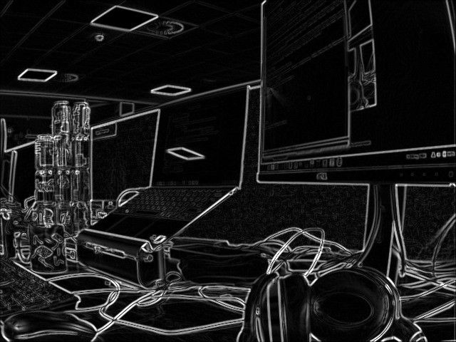
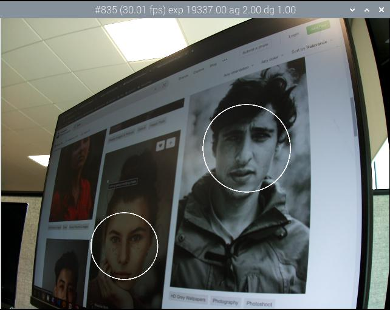
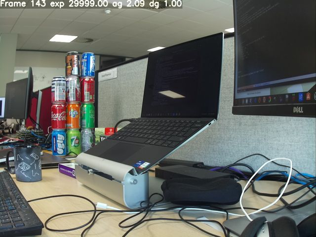

=== Post-Processing with OpenCV

NOTE: These stages all require OpenCV to be installed on your system. You may also need to rebuild `libcamera-apps` with OpenCV support - please see the instructions for xref:camera_software.adoc#building-libcamera-and-libcamera-apps[building `libcamera-apps` for yourself].

==== `sobel_cv` stage

The `sobel_cv` stage has the following user-configurable parameters:

[cols=",^"]
|===
| ksize | Kernel size of the Sobel filter
|===

Default `sobel_cv.json` file:

----
{
    "sobel_cv":
    {
        "ksize": 5
    }
}
----

Example:

==== `face_detect_cv` stage

This stage uses the OpenCV Haar classifier to detect faces in an image. It returns the face locations in the metadata (under the key "face_detect.results"), and optionally draws them on the image.

The `face_detect_cv` stage has the following user-configurable parameters:

[cols=",^"]
|===
| cascade_name | Name of the file where the Haar cascade can be found.
| scaling_factor | Determines range of scales at which the image is searched for faces.
| min_neighbors | Minimum number of overlapping neighbours required to count as a face.
| min_size | Minimum face size.
| max_size | Maximum face size.
| refresh_rate | How many frames to wait before trying to re-run the face detector.
| draw_features | Whether to draw face locations on the returned image.
|===

The `face_detect_cv" stage runs only during preview and video capture; it ignores still image capture. It runs on the low resolution stream which would normally be configured to a resolution from about 320x240 to 640x480 pixels.

Default `face_detect_cv.json` file:

----
{
    "face_detect_cv":
    {
        "cascade_name" : "/usr/local/share/OpenCV/haarcascades/haarcascade_frontalface_alt.xml",
        "scaling_factor" : 1.1,
        "min_neighbors" : 2,
        "min_size" : 32,
        "max_size" : 256,
        "refresh_rate" : 1,
        "draw_features" : 1
    }
}
----

Example:

==== `annotate_cv` stage

This stage allows text to be written into the top corner of images. It allows the same `%` substitutions as the `--info-text` parameter.

Additionally to the flags of xref:camera_software.adoc#preview-window-2[`--info-text`] you can provide any token that https://www.man7.org/linux/man-pages/man3/strftime.3.html[strftime] understands to display the current date / time.
The `--info-text` tokens are interpreted first and any percentage token left is then interpreted by strftime. To achieve a datetime stamp on the video you can use e.g. `%F %T %z` (%F for the ISO-8601 date (2023-03-07), %T for 24h local time (09:57:12) and %z for the timezone difference to UTC (-0800)).

The stage does not output any metadata, but if it finds metadata under the key "annotate.text" it will write this text in place of anything in the JSON configuration file. This allows other post-processing stages to pass it text strings to be written onto the top of the images.

The `annotate_cv` stage has the following user-configurable parameters:

[cols=",^"]
|===
| text | The text string to be written.
| fg | Foreground colour.
| bg | Background colour.
| scale | A number proportional to the size of the text.
| thickness | A number that determines the thickness of the text.
| alpha | The amount of "alpha" to apply when overwriting the background pixels.
|===

Default `annotate_cv.json` file:

----
{
    "annotate_cv" :
    {
	"text" : "Frame %frame exp %exp ag %ag dg %dg",
	"fg" : 255,
	"bg" : 0,
	"scale" : 1.0,
	"thickness" : 2,
	"alpha" : 0.3
    }
}
----

Example:

