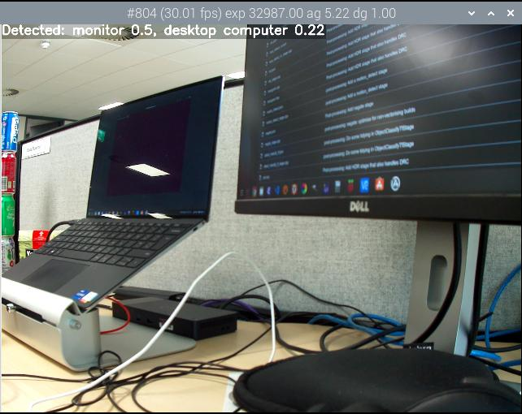
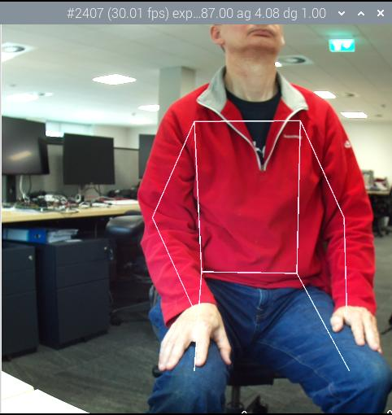
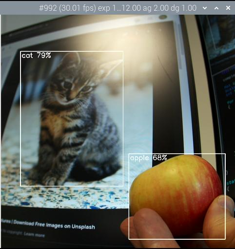
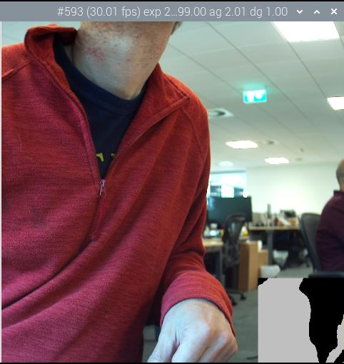

=== Post-Processing with TensorFlow Lite

NOTE: These stages require TensorFlow Lite (TFLite) libraries to be installed that export the {cpp} API. Unfortunately the TFLite libraries are not normally distributed conveniently in this form, however, one place where they can be downloaded is https://lindevs.com/install-precompiled-tensorflow-lite-on-raspberry-pi/[lindevs.com]. Please follow the installation instructions given on that page. Subsequently you may need to recompile `libcamera-apps` with TensorFlow Lite support - please follow the instructions for xref:camera_software.adoc#building-libcamera-and-libcamera-apps[building `libcamera-apps` for yourself].

==== `object_classify_tf` stage

`object_classify_tf` uses a Google MobileNet v1 model to classify objects in the camera image. It can be obtained from https://storage.googleapis.com/download.tensorflow.org/models/mobilenet_v1_2018_08_02/mobilenet_v1_1.0_224_quant.tgz[], which will need to be uncompressed. You will also need the `labels.txt` file which can be found in https://storage.googleapis.com/download.tensorflow.org/models/mobilenet_v1_1.0_224_frozen.tgz[].

This stage has the following configuratble parameters.

[cols=",^"]
|===
| top_n_results | How many results to show
| refresh_rate | The number of frames that must elapse before the model is re-run
| threshold_high | Confidence threshold (between 0 and 1) where objects are considered as being present
| threshold_low | Confidence threshold which objects must drop below before being discarded as matches
| model_file | Pathname to the tflite model file
| labels_file | Pathname to the file containing the object labels
| display_labels | Whether to display the object labels on the image. Note that this causes `annotate.text` metadata to be inserted so that the text can be rendered subsequently by the `annotate_cv` stage
| verbose | Output more information to the console
|===

Example `object_classify_tf.json` file:

----
{
    "object_classify_tf":
    {
        "top_n_results" : 2,
        "refresh_rate" : 30,
        "threshold_high" : 0.6,
        "threshold_low" : 0.4,
        "model_file" : "/home/pi/models/mobilenet_v1_1.0_224_quant.tflite",
        "labels_file" : "/home/pi/models/labels.txt",
        "display_labels" : 1
    },
    "annotate_cv" :
    {
	"text" : "",
	"fg" : 255,
	"bg" : 0,
	"scale" : 1.0,
	"thickness" : 2,
	"alpha" : 0.3
    }
}
----

The stage operates on a low resolution stream image of size 224x224, so it could be used as follows:

`libcamera-hello --post-process-file object_classify_tf.json --lores-width 224 --lores-height 224`

==== `pose_estimation_tf` stage

`pose_estimation_tf` uses a Google MobileNet v1 model `posenet_mobilenet_v1_100_257x257_multi_kpt_stripped.tflite` that can be found at https://github.com/Qengineering/TensorFlow_Lite_Pose_RPi_32-bits[].

This stage has the following configurable parameters.

[cols=",^"]
|===
| refresh_rate | The number of frames that must elapse before the model is re-run
| model_file | Pathname to the tflite model file
| verbose | Output more information to the console
|===

Also provided is a separate `plot_pose_cv` stage which can be included in the JSON configuration file and which will draw the detected pose onto the main image. This stage has the following configuration parameters.

[cols=",^"]
|===
| confidence_threshold | A confidence level determining how much is drawn. This number can be less than zero; please refer to the GitHub repository for more information.
|===

Example `pose_estimation_tf.json` file:

----
{
    "pose_estimation_tf":
    {
        "refresh_rate" : 5,
        "model_file" : "posenet_mobilenet_v1_100_257x257_multi_kpt_stripped.tflite"
    },
    "plot_pose_cv" :
    {
	"confidence_threshold" : -0.5
    }
}
----

The stage operates on a low resolution stream image of size 257x257 (but which must be rounded up to 258x258 for YUV420 images), so it could be used as follows:

`libcamera-hello --post-process-file pose_estimation_tf.json --lores-width 258 --lores-height 258`

==== `object_detect_tf` stage

`object_detect_tf` uses a Google MobileNet v1 SSD (Single Shot Detector) model. The model and labels files can be downloaded from https://storage.googleapis.com/download.tensorflow.org/models/tflite/coco_ssd_mobilenet_v1_1.0_quant_2018_06_29.zip[].

This stage has the following configurable parameters.

[cols=",^"]
|===
| refresh_rate | The number of frames that must elapse before the model is re-run
| model_file | Pathname to the tflite model file
| labels_file | Pathname to the file containing the list of labels
| confidence_threshold | Minimum confidence threshold because a match is accepted.
| overlap_threshold | Determines the amount of overlap between matches for them to be merged as a single match.
| verbose | Output more information to the console
|===

Also provided is a separate `object_detect_draw_cv` stage which can be included in the JSON configuration file and which will draw the detected objects onto the main image. This stage has the following configuration parameters.

[cols=",^"]
|===
| line_thickness | Thickness of the bounding box lines
| font_size | Size of the font used for the label
|===

Example `object_detect_tf.json` file:

----
{
    "object_detect_tf":
    {
	"number_of_threads" : 2,
	"refresh_rate" : 10,
	"confidence_threshold" : 0.5,
	"overlap_threshold" : 0.5,
	"model_file" : "/home/pi/models/coco_ssd_mobilenet_v1_1.0_quant_2018_06_29/detect.tflite",
	"labels_file" : "/home/pi/models/coco_ssd_mobilenet_v1_1.0_quant_2018_06_29/labelmap.txt",
	"verbose" : 1
    },
    "object_detect_draw_cv":
    {
	"line_thickness" : 2
    }
}
----

The stage operates on a low resolution stream image of size 300x300. The following example would pass a 300x300 crop to the detector from the centre of the 400x300 low resolution image.

`libcamera-hello --post-process-file object_detect_tf.json --lores-width 400 --lores-height 300`

==== `segmentation_tf` stage

`segmentation_tf` uses a Google MobileNet v1 model. The model file can be downloaded from https://tfhub.dev/tensorflow/lite-model/deeplabv3/1/metadata/2?lite-format=tflite[], whilst the labels file can be found in the `assets` folder, named `segmentation_labels.txt`.

This stage runs on an image of size 257x257. Because YUV420 images must have even dimensions, the low resolution image should be at least 258 pixels in both width and height. The stage adds a vector of 257x257 values to the image metadata where each value indicates which of the categories (listed in the labels file) that the pixel belongs to. Optionally, a representation of the segmentation can be drawn into the bottom right corner of the image.

This stage has the following configurable parameters.

[cols=",^"]
|===
| refresh_rate | The number of frames that must elapse before the model is re-run
| model_file | Pathname to the tflite model file
| labels_file | Pathname to the file containing the list of labels
| threshold | When verbose is set, the stage prints to the console any labels where the number of pixels with that label (in the 257x257 image) exceeds this threshold.
| draw | Set this value to draw the segmentation map into the bottom right hand corner of the image.
| verbose | Output more information to the console
|===

Example `segmentation_tf.json` file:

----
{
    "segmentation_tf":
    {
	"number_of_threads" : 2,
	"refresh_rate" : 10,
	"model_file" : "/home/pi/models/lite-model_deeplabv3_1_metadata_2.tflite",
	"labels_file" : "/home/pi/models/segmentation_labels.txt",
	"draw" : 1,
	"verbose" : 1
    }
}
----

This example takes a square camera image and reduces it to 258x258 pixels in size. In fact the stage also works well when non-square images are squashed unequally down to 258x258 pixels without cropping. The image below shows the segmentation map in the bottom right hand corner.

`libcamera-hello --post-process-file segmentation_tf.json --lores-width 258 --lores-height 258 --viewfinder-width 1024 --viewfinder-height 1024`

