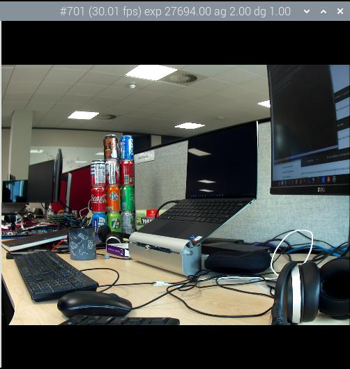
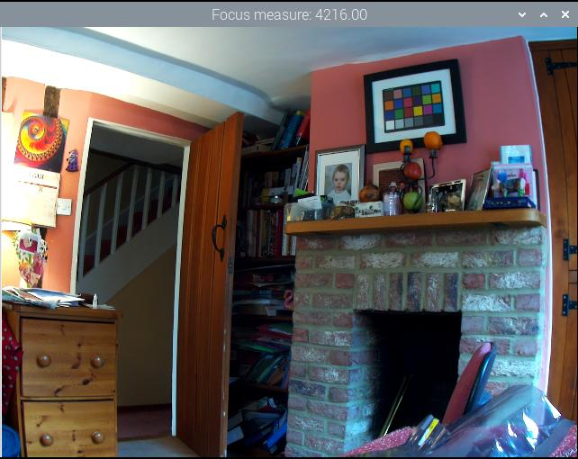

=== Common Command Line Options

The following options apply across all the `libcamera-apps` with similar or identical semantics, unless noted otherwise.

----
	--help,		-h		Print help information for the application
----

The `--help` option causes every application to print its full set of command line options with a brief synopsis of each, and then quit.

----
	--version			Print out a software version number
----

All `libcamera-apps` will, when they see the `--version` option, print out a version string both for `libcamera` and `libcamera-apps` and then quit, for example:

----
libcamera-apps build: ca559f46a97a 27-09-2021 (14:10:24)
libcamera build: v0.0.0+3058-c29143f7
----

----
	--list-cameras			List the cameras available for use
----

The `--list-cameras` will display the available cameras attached to the board that can be used by the application. This option also lists the sensor modes supported by each camera. For example:

----
Available cameras
-----------------
0 : imx219 [3280x2464] (/base/soc/i2c0mux/i2c@1/imx219@10)
    Modes: 'SRGGB10_CSI2P' : 640x480 [206.65 fps - (1000, 752)/1280x960 crop]
                             1640x1232 [41.85 fps - (0, 0)/3280x2464 crop]
                             1920x1080 [47.57 fps - (680, 692)/1920x1080 crop]
                             3280x2464 [21.19 fps - (0, 0)/3280x2464 crop]
           'SRGGB8' : 640x480 [206.65 fps - (1000, 752)/1280x960 crop]
                      1640x1232 [41.85 fps - (0, 0)/3280x2464 crop]
                      1920x1080 [47.57 fps - (680, 692)/1920x1080 crop]
                      3280x2464 [21.19 fps - (0, 0)/3280x2464 crop]
1 : imx477 [4056x3040] (/base/soc/i2c0mux/i2c@1/imx477@1a)
    Modes: 'SRGGB10_CSI2P' : 1332x990 [120.05 fps - (696, 528)/2664x1980 crop]
           'SRGGB12_CSI2P' : 2028x1080 [50.03 fps - (0, 440)/4056x2160 crop]
                             2028x1520 [40.01 fps - (0, 0)/4056x3040 crop]
                             4056x3040 [10.00 fps - (0, 0)/4056x3040 crop]
----

In the above example, the IMX219 sensor is available at index 0 and IMX477 at index 1. The sensor mode identifier takes the following form:
----
S<Bayer order><Bit-depth>_<Optional packing> : <Resolution list>
----
For the IMX219 in the above example, all modes have a `RGGB` Bayer ordering and provide either 8-bit or 10-bit CSI2 packed readout at the listed resolutions. The crop is specified as (<x>, <y>)/<Width>x<Height>, where (x, y) is the location of the crop window of size Width x Height in the sensor array. The units remain native sensor pixels, even if the sensor is being used in a binning or skipping mode.

----
	--camera			Selects which camera to use <index>
----

The `--camera` option will select which camera to use from the supplied <index> value. The <index> value can be obtained from the `--list-cameras` option.

----
	--config,	-c		Read options from the given file <filename>
----

Normally options are read from the command line, but in case multiple options are required it may be more convenient to keep them in a file.

Example: `libcamera-hello -c config.txt`

This is a text file containing individual lines of `key=value` pairs, for example:

----
timeout=99000
verbose=
----

Note how the `=` is required even for implicit options, and that the `--` used on the command line are omitted. Only long form options are permitted (`t=99000` would not be accepted).

----
	--timeout,	-t		Delay before application stops automatically <milliseconds>
----

The `--timeout` option specifies how long the application runs before it stops, whether it is recording a video or showing a preview. In the case of still image capture, the application will show the preview window for this long before capturing the output image.

If unspecified, the default value is 5000 (5 seconds). The value zero causes the application to run indefinitely.

Example: `libcamera-hello -t 0`

==== Preview window

----
	--preview,	-p		Preview window settings <x,y,w,h>
----

Sets the size and location of the preview window (both X Windows and DRM versions). It does not affect the resolution or aspect ratio of images being requested from the camera. The camera images will be scaled to the size of the preview window for display, and will be pillar/letter-boxed to fit.

Example: `libcamera-hello -p 100,100,500,500`

----
	--fullscreen,	-f		Fullscreen preview mode
----

Forces the preview window to use the whole screen, and the window will have no border or title bar. Again the image may be pillar/letter-boxed.

Example `libcamera-still -f -o test.jpg`

----
	--qt-preview			Use Qt-based preview window
----

The preview window is switched to use the Qt-based implementation. This option is not normally recommended because it no longer uses zero-copy buffer sharing nor GPU acceleration and is therefore very expensive, however, it does support X forwarding (which the other preview implementations do not).

The Qt preview window does not support the `--fullscreen` option. Generally it is advised to try and keep the preview window small.

Example `libcamera-hello --qt-preview`

----
	--nopreview,	-n		Do not display a preview window
----

The preview window is suppressed entirely.

Example `libcamera-still -n -o test.jpg`

----
	--info-text			Set window title bar text <string>
----

The supplied string is set as the title of the preview window (when running under X Windows). Additionally the string may contain a number of `%` directives which are substituted with information from the image metadata. The permitted directives are

|===
| Directive | Substitution

| %frame
| The sequence number of the frame

| %fps
| The instantaneous frame rate

| %exp
| The shutter speed used to capture the image, in microseconds

| %ag
| The analogue gain applied to the image in the sensor

| %dg
| The digital gain applied to the image by the ISP

| %rg
| The gain applied to the red component of each pixel

| %bg
| The gain applied to the blue component of each pixel

| %focus
| The focus metric for the image, where a larger value implies a sharper image

| %lp
| The current lens position in dioptres (1 / distance in metres).

| %afstate
| The autofocus algorithm state (one of `idle`, `scanning`, `focused` or `failed`).
|===

When not provided, the `--info-text` string defaults to `"#%frame (%fps fps) exp %exp ag %ag dg %dg"`.

Example: `libcamera-hello --info-text "Focus measure: %focus"`

==== Camera Resolution and Readout

----
	--width				Capture image width <width>
	--height			Capture image height <height>
----

These numbers specify the output resolution of the camera images captured by `libcamera-still`, `libcamera-jpeg` and `libcamera-vid`.

For `libcamera-raw`, it affects the size of the raw frames captured. Where a camera has a 2x2 binned readout mode, specifying a resolution not larger than this binned mode will result in the capture of 2x2 binned raw frames.

For `libcamera-hello` these parameters have no effect.

Examples:

`libcamera-vid -o test.h264 --width 1920 --height 1080` will capture 1080p video.

`libcamera-still -r -o test.jpg --width 2028 --height 1520` will capture a 2028x1520 resolution JPEG. When using the HQ camera the sensor will be driven in its 2x2 binned mode so the raw file - captured in `test.dng` - will contain a 2028x1520 raw Bayer image.

----
	--viewfinder-width		Capture image width <width>
	--viewfinder-height		Capture image height <height>
----

These options affect only the preview (meaning both `libcamera-hello` and the preview phase of `libcamera-jpeg` and `libcamera-still`), and specify the image size that will be requested from the camera for the preview window. They have no effect on captured still images or videos. Nor do they affect the preview window as the images are resized to fit.

Example: `libcamera-hello --viewfinder-width 640 --viewfinder-height 480`

----
	--rawfull			Force sensor to capture in full resolution mode
----

This option forces the sensor to be driven in its full resolution readout mode for still and video capture, irrespective of the requested output resolution (given by `--width` and `--height`). It has no effect for `libcamera-hello`.

Using this option often incurs a frame rate penalty, as larger resolution frames are slower to read out.

Example: `libcamera-raw -t 2000 --segment 1 --rawfull -o test%03d.raw` will cause multiple full resolution raw frames to be captured. On the HQ camera each frame will be about 18MB in size. Without the `--rawfull` option the default video output resolution would have caused the 2x2 binned mode to be selected, resulting in 4.5MB raw frames.

----
	--mode				Specify sensor mode, given as <width>:<height>:<bit-depth>:<packing>
----

This option is more general than `--rawfull` and allows the precise selection of one of the camera modes. The mode should be specified by giving its width, height, bit-depth and packing, separated by colons. These numbers do not have to be exact as the system will select the closest it can find. Moreover, the bit-depth and packing are optional (defaulting to 12 and `P` for "packed" respectively). For example:

* `4056:3040:12:P` - 4056x3040 resolution, 12 bits per pixel, packed. This means that raw image buffers will be packed so that 2 pixel values occupy only 3 bytes.
* `1632:1224:10` - 1632x1224 resolution, 10 bits per pixel. It will default to "packed". A 10-bit packed mode would store 4 pixels in every 5 bytes.
* `2592:1944:10:U` - 2592x1944 resolution, 10 bits per pixel, unpacked. An unpacked format will store every pixel in 2 bytes, in this case with the top 6 bits of each value being zero.
* `3264:2448` - 3264x2448 resolution. It will try to select the default 12-bit mode but in the case of the v2 camera there isn't one, so a 10-bit mode would be chosen instead.

The `--mode` option affects the mode choice for video recording and stills capture. To control the mode choice during the preview phase prior to stills capture, please use the `--viewfinder-mode` option.

----
	--viewfinder-mode		Specify sensor mode, given as <width>:<height>:<bit-depth>:<packing>
----

This option is identical to the `--mode` option except that it applies only during the preview phase of stills capture (also used by the `libcamera-hello` application).

----
	--lores-width			Low resolution image width <width>
	--lores-height			Low resolution image height <height>
----

`libcamera` allows the possibility of delivering a second lower resolution image stream from the camera system to the application. This stream is available in both the preview and the video modes (i.e. `libcamera-hello` and the preview phase of `libcamera-still`, and `libcamera-vid`), and can be used, among other things, for image analysis. For stills captures, the low resolution image stream is not available.

The low resolution stream has the same field of view as the other image streams. If a different aspect ratio is specified for the low resolution stream, then those images will be squashed so that the pixels are no longer square.

During video recording (`libcamera-vid`), specifying a low resolution stream will disable some extra colour denoise processing that would normally occur.

Example: `libcamera-hello --lores-width 224 --lores-height 224`

Note that the low resolution stream is not particularly useful unless used in conjunction with xref:camera_software.adoc#post-processing[image post-processing].

----
	--hflip				Read out with horizontal mirror
	--vflip				Read out with vertical flip
	--rotation			Use hflip and vflip to create the given rotation <angle>
----

These options affect the order of read-out from the sensor, and can be used to mirror the image horizontally, and/or flip it vertically. The `--rotation` option permits only the value 0 or 180, so note that 90 or 270 degree rotations are not supported. Moreover, `--rotation 180` is identical to `--hflip --vflip`.

Example: `libcamera-hello --vflip --hflip`

----
	--roi				Select a crop (region of interest) from the camera <x,y,w,h>
----

The `--roi` (region of interest) option allows the user to select a particular crop from the full field of view provided by the sensor. The coordinates are specified as a proportion of the available field of view, so that `--roi 0,0,1,1` would have no effect at all.

The `--roi` parameter implements what is commonly referred to as "digital zoom".

Example `libcamera-hello --roi 0.25,0.25,0.5,0.5` will select exactly a quarter of the total number of pixels cropped from the centre of the image.

----
	--hdr				Run the camera in HDR mode (supported cameras only)
----

The `--hdr` option causes the camera to be run in HDR (High Dynamic Range) mode. This option only works for certain supported cameras, including the _Raspberry Pi Camera Module 3_.

Example: `libcamera-still --hdr -o hdr.jpg` for capturing a still image, or `libcamera-vid --hdr -o hdr.h264` to capture a video.

Use of the HDR option may generally cause different camera modes to be available, and this can be checked by comparing the output of `libcamera-hello --list-cameras` with `libcamera-hello --hdr --list-cameras`.

Users may also supply `--hdr 0` or `--hdr 1`, where the former disables the HDR modes (and is equivalent to omitting the option entirely), and the latter is the same as using `--hdr` on its own.

NOTE: For the _Raspberry Pi Camera Module 3_, the non-HDR modes include the usual full resolution (12MP) mode as well as its half resolution 2x2 binned (3MP) equivalent. In the case of HDR, only a single half resolution (3MP) mode is available, and it is not possible to switch between HDR and non-HDR modes without restarting the camera application.

==== Camera Control

The following options affect the image processing and control algorithms that affect the camera image quality.

----
	--sharpness			Set image sharpness <number>
----

The given `<number>` adjusts the image sharpness. The value zero means that no sharpening is applied, the value 1.0 uses the default amount of sharpening, and values greater than 1.0 use extra sharpening.

Example: `libcamera-still -o test.jpg --sharpness 2.0`

----
	--contrast			Set image contrast <number>
----

The given `<number>` adjusts the image contrast. The value zero produces minimum contrast, the value 1.0 uses the default amount of contrast, and values greater than 1.0 apply extra contrast.

Example: `libcamera-still -o test.jpg --contrast 1.5`

----
	--brightness			Set image brightness <number>
----

The given `<number>` adjusts the image brightness. The value -1.0 produces an (almost) black image, the value 1.0 produces an almost entirely white image and the value 0.0 produces standard image brightness.

Note that the brightness parameter adds (or subtracts) an offset from all pixels in the output image. The `--ev` option is often more appropriate.

Example: `libcamera-still -o test.jpg --brightness 0.2`

----
	--saturation			Set image colour saturation <number>
----

The given `<number>` adjusts the colour saturation. The value zero produces a greyscale image, the value 1.0 uses the default amount of sautration, and values greater than 1.0 apply extra colour saturation.

Example: `libcamera-still -o test.jpg --saturation 0.8`

----
	--ev				Set EV compensation <number>
----

Sets the EV compensation of the image in units of _stops_, in the range -10 to 10. Default is 0. It works by raising or lowering the target values the AEC/AGC algorithm is attempting to match.

Example: `libcamera-still -o test.jpg --ev 0.3`

----
	--shutter			Set the exposure time in microseconds <number>
----

The shutter time is fixed to the given value. The gain will still be allowed to vary (unless that is also fixed).

Note that this shutter time may not be achieved if the camera is running at a frame rate that is too fast to allow it. In this case the `--framerate` option may be used to lower the frame rate. The maximum possible shutter times for the official Raspberry Pi supported can be found xref:../accessories/camera.adoc#hardware-specification[in this table].

Using values above these maximums will result in undefined behaviour. Cameras will also have different minimum shutter times, though in practice this is not important as they are all low enough to expose bright scenes appropriately.

Example: `libcamera-hello --shutter 30000`

----
	--gain				Sets the combined analogue and digital gains <number>
	--analoggain			Synonym for --gain
----

These two options are actually identical, and set the combined analogue and digital gains that will be used. The `--analoggain` form is permitted so as to be more compatible with the legacy `raspicam` applications. Where the requested gain can be supplied by the sensor driver, then only analogue gain will be used. Once the analogue gain reaches the maximum permitted value, then extra gain beyond this will be supplied as digital gain.

Note that there are circumstances where the digital gain can go above 1 even when the analogue gain limit is not exceeded. This can occur when

* Either of the colour gains goes below 1.0, which will cause the digital gain to settle to 1.0/min(red_gain,blue_gain). This means that the total digital gain being applied to any colour channel does not go below 1.0, as that would cause discolouration artifacts.
* The digital gain can vary slightly while the AEC/AGC changes, though this effect should be only transient.

----
	--metering			Set the metering mode <string>
----

Sets the metering mode of the AEC/AGC algorithm. This may one of the following values

* `centre` - centre weighted metering (which is the default)
* `spot` - spot metering
* `average` - average or whole frame metering
* `custom` - custom metering mode which would have to be defined in the camera tuning file.

For more information on defining a custom metering mode, and also on how to adjust the region weights in the existing metering modes, please refer to the https://datasheets.raspberrypi.com/camera/raspberry-pi-camera-guide.pdf[Tuning guide for the Raspberry Pi cameras and libcamera].

Example: `libcamera-still -o test.jpg --metering spot`

----
	--exposure			Set the exposure profile <string>
----

The exposure profile may be either `normal`, `sport` or `long`. Changing the exposure profile should not affect the overall exposure of an image, but the `sport` mode will tend to prefer shorter exposure times and larger gains to achieve the same net result.

Exposure profiles can be edited in the camera tuning file. Please refer to the https://datasheets.raspberrypi.com/camera/raspberry-pi-camera-guide.pdf[Tuning guide for the Raspberry Pi cameras and libcamera] for more information.

Example: `libcamera-still -o test.jpg --exposure sport`

----
	--awb				Set the AWB mode <string>
----

This option sets the AWB algorithm into the named AWB mode. Valid modes are:

|===
| Mode name | Colour temperature

| auto
| 2500K to 8000K

| incandescent
| 2500K to 3000K

| tungsten
| 3000K to 3500K

| fluorescent
| 4000K to 4700K

| indoor
| 3000K to 5000K

| daylight
| 5500K to 6500K

| cloudy
| 7000K to 8500K

| custom
| A custom range would have to be defined in the camera tuning file.
|===

There is no mode that turns the AWB off, instead fixed colour gains should be specified with the `--awbgains` option.

Note that these values are only approximate, the values could vary according to the camera tuning.

For more information on AWB modes and how to define a custom one, please refer to the https://datasheets.raspberrypi.com/camera/raspberry-pi-camera-guide.pdf[Tuning guide for the Raspberry Pi cameras and libcamera].

Example: `libcamera-still -o test.jpg --awb tungsten`

----
	--awbgains				Set fixed colour gains <number,number>
----

This option accepts a red and a blue gain value and uses them directly in place of running the AWB algorithm. Setting non-zero values here has the effect of disabling the AWB calculation.

Example: `libcamera-still -o test.jpg --awbgains 1.5,2.0`

----
	--denoise				Set the denoising mode <string>
----

The following denoise modes are supported:

* `auto` - This is the default. It always enables standard spatial denoise. It uses extra fast colour denoise for video, and high quality colour denoise for stills capture. Preview does not enable any extra colour denoise at all.

* `off` - Disables spatial and colour denoise.

* `cdn_off` - Disables colour denoise.

* `cdn_fast` - Uses fast color denoise.

* `cdn_hq` - Uses high quality colour denoise. Not appropriate for video/viewfinder due to reduced throughput.

Note that even the use of fast colour denoise can result in lower framerates. The high quality colour denoise will normally result in much lower framerates.

Example: `libcamera-vid -o test.h264 --denoise cdn_off`

----
	--tuning-file				Specify the camera tuning to use <string>
----

This identifies the name of the JSON format tuning file that should be used. The tuning file covers many aspects of the image processing, including the AEC/AGC, AWB, colour shading correction, colour processing, denoising and so forth.

For more information on the camera tuning file, please consult the https://datasheets.raspberrypi.com/camera/raspberry-pi-camera-guide.pdf[Tuning guide for the Raspberry Pi cameras and libcamera].

Example: `libcamera-hello --tuning-file ~/my-camera-tuning.json`

----
	--autofocus-mode			Specify the autofocus mode <string>
----

Specifies the autofocus mode to use, which may be one of

* `default` (also the default if the option is omitted) - normally puts the camera into continuous autofocus mode, except if either `--lens-position` or `--autofocus-on-capture` is given, in which case manual mode is chosen instead
* `manual` - do not move the lens at all, but it can be set with the `--lens-position` option
* `auto` - does not move the lens except for an autofocus sweep when the camera starts (and for `libcamera-still`, just before capture if `--autofocus-on-capture` is given)
* `continuous` - adjusts the lens position automatically as the scene changes.

This option is only supported for certain camera modules (such as the _Raspberry Pi Camera Module 3_).

----
	--autofocus-range			Specify the autofocus range <string>
----

Specifies the autofocus range, which may be one of

* `normal` (the default) - focuses from reasonably close to infinity
* `macro` - focuses only on close objects, including the closest focal distances supported by the camera
* `full` - will focus on the entire range, from the very closest objects to infinity.

This option is only supported for certain camera modules (such as the _Raspberry Pi Camera Module 3_).

----
	--autofocus-speed			Specify the autofocus speed <string>
----

Specifies the autofocus speed, which may be one of

* `normal` (the default) - the lens position will change at the normal speed
* `fast` - the lens position may change more quickly.

This option is only supported for certain camera modules (such as the _Raspberry Pi Camera Module 3_).

----
	--autofocus-window			Specify the autofocus window
----

Specifies the autofocus window, in the form `x,y,width,height` where the coordinates are given as a proportion of the entire image. For example, `--autofocus-window 0.25,0.25,0.5,0.5` would choose a window that is half the size of the output image in each dimension, and centred in the middle.

The default value causes the algorithm to use the middle third of the output image in both dimensions (so 1/9 of the total image area).

This option is only supported for certain camera modules (such as the _Raspberry Pi Camera Module 3_).

----
	--lens-position				Set the lens to a given position <string>
----

Moves the lens to a fixed focal distance, normally given in dioptres (units of 1 / _distance in metres_). We have

* 0.0 will move the lens to the "infinity" position
* Any other `number`: move the lens to the 1 / `number` position, so the value 2 would focus at approximately 0.5m
* `default` - move the lens to a default position which corresponds to the hyperfocal position of the lens.

It should be noted that lenses can only be expected to be calibrated approximately, and there may well be variation between different camera modules.

This option is only supported for certain camera modules (such as the _Raspberry Pi Camera Module 3_).

==== Output File Options

----
	--output,	-o			Output file name <string>
----

`--output` sets the name of the output file to which the output image or video is written. Besides regular file names, this may take the following special values:

* `-` - write to stdout
* `udp://` - a string starting with this is taken as a network address for streaming
* `tcp://` - a string starting with this is taken as a network address for streaming
* a string containing a `%d` directive is taken as a file name where the format directive is replaced with a count that increments for each file that is opened. Standard C format directive modifiers are permitted.

Examples:

`libcamera-vid -t 100000 --segment 10000 -o chunk%04d.h264` records a 100 second file in 10 second segments, where each file is named `chunk.h264` but with the inclusion of an incrementing counter. Note that `%04d` writes the count to a string, but padded up to a total width of at least 4 characters by adding leading zeroes.

`libcamera-vid -t 0 --inline -o udp://192.168.1.13:5000` stream H.264 video to network address 192.168.1.13 on port 5000.

----
	--wrap					Wrap output file counter at <number>
----

When outputting to files with an incrementing counter (e.g. `%d` in the output file name), wrap the counter back to zero when it reaches this value.

Example: `libcamera-vid -t 0 --codec mjpeg --segment 1 --wrap 100 -o image%d.jpg`

----
	--flush					Flush output files immediately
----

`--flush` causes output files to be flushed to disk as soon as every frame is written, rather than waiting for the system to do it.

Example: `libcamera-vid -t 10000 --flush -o test.h264`

==== Post Processing Options

The `--post-process-file` option specifies a JSON file that configures the post-processing that the imaging pipeline applies to camera images before they reach the application. It can be thought of as a replacement for the legacy `raspicam` "image effects".

Post-processing is a large topic and admits the use of 3rd party software like OpenCV and TensorFlowLite to analyse and manipulate images. For more information, please refer to the section on xref:camera_software.adoc#post-processing[post-processing].

Example: `libcamera-hello --post-process-file negate.json`

This might apply a "negate" effect to an image, if the file `negate.json` is appropriately configured.
