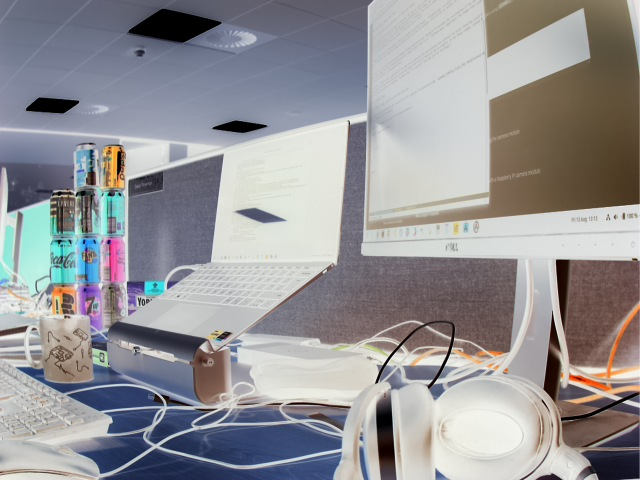
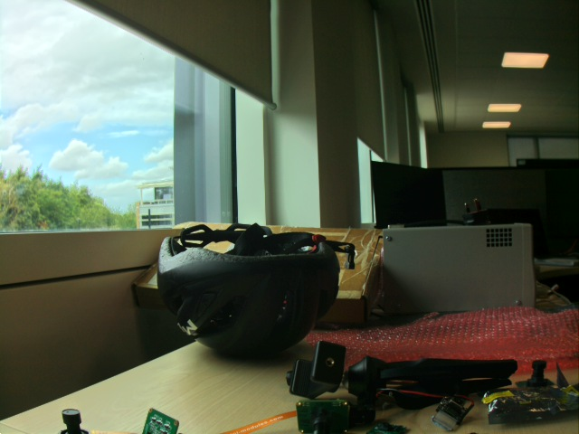

== Post-processing with `rpicam-apps`

`rpicam-apps` share a common post-processing framework. This allows them to pass the images received from the camera system through a number of custom image-processing and image-analysis routines. Each such routine is known as a _stage_. To run post-processing stages, supply a JSON file instructing the application which stages and options to apply. You can find example JSON files that use the built-in post-processing stages in the https://github.com/raspberrypi/rpicam-apps/tree/main/assets[`assets` folder of the `rpicam-apps` repository].

For example, the **negate** stage turns light pixels dark and dark pixels light. Because the negate stage is basic, requiring no configuration, `negate.json` just names the stage:

[source,json]
----
{
    "negate": {}
}
----

To apply the negate stage to an image, pass `negate.json` to the `post-process-file` option:

[source,console]
----
$ rpicam-hello --post-process-file negate.json
----

To run multiple post-processing stages, create a JSON file that contains multiple stages as top-level keys. For example, to the following configuration runs the Sobel stage, then the negate stage:

[source,json]
----
{
    "sobel_cv":
    {
        "ksize": 5
    },
    "negate": {}
}
----

The xref:camera_software.adoc#sobel_cv-stage[Sobel stage] uses OpenCV, hence the `cv` suffix. It has a user-configurable parameter, `ksize`, that specifies the kernel size of the filter to be used. In this case, the Sobel filter produces bright edges on a black background, and the negate stage turns this into dark edges on a white background.

.A negated Sobel filter.
image::images/sobel_negate.jpg[A negated Sobel filter]

Some stages, such as `negate`, alter the image in some way. Other stages analyse the image to generate metadata. Post-processing stages can pass this metadata to other stages and even the application.

To improve performance, image analysis often uses reduced resolution. `rpicam-apps` provide a dedicated low-resolution feed directly from the ISP.

NOTE: The `rpicam-apps` supplied with Raspberry Pi OS do not include OpenCV and TensorFlow Lite. As a result, certain post-processing stages that rely on them are disabled. To use these stages, xref:camera_software.adoc#build-libcamera-and-rpicam-apps[re-compile `rpicam-apps`]. On a Raspberry Pi 3 or 4 running a 32-bit kernel, compile with the `-DENABLE_COMPILE_FLAGS_FOR_TARGET=armv8-neon` flag to speed up certain stages.

=== Built-in stages

==== `negate` stage

This stage turns light pixels dark and dark pixels light.

The `negate` stage has no user-configurable parameters.

Default `negate.json` file:

[source,json]
----
{
    "negate" : {}
}
----

Run the following command to use this stage file with `rpicam-hello`:

[source,console]
----
$ rpicam-hello --post-process-file negate.json
----

Example output:

.A negated image.

==== `hdr` stage

This stage emphasises details in images using High Dynamic Range (HDR) and Dynamic Range Compression (DRC). DRC uses a single image, while HDR combines multiple images for a similar result.

Parameters fall into three groups: the LP filter, global tonemapping, and local contrast.

This stage applies a smoothing filter to the fully-processed input images to generate a low pass (LP) image. It then generates the high pass (HP) image from the diff of the original and LP images. Then, it applies a global tonemap to the LP image and adds it back to the HP image. This process helps preserve local contrast.

You can configure this stage with the following parameters:

[cols="1,3a"]
|===
| `num_frames`
| The number of frames to accumulate; for DRC, use 1; for HDR, try 8
| `lp_filter_strength`
| The coefficient of the low pass IIR filter.
| `lp_filter_threshold`
| A piecewise linear function that relates pixel level to the threshold of meaningful detail
| `global_tonemap_points`
| Points in the input image histogram mapped to targets in the output range where we wish to move them. Uses the following sub-configuration:

* an inter-quantile mean (`q` and `width`)
* a target as a proportion of the full output range (`target`)
* maximum (`max_up`) and minimum (`max_down`) gains to move the measured inter-quantile mean, to prevents the image from changing image too drastically
| `global_tonemap_strength`
| Strength of application of the global tonemap
| `local_pos_strength`
| A piecewise linear function that defines the gain applied to local contrast when added back to the tonemapped LP image, for positive (bright) detail
| `local_neg_strength`
| A piecewise linear function that defines the gain applied to local contrast when added back to the tonemapped LP image, for negative (dark) detail
| `local_tonemap_strength`
| An overall gain applied to all local contrast that is added back
| `local_colour_scale`
| A factor that allows the output colours to be affected more or less strongly
|===

To control processing strength, changing the `global_tonemap_strength` and `local_tonemap_strength` parameters.

Processing a single image takes between two and three seconds for a 12 MP image on a Raspberry Pi 4. When accumulating multiple frames, this stage sends only the processed image to the application.

Default `drc.json` file for DRC:

[source,json]
----
{
    "hdr" : {
		"num_frames" : 1,
		"lp_filter_strength" : 0.2,
		"lp_filter_threshold" : [ 0, 10.0 , 2048, 205.0, 4095, 205.0 ],
		"global_tonemap_points" :
			[
			    { "q": 0.1, "width": 0.05, "target": 0.15, "max_up": 1.5, "max_down": 0.7 },
			    { "q": 0.5, "width": 0.05, "target": 0.5, "max_up": 1.5, "max_down": 0.7 },
			    { "q": 0.8, "width": 0.05, "target": 0.8, "max_up": 1.5, "max_down": 0.7 }
			],
		"global_tonemap_strength" : 1.0,
		"local_pos_strength" : [ 0, 6.0, 1024, 2.0, 4095, 2.0 ],
		"local_neg_strength" : [ 0, 4.0, 1024, 1.5, 4095, 1.5 ],
		"local_tonemap_strength" : 1.0,
		"local_colour_scale" : 0.9
    }
}
----

Example:

.Image without DRC processing
image::images/nodrc.jpg[Image without DRC processing]

Run the following command to use this stage file with `rpicam-still`:

[source,console]
----
$ rpicam-still -o test.jpg --post-process-file drc.json
----

.Image with DRC processing
image::images/drc.jpg[Image with DRC processing]

Default `hdr.json` file for HDR:

[source,json]
----
{
    "hdr" : {
		"num_frames" : 8,
		"lp_filter_strength" : 0.2,
		"lp_filter_threshold" : [ 0, 10.0 , 2048, 205.0, 4095, 205.0 ],
		"global_tonemap_points" :
			[
			    { "q": 0.1, "width": 0.05, "target": 0.15, "max_up": 5.0, "max_down": 0.5 },
			    { "q": 0.5, "width": 0.05, "target": 0.45, "max_up": 5.0, "max_down": 0.5 },
			    { "q": 0.8, "width": 0.05, "target": 0.7, "max_up": 5.0, "max_down": 0.5 }
			],
		"global_tonemap_strength" : 1.0,
		"local_pos_strength" : [ 0, 6.0, 1024, 2.0, 4095, 2.0 ],
		"local_neg_strength" : [ 0, 4.0, 1024, 1.5, 4095, 1.5 ],
		"local_tonemap_strength" : 1.0,
		"local_colour_scale" : 0.8
    }
}
----

Example:

.Image without HDR processing
image::images/nohdr.jpg[Image without HDR processing]

Run the following command to use this stage file with `rpicam-still`:

[source,console]
----
$ rpicam-still -o test.jpg --ev -2 --denoise cdn_off --post-process-file hdr.json
----

.Image with HDR processing

==== `motion_detect` stage

The `motion_detect` stage analyses frames from the low-resolution image stream. You must configure the low-resolution stream to use this stage. The stage detects motion by comparing a region of interest (ROI) in the frame to the corresponding part of a previous frame. If enough pixels change between frames, this stage indicates the motion in metadata under the `motion_detect.result` key.

This stage has no dependencies on third-party libraries.

You can configure this stage with the following parameters, passing dimensions as a proportion of the low-resolution image size between 0 and 1:

[cols="1,3"]
|===
| `roi_x` | x-offset of the region of interest for the comparison (proportion between 0 and 1)
| `roi_y` | y-offset of the region of interest for the comparison (proportion between 0 and 1)
| `roi_width` | Width of the region of interest for the comparison (proportion between 0 and 1)
| `roi_height` | Height of the region of interest for the comparison (proportion between 0 and 1)
| `difference_m` | Linear coefficient used to construct the threshold for pixels being different
| `difference_c` | Constant coefficient used to construct the threshold for pixels being different according to `threshold = difference_m * pixel_value + difference_c`
| `frame_period` | The motion detector will run only this many frames
| `hskip` | The pixel subsampled by this amount horizontally
| `vksip` | The pixel subsampled by this amount vertically
| `region_threshold` | The proportion of pixels (regions) which must be categorised as different for them to count as motion
| `verbose` | Print messages to the console, including when the motion status changes
|===

Default `motion_detect.json` configuration file:

[source,json]
----
{
    "motion_detect" : {
		"roi_x" : 0.1,
		"roi_y" : 0.1,
		"roi_width" : 0.8,
		"roi_height" : 0.8,
		"difference_m" : 0.1,
		"difference_c" : 10,
		"region_threshold" : 0.005,
		"frame_period" : 5,
		"hskip" : 2,
		"vskip" : 2,
		"verbose" : 0
    }
}
----

Adjust the differences and the threshold to make the algorithm more or less sensitive. To improve performance, use the `hskip` and `vskip` parameters.

Run the following command to use this stage file with `rpicam-hello`:

[source,console]
----
$ rpicam-hello --lores-width 128 --lores-height 96 --post-process-file motion_detect.json
----
