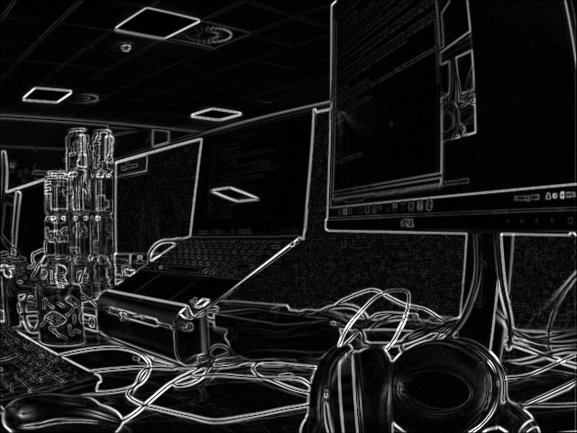
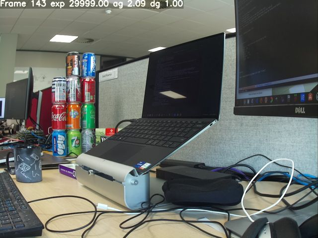

=== Post-processing with OpenCV

NOTE: These stages require an OpenCV installation. You may need to xref:camera_software.adoc#build-libcamera-and-rpicam-apps[rebuild `rpicam-apps` with OpenCV support].

==== `sobel_cv` stage

This stage applies a https://en.wikipedia.org/wiki/Sobel_operator[Sobel filter] to an image to emphasise edges.

You can configure this stage with the following parameters:

[cols="1,3"]
|===
| `ksize` | Kernel size of the Sobel filter
|===

Default `sobel_cv.json` file:

[source,json]
----
{
    "sobel_cv" : {
        "ksize": 5
    }
}
----

Example:

.Using a Sobel filter to emphasise edges.

==== `face_detect_cv` stage

This stage uses the OpenCV Haar classifier to detect faces in an image. It returns face location metadata under the key `face_detect.results` and optionally draws the locations on the image.

You can configure this stage with the following parameters:

[cols=",3]
|===
| `cascade_name` | Name of the file where the Haar cascade can be found
| `scaling_factor` | Determines range of scales at which the image is searched for faces
| `min_neighbors` | Minimum number of overlapping neighbours required to count as a face
| `min_size` | Minimum face size
| `max_size` | Maximum face size
| `refresh_rate` | How many frames to wait before trying to re-run the face detector
| `draw_features` | Whether to draw face locations on the returned image
|===

The `face_detect_cv` stage runs only during preview and video capture. It ignores still image capture. It runs on the low resolution stream with a resolution between 320×240 and 640×480 pixels.

Default `face_detect_cv.json` file:

[source,json]
----
{
    "face_detect_cv" : {
        "cascade_name" : "/usr/local/share/OpenCV/haarcascades/haarcascade_frontalface_alt.xml",
        "scaling_factor" : 1.1,
        "min_neighbors" : 2,
        "min_size" : 32,
        "max_size" : 256,
        "refresh_rate" : 1,
        "draw_features" : 1
    }
}
----

Example:

.Drawing detected faces onto an image.
image::images/face_detect.jpg[Drawing detected faces onto an image]

==== `annotate_cv` stage

This stage writes text into the top corner of images using the same `%` substitutions as the xref:camera_software.adoc#info-text[`info-text`] option.

Interprets xref:camera_software.adoc#info-text[`info-text` directives] first, then passes any remaining tokens to https://www.man7.org/linux/man-pages/man3/strftime.3.html[`strftime`].

For example, to achieve a datetime stamp on the video, pass `%F %T %z`:

* `%F` displays the ISO-8601 date (2023-03-07)
* `%T` displays 24h local time (e.g. "09:57:12")
* `%z` displays the timezone relative to UTC (e.g. "-0800")

This stage does not output any metadata, but it writes metadata found in `annotate.text` in place of anything in the JSON configuration file. This allows other post-processing stages to write text onto images.

You can configure this stage with the following parameters:

[cols="1,3"]
|===
| `text` | The text string to be written
| `fg` | Foreground colour
| `bg` | Background colour
| `scale` | A number proportional to the size of the text
| `thickness` | A number that determines the thickness of the text
| `alpha` | The amount of alpha to apply when overwriting background pixels
|===

Default `annotate_cv.json` file:

[source,json]
----
{
    "annotate_cv" : {
        "text" : "Frame %frame exp %exp ag %ag dg %dg",
        "fg" : 255,
        "bg" : 0,
        "scale" : 1.0,
        "thickness" : 2,
        "alpha" : 0.3
    }
}
----

Example:

.Writing camera and date information onto an image with annotations.

