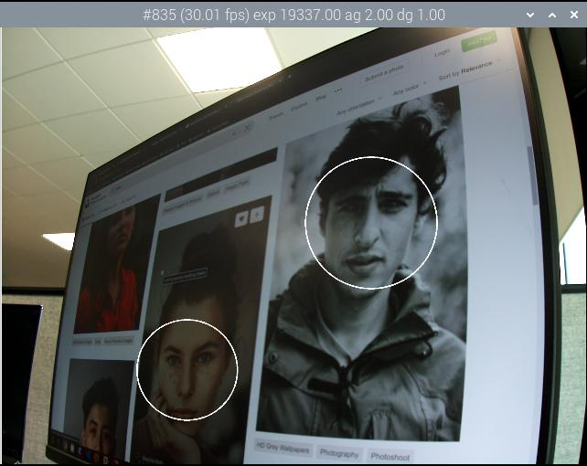

=== Post-processing with OpenCV

NOTE: These stages all require an OpenCV installation. You may need to xref:camera_software.adoc#building-libcamera-and-rpicam-apps[rebuild `rpicam-apps` with OpenCV support].

==== `sobel_cv` stage

The `sobel_cv` stage has the following user-configurable parameters:

[cols=",^"]
|===
| ksize | Kernel size of the Sobel filter
|===

Default `sobel_cv.json` file:

----
{
    "sobel_cv":
    {
        "ksize": 5
    }
}
----

Example:

image::images/sobel.jpg[Image with Sobel filter]

==== `face_detect_cv` stage

This stage uses the OpenCV Haar classifier to detect faces in an image. It returns the face locations in the metadata (under the key "face_detect.results"), and offers an option to draw them on the image.

The `face_detect_cv` stage has the following user-configurable parameters:

[cols=",^"]
|===
| cascade_name | Name of the file where the Haar cascade can be found
| scaling_factor | Determines range of scales at which the image is searched for faces
| min_neighbors | Minimum number of overlapping neighbours required to count as a face
| min_size | Minimum face size
| max_size | Maximum face size
| refresh_rate | How many frames to wait before trying to re-run the face detector
| draw_features | Whether to draw face locations on the returned image
|===

The `face_detect_cv" stage runs only during preview and video capture. It ignores still image capture. It runs on the low resolution stream which would normally be configured to a resolution from about 320x240 to 640x480 pixels.

Default `face_detect_cv.json` file:

----
{
    "face_detect_cv":
    {
        "cascade_name" : "/usr/local/share/OpenCV/haarcascades/haarcascade_frontalface_alt.xml",
        "scaling_factor" : 1.1,
        "min_neighbors" : 2,
        "min_size" : 32,
        "max_size" : 256,
        "refresh_rate" : 1,
        "draw_features" : 1
    }
}
----

Example:

==== `annotate_cv` stage

This stage writes text into the top corner of images using the same `%` substitutions as the `--info-text` parameter.

Beside the flags of xref:camera_software.adoc#display-an-image-sensor-preview[`--info-text`], you can provide any token that https://www.man7.org/linux/man-pages/man3/strftime.3.html[strftime] understands to display the current date and time.
This stage interprets `--info-text` tokens first. Any percentage token left is then passed to `strftime`. For example, to achieve a datetime stamp on the video, pass `%F %T %z`. `%F` displays the ISO-8601 date (2023-03-07). `%T` displays 24h local time (e.g. "09:57:12"). `%z` displays the timezone relative to UTC (e.g. "-0800").

This stage does not output any metadata, but if it finds metadata under the key "annotate.text" it will write this text in place of anything in the JSON configuration file. This allows other post-processing stages to pass text strings to be written onto the top of images.

The `annotate_cv` stage has the following user-configurable parameters:

[cols=",^"]
|===
| text | The text string to be written
| fg | Foreground colour
| bg | Background colour
| scale | A number proportional to the size of the text
| thickness | A number that determines the thickness of the text
| alpha | The amount of alpha to apply when overwriting the background pixels
|===

Default `annotate_cv.json` file:

----
{
    "annotate_cv" :
    {
	"text" : "Frame %frame exp %exp ag %ag dg %dg",
	"fg" : 255,
	"bg" : 0,
	"scale" : 1.0,
	"thickness" : 2,
	"alpha" : 0.3
    }
}
----

Example:

image::images/annotate.jpg[Image with text overlay]

