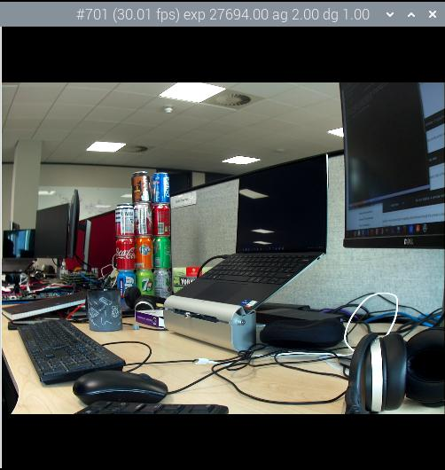
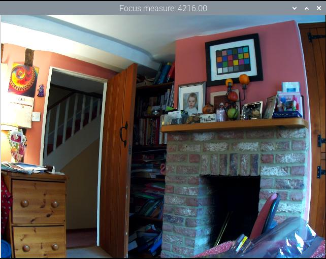

== `rpicam-apps` options reference

=== Common options

The following options apply across all the `rpicam-apps` with similar or identical semantics, unless otherwise noted.

To pass one of the following options to an application, prefix the option name with `--`. If the option requires a value, pass the value immediately after the option name, separated by a single space. If the value contains a space, surround the value in quotes.

Some options have shorthand aliases, for example `-h` instead of `--help`. Use these shorthand aliases instead of the full option name to save space and time at the expense of readability.

==== `help`

Alias: `-h`

Prints the full set of options, along with a brief synopsis of each option. Does not accept a value.

==== `version`

Prints out version strings for `libcamera` and `rpicam-apps`. Does not accept a value.

Example output:

----
rpicam-apps build: ca559f46a97a 27-09-2021 (14:10:24)
libcamera build: v0.0.0+3058-c29143f7
----

==== `list-cameras`

Lists the detected cameras attached to your Raspberry Pi and their available sensor modes. Does not accept a value.

Sensor mode identifiers have the following form: `S<Bayer order><Bit-depth>_<Optional packing> : <Resolution list>`

Crop is specified in native sensor pixels (even in pixel binning mode) as `(<x>, <y>)/<Width>×<Height>`. `(x, y)` specifies the location of the crop window of size `width × height` in the sensor array.

For example, the following output displays information about an `IMX219` sensor at index 0 and an `IMX477` sensor at index 1:

----
Available cameras
-----------------
0 : imx219 [3280x2464] (/base/soc/i2c0mux/i2c@1/imx219@10)
    Modes: 'SRGGB10_CSI2P' : 640x480 [206.65 fps - (1000, 752)/1280x960 crop]
                             1640x1232 [41.85 fps - (0, 0)/3280x2464 crop]
                             1920x1080 [47.57 fps - (680, 692)/1920x1080 crop]
                             3280x2464 [21.19 fps - (0, 0)/3280x2464 crop]
           'SRGGB8' : 640x480 [206.65 fps - (1000, 752)/1280x960 crop]
                      1640x1232 [41.85 fps - (0, 0)/3280x2464 crop]
                      1920x1080 [47.57 fps - (680, 692)/1920x1080 crop]
                      3280x2464 [21.19 fps - (0, 0)/3280x2464 crop]
1 : imx477 [4056x3040] (/base/soc/i2c0mux/i2c@1/imx477@1a)
    Modes: 'SRGGB10_CSI2P' : 1332x990 [120.05 fps - (696, 528)/2664x1980 crop]
           'SRGGB12_CSI2P' : 2028x1080 [50.03 fps - (0, 440)/4056x2160 crop]
                             2028x1520 [40.01 fps - (0, 0)/4056x3040 crop]
                             4056x3040 [10.00 fps - (0, 0)/4056x3040 crop]
----

For the IMX219 sensor in the above example:

* all modes have an `RGGB` Bayer ordering
* all modes provide either 8-bit or 10-bit CSI2 packed readout at the listed resolutions

==== `camera`

Selects the camera to use. Specify an index from the xref:camera_software.adoc#list-cameras[list of available cameras].

==== `config`

Alias: `-c`

Specify a file containing CLI options and values. Consider a file named `example_configuration.txt` that contains the following text, specifying options and values as key-value pairs, one option per line, long (non-alias) option names only:

----
timeout=99000
verbose=
----

TIP: Omit the leading `--` that you normally pass on the command line. For flags that lack a value, such as `verbose` in the above example, you must include a trailing `=`.

You could then run the following command to specify a timeout of 99000 milliseconds and verbose output:

[source,console]
----
$ rpicam-hello --config example_configuration.txt
----

==== `timeout`

Alias: `-t`

Default value: 5000 milliseconds (5 seconds)

Specify how long the application runs before closing. This value is interpreted as a number of milliseconds unless an optional suffix is used to change the unit. The suffix may be one of:

* `min` - minutes
* `s` or `sec` - seconds
* `ms` - milliseconds (the default if no suffix used)
* `us` - microseconds
* `ns` - nanoseconds.

This time applies to both video recording and preview windows. When capturing a still image, the application shows a preview window for the length of time specified by the `timeout` parameter before capturing the output image.

To run the application indefinitely, specify a value of `0`. Floating point values are also permitted.

Example: `rpicam-hello -t 0.5min` would run for 30 seconds.

==== `preview`

Alias: `-p`

Sets the location (x,y coordinates) and size (w,h dimensions) of the desktop or DRM preview window. Does not affect the resolution or aspect ratio of images requested from the camera. Scales image size and pillar or letterboxes image aspect ratio to fit within the preview window.

Pass the preview window dimensions in the following comma-separated form: `x,y,w,h`

Example: `rpicam-hello --preview 100,100,500,500`

==== `fullscreen`

Alias: `-f`

Forces the preview window to use the entire screen with no border or title bar. Scales image size and pillar or letterboxes image aspect ratio to fit within the entire screen. Does not accept a value.

==== `qt-preview`

Uses the Qt preview window, which consumes more resources than the alternatives, but supports X window forwarding. Incompatible with the xref:camera_software.adoc#fullscreen[`fullscreen`] flag. Does not accept a value.

==== `nopreview`

Alias: `-n`

Causes the application to _not_ display a preview window at all. Does not accept a value.

==== `info-text`

Default value: `"#%frame (%fps fps) exp %exp ag %ag dg %dg"`

Sets the supplied string as the title of the preview window when running in a desktop environment. Supports the following image metadata substitutions:

|===
| Directive | Substitution

| `%frame`
| Sequence number of the frame.

| `%fps`
| Instantaneous frame rate.

| `%exp`
| Shutter speed used to capture the image, in microseconds.

| `%ag`
| Analogue gain applied to the image in the sensor.

| `%dg`
| Digital gain applied to the image by the ISP.

| `%rg`
| Gain applied to the red component of each pixel.

| `%bg`
| Gain applied to the blue component of each pixel.

| `%focus`
| Focus metric for the image, where a larger value implies a sharper image.

| `%lp`
| Current lens position in dioptres (1 / distance in metres).

| `%afstate`
| Autofocus algorithm state (`idle`, `scanning`, `focused` or `failed`).
|===

==== `width` and `height`

Each accepts a single number defining the dimensions, in pixels, of the captured image.

For `rpicam-still`, `rpicam-jpeg` and `rpicam-vid`, specifies output resolution.

For `rpicam-raw`, specifies raw frame resolution. For cameras with a 2×2 binned readout mode, specifying a resolution equal to or smaller than the binned mode captures 2×2 binned raw frames.

For `rpicam-hello`, has no effect.

Examples:

* `rpicam-vid -o test.h264 --width 1920 --height 1080` captures 1080p video.

* `rpicam-still -r -o test.jpg --width 2028 --height 1520` captures a 2028×1520 resolution JPEG. If used with the HQ camera, uses 2×2 binned mode, so the raw file (`test.dng`) contains a 2028×1520 raw Bayer image.

==== `viewfinder-width` and `viewfinder-height`

Each accepts a single number defining the dimensions, in pixels, of the image displayed in the preview window. Does not effect the preview window dimensions, since images are resized to fit. Does not affect captured still images or videos.

==== `mode`

Allows you to specify a camera mode in the following colon-separated format: `<width>:<height>:<bit-depth>:<packing>`. The system selects the closest available option for the sensor if there is not an exact match for a provided value. You can use the packed (`P`) or unpacked (`U`) packing formats. Impacts the format of stored videos and stills, but not the format of frames passed to the preview window.

Bit-depth and packing are optional.
Bit-depth defaults to 12.
Packing defaults to `P` (packed).

For information about the bit-depth, resolution, and packing options available for your sensor, see xref:camera_software.adoc#list-cameras[`list-cameras`].

Examples:

* `4056:3040:12:P` - 4056×3040 resolution, 12 bits per pixel, packed.
* `1632:1224:10` - 1632×1224 resolution, 10 bits per pixel.
* `2592:1944:10:U` - 2592×1944 resolution, 10 bits per pixel, unpacked.
* `3264:2448` - 3264×2448 resolution.

===== Packed format details

The packed format uses less storage for pixel data.

_On Raspberry Pi 4 and earlier devices_, the packed format packs pixels using the MIPI CSI-2 standard. This means:

* 10-bit camera modes pack 4 pixels into 5 bytes. The first 4 bytes contain the 8 most significant bits (MSBs) of each pixel, and the final byte contains the 4 pairs of least significant bits (LSBs).
* 12-bit camera modes pack 2 pixels into 3 bytes. The first 2 bytes contain the 8 most significant bits (MSBs) of each pixel, and the final byte contains the 4 least significant bits (LSBs) of both pixels.

_On Raspberry Pi 5 and later devices_, the packed format compresses pixel values with a visually lossless compression scheme into 8 bits (1 byte) per pixel.

===== Unpacked format details

The unpacked format provides pixel values that are much easier to manually manipulate, at the expense of using more storage for pixel data.

On all devices, the unpacked format uses 2 bytes per pixel.

_On Raspberry Pi 4 and earlier devices_, applications apply zero padding at the *most significant end*. In the unpacked format, a pixel from a 10-bit camera mode cannot exceed the value 1023.

_On Raspberry Pi 5 and later devices_, applications apply zero padding at the *least significant end*, so images use the full 16-bit dynamic range of the pixel depth delivered by the sensor.

==== `viewfinder-mode`

Identical to the `mode` option, but it applies to the data passed to the preview window. For more information, see the xref:camera_software.adoc#mode[`mode` documentation].

==== `lores-width` and `lores-height`

Delivers a second, lower-resolution image stream from the camera, scaled down to the specified dimensions.

Each accepts a single number defining the dimensions, in pixels, of the lower-resolution stream.

Available for preview and video modes. Not available for still captures. If you specify a aspect ratio different from the normal resolution stream, generates non-square pixels.

For `rpicam-vid`, disables extra colour-denoise processing.

Useful for image analysis when combined with xref:camera_software.adoc#post-processing-with-rpicam-apps[image post-processing].

==== `hflip`

Flips the image horizontally. Does not accept a value.

==== `vflip`

Flips the image vertically. Does not accept a value.

==== `rotation`

Rotates the image extracted from the sensor. Accepts only the values 0 or 180.

==== `roi`

Crops the image extracted from the full field of the sensor. Accepts four decimal values, _ranged 0 to 1_, in the following format: `<x>,<y>,<w>,h>`. Each of these values represents a percentage of the available width and heights as a decimal between 0 and 1.

These values define the following proportions:

* `<x>`: X coordinates to skip before extracting an image
* `<y>`: Y coordinates to skip before extracting an image
* `<w>`: image width to extract
* `<h>`: image height to extract

Defaults to `0,0,1,1` (starts at the first X coordinate and the first Y coordinate, uses 100% of the image width, uses 100% of the image height).

Examples:

* `rpicam-hello --roi 0.25,0.25,0.5,0.5` selects exactly a half of the total number of pixels cropped from the centre of the image (skips the first 25% of X coordinates, skips the first 25% of Y coordinates, uses 50% of the total image width, uses 50% of the total image height).
* `rpicam-hello --roi 0,0,0.25,0.25` selects exactly a quarter of the total number of pixels cropped from the top left of the image (skips the first 0% of X coordinates, skips the first 0% of Y coordinates, uses 25% of the image width, uses 25% of the image height).

==== `hdr`

Default value: `off`

Runs the camera in HDR mode. If passed without a value, assumes `auto`. Accepts one of the following values:

* `off` - Disables HDR.
* `auto` - Enables HDR on supported devices. Uses the sensor's built-in HDR mode if available. If the sensor lacks a built-in HDR mode, uses on-board HDR mode, if available.
* `single-exp` - Uses on-board HDR mode, if available, even if the sensor has a built-in HDR mode. If on-board HDR mode is not available, disables HDR.

Raspberry Pi 5 and later devices have an on-board HDR mode.

To check for built-in HDR modes in a sensor, pass this option in addition to xref:camera_software.adoc#list-cameras[`list-cameras`].

=== Camera control options

The following options control image processing and algorithms that affect camera image quality.

==== `sharpness`

Sets image sharpness. Accepts a numeric value along the following spectrum:

* `0.0` applies no sharpening
* values greater than `0.0`, but less than `1.0` apply less than the default amount of sharpening
* `1.0` applies the default amount of sharpening
* values greater than `1.0` apply extra sharpening

==== `contrast`

Specifies the image contrast. Accepts a numeric value along the following spectrum:

* `0.0` applies minimum contrast
* values greater than `0.0`, but less than `1.0` apply less than the default amount of contrast
* `1.0` applies the default amount of contrast
* values greater than `1.0` apply extra contrast

==== `brightness`

Specifies the image brightness, added as an offset to all pixels in the output image. Accepts a numeric value along the following spectrum:

* `-1.0` applies minimum brightness (black)
* `0.0` applies standard brightness
* `1.0` applies maximum brightness (white)

For many use cases, prefer xref:camera_software.adoc#ev[`ev`].

==== `saturation`

Specifies the image colour saturation. Accepts a numeric value along the following spectrum:

* `0.0` applies minimum saturation (gray scale)
* values greater than `0.0`, but less than `1.0` apply less than the default amount of saturation
* `1.0` applies the default amount of saturation
* values greater than `1.0` apply extra saturation

==== `ev`

Specifies the https://en.wikipedia.org/wiki/Exposure_value[exposure value (EV)] compensation of the image in stops. Accepts a numeric value that controls target values passed to the Automatic Exposure/Gain Control (AEC/AGC) processing algorithm along the following spectrum:

* `-10.0` applies minimum target values
* `0.0` applies standard target values
* `10.0` applies maximum target values

==== `shutter`

Specifies the exposure time, using the shutter, in _microseconds_. Gain can still vary when you use this option. If the camera runs at a framerate so fast it does not allow for the specified exposure time (for instance, a framerate of 1fps and an exposure time of 10000 microseconds), the sensor will use the maximum exposure time allowed by the framerate.

For a list of minimum and maximum shutter times for official cameras, see the xref:../accessories/camera.adoc#hardware-specification[camera hardware documentation]. Values above the maximum result in undefined behaviour.

==== `gain`

Alias: `--analoggain`

Sets the combined analogue and digital gain. When the sensor driver can provide the requested gain, only uses analogue gain. When analogue gain reaches the maximum value, the ISP applies digital gain. Accepts a numeric value.

For a list of analogue gain limits, for official cameras, see the xref:../accessories/camera.adoc#hardware-specification[camera hardware documentation].

Sometimes, digital gain can exceed 1.0 even when the analogue gain limit is not exceeded. This can occur in the following situations:

* Either of the colour gains drops below 1.0, which will cause the digital gain to settle to 1.0/min(red_gain,blue_gain). This keeps the total digital gain applied to any colour channel above 1.0 to avoid discolouration artefacts.
* Slight variances during Automatic Exposure/Gain Control (AEC/AGC) changes.

==== `metering`

Default value: `centre`

Sets the metering mode of the Automatic Exposure/Gain Control (AEC/AGC) algorithm. Accepts the following values:

* `centre` - centre weighted metering
* `spot` - spot metering
* `average` - average or whole frame metering
* `custom` - custom metering mode defined in the camera tuning file

For more information on defining a custom metering mode, and adjusting region weights in existing metering modes, see the https://datasheets.raspberrypi.com/camera/raspberry-pi-camera-guide.pdf[Tuning guide for the Raspberry Pi cameras and libcamera].

==== `exposure`

Sets the exposure profile. Changing the exposure profile should not affect the image exposure. Instead, different modes adjust gain settings to achieve the same net result. Accepts the following values:

* `sport`: short exposure, larger gains
* `normal`: normal exposure, normal gains
* `long`: long exposure, smaller gains

You can edit exposure profiles using tuning files. For more information, see the https://datasheets.raspberrypi.com/camera/raspberry-pi-camera-guide.pdf[Tuning guide for the Raspberry Pi cameras and libcamera].

==== `awb`

Sets the Auto White Balance (AWB) mode. Accepts the following values:

|===
| Mode name | Colour temperature range

| `auto`
| 2500K to 8000K

| `incandescent`
| 2500K to 3000K

| `tungsten`
| 3000K to 3500K

| `fluorescent`
| 4000K to 4700K

| `indoor`
| 3000K to 5000K

| `daylight`
| 5500K to 6500K

| `cloudy`
| 7000K to 8500K

| `custom`
| A custom range defined in the tuning file.
|===

These values are only approximate: values could vary according to the camera tuning.

No mode fully disables AWB. Instead, you can fix colour gains with xref:camera_software.adoc#awbgains[`awbgains`].

For more information on AWB modes, including how to define a custom one, see the https://datasheets.raspberrypi.com/camera/raspberry-pi-camera-guide.pdf[Tuning guide for the Raspberry Pi cameras and libcamera].

==== `awbgains`

Sets a fixed red and blue gain value to be used instead of an Auto White Balance (AWB) algorithm. Set non-zero values to disable AWB. Accepts comma-separated numeric input in the following format: `<red_gain>,<blue_gain>`

==== `denoise`

Default value: `auto`

Sets the denoising mode. Accepts the following values:

* `auto`: Enables standard spatial denoise. Uses extra-fast colour denoise for video, and high-quality colour denoise for images. Enables no extra colour denoise in the preview window.

* `off`: Disables spatial and colour denoise.

* `cdn_off`: Disables colour denoise.

* `cdn_fast`: Uses fast colour denoise.

* `cdn_hq`: Uses high-quality colour denoise. Not appropriate for video/viewfinder due to reduced throughput.

Even fast colour denoise can lower framerates. High quality colour denoise _significantly_ lowers framerates.

==== `tuning-file`

Specifies the camera tuning file. The tuning file allows you to control many aspects of image processing, including the  Automatic Exposure/Gain Control (AEC/AGC), Auto White Balance (AWB), colour shading correction, colour processing, denoising and more. Accepts a tuning file path as input.

For more information about tuning files, see xref:camera_software.adoc#tuning-files[Tuning Files].

==== `autofocus-mode`

Default value: `default`

Specifies the autofocus mode. Accepts the following values:

* `default`: puts the camera into continuous autofocus mode unless xref:camera_software.adoc#lens-position[`lens-position`] or xref:camera_software.adoc#autofocus-on-capture[`autofocus-on-capture`] override the mode to manual
* `manual`: does not move the lens at all unless manually configured with xref:camera_software.adoc#lens-position[`lens-position`]
* `auto`: only moves the lens for an autofocus sweep when the camera starts or just before capture if xref:camera_software.adoc#autofocus-on-capture[`autofocus-on-capture`] is also used
* `continuous`: adjusts the lens position automatically as the scene changes

This option is only supported for certain camera modules.

==== `autofocus-range`

Default value: `normal`

Specifies the autofocus range. Accepts the following values:

* `normal`: focuses from reasonably close to infinity
* `macro`: focuses only on close objects, including the closest focal distances supported by the camera
* `full`: focus on the entire range, from the very closest objects to infinity

This option is only supported for certain camera modules.

==== `autofocus-speed`

Default value: `normal`

Specifies the autofocus speed. Accepts the following values:

* `normal`: changes the lens position at normal speed
* `fast`: changes the lens position quickly

This option is only supported for certain camera modules.

==== `autofocus-window`

Specifies the autofocus window within the full field of the sensor. Accepts four decimal values, _ranged 0 to 1_, in the following format: `<x>,<y>,<w>,h>`. Each of these values represents a percentage of the available width and heights as a decimal between 0 and 1.

These values define the following proportions:

* `<x>`: X coordinates to skip before applying autofocus
* `<y>`: Y coordinates to skip before applying autofocus
* `<w>`: autofocus area width
* `<h>`: autofocus area height

The default value uses the middle third of the output image in both dimensions (1/9 of the total image area).

Examples:

* `rpicam-hello --autofocus-window 0.25,0.25,0.5,0.5` selects exactly half of the total number of pixels cropped from the centre of the image (skips the first 25% of X coordinates, skips the first 25% of Y coordinates, uses 50% of the total image width, uses 50% of the total image height).
* `rpicam-hello --autofocus-window 0,0,0.25,0.25` selects exactly a quarter of the total number of pixels cropped from the top left of the image (skips the first 0% of X coordinates, skips the first 0% of Y coordinates, uses 25% of the image width, uses 25% of the image height).

This option is only supported for certain camera modules.

==== `lens-position`

Default value: `default`

Moves the lens to a fixed focal distance, normally given in dioptres (units of 1 / _distance in metres_). Accepts the following spectrum of values:

* `0.0`: moves the lens to the "infinity" position
* Any other `number`: moves the lens to the 1 / `number` position. For example, the value `2.0` would focus at approximately 0.5m
* `default`: move the lens to a default position which corresponds to the hyperfocal position of the lens

Lens calibration is imperfect, so different camera modules of the same model may vary.

==== `verbose`

Alias: `-v`

Default value: `1`

Sets the verbosity level. Accepts the following values:

* `0`: no output
* `1`: normal output
* `2`: verbose output

=== Output file options

==== `output`

Alias: `-o`

Sets the name of the file used to record images or video. Besides plaintext file names, accepts the following special values:

* `-`: write to stdout.
* `udp://` (prefix): a network address for UDP streaming.
* `tcp://` (prefix): a network address for TCP streaming.
* Include the `%d` directive in the file name to replace the directive with a count that increments for each opened file. This directive supports standard C format directive modifiers.

Examples:

* `rpicam-vid -t 100000 --segment 10000 -o chunk%04d.h264` records a 100 second file in 10 second segments, where each file includes an incrementing four-digit counter padded with leading zeros: e.g. `chunk0001.h264`, `chunk0002.h264`, etc.

* `rpicam-vid -t 0 --inline -o udp://192.168.1.13:5000` streams H.264 video to network address 192.168.1.13 using UDP on port 5000.

==== `wrap`

Sets a maximum value for the counter used by the xref:camera_software.adoc#output[`output`] `%d` directive. The counter resets to zero after reaching this value. Accepts a numeric value.

==== `flush`

Flushes output files to disk as soon as a frame finishes writing, instead of waiting for the system to handle it. Does not accept a value.

==== `post-process-file`

Specifies a JSON file that configures the post-processing applied by the imaging pipeline. This applies to camera images _before_ they reach the application. This works similarly to the legacy `raspicam` "image effects". Accepts a file name path as input.

Post-processing is a large topic and admits the use of third-party software like OpenCV and TensorFlowLite to analyse and manipulate images. For more information, see xref:camera_software.adoc#post-processing-with-rpicam-apps[post-processing].

==== `buffer-count`

The number of buffers to allocate for still image capture or for video recording. The default value of zero lets each application choose a reasonable number for its own use case (1 for still image capture, and 6 for video recording). Increasing the number can sometimes help to reduce the number of frame drops, particularly at higher framerates.

==== `viewfinder-buffer-count`

As the `buffer-count` option, but applies when running in preview mode (that is `rpicam-hello` or the preview, not capture, phase of `rpicam-still`).

==== `metadata`

Save captured image metadata to a file or `-` for stdout. The fields in the metadata output will depend on the camera model in use.

See also `metadata-format`.

==== `metadata-format`

Format to save the metadata in. Accepts the following values:

* `txt` for text format
* `json` for JSON format

In text format, each line will have the form

    key=value

In JSON format, the output is a JSON object.

This option does nothing unless `--metadata` is also specified.
