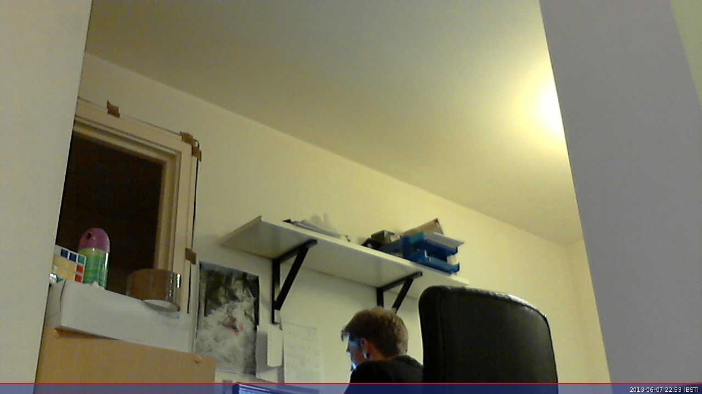

== Use a USB webcam

Most Raspberry Pi devices have dedicated ports for camera modules. Camera modules are high-quality, highly-configurable cameras popular with Raspberry Pi users.

However, for many purposes a USB webcam has everything you need to record pictures and videos from your Raspberry Pi. This section explains how to use a USB webcam with your Raspberry Pi.

=== Install dependencies

First, install the `fswebcam` package:

[source,console]
----
$ sudo apt install fswebcam
----

Next, add your username to the `video` group, otherwise you may see 'permission denied' errors:

[source,console]
----
$ sudo usermod -a -G video <username>
----

To check that the user has been added to the group correctly, use the `groups` command.

=== Take a photo

Run the following command to take a picture using the webcam and save the image to a filename named `image.jpg`:

[source,console]
----
$ fswebcam image.jpg
----

You should see output similar to the following:

----
--- Opening /dev/video0...
Trying source module v4l2...
/dev/video0 opened.
No input was specified, using the first.
Adjusting resolution from 384x288 to 352x288.
--- Capturing frame...
Corrupt JPEG data: 2 extraneous bytes before marker 0xd4
Captured frame in 0.00 seconds.
--- Processing captured image...
Writing JPEG image to 'image.jpg'.
----

.By default, `fswebcam` uses a low resolution and adds a banner displaying a timestamp.
image::images/webcam-image.jpg[By default, `fswebcam` uses a low resolution and adds a banner displaying a timestamp]

To specify a different resolution for the captured image, use the `-r` flag, passing a width and height as two numbers separated by an `x`:

[source,console]
----
$ fswebcam -r 1280x720 image2.jpg
----

You should see output similar to the following:

----
--- Opening /dev/video0...
Trying source module v4l2...
/dev/video0 opened.
No input was specified, using the first.
--- Capturing frame...
Corrupt JPEG data: 1 extraneous bytes before marker 0xd5
Captured frame in 0.00 seconds.
--- Processing captured image...
Writing JPEG image to 'image2.jpg'.
----

.Specify a resolution to capture a higher quality image.

==== Remove the banner

To remove the banner from the captured image, use the `--no-banner` flag:

[source,console]
----
$ fswebcam --no-banner image3.jpg
----

You should see output similar to the following:

----
--- Opening /dev/video0...
Trying source module v4l2...
/dev/video0 opened.
No input was specified, using the first.
--- Capturing frame...
Corrupt JPEG data: 2 extraneous bytes before marker 0xd6
Captured frame in 0.00 seconds.
--- Processing captured image...
Disabling banner.
Writing JPEG image to 'image3.jpg'.
----

.Specify `--no-banner` to save the image without the timestamp banner.
image::images/webcam-image-no-banner.jpg[Specify `--no-banner` to save the image without the timestamp banner]

=== Automate image capture

Unlike xref:camera_software.adoc#rpicam-apps[`rpicam-apps`], `fswebcam` doesn't have any built-in functionality to substitute timestamps and numbers in output image names. This can be useful when capturing multiple images, since manually editing the file name every time you record an image can be tedious. Instead, use a Bash script to implement this functionality yourself.

Create a new file named `webcam.sh` in your home folder. Add the following example code, which uses the `bash` programming language to save images to files with a file name containing the year, month, day, hour, minute, and second:

[,bash]
----
#!/bin/bash

DATE=$(date +"%Y-%m-%d_%H-%M-%S")

fswebcam -r 1280x720 --no-banner $DATE.jpg
----

Then, make the bash script executable by running the following command:

[source,console]
----
$ chmod +x webcam.sh
----

Run the script with the following command to capture an image and save it to a file with a timestamp for a name, similar to `2024-05-10_12-06-33.jpg`:

[source,console]
----
$ ./webcam.sh
----

You should see output similar to the following:

----
--- Opening /dev/video0...
Trying source module v4l2...
/dev/video0 opened.
No input was specified, using the first.
--- Capturing frame...
Corrupt JPEG data: 2 extraneous bytes before marker 0xd6
Captured frame in 0.00 seconds.
--- Processing captured image...
Disabling banner.
Writing JPEG image to '2024-05-10_12-06-33.jpg'.
----

=== Capture a time lapse

Use `cron` to schedule photo capture at a given interval. With the right interval, such as once a minute, you can capture a time lapse.

First, open the cron table for editing:

[source,console]
----
$ crontab -e
----

Once you have the file open in an editor, add the following line to the schedule to take a picture every minute, replacing `<username>` with your username:

[,bash]
----
* * * * * /home/<username>/webcam.sh 2>&1
----

Save and exit, and you should see the following message:

----
crontab: installing new crontab
----
