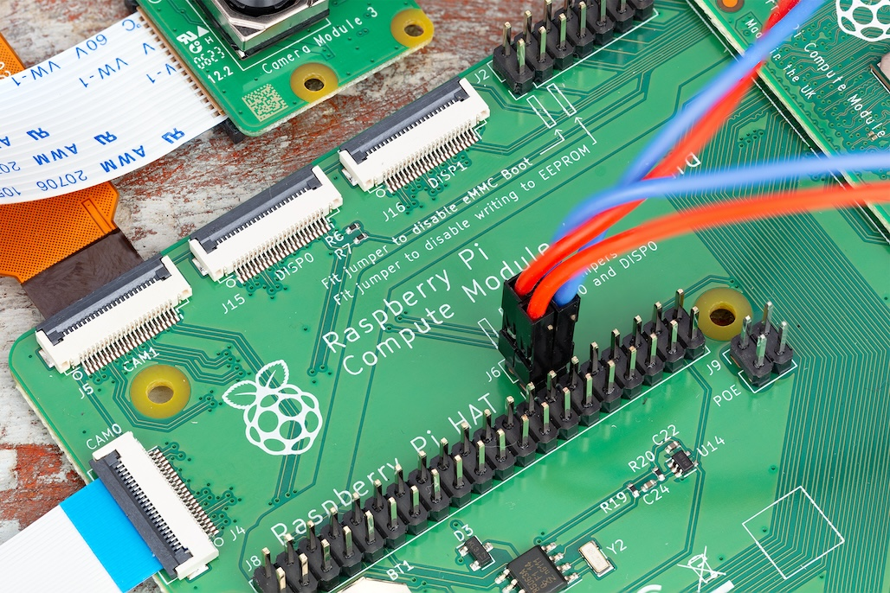

== Attach a Raspberry Pi Camera Module

The Compute Module has two CSI-2 camera interfaces: CAM1 and CAM0. This section explains how to connect one or two Raspberry Pi Cameras to a Compute Module using the CAM1 and CAM0 interfaces with a Compute Module I/O Board.

IMPORTANT: Camera modules are not hot-pluggable. *Always* power down your board before connecting or disconnecting a camera module.

=== Update your system

Before configuring a camera, ensure your system runs the latest available software:

----
sudo apt update
sudo apt full-upgrade
----

=== Connect one camera

To connect a single camera to a Compute Module, complete the following steps:

. Power the Compute Module down.
. Connect the Camera Module to the CAM1 port using a RPI-CAMERA board or a Raspberry Pi Zero camera cable.
+
image::images/CMIO-Cam-Adapter.jpg[Connecting the adapter board]

. _(CM1, CM3, CM3+, and CM4S only)_: Connect the following GPIO pins with jumper cables:
  * `0` to `CD1_SDA`
  * `1` to `CD1_SCL`
  * `2` to `CAM1_I01`
  * `3` to `CAM1_I00`
+
image::images/CMIO-Cam-GPIO.jpg[GPIO connection for a single camera]

. Remove (or comment out with the prefix `#`) the following lines, if they exist, in `/boot/firmware/config.txt`:
+
----
camera_auto_detect=1
----
+
----
dtparam=i2c_arm=on
----
NOTE: If your Compute Module includes onboard EMMC storage, you can boot, edit the boot configuration, then reboot to load the configuration changes.

. _(CM1, CM3, CM3+, and CM4S only)_: Add the following directive to `/boot/firmware/config.txt` to accommodate the swapped GPIO pin assignment on the I/O board:
+
----
dtoverlay=cm-swap-i2c0
----

. _(CM1, CM3, CM3+, and CM4S only)_: Add the following directive to `/boot/firmware/config.txt` to assign GPIO 3 as the CAM1 regulator:
+
----
dtparam=cam1_reg
---- 

. Add the appropriate directive to `/boot/firmware/config.txt` to manually configure the driver for your camera model:
+
[%header,cols="1,1"]
|===
| camera model
| directive

| v1 camera 
| `dtoverlay=ov5647,cam1`

| v2 camera
| `dtoverlay=imx219,cam1`

| v3 camera
| `dtoverlay=imx708,cam1`

| HQ camera
| `dtoverlay=imx477,cam1`

| GS camera
| `dtoverlay=imx296,cam1`
|===

. Power the Compute Module on.

. Run the following command to check the list of detected cameras:
+
----
libcamera-hello --list
----
You should see your camera model, referred to by the driver directive in the table above, in the output.

=== Connect two cameras

To connect two cameras to a Compute Module, complete the following steps:

. Follow the single camera quickstart above.
. Power the Compute Module down.
. Connect the Camera Module to the CAM0 port using a RPI-CAMERA board or a Raspberry Pi Zero camera cable.
+
image::images/CMIO-Cam-Adapter.jpg[Connect the adapter board]
. _(CM1, CM3, CM3+, and CM4S only)_: Connect the following GPIO pins with jumper cables:
  * `28` to `CD0_SDA`
  * `29` to `CD0_SCL`
  * `30` to `CAM0_I01`
  * `31` to `CAM0_I00`
+
image:images/CMIO-Cam-GPIO2.jpg[GPIO connection with additional camera]

. _(CM4 only)_: Connect the J6 GPIO pins with two vertical-orientation jumpers.
+

. _(CM1, CM3, CM3+, and CM4S only)_: Add the following directive to `/boot/firmware/config.txt` to assign GPIO 31 as the CAM0 regulator:
+
----
dtparam=cam0_reg
----
NOTE: If your Compute Module includes onboard EMMC storage, you can boot, edit the boot configuration, then reboot to load the configuration changes.

. Add the appropriate directive to `/boot/firmware/config.txt` to manually configure the driver for your camera model:
+
[%header,cols="1,1"]
|===
| camera model
| directive

| v1 camera 
| `dtoverlay=ov5647,cam0`

| v2 camera
| `dtoverlay=imx219,cam0`

| v3 camera
| `dtoverlay=imx708,cam0`

| HQ camera
| `dtoverlay=imx477,cam0`

| GS camera
| `dtoverlay=imx296,cam0`
|===

. Power the Compute Module on.

. Run the following command to check the list of detected cameras:
+
----
libcamera-hello --list
----
+
You should see both camera models, referred to by the driver directives in the table above, in the output.

=== Software

Raspberry Pi OS includes the `libcamera` library to help you take images with your Raspberry Pi.

==== Take a picture

Use the following command to immediately take a picture and save it to a file in PNG encoding using the `MMDDhhmmss` date format as a filename:

----
libcamera-still --datetime -e png
----

Use the `-t` option to add a delay in milliseconds.
Use the `--width` and `--height` options to specify a width and height for the image.

==== Take a video

Use the following command to immediately start recording a 10 second long video and save it to a file with the h264 codec named `video.h264`:

----
libcamera-vid -t 10000 -o video.h264
----

==== Specify which camera to use

By default, `libcamera` always uses the camera with index `0` in the `--list-cameras` list.
To specify a camera option, get an index value for each camera from the following command:

----
$ libcamera-hello --list-cameras
Available cameras
-----------------
0 : imx477 [4056x3040] (/base/soc/i2c0mux/i2c@1/imx477@1a)
    Modes: 'SRGGB10_CSI2P' : 1332x990 [120.05 fps - (696, 528)/2664x1980 crop]
           'SRGGB12_CSI2P' : 2028x1080 [50.03 fps - (0, 440)/4056x2160 crop]
                             2028x1520 [40.01 fps - (0, 0)/4056x3040 crop]
                             4056x3040 [10.00 fps - (0, 0)/4056x3040 crop]

1 : imx708 [4608x2592] (/base/soc/i2c0mux/i2c@0/imx708@1a)
    Modes: 'SRGGB10_CSI2P' : 1536x864 [120.13 fps - (768, 432)/3072x1728 crop]
                             2304x1296 [56.03 fps - (0, 0)/4608x2592 crop]
                             4608x2592 [14.35 fps - (0, 0)/4608x2592 crop]
----

In the above output:

* `imx477` refers to a HQ camera with an index of `0`
* `imx708` refers to a v3 camera with an index of `1`

To use the HQ camera, pass its index (`0`) to the `--camera` `libcamera` option:

----
libcamera-hello --camera 0
----

To use the v3 camera, pass its index (`1`) to the `--camera` `libcamera` option:

----
libcamera-hello --camera 1
----

=== I2C mapping of GPIO pins

By default, the supplied camera drivers assume that CAM1 uses `i2c-10` and CAM0 uses `i2c-0`. Compute module I/O boards map the following GPIO pins to `i2c-10` and `i2c-0`:

[%header,cols="1,1,1"]
|===
| I/O Board Model
| `i2c-10` pins
| `i2c-0` pins

| CM4 I/O Board
| GPIOs 44,45
| GPIOs 0,1

| CM1, CM3, CM3+, CM4S I/O Board
| GPIOs 0,1
| GPIOs 28,29
|===

To connect a camera to the CM1, CM3, CM3+ and CM4S I/O Board, add the following directive to `/boot/firmware/config.txt` to accommodate the swapped pin assignment:

----
dtoverlay=cm-swap-i2c0
----

Alternative boards may use other pin assignments. Check the documentation for your board and use the following alternate overrides depending on your layout:

[%header,cols="1,1"]
|===
| Swap
| Override

| Use GPIOs 0,1 for i2c0
| `i2c0-gpio0`

| Use GPIOs 28,29 for i2c0 (default)
| `i2c0-gpio28`

| Use GPIOs 44&45 for i2c0
| `i2c0-gpio44`

| Use GPIOs 0&1 for i2c10 (default)
| `i2c10-gpio0`

| Use GPIOs 28&29 for i2c10
| `i2c10-gpio28`

| Use GPIOs 44&45 for i2c10
| `i2c10-gpio44`
|===

==== GPIO pins for shutdown

For camera shutdown, Device Tree uses the pins assigned by the `cam1_reg` and `cam0_reg` overlays.

The CM4 IO Board provides a single GPIO pin for both aliases, so both cameras share the same regulator.

The CM1, CM3, CM3+, and CM4S I/O Board provides no GPIO pin for `cam1_reg` and `cam0_reg`, so the regulators are disabled on those boards. However, you can enable them with the following directives in `/boot/firmware/config.txt`:

* `dtparam=cam1_reg`
* `dtparam=cam0_reg`

To assign `cam1_reg` and `cam0_reg` to a specific pin on a custom board, use the following directives in `/boot/firmware/config.txt`:

* `dtparam=cam1_reg_gpio=<pin number>`
* `dtparam=cam0_reg_gpio=<pin number>`

For example, to use pin 42 as the regulator for CAM1, add the directive `dtparam=cam1_reg_gpio=42` to `/boot/firmware/config.txt`.

These directives only work for GPIO pins connected directly to the SoC, not for expander GPIO pins.
