A Raspberry Pi *Compute Module (CM)* is a compact version of a standard Raspberry Pi single-board computer (SBC) designed primarily for embedded and industrial applications. A Compute Module contains the core components of a Raspberry Pi but without the standard connectors like HDMI, USB, or Ethernet.

A Raspberry Pi *Compute Module IO Board (CMIO)* provides the physical connectors, peripheral interfaces, and expansion options necessary for accessing and expanding a Compute Module's functionality. A Compute Module IO Board can be used as a standalone product, allowing for rapid prototyping and embedded systems development, or as a reference design for your own carrier (IO) board. In either case, you can selectively make use of only the connectors that your application requires.

This page:

* Summarises the available Raspberry Pi Compute Module and IO Board models, including information about their compatibility and key features.
* Describes the accessories available for Compute Module 5 (CM5) and its IO Board (CM5IO).
* Explains how to flash and boot Raspberry Pi Compute Modules.
* Explains how to configure the EEPROM bootloader of a Compute Module.
* Explains how to wire and enable peripherals like cameras and displays using Device Tree and overlays.
* Provides links to datasheets, schematics, and design resources.

== Compute Modules

Raspberry Pi Compute Modules are *system-on-module (SoM)* variants of the flagship Raspberry Pi single-board computers (SBC). They're designed for industrial and commercial applications, such as digital signage, thin clients, and process automation. Many developers and system designers choose Compute Modules over flagship Raspberry Pi models for their compact design, flexibility, and support for on-board eMMC storage.

=== Memory, storage, and wireless variants

Raspberry Pi Compute Modules are available in several variants, differing in memory, embedded Multi-Media Card (eMMC) flash storage capacity (soldered onto the board), and wireless connectivity (Wi-Fi and Bluetooth).

* *Memory.* Compute Modules 1, 3, and 3+ offer a fixed amount of RAM. Compute Modules 4, 4S, and 5 offer different amounts of RAM; for details about the available options, see the dedicated sections for each Compute Module model on this page.
* *Storage.* Compute Modules 3, 3+, 4, 4S, and 5 offer different storage options, with later models offering more options and larger sizes than earlier models. Compute Module 1 offers a fixed 4 GB of storage. Storage is provided by eMMC flash memory, which provides persistent storage with low power consumption and built-in features that improve reliability. Variants with no on-board storage are referred to with the suffix *Lite* or *L*, for example, "CM5Lite" or "CM3L".
* *Wireless.* Compute Modules 4 and 5 offer optional Wi-Fi and Bluetooth.

=== Models

The following table summarises Raspberry Pi Compute Modules in reverse chronological order, listing their SoC, GPU, CPU, and form factor for quick reference. For more information about each of these models, including memory and storage options, see the following dedicated sections on this page.

[cols="1,1,1,1,1,1", options="header"]
|===
|Model|Based on|SoC|GPU|CPU|Form factor

| <<cm5, *CM5*>> (2024)
| Raspberry Pi 5
| Broadcom BCM2712
|VideoCore VII
| 4 × Cortex-A76 at 2.4 GHz
|Dual 100-pin connectors

| <<cm4s, *CM4S*>> (2022)
| Raspberry Pi 4 Model B (in CM3 form factor)
| Broadcom BCM2711
|VideoCore VI
| 4 × Cortex-A72 at 1.5 GHz
|DDR2 SODIMM

| <<cm4, *CM4*>> (2020)
| Raspberry Pi 4 Model B
| Broadcom BCM2711
|VideoCore VI
| 4 × Cortex-A72 at 1.5 GHz
|Dual 100-pin connectors

| <<cm3plus, *CM3+*>> (2019)
| Raspberry Pi 3 Model B+
| Broadcom BCM2837B0
|VideoCore IV
| 4 × Cortex-A53 at 1.2 GHz
|DDR2 SODIMM

| <<cm3, *CM3*>> (2017; discontinued October 2025)
| Raspberry Pi 3 Model B
| Broadcom BCM2837
|VideoCore IV
| 4 × Cortex-A53 at 1.2 GHz
|DDR2 SODIMM

| <<cm1, *CM1*>> (2014)
| Raspberry Pi Model B
| Broadcom BCM2835
|VideoCore IV
| 1 × ARM1176JZF-S at 700 MHz
|DDR2 SODIMM

|===

[[cm5]]
=== Compute Module 5

.Compute Module 5
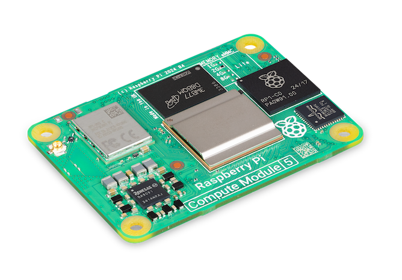

Compute Module 5 (*CM5*) combines the core components of Raspberry Pi 5 with optional flash storage. Key features include:

* *Processor.* Broadcom BCM2712.
* *Memory options.* 2 GB, 4 GB, 8 GB, or 16 GB of RAM.
* *Storage options.* 0 GB (*CM5Lite*), 16 GB, 32 GB, or 64 GB of eMMC flash memory.
* *Form factor.* Two 100-pin high-density connectors for connecting to the companion carrier board.

CM5 uses the same form factor as *CM4* and provides input/output (I/O) interfaces beyond those available on standard Raspberry Pi boards, offering expanded options for more complex systems and designs.

[[cm4s]]
=== Compute Module 4S

.Compute Module 4S
image::images/cm4s.jpg[alt="Compute Module 4S", width="60%"]

Compute Module 4S (*CM4S*) combines the core components of Raspberry Pi 4 with optional flash storage. Key features include:

* *Processor.* Broadcom BCM2711.
* *Memory options.* 1 GB, 2 GB, 4 GB, or 8 GB of RAM.
* *Storage options.* 0 GB (*CM4SLite*), 8 GB, 16 GB, or 32 GB of eMMC flash memory.
* *Form factor.* Standard DDR2 SODIMM module.

Unlike *CM4*, CM4S retains the DDR2 SODIMM form factor used in *CM1*, *CM3*, and *CM3+*.

[[cm4]]
=== Compute Module 4

.Compute Module 4
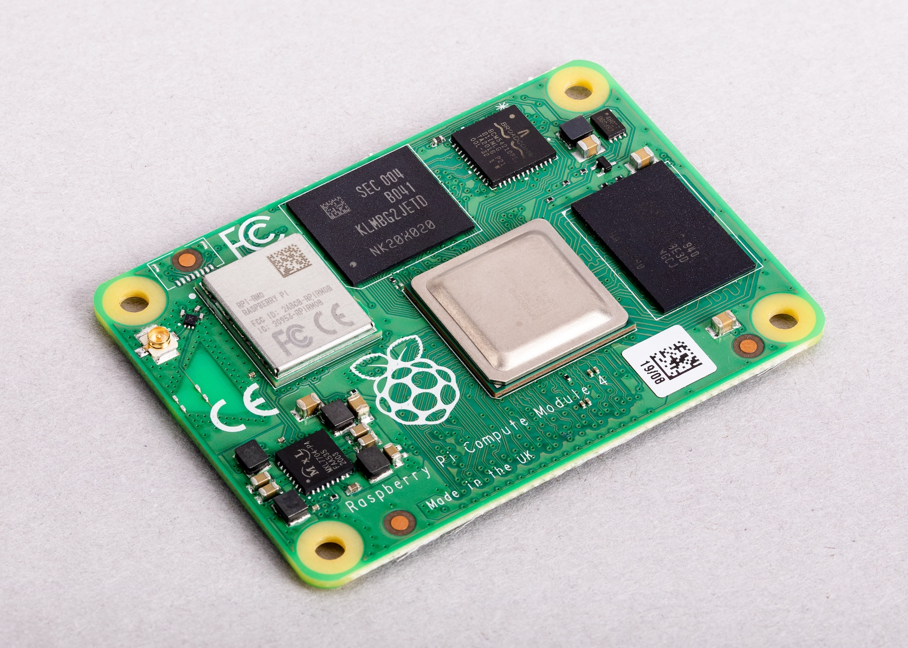

Compute Module 4 (*CM4*) combines the core components of Raspberry Pi 4 with optional flash storage. Key features include:

* *Processor.* Broadcom BCM2711.
* *Memory options.* 1 GB, 2 GB, 4 GB, or 8 GB of RAM.
* *Storage options.* 0 GB (*CM4Lite*), 8 GB, 16 GB, or 32 GB of eMMC flash memory.
* *Form factor.* Two 100-pin high-density connectors for connecting to the companion carrier board.
* *Temperature range options.* Operating temperature of -20°C to +85°C for standard variants or -40°C to +85°C for wider applications.

Unlike earlier modules (*CM1*, *CM3*, *CM3+*), CM4 moved away from the DDR2 SODIMM form factor to a dual 100-pin high-density connector layout, which results in a smaller physical footprint. This redesign supports the following additional features:

* Dual HDMI connectors
* PCIe support
* Ethernet connector

[[cm3plus]]
=== Compute Module 3+

.Compute Module 3+
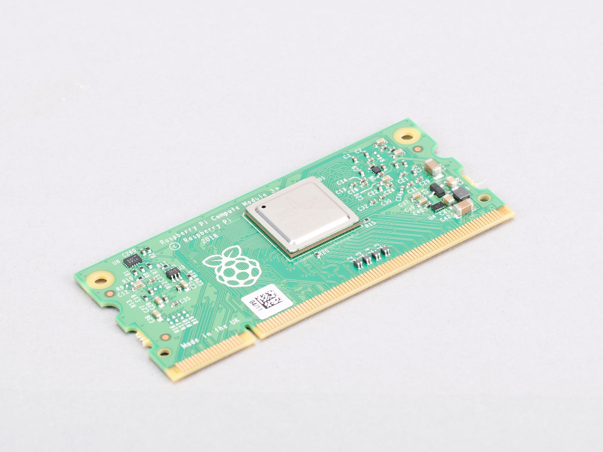

Compute Module 3+ (*CM3+*) combines the core components of Raspberry Pi 3 Model B+ with optional flash storage. Key features include:

* *Processor.* Broadcom BCM2837B0.
* *Memory*. 1 GB of RAM.
* *Storage options.* 0 GB (*CM3+Lite*) or 8 GB, 16 GB, or 32 GB of eMMC flash memory.
* *Form factor.* Standard DDR2 SODIMM module.

[[cm3]]
=== Compute Module 3

.Compute Module 3
image::images/cm3.jpg[alt="Compute Module 3", width="60%"]

IMPORTANT: Raspberry Pi Compute Module 3 (CM3) and Compute Module 3 Lite (CM3Lite) have reached End-of-Life (EoL) due to the discontinuation of the core SoC used in these products. The official EoL date was 16 October 2025. The closest equivalent to CM3 is Raspberry Pi <<cm3plus, Compute Module 3+>>, which offers the same mechanical footprint, improved thermal design, and a BCM2837B0 processor, and so is recommended for existing designs. For new designs requiring the SODIMM form factor, we recommend <<cm4s, Compute Module 4S>>. For all other new designs, we recommend <<cm4, Compute Module 4>> or <<cm5, Compute Module 5>>. For more information, see the official https://pip.raspberrypi.com/documents/RP-009286-PC?disposition=inline[Obsolescence Notice].

Compute Module 3 (*CM3*) combines the core components of Raspberry Pi 3 with an optional 4 GB of flash storage. Key features include:

* *Processor.* Broadcom BCM2837.
* *Memory.* 1 GB of RAM.
* *Storage options.* 0 GB (*CM3Lite*) or 4 GB of eMMC flash memory.
* *Form factor.* Standard DDR2 SODIMM module.

[[cm1]]
=== Compute Module 1

.Compute Module 1
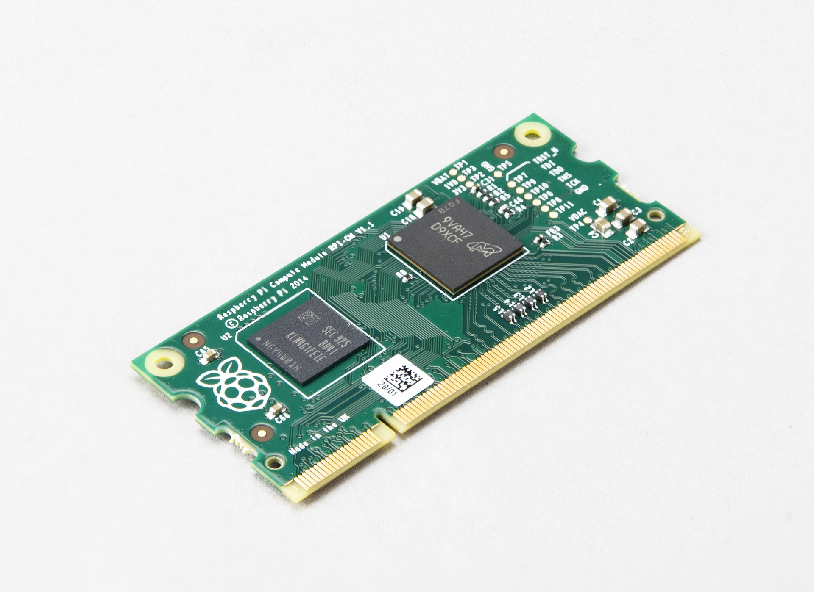

Compute Module 1 (*CM1*) combines the core components of Raspberry Pi Model B with 4 GB of flash storage. Key features include:

* *Processor.* Broadcom BCM2835.
* *Memory.* 512 MB of RAM.
* *Storage.* 4 GB of eMMC flash memory.
* *Form factor.* Standard DDR2 SODIMM module.

== IO Boards

A Raspberry Pi Compute Module IO Board is the companion carrier board that provides the necessary connectors to interface with various input/output (I/O) peripherals on your Compute Module. Raspberry Pi Compute Module IO Boards provide the following functionality:

* Supply power to the Compute Module.
* Connect general-purpose input/output (GPIO) pins to standard pin headers so that you can attach sensors or electronics.
* Make camera and display interfaces available through flat flexible cable (FFC) connectors.
* Make HDMI signals available through HDMI connectors.
* Make USB interfaces available through standard USB connectors for peripheral devices.
* Provide LEDs that indicate power and activity status.
* Enable eMMC programming over USB for flashing the module's on-board storage.
* On CM4IO and CM5IO, expose PCIe through connectors so that you can attach storage or peripheral devices like SSDs or network adapters.

Raspberry Pi IO Boards are general-purpose boards designed for development, testing, and prototyping Compute Modules. For production use, you might design a smaller, custom carrier board that includes only the connectors you need for your use case.

[[io-board-compatibility]]
=== IO Boards and compatibility

Not all IO Boards work with all Compute Module models. The following table summarises Raspberry Pi Compute Module IO Boards in reverse chronological order, listing their compatible Compute Modules (which include Lite versions), power input, and size. For more information about each of these boards, including available interfaces, see the following dedicated sections on this page.

[cols="1,1,1,1", options="header"]
|===
|IO Board|Compatible CM|Power input|Size

| <<cm5io, *Compute Module 5 IO Board (CM5IO)*>> (2024)
| <<cm5, CM5>>; CM4 with reduced functionality
| 5 V through USB Type-C
|160 mm × 90 mm

| <<cm4io, *Compute Module 4 IO Board (CM4IO)*>> (2020)
| <<cm4, CM4>>; CM5 with reduced functionality
| 5 V through the GPIO header or 12 V through the DC barrel jack
|160 mm × 90 mm

| <<cmio, *Compute Module IO Board version 3 (CMIO3)*>> (2017)
| <<cm1, CM1>>, <<cm3, CM3>>, <<cm3plus, CM3+>>, and <<cm4s, CM4S>>
| 5 V through GPIO or a micro USB connector
| 85 mm × 105 mm

| <<cmio, *Compute Module IO Board version 1 (CMIO; CMIO1)*>> (2014)
| <<cm1, CM1>>
| 5 V through GPIO or a micro USB connector.
| 85 mm × 105 mm

|===

[[cm5io]]
=== Compute Module 5 IO Board

.Compute Module 5 IO Board
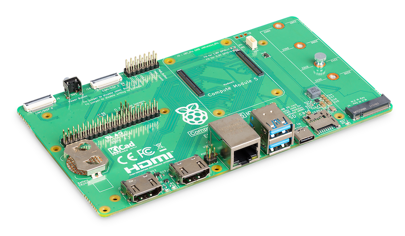

The Compute Module 5 IO Board (CM5IO) provides the following:

* *Power and control connectors.*
** USB-C power using the same standard as Raspberry Pi 5: 5 V at 5 A (25 W) or 5 V at 3 A (15 W) with a 600 mA peripheral limit.
** A power button for CM5.
** Real-time clock (RTC) battery socket.
* *Video and display connectors.*
** Two HDMI connectors.
** Two MIPI DSI/CSI-2 combined display/camera FPC connectors (22-pin, 0.5 mm pitch cable).
* *Networking and connectivity connectors.*
** Two USB 3.0 (Type-A) connectors for keyboards, storage, or peripherals.
** A USB 2.0 (Type-C) connector for flashing CM5 or additional peripherals.
** A Gigabit Ethernet RJ45 with PoE support.
* *Expansion and storage options.*
** A M.2 M key PCIe socket compatible with the 2230, 2242, 2260, and 2280 form factors.
** A microSD card slot (only for use with *CM5Lite*, which has no eMMC; other variants ignore the slot).
** HAT footprint with 40-pin GPIO connector.
** PoE header.
* *Configuration options.*
** Jumpers to disable features such as eMMC boot, EEPROM write, and wireless connectivity.
** Selectable 1.8 V or 3.3 V GPIO voltage.
* *Fan connector.* A four-pin JST-SH PWM fan connector.

[[cm4io]]
=== Compute Module 4 IO Board

.Compute Module 4 IO Board
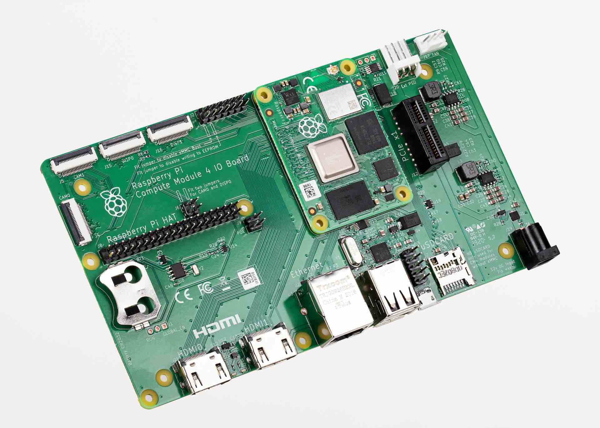

The Compute Module 4 IO Board (CM4IO) provides the following:

* *Power and control connectors.*
** 5 V through the GPIO header or 12 V input through barrel jack; supports up to 26 V if PCIe is unused.
** Real-time clock (RTC) battery socket.
* *Video and display connectors.*
** Two HDMI connectors.
** Two MIPI DSI display FPC connectors (22-pin, 0.5 mm pitch cable).
** Two MIPI CSI-2 camera FPC connectors (22-pin, 0.5 mm pitch cable).
* *Networking and connectivity connectors.*
** Two USB 2.0 connectors.
** A micro USB upstream port.
** A Gigabit Ethernet RJ45 with PoE support.
* *Expansion and storage options.*
** PCIe Gen 2 socket.
** A microSD card slot (only for use with *CM4Lite*, which has no eMMC; other variants ignore the slot).
** HAT footprint with 40-pin GPIO connector.
** PoE header.
* *Configuration options.*
** Jumpers to disable features such as eMMC boot, EEPROM write, and wireless connectivity.
** Selectable 1.8 V or 3.3 V GPIO voltage.
* *Fan connector.* Fan connector supporting standard 12 V fans with PWM drive.

[[cmio]]
=== Compute Module IO Board (versions 1 and 3)

.Compute Module IO Board (version 3)
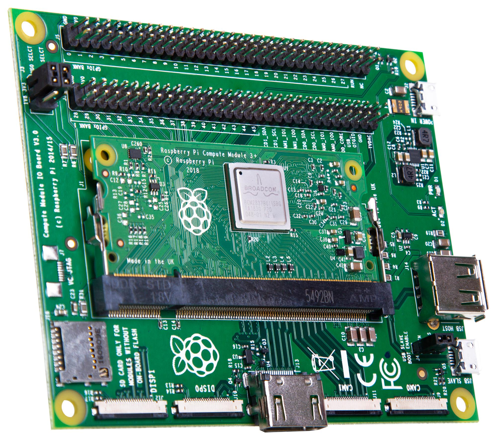

There are two variants of the Compute Module IO Board:

* Version 1 (CMIO), compatible only with <<cm1, CM1>>.
* Version 3 (CMIO3), compatible with <<cm1, CM1>>, <<cm3, CM3>>, <<cm3plus, CM3+>>, and <<cm4s, CM4S>>. This version adds a microSD card slot that doesn't exist on CMIO (version 1).

The Compute Module IO Board (CMIO and CMIO3) provides the following:

* *Power and control connectors.* 5 V input through GPIO or a micro USB connector.
* *Video and display connectors.*
** One Full size Type A HDMI.
** Two MIPI DSI display FPC connectors (22-pin, 0.5 mm pitch cable).
** Two MIPI CSI-2 camera FPC connectors (22-pin, 0.5 mm pitch cable).
* *Networking and connectivity connectors.* One USB 2.0 Type-A connector.
* *Expansion and storage options.*
** 46 GPIO pins.
** (CMIO3 only) A microSD card slot (only for use with *CM3Lite*, *CM3+Lite* and *CM4SLite*, which have no eMMC).

== CM5 and CM5IO accessories

Raspberry Pi offers the following accessories for CM5 and CM5IO:

* <<case, CM5IO Case>>, an enclosure for a CM5IO (and attached CM5). The case also optionally fits an antenna and cooler.
* <<antenna, Antenna (CM4 and CM5)>>, a 2.4 GHz and 5 GHz antenna for wireless connectivity through CM4 or CM5.
* <<cooler, CM5 Cooler>>, a passive heat sink to dissipate heat from CM5.

[[case]]
=== CM5IO Case

.Compute Module 5 IO Board Case (version 2)
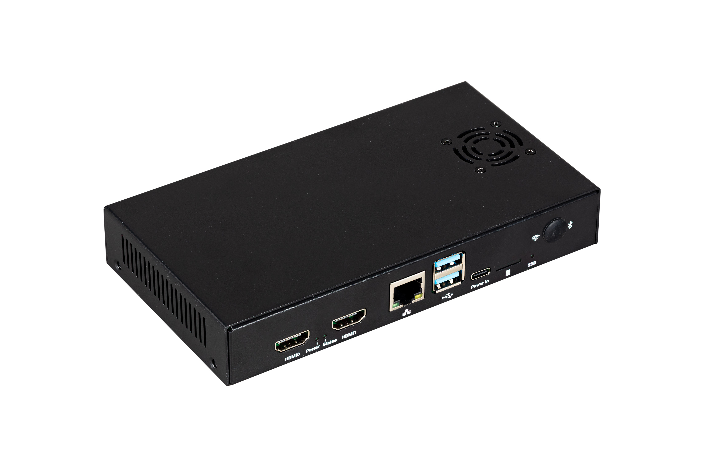

The Compute Module 5 IO Board (CM5IO) Case is a two-piece metal enclosure that, when assembled, provides physical protection for CM5IO with an attached CM5.

The following features apply to the most recent iteration of the CM5IO Case (version 2):

* Cut-outs for externally facing connectors and LEDs.
* A pre-installed, controllable fan that you can remove.
* An attachment point for a *Raspberry Pi Antenna Kit*.
* Space for a *CM5 Cooler* alongside the pre-installed fan.
* Space for accessories connected to the IO board, such as an M.2 SSD or PoE+ HAT+.

The original version of the case doesn't provide the internal space for all the listed items simultaneously. For more information about the different versions, see <<versions>>.

==== Case specifications

.Compute Module 5 IO Board Case ports
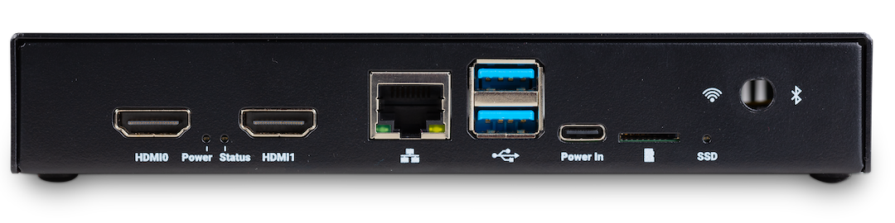

When assembled, the CM5IO Case measures approximately 170 mm × 94 mm × 28 mm. It's made of sheet metal and weighs approximately 350 g.

For thermal management, the case includes a pre-installed fan that directs airflow over your CM5 and CM5IO components. You can remove or replace the fan depending on your cooling requirements. Depending on the case version, you can also optionally add a <<cooler, CM5 Cooler>> for improved thermal performance; the original case requires removing the fan first, while the updated version provides space for both the fan and cooler together.

The following image depicts the physical dimensions of the CM5IO case in millimetres (mm). The size of the case is the same for both versions; the only difference is the placement of the fan. For information about the different versions, see <<versions>>.

.CM5IO Case (version 2) physical specifications
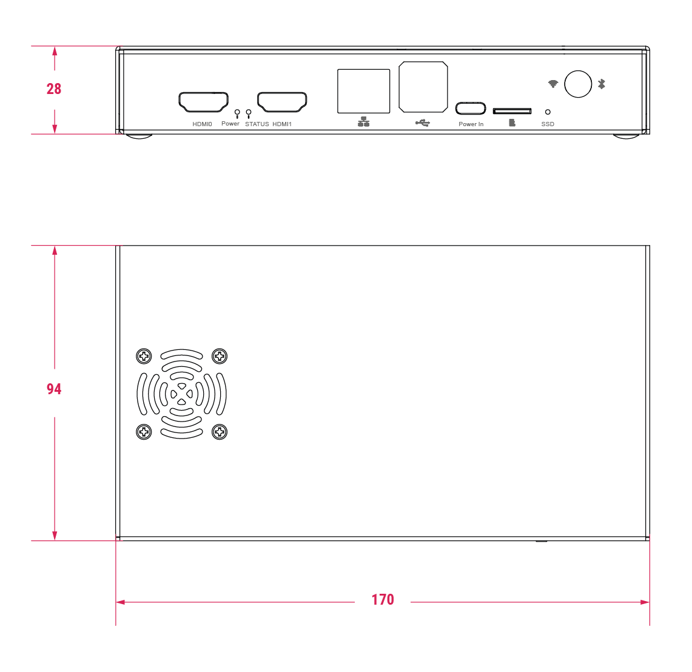

[[versions]]
==== Case versions

The are two iterations of the CM5IO case, differing in the placement of the pre-installed fan: version 1 and version 2.

.Left: version 1 of the CM5IO Case; right: version 2 of the CM5IO Case
image::images/case-versions.jpg[alt="case versions 1 and 2="80%"]

The first version features a fan that's closer to the long edge of the enclosure. The internal layout and available clearance in this version doesn't allow for both the fan and the CM5 Cooler to be installed inside the case at the same time. If you want to install the CM5 Cooler into the case, you must remove the fan.

The second version updates the internal layout such that the fan sits closer to the short edge of the enclosure. This revised layout provides sufficient space for both the fan and the CM5 Cooler without modification.

For instructions on mounting a CM5 Cooler onto CM5, which you can then attach to an IO board and install into the CM5IO Case, see <<mounting>>.

[[case-assembly]]
==== Case assembly

The following steps provide instructions for assembling the most recent version of the CM5IO Case (version 2). Version 1 doesn't allow space for both the fan and a CM5 Cooler at the same time without modification. If you have version 1 of the CM5IO Case, you can either remove the fan (described in step 4) or skip step 6 in the following instructions. For information about the different versions, see <<versions>>.

To mount a CM5IO inside your case:

. *Attach your CM5 to your CM5IO.* Rotate your CM5 90 degrees to the right to align the dual 100-pin connectors on your CM5 with those on your CM5IO and press gently but firmly to attach them. The mounting holes should also align.
. *Open the case.* Unscrew and remove the four screws (two on the left side of the case and two on the right side of the case) using a Phillips screwdriver. Then, separate the top of the case from the base. Keep the screws in a safe place.
. *Install your CM5IO assembly into the case.* Place your CM5IO (with CM5 attached) into the base of the case, aligning it with the four mounting holes near the corners of the board. Ensure all externally facing connectors align with the corresponding cut-outs at the front of the case. Then, secure your CM5IO assembly to the base by screwing four M2.5 screws into the four mounting holes.
. *Connect or remove the fan.*
** If using the pre-installed fan, plug the fan connector into the four-pin fan socket labelled *FAN (J14)* on your CM5IO.
** If you want to remove the fan, unscrew the four corner screws of the fan from the underside of the top of the case.
. *Optionally, attach an external antenna.* If you want to install an antenna, follow the instructions in <<install-antenna>>.
. *Optionally, attach a cooler.* If you want to install a cooler, follow the instructions in <<mounting>>. If you're also attaching an antenna, attach the antenna's U.FL connector first for easier access.
. *Optionally, attach a camera or display.* If you're using a camera or a display, pass the flat cable through one of the slots at the back of the case and connect it to one of the *CAM/DISP* ports on your CM5IO.
. *Optionally, install an M.2 SSD.* If you want to install an M.2 SSD, insert it into the M.2 slot in the bottom-right corner of the CM5IO and secure it on the opposite end with a mounting screw.
. *Optionally, install a HAT.* If you want to install a HAT, align it with the 40-pin GPIO header and the mounting posts such that the HAT covers the battery slot, then press it firmly into place and secure it with screws.
. *Close the case.* Fold the top of the case back onto the base of the case, aligning the screw holes on the left and right sides of the case, and the power button on the back of the case. Screw the four screws back into place using a Phillips screwdriver, taking care not to overtighten them.

NOTE: The SD card slot is a push-push slot. To insert an SD card, push it into the SD card slot with the contacts facing downwards. To remove it, push it inwards towards the slot to release it and then pull it out.

[[antenna]]
=== Antenna (CM4 and CM5)

The Raspberry Pi Antenna Kit provides a certified external antenna to boost wireless reception on a CM4 or CM5.

.Antenna attached to a CM4
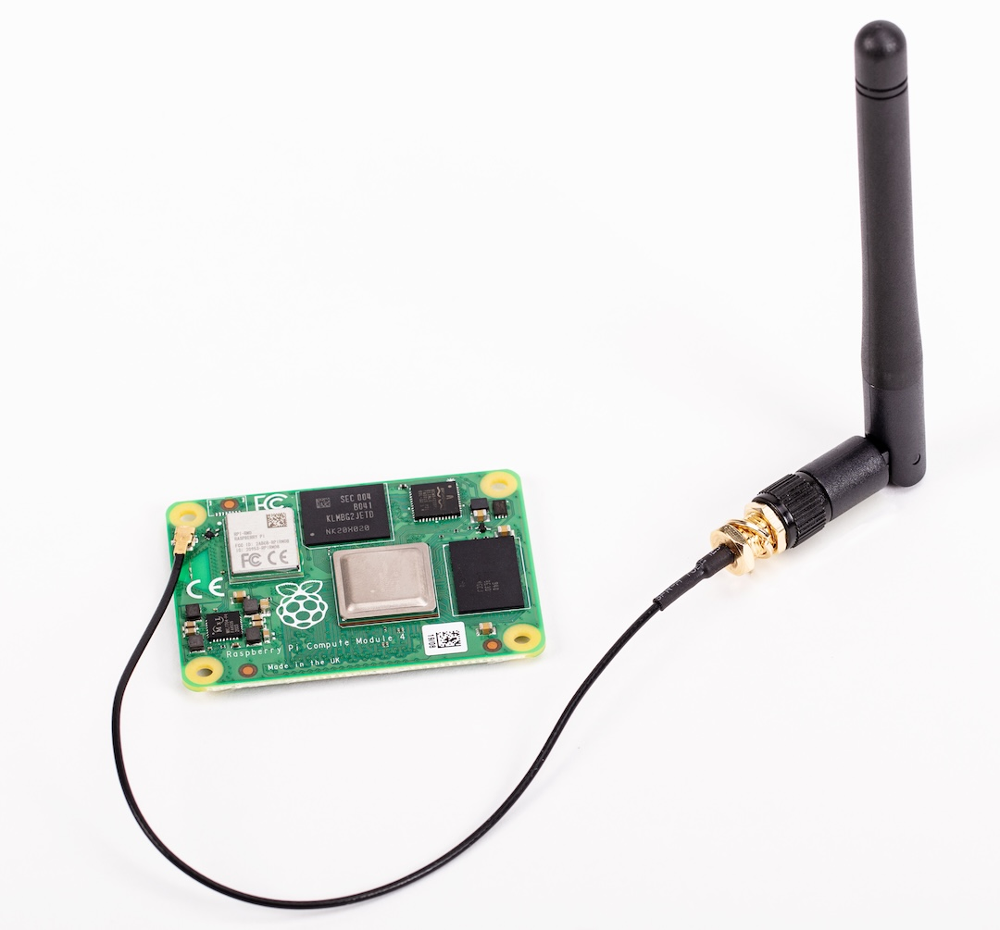

==== Antenna specifications

The antenna supports dual-band Wi-Fi and attaches to the https://en.wikipedia.org/wiki/Hirose_U.FL[U.FL connector] on your CM4 or CM5. The antenna is approximately 108.5 mm at full height and approximately 87.5 mm long when at a 90 degree angle; the SMA to U.FL cable is approximately 205 mm long.

.CM4 and CM5 antenna physical specifications
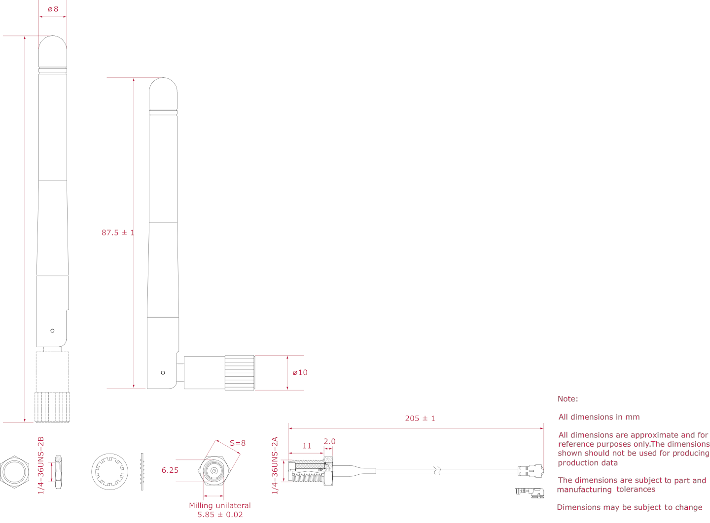

[[install-antenna]]
==== Connect an antenna through the CM5IO Case

You can use the antenna with the <<case, CM5IO Case>>. To attach the antenna to your Compute Module through the CM5IO Case, complete the first four steps outlined in <<case-assembly>>, and then complete following steps:

. *Connect the U.FL connector.* Connect the U.FL connector on the antenna cable to the U.FL-compatible connector on your Compute Module, next to the top-left mounting hole of your CM5. Do this before attaching a cooler (if using one) because the cooler can make it harder to attach the U.FL connector.
. *Insert the SMA connector.* Remove the rubber plug from the antenna port on the inside of the CM5IO Case. Then, from the inside of the case, push the SMA connector with the (flat side up) into the antenna port so that it extends through and is accessible from the outside.
. *Fasten the SMA connector into place.* Twist the retaining hexagonal nut and washer onto the SMA connector in a clockwise direction until it sits securely in place. Avoid excessive twisting when tightening to prevent damage.
. *Attach the antenna to the SMA connector.* Insert the SMA connector into the antenna port with the antenna facing outward and twist the antenna clockwise to secure it.
. *Adjust the antenna.* Move the antenna into its final position by turning it up to a 90 degree angle.

You can now complete the remaining steps outlined in <<case-assembly>> for mounting a CM5IO inside your case.

.CM4 and CM5 antenna assembly diagram
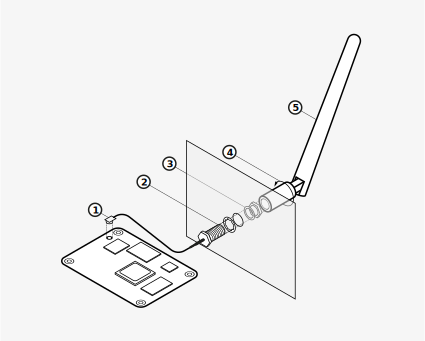

To use the Antenna with your Compute Module, add a `dtparam` instruction in xref:../computers/config_txt.adoc[`/boot/firmware/config.txt`]. Add the following line to the end of the `config.txt` file: `dtparam=ant2`

[[cooler]]
=== CM5 Cooler

The CM5 Cooler is a passive heat sink that helps dissipate heat from your CM5, improving CPU performance and longevity.

.CM5 cooler
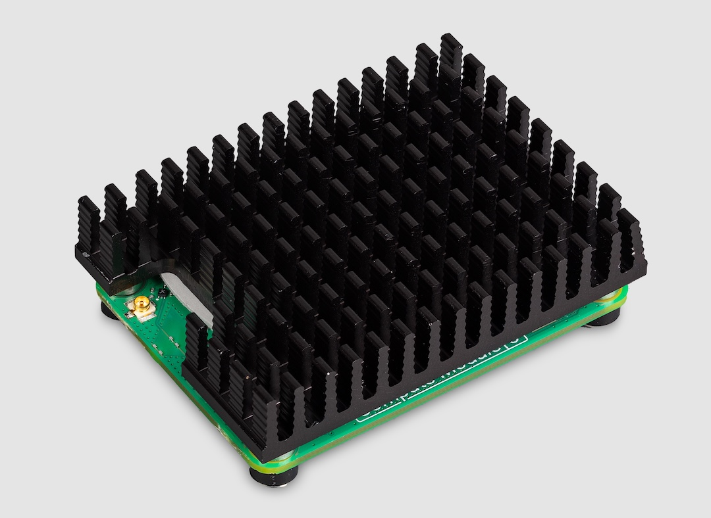

==== Cooler specifications

The CM5 Cooler dimensions are approximately 41 mm × 56 mm × 12.7 mm. The cooler is an aluminium heat sink with a conductive silicone pad on the bottom. Newer versions of the <<case, CM5IO Case>> allow both the cooler and pre-installed fan to be used inside the case at the same time. If you have an older version of the CM5IO Case, you must remove the fan from the case to allow space for the cooler.

.CM5 cooler physical specifications
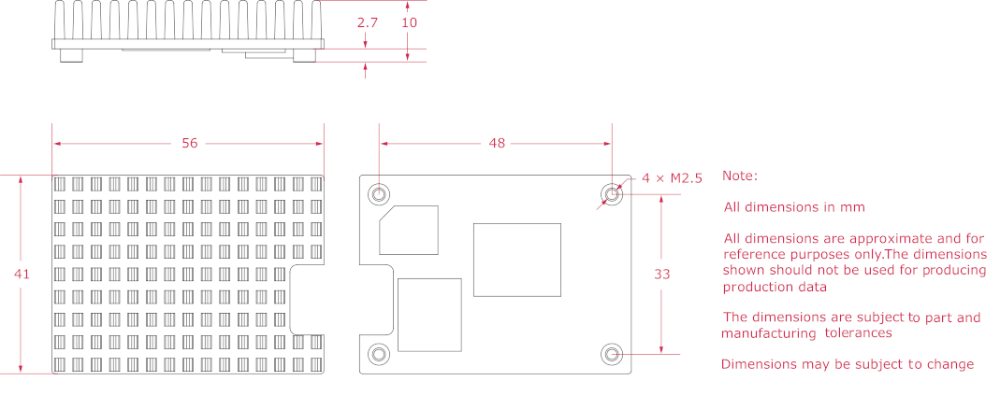

[[mounting]]
==== Mount a CM5 Cooler

To mount the cooler to your CM5:

. Remove the protective paper from the silicone pad on the bottom of cooler.
. Attach the silicone at the bottom of the cooler to the top of your CM5. Place the cooler on your CM5 such that the cutout in the cooler is above  the on-board antenna (the trapezoid-shaped area on the left of a CM5) and the https://en.wikipedia.org/wiki/Hirose_U.FL[U.FL connector] next to it (if it has one).
. Optionally, fasten screws in the mounting points found in each corner to secure the cooler. If you omit the screws, the bond between your cooler and your CM5 improves through time and use.
