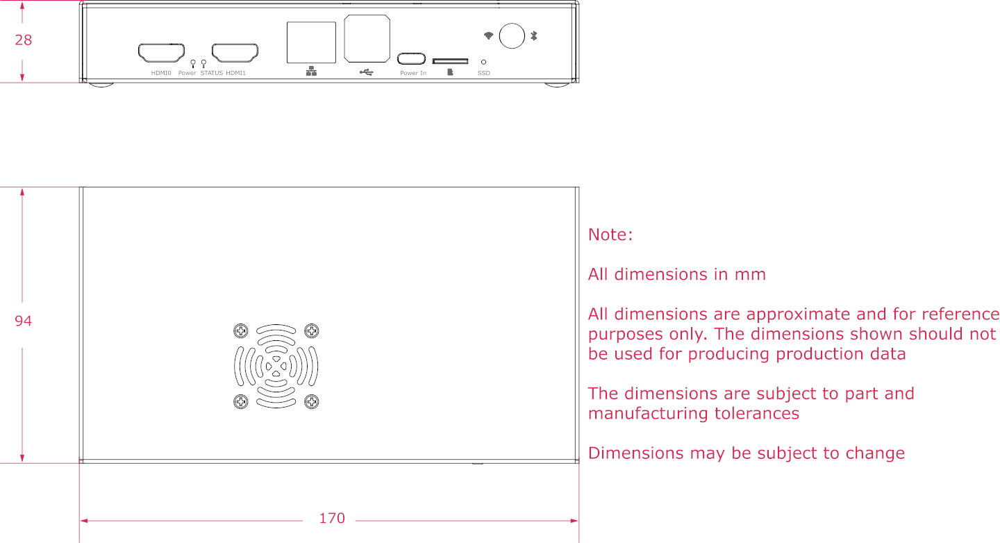

== Compute Modules

Raspberry Pi Compute Modules are **system-on-module** variants of the flagship Raspberry Pi models. Compute Modules are especially popular for industrial and commercial applications, including digital signage, thin clients, and process automation. Some of these applications use the flagship Raspberry Pi design, but many users want a more compact design or on-board eMMC storage.

Compute Modules come in multiple variants, varying both in memory and soldered-on Multi-Media Card (eMMC) flash storage capacity. Like SD cards, eMMC provides persistent storage with minimal energy impact. Unlike SD cards, eMMC is specifically designed to be used as a disk and includes extra features to improve reliability. **Lite** models have no on-board storage, and are sometimes referred to with the shorthand suffix **L**, e.g. "CM3L".

Compute Modules use the following Raspberry Pi SoCs:

* BCM2835 for CM1
* BCM2837 for CM3, CM3+
* BCM2711 for CM4, CM4S
* BCM2712 for CM5

=== Compute Module 5

.Compute Module 5
image::images/cm5.png[alt="Compute Module 5", width="60%"]

The Compute Module 5 (CM5) combines the internals of a Raspberry Pi 5 (the BCM2712 processor and 2GB, 4GB, 8GB, or 16GB of RAM) with optional 0GB (Lite), 16GB, 32GB or 64GB of eMMC flash storage.

CM5 uses the same form factor as CM4, featuring two 100-pin high density connectors.

=== Compute Module 4

.Compute Module 4
image::images/cm4.jpg[alt="Compute Module 4", width="60%"]

The Compute Module 4 (CM4) combines the internals of a Raspberry Pi 4 (the BCM2711 processor and 1GB, 2GB, 4GB, or 8GB of RAM) with an optional 0GB (Lite), 8GB, 16GB or 32GB of eMMC flash storage.

Unlike CM1, CM3, and CM3+, CM4 does not use the DDR2 SO-DIMM form factor. Instead, CM4 uses two 100-pin high density connectors in a smaller physical footprint. This change helped add the following interfaces:

* an additional second HDMI port
* PCIe
* Ethernet

The previous form factor could not have supported these interfaces.

=== Compute Module 4S

.Compute Module 4S
image::images/cm4s.jpg[alt="Compute Module 4S", width="60%"]

The Compute Module 4S (CM4S) combines the internals of a Raspberry Pi 4 (the BCM2711 processor and 1GB, 2GB, 4GB, or 8GB of RAM) with an optional 0GB (Lite), 8GB, 16GB or 32GB of eMMC flash storage. Unlike CM4, CM4S comes in the same DDR2 SO-DIMM form factor as CM1, CM3, and CM3+.

[[compute-module-3-plus]]
=== Compute Module 3+

.Compute Module 3+
image::images/cm3-plus.jpg[alt="Compute Module 3+", width="60%"]

The Compute Module 3+ (CM3+) combines the internals of a Raspberry Pi 3 Model B+ (the BCM2837 processor and 1GB of RAM) with an optional 0GB (Lite), 8GB, 16GB or 32GB of eMMC flash storage. CM3+ comes in the DDR2 SO-DIMM form factor.

=== Compute Module 3

.Compute Module 3
image::images/cm3.jpg[alt="Compute Module 3", width="60%"]

The Compute Module 3 (CM3) combines the internals of a Raspberry Pi 3 (the BCM2837 processor and 1GB of RAM) with an optional 4GB of eMMC flash storage. CM3 comes in the DDR2 SO-DIMM form factor.

=== Compute Module 1

.Compute Module 1
image::images/cm1.jpg[alt="Compute Module 1", width="60%"]

The Compute Module 1 (CM1) contains the internals of a Raspberry Pi (the BCM2835 processor and 512MB of RAM) as well as an optional 4GB of eMMC flash storage. CM1 comes in the DDR2 SO-DIMM form factor.

== IO Boards

Raspberry Pi IO Boards provide a way to connect a single Compute Module to a variety of I/O (input/output) interfaces. Compute Modules are small, lacking ports and connectors. IO Boards provide a way to connect Compute Modules to a variety of peripherals.

Raspberry Pi IO Boards provide the following functionality:

* power the module
* connects the GPIO to pin headers
* connects the camera and display interfaces to FFC connectors
* connects HDMI to HDMI ports
* connects USB to USB ports
* connects activity monitoring to LEDs
* eMMC programming over USB
* connects PCIe to connectors used to physically connect storage or peripherals

IO Boards are breakout boards intended for development or personal use; in production, you should use a smaller, potentially custom board that provides only the ports and peripherals required for your use-case.

=== Compute Module 5 IO Board

.Compute Module 5 IO Board
image::images/cm5io.png[alt="Compute Module 5 IO Board", width="60%"]

Compute Module 5 IO Board provides the following interfaces:

* HAT footprint with 40-pin GPIO connector
* PoE header
* 2× HDMI ports
* 2× USB 3.0 ports
* Gigabit Ethernet RJ45 with PoE support
* M.2 M key PCIe socket compatible with the 2230, 2242, 2260, and 2280 form factors
* microSD card slot (only for use with Lite variants with no eMMC; other variants ignore the slot)
* 2× MIPI DSI/CSI-2 combined display/camera FPC connectors (22-pin 0.5 mm pitch cable)
* Real-time clock with battery socket
* four-pin JST-SH PWM fan connector
* USB-C power using the same standard as Raspberry Pi 5 (5V, 5A (25W) or 5V, 3A (15W) with a 600mA peripheral limit)
* Jumpers to disable features such as eMMC boot, EEPROM write, and the USB OTG connection

=== Compute Module 4 IO Board

.Compute Module 4 IO Board
image::images/cm4io.jpg[alt="Compute Module 4 IO Board", width="60%"]

Compute Module 4 IO Board provides the following interfaces:

* HAT footprint with 40-pin GPIO connector and PoE header
* 2× HDMI ports
* 2× USB 2.0 ports
* Gigabit Ethernet RJ45 with PoE support
* microSD card slot (only for use with Lite variants with no eMMC; other variants ignore the slot)
* PCIe Gen 2 socket
* micro USB upstream port
* 2× MIPI DSI display FPC connectors (22-pin 0.5 mm pitch cable)
* 2× MIPI CSI-2 camera FPC connectors (22-pin 0.5 mm pitch cable)
* Real-time clock with battery socket
* 12V input via barrel jack (supports up to 26V if PCIe unused)

=== Compute Module IO Board

.Compute Module IO Board
image::images/cmio.jpg[alt="Compute Module IO Board", width="60%"]

Compute Module IO Board provides the following interfaces:

* 120 GPIO pins
* HDMI port
* USB-A port
* 2× MIPI DSI display FPC connectors (22-pin 0.5 mm pitch cable)
* 2× MIPI CSI-2 camera FPC connectors (22-pin 0.5 mm pitch cable)

The Compute Module IO Board comes in two variants: Version 1 and Version 3. Version 1 is only compatible with CM1. Version 3 is compatible with CM1, CM3, CM3+, and CM4S. Compute Module IO Board Version 3 is sometimes written as the shorthand CMIO3.

Compute Module IO Board Version 3 added a microSD card slot that did not exist in Compute Module IO Board Version 1.

=== IO Board compatibility

Not all Compute Module IO Boards work with all Compute Module models. The following table shows which Compute Modules work with each IO Board:

[cols="1,1"]
|===
| IO Board | Compatible Compute Modules

| Compute Module IO Board Version 1 (CMIO)/(CMIO1)
a|
* CM1
| Compute Module IO Board Version 3 (CMIO)/(CMIO3)
a|
* CM1
* CM3
* CM3+
* CM4S
| Compute Module 4 IO Board (CM4IO)
a|
* CM4
* CM5 (with reduced functionality)
| Compute Module 5 IO Board (CM5IO)
a|
* CM5
* CM4 (with reduced functionality)
|===

== CM5 Accessories

=== IO Case

The world can be a dangerous place. The Compute Module 5 IO Board Case provides physical protection for a CM5IO Board.

.Compute Module 5 IO Board Case
image::images/cm5io-case.png[alt="Compute Module 5 IO Board Case", width="60%"]

The Case provides cut-outs for all externally-facing ports and LEDs on the CM5IO Board, and an attachment point for a Raspberry Pi Antenna Kit.

.Compute Module 5 IO Board Case ports
image::images/cm5io-case-front.png[alt="the port selection on the Compute Module 5 IO Board Case", width="60%"]

To mount a CM5IO Board within your Case, position your Board in the bottom section of the case, aligning the four mounting points inset slightly from each corner of the Board. Fasten four screws into the mounting points. Take care not to over-tighten the screws.

To use the Case fan, connect the fan cable to the FAN (J14) port on the Board.

To close the case, put the top section of the case on top of the bottom section of the case. Facing the front of the case, which has port pass-throughs, carefully align the screw holes on the left and right side of the case and the power button on the back of the case. Tighten four screws into the screw holes. Take care not to over-tighten the screws.

TIP: The Case comes with a fan pre-installed. To close the case with the passive Cooler attached to your Compute Module, remove the fan. To remove the fan, remove the four screws positioned in the corners of the fan from the bottom of the top case.

.CM5 Case physical specification

=== Antenna

The Raspberry Pi Antenna Kit provides a certified external antenna to boost wireless reception on a CM4 or CM5.

.CM4 and CM5 Antenna
image::images/cm4-cm5-antenna.jpg[alt="The Antenna, connected to CM4", width="60%"]

To attach the Antenna to your Compute Module and Case, complete the following steps:

. Connect the https://en.wikipedia.org/wiki/Hirose_U.FL[U.FL connector] on the cable to the U.FL-compatible connector on your Compute Module.
. Secure the toothed washer onto the male SMA connector at the end of the cable, then insert the SMA connector, with the antenna facing outward, through the hole in the Case.
. Fasten the SMA connector into place with the retaining hexagonal nut and washer.
. Tighten the female SMA connector on the Antenna onto the male SMA connector.
. Adjust the Antenna to its final position by turning it up to 90°.

.CM4 and CM5 Antenna assembly diagram
image::images/cm4-cm5-antenna-assembly.svg[alt="CM4 and CM5 antenna assembly diagram", width="60%"]

To **use** the Antenna with your Compute Module, add a `dtoverlay` instruction in xref:../computers/config_txt.adoc[`/boot/firmware/config.txt`]. Add the following line to the end of `config.txt`:

[source,ini]
----
dtparam=ant2
----

.CM4 and CM5 Antenna physical specification

=== Cooler

The CM5 Cooler helps dissipate heat from your CM5, improving CPU performance, longevity, and bumpiness.

.CM5 Cooler
image::images/cm5-cooler.jpg[alt="CM5 Cooler", width="60%"]

To mount the Cooler to your CM5, attach the thermally conductive silicone at the bottom of the Cooler to the top of your CM5. Align the cut-out in the heatsink with the antenna https://en.wikipedia.org/wiki/Hirose_U.FL[U.FL connector]. Optionally, fasten screws in the mounting points found in each corner to secure the Cooler. If you omit the screws, the bond between your Cooler and your Compute Module will improve through time, use, and trust.

.CM5 Cooler physical specification
image::images/cm5-cooler-physical.png[alt="CM5 Cooler physical specification", width="80%"]

NOTE: The CM5 Cooler is only compatible with the CM5IO Case if you remove the fan from the case.
