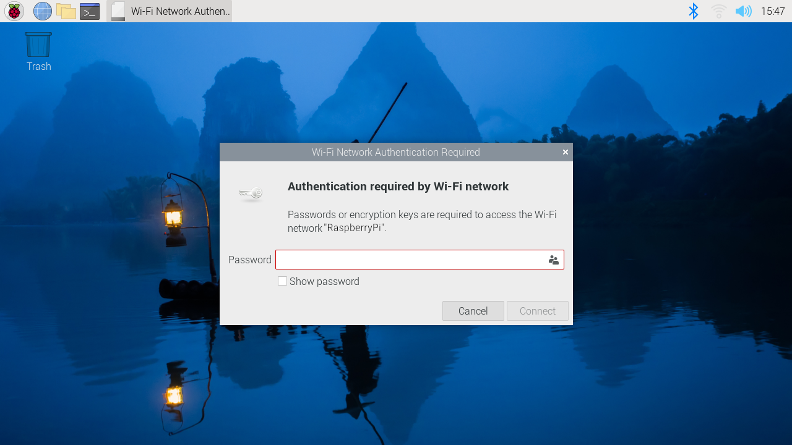

== Configuring Networking

Raspberry Pi OS provides a Graphical User Interface (GUI) for setting up wireless connections. Users of Raspberry Pi OS Lite and headless machines can set up wireless networking from the command line with https://developer-old.gnome.org/NetworkManager/stable/nmcli.html[`nmcli`].

NOTE: These instructions work for Raspberry Pi OS _Bookworm_ and later. For earlier versions, check an older version of the documentation.

=== Using the Desktop

Quickly access the Network Manager via the network icon at the right-hand end of the menu bar. If you are using a Raspberry Pi with built-in wireless connectivity, or if a wireless dongle is plugged in, click this icon to bring up a list of available wireless networks. If you see the message 'No APs found - scanning...', wait a few seconds, and the Network Manager should find your network.

NOTE: Raspberry Pi devices that support the 5GHz band (Pi3B+, Pi4, CM4, Pi400), disable wireless networking until you assign a locale. To set a locale, open the `Raspberry Pi Configuration` application from the Preferences Menu, select *Localisation* and select your country.

The icons on the right show whether a network is secured or not and give an indication of signal strength. Click the network that you want to connect to. If the network is secured, a dialogue box will prompt you to enter the network key:

Enter the key and click *OK*, then wait a couple of seconds. The network icon will flash briefly to show that a connection is being made. When connected, the icon will stop flashing and show the signal strength.

[[wireless-networking-command-line]]
=== Using the Command Line

This guide will help you configure a wireless connection on your Raspberry Pi entirely from a terminal without using a GUI. No additional software is required; Raspberry Pi OS comes preconfigured with everything you need.

NOTE: This guide should work for WEP, WPA, WPA2, or WPA3 networks, but may not work for enterprise networks.

==== Enable Wireless Networking

On a fresh install, you must specify the country where you use your device.
This allows your device to choose the correct frequency bands for 5GHz networking.
Once you have specified a locale, you can use your Raspberry Pi's built-in wireless networking module.

To do this, set your locale with the command line `raspi-config` tool. Run the following command:
----
sudo raspi-config
----
Select the *Localisation Options* menu item using the arrow keys. Choose the *WLAN Country* option.
Pick your country from the dropdown using the arrow keys. Press `Enter` to select your country.

You should now have access to wireless networking. Run the following command to check if your wifi radio is enabled:

----
nmcli radio wifi
----

If this command returns the text "enabled", you're ready to configure a connection. If this command returns "disabled", try enabling WiFi with the following command:

----
nmcli radio wifi on
----

==== Find Networks

To scan for wireless networks, run the following command:

----
nmcli dev wifi list
----

You should see output similar to the following:

----
IN-USE  BSSID              SSID            MODE   CHAN  RATE        SIGNAL  BARS  SECURITY
        90:72:40:1B:42:05  myNetwork       Infra  132   405 Mbit/s  89      ****  WPA2
        90:72:42:1B:78:04  myNetwork5G     Infra  11    195 Mbit/s  79      ***   WPA2
        9C:AB:F8:88:EB:0D  Pi Towers       Infra  1     260 Mbit/s  75      ***   WPA2 802.1X
        B4:2A:0E:64:BD:BE  Example         Infra  6     195 Mbit/s  37      **    WPA1 WPA2
----

Look in the "SSID" column for the name of the network you would like to connect to. Use the SSID and a password to connect to the network.

==== Connect to a Network

We'll use `nmcli` to connect to a WiFi network.
Run the following command to configure a network connection:

----
sudo nmcli --ask dev wifi connect <example_ssid>
----

Don't forget to replace `<example_ssid>` with the name of the network you're trying to configure.

Enter your network password when prompted.

Your Raspberry Pi should automatically connect to the network once you enter your password. If you see the following output:

----
Error: Connection activation failed: Secrets were required, but not provided.
----

This means that you entered an incorrect password. If you see this error, run the above command again, being careful to enter your password correctly.

To check if you're connected to a network, run the following command:

----
nmcli dev wifi list
----

You should see output similar to the following:

----
IN-USE  BSSID              SSID            MODE   CHAN  RATE        SIGNAL  BARS  SECURITY
*       90:72:40:1B:42:05  myNetwork       Infra  132   405 Mbit/s  89      ****  WPA2
        90:72:42:1B:78:04  myNetwork5G     Infra  11    195 Mbit/s  79      ***   WPA2
        9C:AB:F8:88:EB:0D  Pi Towers       Infra  1     260 Mbit/s  75      ***   WPA2 802.1X
        B4:2A:0E:64:BD:BE  Example         Infra  6     195 Mbit/s  37      **    WPA1 WPA2
----

Check for an asterisk (`*`) in the "IN-USE" column; it should appear in the same row as the SSID of the network you intended to connect to.

NOTE: You can manually edit your connection configurations in the `/etc/NetworkManager/system-connections/` directory.

==== Connect to an Unsecured Network

If the network you are connecting to does not use a password, run the following command:

----
sudo nmcli dev wifi connect <example_ssid>
----

WARNING: Be careful when using unsecured wireless networks. 

==== Connect to a Hidden Network

If you are using a hidden network, specify the "hidden" option with a value of "yes" when you run `nmcli`:

----
sudo nmcli --ask dev wifi connect <example_ssid> hidden yes
----

==== Set Priority Among Multiple Networks

If your device detects more than one known networks at the same time, it could connect any of the detected known networks. Use the priority option to force your device to prefer certain networks. Your device will connect to the network that is in range with the highest priority. Run the following command to view the priority of known networks:

----
nmcli --fields autoconnect-priority,name connection
----

You should see output similar to the following:

----
AUTOCONNECT-PRIORITY  NAME
0                     myNetwork
0                     lo
0                     Pi Towers
0                     Example
-999                  Wired connection 1
----

Use the `nmcli connection modify` command to set the priority of a network.
The following example command sets the priority of a network named "Pi Towers" to `10`:

----
nmcli connection modify "Pi Towers" connection.autoconnect-priority 10
----

Your device will always try to connect to the in-range network with the highest non-negative priority value. You can also assign a network a negative priority; your device will only attempt to connect to a negative priority network if no other known network is in range. For example, consider three networks:

----
AUTOCONNECT-PRIORITY  NAME
-1                    snake
0                     rabbit
1                     cat
1000                  dog
----

- If all of these networks were in range, your device would first attempt to connect to the "dog" network.
- If connection to the "dog" network fails, your device would attempt to connect to the "cat" network.
- If connection to the "cat" network fails, your device would attempt to connect to the "rabbit" network.
- If connection to the "rabbit" network fails, and your device detects no other known networks, your device will attempt to connect to the "snake" network.

=== Configure DHCP

By default, Raspberry Pi OS attempts to automatically configure all network interfaces by DHCP, falling back to automatic private addresses in the range 169.254.0.0/16 if DHCP fails.

=== Assign a Static IP Address

To allocate a static IP address to your Raspberry Pi, reserve an address for it on your router. That way your Raspberry Pi will continue to have its address allocated via DHCP but will receive the same address each time. A "fixed" address can be allocated by associating the MAC address of your Raspberry Pi with a static IP address in your DHCP server.
