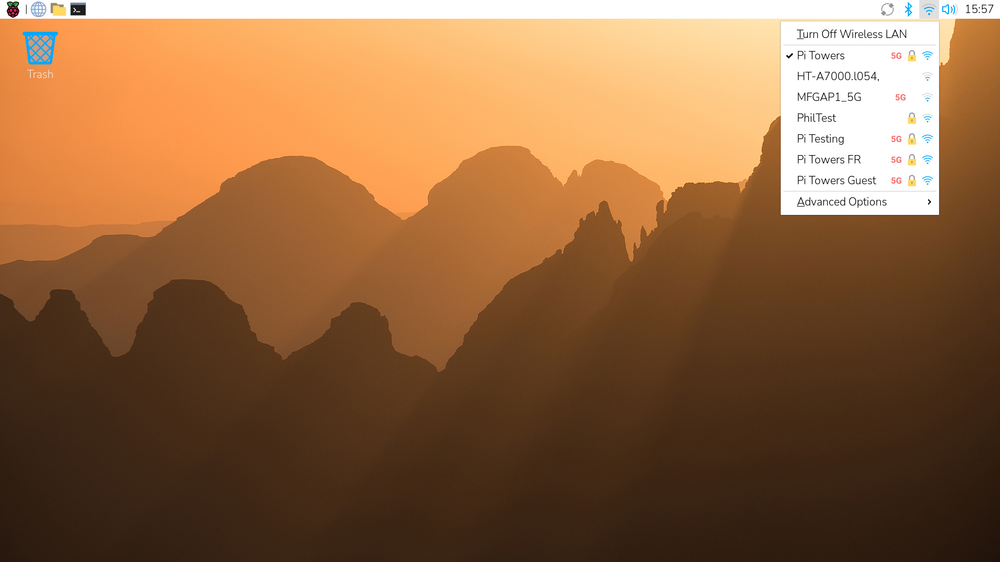
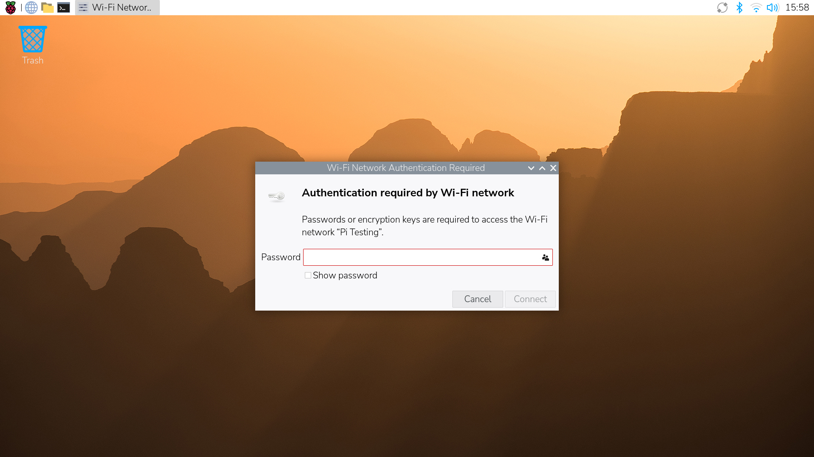
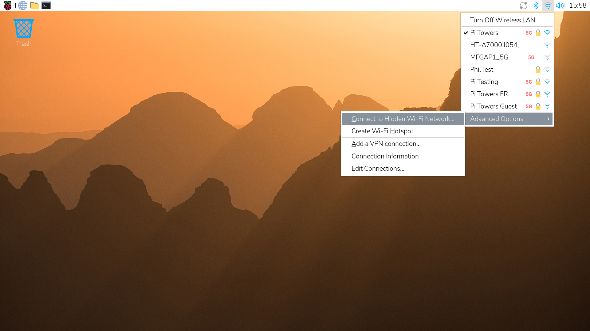

== Networking
Raspberry Pi OS provides flexible options for configuring network settings. This section summarises how to manage and customise your Raspberry Pi's network configuration, including how to:

* <<hostname>> of your Raspberry Pi from the desktop and by using the interactive `raspi-config` TUI.
* <<dhcp-ip>> using a manual method suitable for your use case.
* <<network-priority>> from the desktop and from the command line.
* <<predictable-names>> using the interactive `raspi-config` TUI. This is an advanced option that is off by default.
* <<link-local>> using the interactive `raspi-config` TUI. This is an advanced option that is off by default.
* <<proxy>> using the interactive `raspi-config` TUI. This is an advanced option that is off by default.

[[hostname]]
=== Change the hostname
Setting a hostname is useful for the following reasons:

* When you set a hostname (for example, `my-pi`), you can access your Raspberry Pi through *mDNS* rather than the longer, changeable IP address. For example, instead of `ssh pi@192.168.1.42`, you can use `ssh pi@my-pi.local`. 
* If you have multiple Raspberry Pi devices on the same network, you can ensure you're always connecting to the right Raspberry Pi by using unique hostnames (for example, `my-pi`, `pi-hole`, and `retro-pi`).

Your hostname isn't case sensitive and may only contain:

* ASCII letters from *a* through to *z*.
* Digits from *0* through to *9*.
* Hyphens (*-*).

No other symbols, punctuation, or blank spaces are permitted.

[tabs]
======
Desktop::
. Select the Raspberry Pi icon in the top-left corner of the system tray and then go to *Preferences > Control Centre*.
. Open the *System* tab in the left-side menu.
. Select *Change Hostname*.
. Enter a new hostname in the *Enter new hostname* field.
. Select *OK* in the bottom-right corner of the window.
. Select *Close* in the bottom-right corner of the *Control Centre*.
raspi-config::
. Open the Terminal and run `sudo raspi-config`.
. Use the keyboard to navigate to and select `1 System Options > S4 Hostname`.
. Select `<OK>` to continue. This opens a screen with your current hostname.
. Delete your hostname and enter a new one.
. Select `<OK>` and then `<Finish>` when you're done.
======

[[dhcp-ip]]
=== Manage DHCP and static IP
In a typical home network, DHCP (Dynamic Host Configuration Protocol) is managed by your router. It automatically assigns IP addresses and other networking settings (like the gateway and DNS servers) to devices as they connect.

Using DHCP allows your Raspberry Pi to connect to a network (through Wi-Fi or Ethernet) without manually configuring an IP address and other networking settings.

By default, IP addresses are temporary and can change over time as your router reassigns them as needed. If you're running services on your Raspberry Pi (such as a web server or SSH access), it's recommended that the device always has the same IP address. There are two main ways to achieve this:

* *DHCP reservation (recommended).* Sometimes called a static lease, a DHCP reservation is configured on your router. It ensures that your Raspberry Pi always receives the same IP address based on its MAC address and keeps all IP management centralised on the router. Setup steps vary depending on your router's manufacturer and interface.
* *Static IP on the device.* You can manually configure a static IP address directly on your Raspberry Pi using `nmcli`. This requires manually setting the IP address, subnet mask, gateway, and DNS. We don't recommend doing this because misconfiguration can lead to connectivity issues. You must ensure that the chosen IP is outside the router's DHCP pool and doesn't conflict with other devices.

[[network-priority]]
=== Set network priority
When your Raspberry Pi detects multiple known networks, it can connect to any of them by default. You can prioritise networks to control which network your Raspberry Pi prefers. If you set network priority, your Raspberry Pi tries to connect to the in-range network with the highest non-negative priority:

* Networks with higher numbers have higher priority; your Raspberry Pi tries to connect to the largest positive number first.
* Networks set to *0* have neutral priority, which is the default. A network set to *0* is chosen after other networks with a higher positive priority number.
* Networks with a negative number are low priority; your Raspberry Pi only connects to a network with negative priority if no other known network is available.

For example, consider the following four networks:

* Snake (-1)
* Rabbit (0)
* Dog (1)
* Cat (100)

If all of the above networks are in range, your Raspberry Pi first attempts to connect to the *Cat* network. If this network fails, it then attempts to connect to the *Dog* network, then the *Rabbit* network. If your Raspberry P detects no other known networks, it attempts to connect to the *Snake* network.

[tabs]
======
Desktop::
. Select the wireless icon in the top-right system tray. This icon shows the strength of the Wi-Fi signal currently connected and opens *Network Manager*.
. Select *Advanced Options > Edit Connections*. This opens the *Network Connections* window.
. Find and select the network that you want to prioritise.
. Select the blue gear icon at the bottom of the window.
. Open the *General* tab.
. Ensure that *Connect automatically with priority* is selected.
. Set the numeric priority value. This controls which network your Raspberry Pi prefers when multiple known networks are available.
. Select *Save* in the bottom-right corner of the window, then close the *Network Connections* window.
CLI::
Before setting the priority of a network, run the following command to view the existing priority of known networks:
+
[source,console]
----
$ nmcli --fields AUTOCONNECT-PRIORITY,NAME connection
----
+
This outputs something like the following:
+
[source]
----
AUTOCONNECT-PRIORITY  NAME
0                     myNetwork
0                     lo
0                     Pi Towers
0                     Example
-999                  Wired connection 1
----
+
Use `nmcli connection modify` to set priority of a network. The following example sets the priority of a network named Pi Towers (in quotation marks) to 10:
+
[source,console]
----
$ sudo nmcli connection modify "Pi Towers" connection.autoconnect-priority 10
----
======

[[predictable-names]]
=== Enable or disable predictable network interface names
You can enable or disable more specific interface names to make network device naming consistent across reboots and hardware changes. This is an advanced user option that is off by default because it replaces the traditional `eth0` and `wlan0` naming schemes on some devices. Naming behaviour can vary between Raspberry Pi models and configurations.

. Open the Terminal and run `sudo raspi-config`.
. Use the keyboard to navigate to and select `6 Advanced Options > A2 Network Interface Names`.
. Select `Yes` or `No` in response to the question *Would you like to enable predictable network interface names?*
. Select `<OK>` to confirm this choice and then `<Finish>` when you're done.
. Reboot your Raspberry Pi for the change to take effect.

[[link-local]]
=== Enable or disable link-local address fallback
You can enable or disable link-local address fallback to assign a temporary `169.254.x.x` address. This address might be assigned even if a DHCP server is available: the system first assigns a link-local address, then replaces it when a DHCP lease is obtained. If no DHCP response is received, the link-local address remains in use.

This is an advanced user option that is off by default because it can interfere with network configuration and isn't typically needed on most networks where DHCP is available. Only enable this option if you understand this behaviour.

. Open the Terminal and run `sudo raspi-config`.
. Use the keyboard to navigate to and select `6 Advanced Options > A14 Link-local Fallback`.
. Select `Yes` or `No` in response to the question *Would you like to enable link-local fallback?*
. Select `<OK>` to confirm this choice and then `<Finish>` when you're done.
. Reboot your Raspberry Pi for the change to take effect.

[[proxy]]
=== Configure your Raspberry Pi to use a proxy server
A proxy server acts as an intermediary between a client device and the internet. To configure your Raspberry Pi to use a proxy server, you need:

* The IP address or hostname and port of your proxy server.
* A username and password for your proxy server (if required).

This is an advanced configuration that you should only configure if your network requires a proxy (for example, in managed, corporate, restricted environments).

. Open the Terminal and run `sudo raspi-config`.
. Use the keyboard to navigate to and select `6 Advanced Options > A3 Network Proxy Settings`.
. Configure environment variables for proxy usage. Choose one or more of the following options depending on your needs. Each option must be configured separately, meaning you must start from step 1 for each option you want to configure:
** `P1 All` applies the same proxy settings to all network traffic.
** `P2 HTTP` sends all HTTP traffic through the proxy.
** `P3 HTTPS` sends all HTTPS (secure) traffic through the proxy.
** `P4 FTP` sends all FTP traffic through the proxy.
** `P5 Exceptions` specifies addresses that should bypass the proxy.
. Select `<OK>` and then `<OK>` again.
. Select `<Finish>` when you're done.
. Reboot your Raspberry Pi for the change to take effect.

For options `P1` through to `P4`, enter the proxy in the following format, replacing `<proxy_ip_address>` with the IP address of your proxy and `<proxy_port>` with the port of your proxy:

[source]
----
http://<proxy_ip_address>:<proxy_port>`
----

If your proxy requires a username and password, add them using the following format, replacing `<username>` and `<password>` with the username and password you use to authenticate to your proxy.

[source]
----
http://<username>:<password>@<proxy_ip_address>:<proxy_port>
----

For option `P5`, enter a comma-separated list of addresses that can bypass the proxy. Add additional domains or IP ranges as needed.

[source]
----
no_proxy=“localhost,127.0.0.1”
----

== Wireless connection
This section covers how to:

* Configure a Wi-Fi connection, specifically, how to:
** <<wlan-country>>, which is a prerequisite for connecting to a wireless network, which you can do from the desktop and using the interactive `raspi-config` TUI.
** <<find-networks>> to connect to, which you can do from the desktop and from the command line.
** <<connect-to-wireless>>, which you can do from the desktop and from the command line.
** <<wlan-power>>, which is an advanced option set through the interactive `raspi-config` TUI.
* <<bt>>, such as a mouse or keyboard, which you can do from the desktop.

The Wi-Fi connection requires either a Raspberry Pi with built-in wireless connectivity or a wireless USB stick plugged into it.

[[wlan-country]]
=== Enable wireless networking (set WLAN country)
On Raspberry Pi devices equipped with dual-band wireless, networking is automatically disabled as a safety measure until a Wireless LAN (WLAN) country is set. This applies from Raspberry Pi 3B+ onwards, Compute Module 4 onwards, and all keyboard computers (Raspberry Pi 400, 500, and 500+).

Setting the WLAN country specifies where you use your Raspberry Pi. This allows your Raspberry Pi to choose the correct frequency bands for 5 GHz networking. When you've specified a WLAN country, you can use your Raspberry Pi device's built-in wireless networking module. You only need to set the WLAN country once unless you want to change it.

IMPORTANT: Selecting the correct Wi-Fi regulatory domain is critical because it determines available channels, transmit power, and overall network performance; incorrect settings can cause legal issues, increased interference, reduced capacity, and degraded connectivity.

Typically, WLAN country is set when you install an OS onto your boot media using Imager, but you can also set it up or change it later through the desktop GUI or from the Terminal (through the `raspi-config` TUI and using `nmcli` commands).

[tabs]
======
Desktop::
. Select the Raspberry Pi icon in the top-left corner.
. Select *Preferences > Control Centre*.
. Open the *Localisation* tab.
. Select *Set WLAN Country* at the bottom of the list.
. Choose your country from the *Country* dropdown menu.
. Select *OK* and then *Close*.
raspi-config and nmcli::
. Open the Terminal and run `sudo raspi-config`.
. Use the keyboard to navigate to and select `5 Localisation options > L4 WLAN Country`.
. Navigate through the list of countries and select the country that applies to you.
. Select `<OK>`. This opens a confirmation window. Select `<OK>` again.
. In a new Terminal, run the following command to check that the Wi-Fi radio module on your Raspberry Pi is enabled:
+
[source,console]
----
$ nmcli radio wifi
----
+
. If this command returns `enabled`, you're ready to configure your Wi-Fi connection. If the command returns `disabled`, enable Wi-Fi with the following command:
+
[source,console]
----
$ nmcli radio wifi on
----
======

[[find-networks]]
=== Find networks
Before connecting to a wireless network, you must find or specify an available one. On Raspberry Pi OS, you can view nearby Wi-Fi networks either using *Network Manager* in the desktop GUI, or through the command line.

[tabs]
======
Desktop::
To view available Wi-Fi networks from the desktop, select the wireless icon in the top-right system tray. This icon shows the strength of the Wi-Fi signal currently connected and opens *Network Manager*. From Raspberry Pi OS *Bookworm* onwards, Network Manager is the default network configuration tool. Earlier versions of Raspberry Pi OS use `dhcpd` and other tools for network configuration.
+
The Network Manager shows a list of available wireless networks. The icons next to each available network indicate:
+
* Whether the network is operating on a 5 GHz frequency band (*5G* icon).
* Whether the network is secured (padlock icon).
* The signal strength of the network (four-bar Wi-Fi icon).
+
.Wireless Manager menu

+
If a message appears telling you no access points (AP) were found, for example, 'No APs found - scanning', wait a few seconds for Network Manager to find your network.
+
If your wireless network isn't present in the menu because it has a hidden SSID, follow the instructions in <<connect-to-wireless>>.
CLI::
To view available Wi-Fi networks from the Terminal, run the following command:
+
[source,console]
----
$ nmcli dev wifi list
----
+
This returns an output like the following:
+
[source]
----
IN-USE  BSSID              SSID            MODE   CHAN  RATE        SIGNAL  BARS  SECURITY
        90:72:40:1B:42:05  myNetwork       Infra  132   405 Mbit/s  89      ****  WPA2
        90:72:42:1B:78:04  myNetwork5G     Infra  11    195 Mbit/s  79      ***   WPA2
        9C:AB:F8:88:EB:0D  Pi Towers       Infra  1     260 Mbit/s  75      ***   WPA2 802.1X
        B4:2A:0E:64:BD:BE  Example         Infra  6     195 Mbit/s  37      **    WPA1 WPA2
----
+
Search for the name of the network you'd like to connect to in the SSID column of the output. Use the SSID and password to connect to the network, as described in <<connect-to-wireless>>.
======

[[connect-to-wireless]]
=== Connect to a wireless network
You can set up wireless connection from the desktop and using `nmcli` (NetworkManager Command Line Interface) commands.

`nmcli` is a command-line method of configuring a system's network settings. The command line instructions outlined below use only a few `nmcli` commands. However, `nmcli` offers numerous commands that you might find useful for managing wireless connections. For more information, see the https://networkmanager.dev/docs/api/latest/nmcli.html[nmcli network manager documentation].

NOTE: The following instructions work for WEP, WPA, WPA2, and WPA3 networks, but might not work for enterprise networks.

[tabs]
======
Desktop::
To change or add a wireless network from the desktop GUI, open the Network Manager, as described in <<find-networks>> and, if the wireless network you want to connect to isn't hidden:
+
. Select the appropriate wireless network. If your wireless network isn't listed because it's a hidden network, follow the instructions for a hidden network instead.
** If you don't already have a wireless network selected, or if you have previously turned it off, select **Turn On Wireless LAN**. Then, select a wireless network from the menu.
** If you're already connected to a wireless network, choose a different one from the menu.
. If prompted to, enter the password for that wireless network.
+
.Password prompt for connecting to a secure wireless network

+
. Select *Connect* in the bottom-right corner of the window.
Desktop (hidden network)::
If your wireless network isn't present in the Network Manager menu because it has a hidden SSID:
+
. Open the Network Manager, as described in <<find-networks>>, and select *Advanced Options > Connect to Hidden Wireless Network*.
+
.Connect to a hidden network

+
. Enter the network's name.
. Choose the network's security from the dropdown menu. This adds fields to the window that differ depending on your choice, for example, username and password.
. Select *Connect* in the bottom-right corner of the window.
CLI::
To change or add a wireless network from the command line, you first need the name of the network SSID, which you can find by following the instructions in <<find-networks>> from the command line.
+
When you have the SSID, run the following command, replacing `<example_ssid>` with the name of the network you're trying to connect to:
+
[source,console]
----
$ sudo nmcli --ask dev wifi connect <example_ssid>
----
+
Enter the network password when prompted. Your Raspberry Pi then automatically connects to the network.
+
If an error output appears telling you that *Secrets were required, but not provided*, you entered an incorrect password. Run the above command again and re-enter your password correctly.
+
If the network you're connecting to doesn't use a password, run the following command instead, replacing `<example_ssid>` with the name of the network you're trying to connect to:
+
[source,console]
----
$ sudo nmcli dev wifi connect <example_ssid>
----
+
WARNING: Unsecured wireless networks can put your personal information at risk. Whenever possible, use a secured wireless network or VPN.
+
If you're connecting to a hidden network, run the following command instead, replacing `<example_ssid>` with the name of the network you're trying to connect to:
+
[source,console]
----
$ sudo nmcli --ask dev wifi connect <example_ssid> hidden yes
----
+
To check that you're connected to a network, run the following command:
+
[source,console]
----
$ nmcli dev wifi list
----
+
An asterisk (***) in the `IN-USE` column on the same row as the SSID for the network you're connected to confirms that your Raspberry Pi is successfully connected.
+
NOTE: If you're an advanced user, you can also manually edit your connection configuration by editing the Network Manager connection files in the `/etc/NetworkManager/system-connections` directory. From here, you can edit things like SSID (network name), password, security type (for example WPA2), IP addresses, and DNS settings.
======

[[wlan-power]]
=== Enable or disable WLAN power saving
WLAN power saving is an advanced option in `raspi-config` that we don't recommend setting unless instructed to by a Raspberry Pi engineer. Disabling power saving is applied immediately and persists for future connections. Enable this setting with caution; it might improve connection stability but increase power consumption.

. Open the Terminal and run `sudo raspi-config`.
. Use the keyboard to navigate to and select `6 Advanced Options > A13 WLAN Power Save`.
. Select `Yes` or `No` in response to the question *Would you like to enable WLAN power saving?*
. Select `<OK>` to confirm this choice and then `<Finish>` when you're done.

[[bt]]
=== Connect Bluetooth peripherals
If your Bluetooth device doesn't include a USB dongle, you can connect it from the desktop GUI. To discover and pair a Bluetooth keyboard or mouse:

. From the top menu, select the Bluetooth icon directly to the left of the Wi-Fi icon.
. Select *Add Device*. This opens the *Add New Device* window.
. Wait for the device to appear in the window and then select it.
. Select *Pair* in the bottom-right corner of the window.
. Select *OK* to confirm that you'd like to pair with the device.
