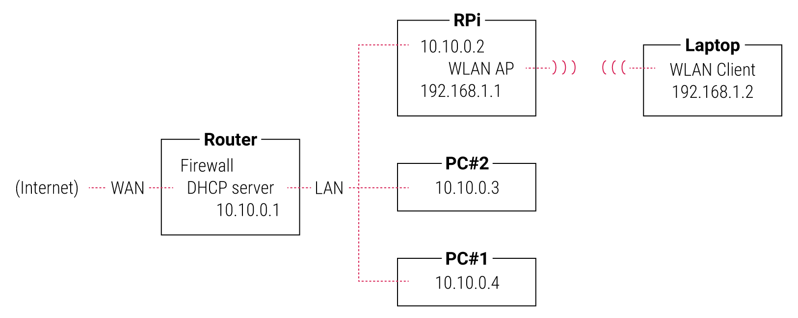
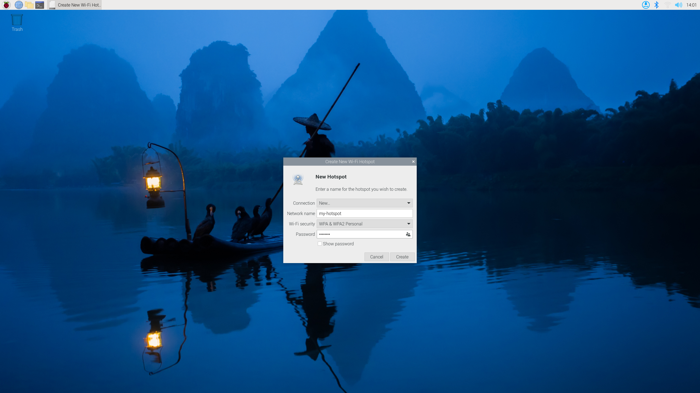
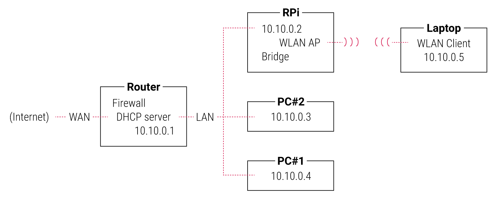

== Host a wireless network on your Raspberry Pi

Your Raspberry Pi can host its own wireless network using a wireless module.
If you connect your Raspberry Pi to the internet via the Ethernet port (or a second wireless module), other devices connected to the wireless network can access the internet through your Raspberry Pi.

Consider a wired network that uses the `10.x.x.x` IP block. You can connect your Raspberry Pi to that network and serve wireless clients on a separate network that uses another IP block, such as `192.168.x.x`.

In the diagram below, note that the laptop exists in an IP block separate from the router and wired clients:

With this network configuration, wireless clients can all communicate with each other through the Raspberry Pi router. However, clients on the wireless network cannot directly interact with clients on the wired network other than the Raspberry Pi; wireless clients exist in a private network separate from the network that serves wired clients.

NOTE: The Raspberry Pi 4, Raspberry Pi 3, and Raspberry Pi Zero W can host a wireless network using the built-in wireless module. Raspberry Pi models that lack a built-in module support this functionality using a separate wireless dongle.

=== Prerequisites

To host a wireless network with your Raspberry Pi, you will need the following:

* a Raspberry Pi with a wireless module (built-in or separate)
* a wireless client, such as a laptop or smartphone, to test your new wireless network

=== Setup

You can configure a hosted wireless network on your Raspberry Pi through the Network Manager app on the desktop or on the command line with `nmcli`.

==== Graphical desktop

To create a hosted wireless network using the Network Manager app on the desktop, complete the following steps:

1. Click the network icon in the system tray. Select *Advanced Options* > *Create Wi-Fi Hotspot*.
+
--

--
2. Enter a network name.
+
--

--
3. From the *Wi-Fi Security* dropdown, select *WPA and WPA2 Personal*.
4. Enter a password. WPA encryption requires a password at least 8 characters long.
5. Click the *Create* button to begin hosting a wireless network from your Raspberry Pi.

To disable the network:

1. Click the network icon in the system tray. Select *Turn Off Wireless LAN*.
2. Click the network icon in the system tray. Select *Turn On Wireless LAN*.

The wireless module should automatically connect to your preferred wireless network when you complete the second step. If it doesn't, pick a wireless network from the dropdown.

==== Command line

To create a hosted wireless network on the command line, run the following command, replacing the `<example-network-name>` and `<example-password>` placeholders with your own values:

----
sudo nmcli device wifi hotspot ssid <example-network-name> password <example-password>
----

To disable the network, run the following command:

----
sudo nmcli device disconnect wlan0
----

After disabling the network, run the following command to reconnect to another Wi-Fi network:

----
sudo nmcli device up wlan0
----

TIP: For more information about connecting to wireless networks, see xref:configuration.adoc#configuring-networking[Configuring Networking].

=== Use your Raspberry Pi as a network bridge

By default, the wireless network hosted from your Raspberry Pi exists separately from the parent network connected via Ethernet. In this arrangement, devices connected to the parent network cannot directly communicate with devices connected to the wireless network hosted from your Raspberry Pi. If you want connected wireless devices to be able to communicate with devices on the parent network, you can configure your Raspberry Pi as a https://en.wikipedia.org/wiki/Network_bridge[network bridge]. With a network bridge in place, each device connected to the Pi-hosted wireless network is assigned an IP address in the parent network.

In the diagram below, note that the laptop exists in the same IP block as the router and wired clients:

The following steps describe how to set up a network bridge on your Raspberry Pi to enable communication between wireless clients and the parent network.

First, create a network bridge interface:

----
sudo nmcli connection add type bridge con-name 'Bridge' ifname bridge0
----

Next, add your device's Ethernet connection to the parent network to the bridge:

----
sudo nmcli connection add type ethernet slave-type bridge \
    con-name 'Ethernet' ifname eth0 master bridge0
----

Finally, add your wireless hotspot connection to the bridge. You can either add an existing hotspot interface or create a new one:

* If you have already created a wireless hotspot connection, add the existing interface to the bridge with the following command:
+
----
sudo nmcli connection modify 'Hotspot' master bridge0
----

* If you have not yet created a wireless hotspot connection, create a new interface and add it to the bridge with a single command, replacing the `<hotspot-password>` placeholder with a password of your choice:
+
----
sudo nmcli connection add con-name 'Hotspot' \
    ifname wlan0 type wifi slave-type bridge master bridge0 \
    wifi.mode ap wifi.ssid Hotspot wifi-sec.key-mgmt wpa-psk \
    wifi-sec.proto rsn wifi-sec.pairwise ccmp \
    wifi-sec.psk <hotspot-password>
----

Now that you've configured your bridge, it's time to activate it. Run the following command to activate the bridge:

----
sudo nmcli connection up Bridge
----

And run the following command to start hosting your wireless network:

----
sudo nmcli connection up Hotspot
----

You can use the `nmcli device` command to verify that the bridge, Ethernet interface, and wireless hotspot interface are all active.

TIP: Use a tool such as https://github.com/royhills/arp-scan[arp-scan] to check if devices on the parent network are accessible once connected to the hotspot.
