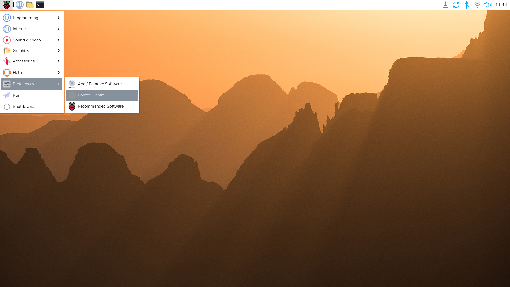
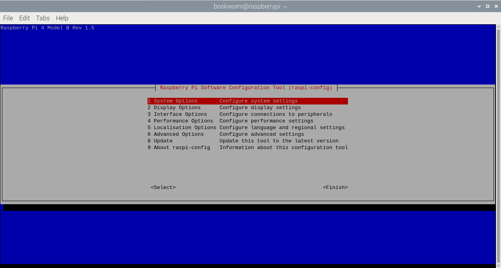

Key Raspberry Pi settings are configured as part of the setup process using Raspberry Pi Imager, described in xref:../computers/getting-started.adoc#imager-install[Install using Imager]. After installation, you can change your settings and configure additional settings; you can do this in different ways depending on your use case and technical level, described in <<config-methods>>.

[[config-methods]]
== Configuration methods
There are several ways to configure your Raspberry Pi settings. While each method uses a different interface, they typically function by modifying `/boot/firmware/config.txt` and other relevant configuration files. The three main configuration methods are:

* <<gui,Desktop graphical user interface (GUI)>>
* <<raspi-config,Interactive raspi-config text user interface (TUI)>>
* <<cli,Direct command-line interface (CLI)>>

If your system includes a desktop environment, you can configure common settings from the desktop GUI. For more granular control, or if you're using Raspberry Pi OS Lite or have a xref:../computers/getting-started.adoc#headless-setup[headless setup], Raspberry Pi OS includes the interactive `raspi-config` TUI, which is a Terminal-based configuration tool for managing common system settings.

The desktop GUI is the most user-friendly, but the method you choose depends on a number of factors, like whether you're using a headless computer (a Raspberry Pi with no output display connected) and your comfort level with the command line. For example, if you're using a headless Raspberry Pi with no connected display, you can't access a graphical desktop environment. In this case, you must use the official `raspi-config` configuration utility or manually edit the relevant configuration files from the command line.

Some other settings can only be configured from the command line or in console mode. Although these don't appear in the desktop GUI or in the `raspi-config` TUI, they're still described in the relevant categories on this page.

[[gui]]
=== Desktop GUI
If your system includes a desktop environment, the desktop GUI provides a visual, interactive layer for Raspberry Pi OS. When connected to a display, this interface allows you to control your Raspberry Pi using icons, menus, windows, and a pointer.

Most settings are managed through the *Control Centre*, but some options are available elsewhere on your desktop. For example, you can configure Wi-Fi from the wireless icon in the top-right corner of the system tray on your Raspberry Pi desktop.

To open the Control Centre, select the Raspberry Pi icon in the top-left corner of the system tray and then go to *Preferences > Control Centre*.

.How to access the Control Centre from the Raspberry Pi desktop

NOTE: Instead of *Control Centre*, versions of Raspberry Pi OS prior to Trixie used a configuration tool called *Raspberry Pi Configuration*. 

[[raspi-config]]
=== Interactive `raspi-config` TUI

Raspberry Pi OS includes `raspi-config`, which is a Terminal-based configuration tool for managing common system settings. It provides a structured menu-based interface that you navigate through using a keyboard.

.The main menu of the `raspi-config` text user interface (TUI)

You might use the `raspi-config` TUI if:

* You want or need more granular control than the desktop GUI.
* You're using Raspberry Pi OS Lite.
* You're running your Raspberry Pi in a headless environment.

To open the `raspi-config` tool, launch the Terminal on your Raspberry Pi device and then enter `sudo raspi-config`. Then:

* To navigate through the settings list, use the up and down arrow keys on your keyboard.
* To select a highlighted setting, press the *Enter* or *Return* key on your keyboard. You can also select a highlighted setting by using the right arrow or *Tab* key to highlight `<Select>` and then press the *Enter* or *Return* key on your keyboard.
* To return to the settings list, use the left arrow key on your keyboard or the *Tab* key on your keyboard.
* To jump ahead alphabetically, type the relevant letter. For example, type *E* to jump ahead to *Europe* in the timezone list.
* To close `raspi-config`, use the right arrow on your keyboard or the *Tab* key on your keyboard to select `<Finish>` and then press the *Enter* or *Return* key on your keyboard.

[[cli]]
=== Direct CLI
You can manually configure some settings by editing system files or running commands in the Terminal or in console mode. Other more advanced settings, such as configuring a custom fullscreen splash image, can only be configured manually through the CLI.