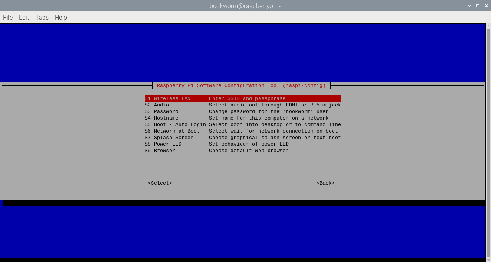
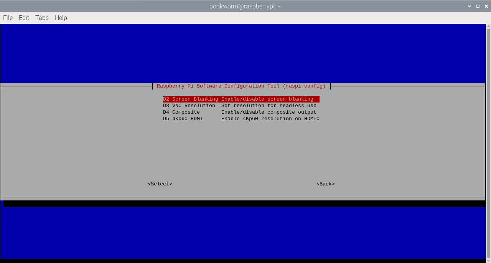
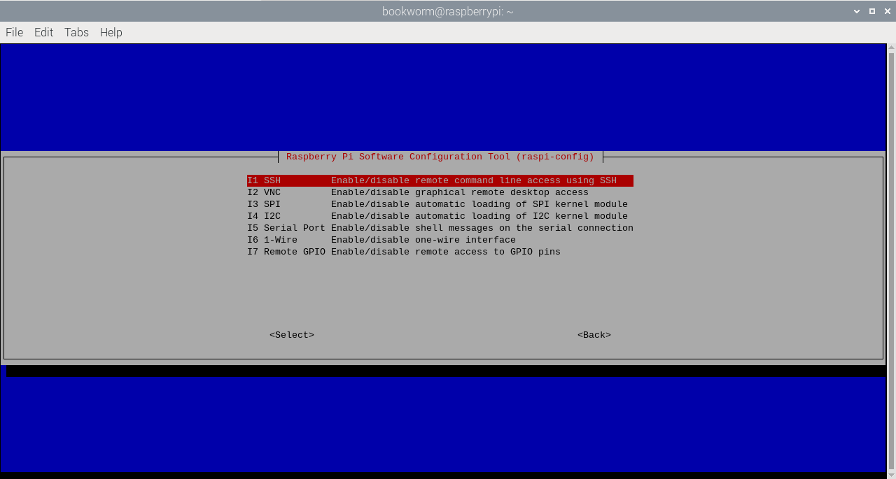
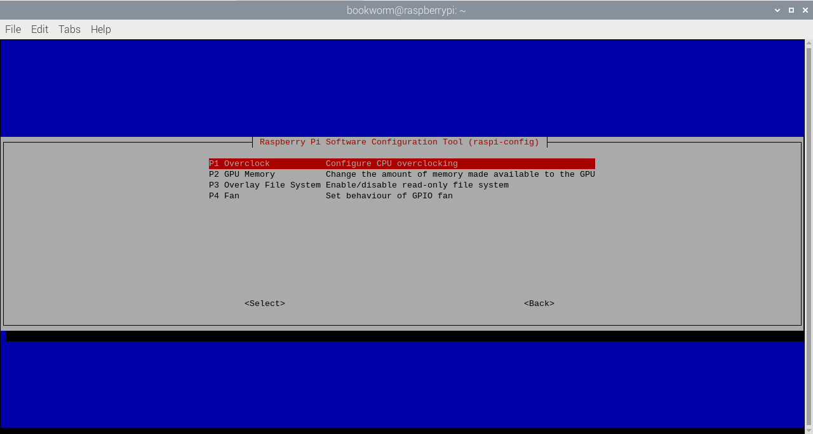
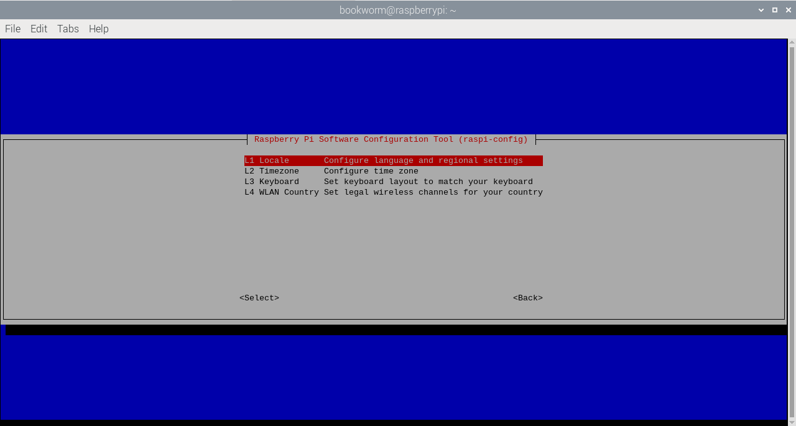
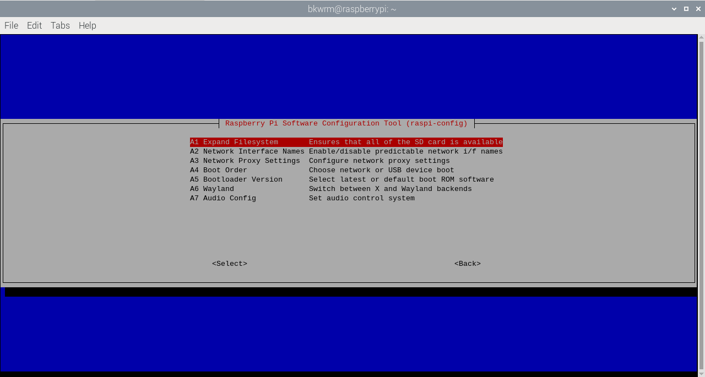

[[raspi-config]]
== `raspi-config`

TIP: Raspberry Pi Desktop users can access a graphical version of this application at **Preferences** > **Raspberry Pi Configuration**. However, some advanced configuration is only available in `raspi-config`.

`raspi-config` helps you configure your Raspberry Pi.  Available options may differ between Raspberry Pi models. To open the configuration tool, run the following command:

[source,console]
----
$ sudo raspi-config
----

You should see a blue screen with options in a grey box:

Use the **Up** and **Down** arrow keys to move the highlighted selection between the options available.

Press the **Right** arrow key or press **Tab** to access the `<Select>` and `<Finish>` buttons. Press **Left** or press **Tab** to return to the options.

`raspi-config` automates edits to xref:config_txt.adoc#what-is-config-txt[`/boot/firmware/config.txt`] and various Linux configuration files. Some options require a reboot to take effect. If you changed any of these, `raspi-config` asks you to reboot when you exit.

TIP: In long lists of option values (like the list of timezone cities), type a letter to skip to that section of the list. For example, enter `L` to skip to Lisbon.

[[menu-options]]
=== System options

The system options submenu allows you to make configuration changes to various parts of the boot, login and networking process, along with some other system level changes.

==== Wireless LAN

Configure Wi-Fi SSID and passphrase.

==== Audio

Specify the audio output destination.

==== Password

Change your password.

For more information, see xref:configuration.adoc#change-user-password[Change a user's password].

[[hostname]]
==== Hostname

Set the visible xref:remote-access.adoc#resolve-raspberrypi-local-with-mdns[mDNS] name for this Raspberry Pi on a network.

[[boot-options]]
==== Boot/auto login

Select whether to boot to console or desktop, and whether or not your Raspberry Pi automatically logs into your current user account when powered on.

==== Network at boot

Wait for a network connection before proceeding with boot.

==== Splash screen

Enable or disable the splash screen displayed at boot time.

==== Power LED

If your Raspberry Pi model allows, change the behaviour of the power LED.

==== Browser

Change the default web browser.

=== Display options

[[underscan]]
==== Underscan

NOTE: Not available when running Wayland.

If the initial text shown on the screen disappears off the edge, enable overscan to adjust the border. On some displays, particularly monitors, disabling overscan will make the picture fill the whole screen and remove the black border.

==== Screen blanking

Enable or disable screen blanking.

[[resolution]]
==== VNC resolution

Define the video resolution to use in xref:configuration.adoc#setting-up-a-headless-raspberry-pi[headless] setups.

==== Composite

Enable or disable composite video.

==== 4Kp60 HDMI

Enable or disable 4Kp60 resolution for HDMI outputs.

[[interfacing-options]]
=== Interface options

Enable and disable various physical and virtual interfaces.

[[ssh]]
==== SSH

Enable or disable remote terminal access to your Raspberry Pi using SSH.

SSH allows you to remotely access the command line of the Raspberry Pi from another computer. SSH is disabled by default. Read more about using SSH on the xref:remote-access.adoc#ssh[SSH documentation page]. If connecting your Raspberry Pi directly to a public network, you should not enable SSH unless you have set up secure passwords for all users.

[[rpi-connect]]
==== RPi Connect

Enable or disable xref:../services/connect.adoc[Raspberry Pi Connect], which provides the ability to access your Raspberry Pi remotely with no manual network configuration.

[[VNC]]
==== VNC

Enable or disable the WayVNC or RealVNC virtual network computing server.

[[spi]]
==== SPI

Enable or disable SPI interfaces and automatic loading of the SPI kernel module.

[[i2c]]
==== I2C

Enable or disable I2C interfaces and automatic loading of the I2C kernel module.

[[serial]]
==== Serial port

Enable or disable shell and kernel messages on the serial connection.

[[one-wire]]
==== 1-Wire

Enable or disable the Dallas 1-wire interface, often used for DS18B20 temperature sensors.

==== Remote GPIO

Enable or disable remote access to the GPIO pins.

=== Performance options

[[overclock]]
==== Overclock

If your Raspberry Pi model allows, overclock the CPU. Overclocking potential varies between individual Raspberry Pi devices, even within the same model. Overclocking too high may result in instability.

WARNING: *Overclocking may reduce the lifetime of your Raspberry Pi.* If overclocking at a certain level causes system instability, try a more modest overclock. Hold down the *Shift* key during boot to temporarily disable overclocking.

[[memory-split]]
==== GPU memory

Change the amount of memory made available to the GPU.

==== Overlay file system

Enable or disable a read-only filesystem.

==== Fan

Customise the behaviour of the GPIO-connected https://www.raspberrypi.com/products/raspberry-pi-4-case-fan/[Raspberry Pi 4 Case Fan]. Does not affect the fans in the https://www.raspberrypi.com/products/raspberry-pi-5-case/[Raspberry Pi 5 Case for Raspberry Pi 5] or https://www.raspberrypi.com/products/active-cooler/[Raspberry Pi 5 Active Cooler], which connect using a special four-pin fan header.

[[localisation-options]]
=== Localisation options

Configure location and country-related options.

[[change-locale]]
==== Locale

Select a locale, for example `en_GB.UTF-8 UTF-8`.

[[change-timezone]]
==== Time zone

Sets your local time zone, starting with the region then selecting a city, e.g. "Europe/London". Type a letter to jump to that letter in the list.

[[change-keyboard-layout]]
==== Keyboard

Opens a menu where you can select your keyboard layout. Changes usually take effect immediately, but may require a reboot. Type a letter to jump to that letter in the list.

==== WLAN country

Sets the country code for your wireless network.

[[advanced-options]]
=== Advanced options

[[expand-filesystem]]
==== Expand filesystem

Expands your OS partition to fill the whole storage device, giving you more space to use for files. Reboot your Raspberry Pi to complete this action. Normally, Raspberry Pi OS runs this action on first boot. This option can be useful if you clone your OS to a separate storage device with more capacity than the original.

WARNING: There is no confirmation step. Selecting the option begins the partition expansion immediately.

==== Network interface names

Enable or disable predictable network interface names.

==== Network proxy settings

Configure the network's proxy settings.

==== Boot order

On Raspberry Pi 4 and later, specify whether to boot from USB or network if the SD card isn't inserted. For more information, see xref:raspberry-pi.adoc#raspberry-pi-bootloader-configuration[bootloader configuration].

==== Bootloader version

On the Raspberry Pi 4 and later, switch to the latest boot ROM software. Alternatively, you can revert to the factory default if the latest version causes problems.

==== Wayland

Switch between the X11 and Wayland backends, and choose a window manager. Since Raspberry Pi OS _Bookworm_, all Raspberry Pi models run Wayland using labwc by default.

NOTE: To use Wayland on Raspberry Pi models prior to Raspberry Pi 4 running a version of Raspberry Pi OS earlier than _Bookworm_, add `wayland=on` to `/boot/firmware/cmdline.txt`.

==== Audio config

Switch between the PulseAudio and PipeWire audio backends. Prior to Raspberry Pi OS Bookworm, Raspberry Pi OS used PulseAudio.

[[update]]
=== Update

Update this tool to the latest version.

[[about]]
=== About raspi-config

Display a description of `raspi-config`.

[[finish]]
=== Finish

Exits `raspi-config`. If you made changes that require a reboot, `raspi-config` prompts you to reboot. When implementing changes for the first time, it's best to reboot. If you chose to resize your SD card, rebooting may take longer than usual.

[[raspi-config-cli]]
== non-interactive `raspi-config`

The `raspi-config` tool also supports non-interactive options and flags that change options entirely on the command line with no visual component. Available options may differ between Raspberry Pi models.

[source,console]
----
$ sudo raspi-config nonint <command> <arguments> [optional-argument]
----

NOTE: The meaning of `0` and `1` varies between options. Always check the documentation before passing a value to an option.

[[raspi-config-cli-commands]]

=== System options

==== Wireless LAN

Configure Wi-Fi SSID and passphrase.

[source,console]
----
$ sudo raspi-config nonint do_wifi_ssid_passphrase <ssid> <passphrase> [hidden] [plain]
----

Pass a wireless network name (SSID) and passphrase, if required. The following flags are optional:

The `<hidden>` option indicates the visibility of the SSID. If the network broadcasts an open SSID, pass `0` or omit the option. If your SSID is hidden, pass `1`. Defaults to `0`.

The `<plain>` option indicates whether or not you intend to pass the passphrase as plaintext. If your passphrase includes a space or a special character like `!`, you must pass `0` and use quotes around your passphrase. Otherwise, you can pass `1` or omit the option. Defaults to `1`.  To pass this option, you must specify a value for `<hidden>`.

For example, run the following commands to connect to a:

* non-hidden network named `myssid` with the passphrase `mypassphrase`:
+
[source,console]
----
$ sudo raspi-config nonint do_wifi_ssid_passphrase myssid mypassphrase
----

* hidden network named `myssid` with the passphrase `mypassphrase`:
+
[source,console]
----
$ sudo raspi-config nonint do_wifi_ssid_passphrase myssid mypassphrase 1
----

* non-hidden network named `myssid` with the passphrase `my passphrase`:
+
[source,console]
----
$ sudo raspi-config nonint do_wifi_ssid_passphrase myssid "my passphrase" 0 0
----

==== Audio

Specify the audio output destination.

[source,console]
----
$ sudo raspi-config nonint do_audio <N>
----

On Raspberry Pi 4B, you can use the following options:

* `0`: bcm2835 headphone jack
* `1`: vc4-hdmi-0
* `2`: vc4-hdmi-1

For a full list of possible `<N>` values, see the numbers used in the interactive `raspi-config` version of this option.

[[change-user-password-nonint]]
==== Password

Change your password.

For more information, see xref:configuration.adoc#change-user-password[Change a user's password].

[source,console]
----
$ sudo raspi-config nonint do_change_pass
----

NOTE: This function uses a full-screen interactive interface, even when run from a CLI option.

[[hostname-nonint]]
==== Hostname

Set the visible xref:remote-access.adoc#resolve-raspberrypi-local-with-mdns[mDNS] name for this Raspberry Pi on a network.

[source,console]
----
$ sudo raspi-config nonint do_hostname <hostname>
----

[[boot-options-nonint]]
==== Boot/auto login

Select whether to boot to console or desktop, and whether or not your Raspberry Pi automatically logs into your current user account when powered on.

[source,console]
----
$ sudo raspi-config nonint do_boot_behaviour <B1/B2/B3/B4>
----

* `B1`: boot to console, requiring login
* `B2`: boot to console, logging in automatically
* `B3`: boot to desktop, requiring login
* `B4`: boot to desktop, logging in automatically

==== Network at boot

Wait for a network connection before letting boot proceed.

[source,console]
----
$ sudo raspi-config nonint do_boot_wait <0/1>
----

* `0`: boot without waiting for network connection
* `1`: boot after waiting for network connection

==== Splash screen

Enable or disable the splash screen displayed at boot time.

[source,console]
----
$ sudo raspi-config nonint do_boot_splash <0/1>
----

* `0`: enable splash screen
* `1`: disable splash screen

==== Power LED

If your Raspberry Pi model allows, change the behaviour of the power LED.

[source,console]
----
$ sudo raspi-config nonint do_leds <0/1>
----

* `0`: flash for disk activity
* `1`: keep the power LED lit at all times

==== Browser

Change the default web browser. Choosing a web browser that isn't currently installed won't work.

[source,console]
----
$ sudo raspi-config nonint do_browser <chromium-browser/firefox>
----

=== Display options

[[underscan-nonint]]
==== Underscan

NOTE: Not available when running Wayland.

If the initial text shown on the screen disappears off the edge, enable overscan to adjust the border. On some displays, particularly monitors, disabling overscan will make the picture fill the whole screen and remove the black border.

[source,console]
----
$ sudo raspi-config nonint do_overscan_kms <device> <enabled>
----

Device:

* `1`: HDMI-1
* `2`: HDMI-2

Enabled:

* `0`: enable overscan
* `1`: disable overscan

==== Screen blanking

Enable or disable screen blanking.

[source,console]
----
$ sudo raspi-config nonint do_blanking <0/1>
----

* `0`: enable screen blanking
* `1`: disable screen blanking

[[resolution-nonint]]
==== VNC resolution

Define the video resolution to use for VNC in xref:configuration.adoc#setting-up-a-headless-raspberry-pi[headless] setups.

[source,console]
----
$ sudo raspi-config nonint do_vnc_resolution <width>x<height>
----

==== Composite

Enable or disable composite video output.

On Raspberry Pi 4:

[source,console]
----
$ sudo raspi-config nonint do_pi4video <V1/V2/V3>
----

* `V1`: enable 4Kp60 HDMI output
* `V2`: enable composite video output
* `V3`: disable 4Kp60 and composite output

On other models:

[source,console]
----
$ sudo raspi-config nonint do_composite <0/1>
----

* `0`: enable composite video
* `1`: disable composite video

[[interfacing-options-nonint]]
=== Interface options

[[ssh-nonint]]
==== SSH

Enable or disable remote terminal access to your Raspberry Pi using SSH.

SSH allows you to remotely access the command line of the Raspberry Pi from another computer. For more information about SSH, see the xref:remote-access.adoc#ssh[SSH documentation].

[source,console]
----
$ sudo raspi-config nonint do_ssh <0/1>
----

* `0`: enable SSH
* `1`: disable SSH

[[rpi-connect-nonit]]
==== Raspberry Pi Connect

Enable or disable xref:../services/connect.adoc[Raspberry Pi Connect], which provides the ability to access your Raspberry Pi remotely with no manual network configuration.

[source,console]
----
$ sudo raspi-config nonint do_rpi_connect <0/1>
----

* `0`: enable Raspberry Pi Connect
* `1`: disable Raspberry Pi Connect

[[VNC-nonint]]
==== VNC

Enable or disable a Virtual Network Computing (VNC) server. For more information about VNC, see the xref:remote-access.adoc#vnc[VNC documentation].

[source,console]
----
$ sudo raspi-config nonint do_vnc <0/1>
----

* `0`: enable VNC
* `1`: disable VNC

[[spi-nonint]]
==== SPI

Enable or disable SPI interfaces and automatic loading of the SPI kernel module.

[source,console]
----
$ sudo raspi-config nonint do_spi <0/1>
----

* `0`: enable SPI
* `1`: disable SPI

[[i2c-nonint]]
==== I2C

Enable or disable I2C interfaces and automatic loading of the I2C kernel module.

[source,console]
----
$ sudo raspi-config nonint do_i2c <0/1>
----

* `0`: enable I2C
* `1`: disable I2C

[[serial-nonint]]
==== Serial Port

Enable or disable the serial connection hardware.

[source,console]
----
$ sudo raspi-config nonint do_serial_hw <0/1>
----

* `0`: enable serial port
* `1`: disable serial port

[[serial-console-nonint]]
==== Serial console

Enable or disable shell and kernel messages on the serial connection.

[source,console]
----
$ sudo raspi-config nonint do_serial_cons <0/1>
----

* `0`: enable console over serial port
* `1`: disable console over serial port

[[one-wire-nonint]]
==== 1-wire

Enable or disable the Dallas 1-wire interface. This is usually used for DS18B20 temperature sensors.

[source,console]
----
$ sudo raspi-config nonint do_onewire <0/1>
----

* `0`: enable 1-wire
* `1`: disable 1-wire

==== Remote GPIO

Enable or disable remote access to the GPIO pins.

[source,console]
----
$ sudo raspi-config nonint do_rgpio <0/1>
----

* `0`: enable remote GPIO
* `1`: disable remote GPIO

=== Performance options

[[overclock-nonint]]
==== Overclock

If your Raspberry Pi model allows, overclock the CPU. Overclocking potential varies between individual Raspberry Pi devices, even within the same model. Overclocking too high may result in instability.

WARNING: *Overclocking may reduce the lifetime of your Raspberry Pi.* If overclocking at a certain level causes system instability, try a more modest overclock. Hold down the *Shift* key during boot to temporarily disable overclocking.

[source,console]
----
$ sudo raspi-config nonint do_overclock <setting>
----

This command accepts the following `<setting>` values:

* `None`: no overclock (default)
* `Modest`: overclock to 50% of the maximum
* `Medium`: overclock to 75% of the maximum
* `High`: overclock to 100% of the maximum
* `Turbo`: overclock to 125% of the maximum

[[memory-split-nonint]]
==== GPU memory

Change the amount of memory made available to the GPU.

[source,console]
----
$ sudo raspi-config nonint do_memory_split <megabytes>
----

==== Overlay file system

Enable or disable a read-only filesystem.

[source,console]
----
$ sudo raspi-config nonint do_overlayfs <0/1>
----

* `0`: enable overlay filesystem
* `1`: disable overlay filesystem

==== Fan

Customise the behaviour of the GPIO-connected https://www.raspberrypi.com/products/raspberry-pi-4-case-fan/[Raspberry Pi 4 Case Fan]. Does not affect the fans in the https://www.raspberrypi.com/products/raspberry-pi-5-case/[Raspberry Pi 5 Case for Raspberry Pi 5] or https://www.raspberrypi.com/products/active-cooler/[Raspberry Pi 5 Active Cooler], which connect using a special four-pin fan header.

[source,console]
----
$ sudo raspi-config nonint do_fan <0/1> [gpio] [onTemp]
----

* `0`: enable fan
* `1`: disable fan

`gpio` defaults to `14`.

`onTemp` defaults to `80` **degrees Celsius**.

[[localisation-options-nonint]]
=== Localisation options

[[change-locale-nonint]]
==== Locale

Select a locale, for example `en_GB.UTF-8 UTF-8`.

[source,console]
----
$ sudo raspi-config nonint do_change_locale <locale>
----

For a full list of possible `<locale>` values, see the abbreviations used in the interactive `raspi-config` version of this option.

[[change-timezone-nonint]]
==== Time zone

Set your local time zone, starting with the region then selecting a city, e.g. "Europe/London".

[source,console]
----
$ sudo raspi-config nonint do_change_timezone <timezone>
----

For a full list of possible `<timezone>` values, see the abbreviations used in the interactive `raspi-config` version of this option.

[[change-keyboard-layout-nonint]]
==== Keyboard

Set your keyboard layout. Changes usually take effect immediately, but may require a reboot.

[source,console]
----
$ sudo raspi-config nonint do_configure_keyboard <keymap>
----

For a full list of possible `<keymap>` values, see the the abbreviations used in the interactive `raspi-config` version of this option.

==== WLAN country

Set the country code for your wireless network.

[source,console]
----
$ sudo raspi-config nonint do_wifi_country <country>
----

For a full list of possible `<country>` values, see the abbreviations used in the interactive `raspi-config` version of this option.

[[advanced-options-nonint]]
=== Advanced options

[[expand-filesystem-nonint]]
==== Expand filesystem

Expand your OS partition to fill the whole storage device, giving you more space to use for files. Reboot the Raspberry Pi to complete this action. Normally, Raspberry Pi OS runs this action on first boot. This option can be useful if you clone your OS to a separate storage device with more capacity than the original.

WARNING: There is no confirmation step. Selecting the option begins the partition expansion immediately.

[source,console]
----
$ sudo raspi-config nonint do_expand_rootfs
----

==== Network interface names

Enable or disable predictable network interface names.

[source,console]
----
$ sudo raspi-config nonint do_net_names <0/1>
----

* `0`: enable predictable network interface names
* `1`: disable predictable network interface names

==== Network proxy settings

Configure the network's proxy settings.

[source,console]
----
$ sudo raspi-config nonint do_proxy <SCHEMES> <ADDRESS>
----

==== Boot order

On the Raspberry Pi 4 and later, specify whether to boot from USB or network if the SD card isn't inserted. See the xref:raspberry-pi.adoc#raspberry-pi-bootloader-configuration[bootloader configuration] section for more information.

[source,console]
----
$ sudo raspi-config nonint do_boot_order <B1/B2/B3>
----

Depending on your device, you can choose from the following options:

* `B1`: SD card boot - boot from SD card if available, otherwise boot from NVMe, otherwise boot from USB
* `B2`: NVMe/USB boot - boot from NVMe if available, otherwise boot from USB if available, otherwise boot from SD card
* `B3`: Network boot - boot from SD card _if inserted_, otherwise boot from network

==== Bootloader version

On the Raspberry Pi 4 and later, switch to the latest boot ROM software. Alternatively, you can revert to the factory default if the latest version causes problems.

[source,console]
----
$ sudo raspi-config nonint do_boot_rom <E1/E2>
----

* `E1`: use the latest boot ROM
* `E2`: use the factory default

==== Wayland

Switch between the X11 and Wayland backends, and choose a window manager. Since Raspberry Pi OS _Bookworm_, all Raspberry Pi models run Wayland using the labwc window manager by default.

NOTE: To use Wayland on Raspberry Pi models prior to Raspberry Pi 4 running a version of Raspberry Pi OS earlier than _Bookworm_, add `wayland=on` to `/boot/firmware/cmdline.txt`.

[source,console]
----
$ sudo raspi-config nonint do_wayland <W1/W2>
----

* `W1`: use the Openbox window manager with X11 backend
* `W2`: use the wayfire window manager with Wayland backend
* `W3`: use the labwc window manager with Wayland backend

==== Audio config

Use this option to switch between the PulseAudio and PipeWire audio backends. Prior to Raspberry Pi OS Bookworm, Raspberry Pi OS used PulseAudio.

[source,console]
----
$ sudo raspi-config nonint do_audioconf <1/2>
----

* `1`: use the PulseAudio backend
* `2`: use the PipeWire backend

[[update-nonint]]
=== Update

Update this tool to the latest version.

[source,console]
----
$ sudo raspi-config nonint do_update
----
