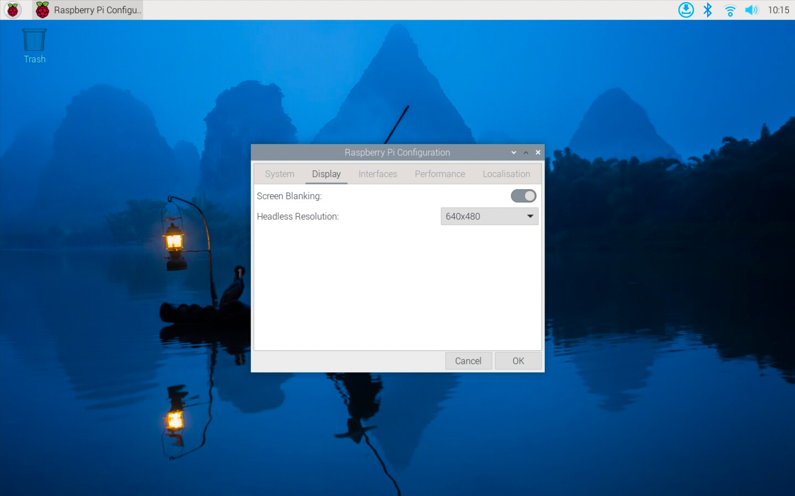

== Configure Screen Blanking

You can configure your Raspberry Pi to blank the screen after a period of inactivity. By default, Raspberry Pi OS blanks the screen after 10 minutes of inactivity when screen blanking is enabled.

=== Desktop

You can control screen blanking using the *Screen Blanking* option in the Raspberry Pi Configuration menu.

==== Raspberry Pi Configuration

Click the Raspberry Pi button in the menu bar. Navigate to *Preferences* > *Raspberry Pi Configuration*.

Select the *Display* tab. Toggle the *Screen Blanking* radio button into the on position. Press *OK* to confirm your selection.

==== CLI

You can enable and disable screen blanking with the `raspi-config` CLI tool. Run the following command to open the tool:

----
sudo raspi-config
----

Use the arrow keys to navigate and the *Enter* key to select. Select `Display Options` > `Screen Blanking`. Choose `yes` with the arrow keys to enable screen blanking, or `no` to disable screen blanking.

Alternatively, you can add or edit the following lines to `~/.config/wayfire.ini`:

----
[idle]
dpms_timeout=600
----

The `dpms_timeout` variable controls the number of seconds of inactivity required before Raspberry Pi OS blanks your screen. For example, a value of `600` blanks the screen after 600 seconds, or 10 minutes. Set the value to `0` to never blank the screen.

=== Console

The `dpms_timeout` screen blanking configuration used by Raspberry Pi Configuration only affects desktop sessions. In *console mode*, when your Raspberry Pi is connected to a monitor and keyboard with only a terminal for input, use the `consoleblank` setting in the boot command line.

==== Set console mode screen blanking

To change the console mode screen blanking configuration, open `/boot/firmware/cmdline.txt` in a text editor as an administrator:

----
sudo nano /boot/firmware/cmdline.txt
----

You can adjust the number of seconds before Raspberry Pi OS blanks the console here. For instance, add `consoleblank=600` to disable display output after 600 seconds of inactivity. Set the value to `0` to never blank the screen.

Changes to `cmdline.txt` only take effect after a reboot. Use the following command to reboot your Raspberry Pi:

----
sudo reboot
----

==== View current screen blanking setting

You can display the current console blank time in seconds with the following command:

[,bash]
----
cat /sys/module/kernel/parameters/consoleblank
----
