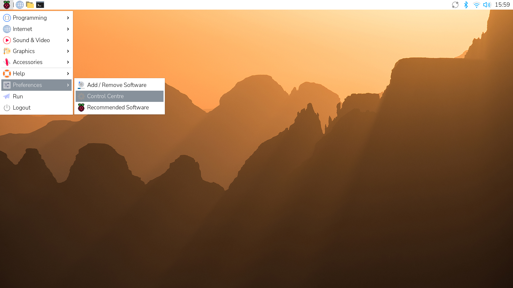
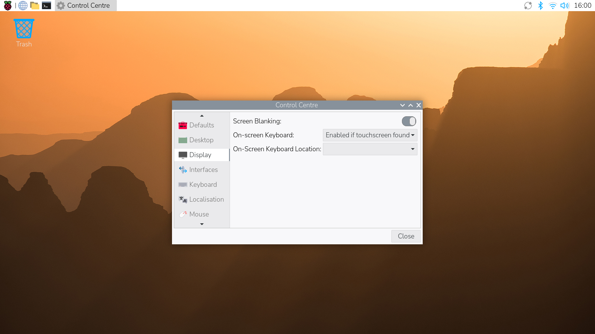

== Screen blanking

You can configure your Raspberry Pi to blank the screen after a period of inactivity. When screen blanking is enabled, Raspberry Pi OS blanks the screen after ten minutes of inactivity by default.

How you manage screen blanking depends on your setup:

* In the <<desktop, desktop environment>>, you can configure screen blanking with graphical tools or from the command line.
* In <<console, console mode>> (text-only without the desktop), screen blanking is controlled through kernel parameters.

[[desktop]]
=== Desktop

When running Raspberry Pi OS using the desktop environment, you can control screen blanking through built-in configuration tools: the graphical menu (*Control Centre*) or the command-line interface (*CLI*).

If you aren't running the desktop environment, you can manage screen blanking from the terminal interface on your Raspberry Pi. For instructions, see <<console, Console>>.

==== Control Centre

The *Control Centre* application allows you to turn screen blanking on or off without editing configuration files manually.

1. Select the Raspberry Pi icon in the top-left corner of the menu bar.
2. Go to *Preferences > Control Centre*.
+

3. Open the *Display* tab in the *Control Centre* window.
4. Use the toggle to turn on *Screen Blanking*.
5. Select *Close* to confirm your selection.
+

NOTE: In previous versions of Raspberry Pi OS, the Control Centre application was called Raspberry Pi Configuration.

==== CLI

If you prefer using the terminal, use the `raspi-config` command-line tool to enable or disable screen blanking. This method is useful when working remotely over SSH or when you want quick access to system settings.

1. Run the following command to open the tool: `sudo raspi-config`.
2. Navigate with the arrow keys and press **Enter** or **Return** to select `Display Options` *>* `Screen Blanking`.
3. Use the arrow keys on your keyboard to either:
    - Choose `yes` to enable screen blanking.
    - Choose `no` to disable screen blanking.

[[console]]
=== Console

You can control screen blanking in *console mode* using the `consoleblank` kernel parameter.

Unlike the screen blanking setting modified by the Control Centre and `raspi-config`, which only affects desktop sessions, the `consoleblank` parameter applies when your Raspberry Pi is running with a monitor and keyboard in a text-only terminal session. By setting `consoleblank` in the kernel command line, you can specify how long the console waits before turning off the screen.

==== Set console mode screen blanking

To change the console mode screen blanking configuration:

1. Use the following command to open `/boot/firmware/cmdline.txt` in a text editor as an administrator: `sudo nano /boot/firmware/cmdline.txt`.
2. Set the number of seconds before Raspberry Pi OS blanks the console. All parameters must remain on a single line. You can:
    * Set how many seconds of inactivity before the screen blanks. For example, adding `consoleblank=600` blanks the screen after 600 seconds of inactivity.
    * Add `consoleblank=0` to never blank the screen.
3. Use the following command to reboot the Raspberry Pi: `sudo reboot`. This is a necessary precursor for the changes to take effect.

After reboot, the console blanking timeout follows your new setting.

==== View the current screen blanking setting

You can display the current console blank time (in seconds) with the following command:

[source,console]
----
$ cat /sys/module/kernel/parameters/consoleblank
----

== Custom fullscreen splash image

You can configure your Raspberry Pi to display a fullscreen splash image during boot instead of the standard console log messages.

[[file-reqs]]
=== File requirements

The splash screen image must meet the following criteria:

* *Maximum dimensions.* 1920 × 1080 pixels.
    - If the image is smaller than the screen, the remaining area around your image is filled with a solid color taken from the top-left pixel of your image `(0, 0)`.
    - Scaling isn't applied. If the screen is smaller than the image, the image is clipped and centred.
* *Maximum colours.* 224 unique colours.
* *Colour depth.* 24-bit (8 bits per channel, no alpha channel).
* *Format.* Uncompressed TGA.

You can use ImageMagick's `convert` command to convert an image to the TGA format expected by the kernel. For example, to convert `image.png` to a suitably-formatted `splash-image.tga` file:

[source,console]
----
$ sudo apt install imagemagick
$ convert image.png -colors 224 -depth 8 -type TrueColor -alpha off -compress none -define tga:bits-per-sample=8 splash-image.tga
----

=== Set up a fullscreen splash image

There are two ways to enable a fullscreen splash image on your Raspberry Pi. Depending on your technical expertise, you can either:

* <<apt-package, *Use the apt package>>.* This method is more straightforward, allowing you to enable the splash screen with minimal configuration. You install a pre-made package (`rpi-splash-screen-support`) that automates most of the setup. It copies your image, sets kernel parameters, and configures the system for you.
* <<cli-splash, *Edit the `cmdline.txt` system file>>.* This method is more technical, but gives you control over every step. You manually configure the splash image on the command line and then update your `initramfs` to contain the splash image.

[[apt-package]]
==== Use the apt package

Install the `rpi-splash-screen-support` package to simplify the set up of fullscreen splash images. The package provides the `configure-splash` tool, which sets the necessary kernel parameters and updates your `initramfs`.

1. Install the package using the following command:
+
[source,console]
----
$ sudo apt install rpi-splash-screen-support
----
2. After the apt package is installed, run the following command to configure your splash image, replacing `<splash-image.tga>` with the name or path of the image file. This path can be relative or absolute:
+
[source,console]
----
$ sudo configure-splash <splash-image.tga>
----
3. Run the following command to reboot your Raspberry Pi and see the splash image:
+
[source,console]
----
$ sudo reboot
----

If the image appears upside down when booting, edit the `convert` command in <<file-reqs, File requirements>> to add the `-flip` flag before the `splash-image.tga`. Then run `configure-splash` to update the image with the correct orientation.

[[cli-splash]]
==== Edit the `cmdline.txt` system file

The following method requires editing system files and manually updating the `initramfs`.

1. Use the following command to open `/boot/firmware/cmdline.txt` in a text editor as an administrator: `sudo nano /boot/firmware/cmdline.txt`.
2. Disable on-screen console messages to prevent boot messages from covering your splash image. Edit `cmdline.txt` to remove the following:
    - `console=tty1`.
    - `quiet` (if present).
    - Any references to `plymouth`, such as `plymouth.ignore-serial-consoles`.
3. Edit `cmdline.txt` to add the following parameters:
    - `fullscreen_logo_name=logo.tga fullscreen_logo=1` to enable fullscreen splash.
    - `vt.global_cursor_default=0` to remove the flashing cursor in the splash image.
+
Your entry should end with something like the following:
+
[source]
----
fullscreen_logo_name=logo.tga fullscreen_logo=1 vt.global_cursor_default=0
----
4. Place the image file in the correct location.
    - The kernel expects the image file in `/lib/firmware`.
    - The TGA file is read from the `initramfs` during boot.
    - The filename must match fullscreen_logo_name in `cmdline.txt`.

For example code for embedding TGA images in `initramfs`, see the https://github.com/raspberrypi/rpi-splash-screen-support/blob/master/configure-splash[Raspberry Pi splash screen support tool] in GitHub.

NOTE: *Step 2* doesn't prevent `getty` from launching a login prompt. Your splash image appears during boot, but when the system is ready for login, the console takes over, and the splash disappears. `getty` clears the splash screen and writes the login prompt over it when the system is ready.

