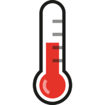
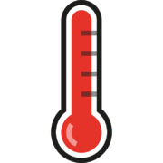

== Firmware Warning Icons

Under certain circumstances, the Raspberry Pi firmware will display a warning icon on the display, to indicate an issue. There are currently three icons that can be displayed.

=== Undervoltage Warning

If the power supply to the Raspberry Pi drops below 4.63V (±5%), the following icon is displayed.

image::images/under_volt.png[Under Voltage]

=== Over Temperature Warning (80-85°C)

If the temperature of the SoC is between 80C and 85C, the following icon is displayed. The ARM core(s) will be throttled back in an attempt to reduce the core temperature.

=== Over Temperature Warning (over 85°C)

If the temperature of the SoC is over 85°C, the following icon is displayed. The ARM core(s) and the GPU will be throttled back in an attempt to reduce the core temperature.

