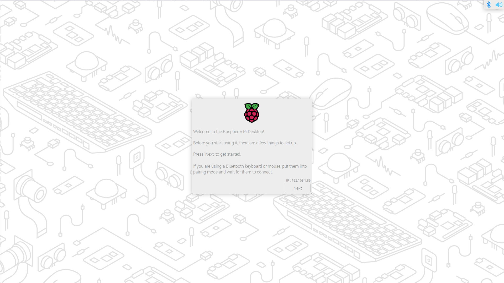
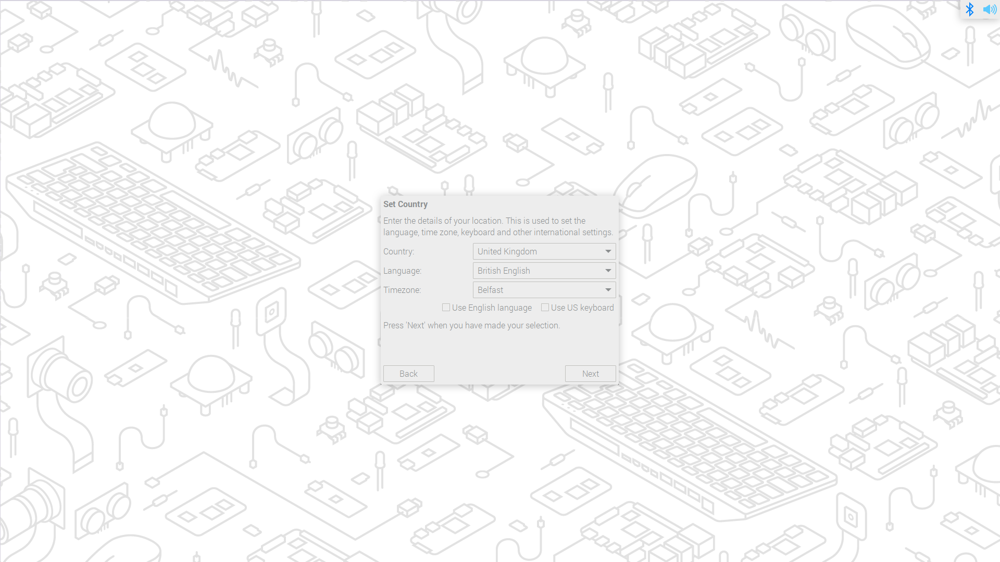
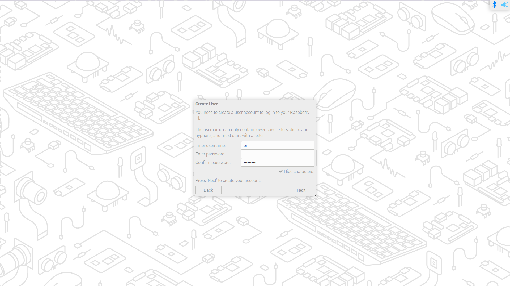
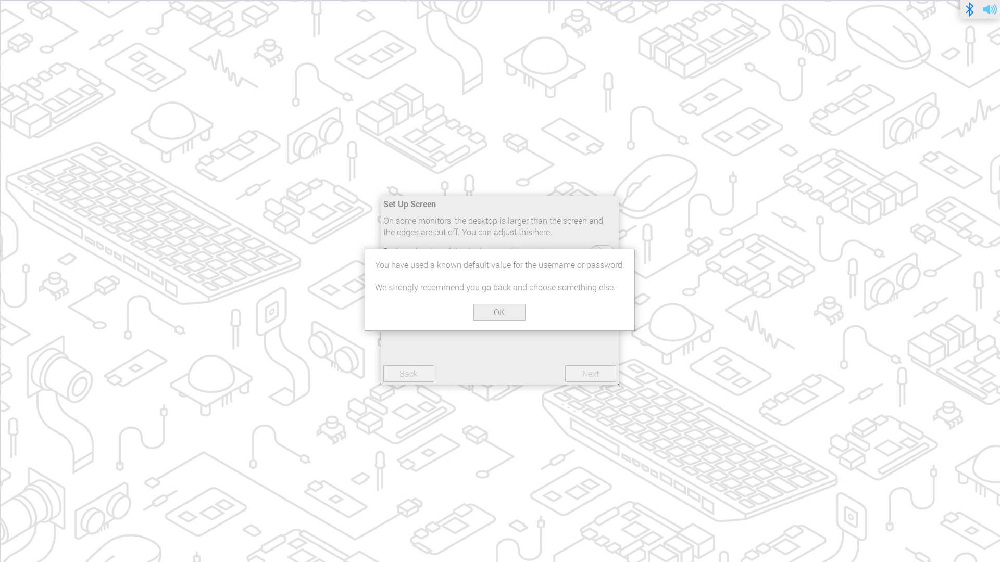
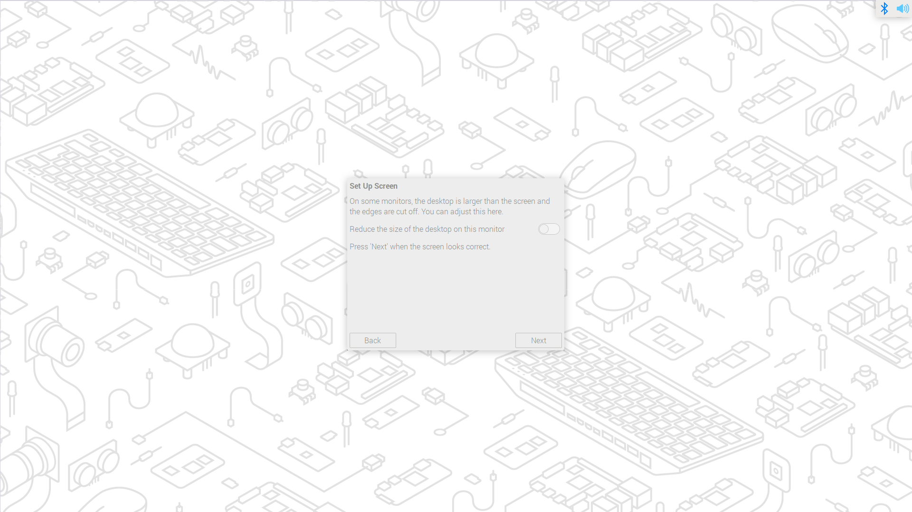
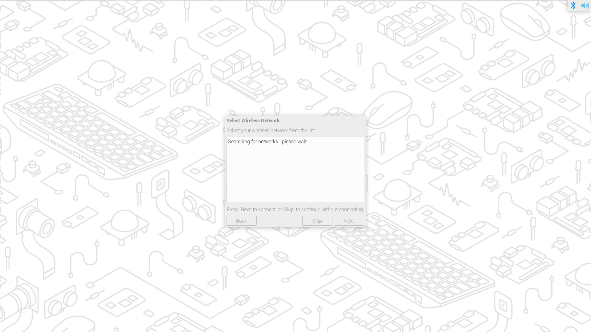
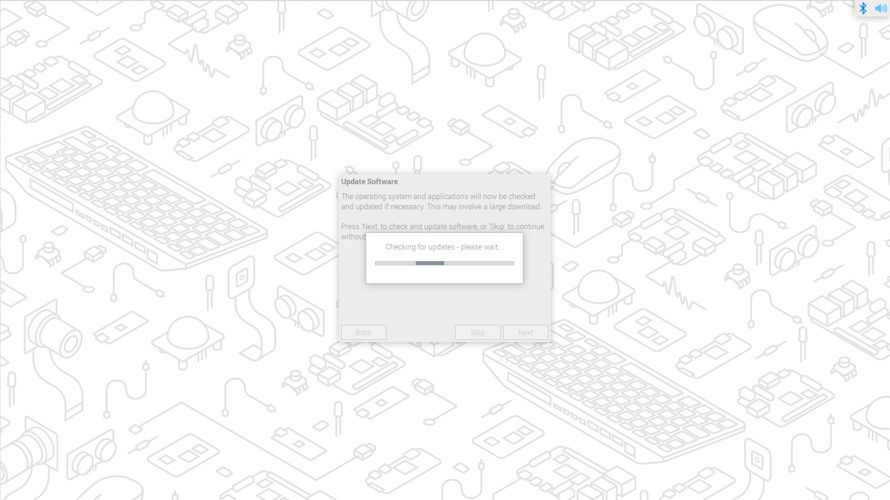
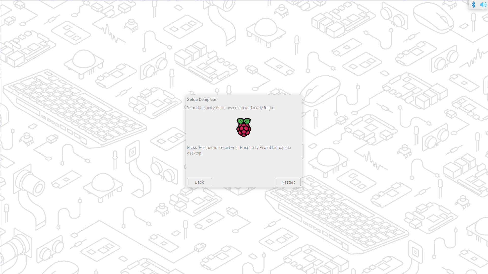

== Configuration on First Boot

If you have not already configured your operating system using the xref:getting-started.adoc#advanced-options[Advanced Menu] of Raspberry Pi Imager when Raspberry Pi OS starts up for the first time you will be guided through initial setup.

The Raspberry Pi OS configuration wizard will run on the first boot. The wizard starts off by allowing you to configure international settings and your timezone information.

NOTE: If you are using a Bluetooth keyboard and mouse the first page will prompt you to put any Bluetooth keyboard or mouse you wish to use into pairing mode, and then to wait. As long as you are on the first page of the wizard, the Raspberry Pi will now scan for pairable Bluetooth mice and keyboards, and will automatically pair the first of each which it finds. You will see messages pop up to indicate that a Bluetooth device has been found and is being paired – you may need to wait a few seconds after the final “connected” dialog appears for the newly-connected device to wake up and start being used by the system. This works both with the built-in Bluetooth adapter on Raspberry Pi 3 and 4, and also with USB Bluetooth adapters on earlier models of Raspberry Pi – just make sure the USB adapter is inserted before the Raspberry Pi is booted.

After hitting "Next" you'll be prompted to create a user account. Here you can choose your username, and a password.

If you want to you can set your username to the old default username of `pi`, which was used on older versions of Raspberry Pi OS. 

NOTE: Some older software may require the presence of the `pi` user. 

However, if you do choose to create this account you will trigger a warning message, and we'd advise you to avoid the old default password of `raspberry`.

After creating an user account you can configure your screen,

and your wireless network.

Once your wireless network is configured and your Raspberry Pi has access to the Internet you will be prompted to update the operating system to the latest version. This will automatically download any patches and updates needed to bring your new operating system right up to date.

Once the operating system is updated you will be prompted to reboot your Raspberry Pi.

NOTE: If you are installing Raspberry Pi OS Lite you will still need to create a new user account. You will therefore be prompted to create an account by text prompts at the command line when you first boot a Lite image. If you are booting Raspberry Pi OS xref:configuration.adoc#setting-up-a-headless-raspberry-pi[headless] you *MUST* configure the operating system using Raspberry Pi Imager using the xref:getting-started.adoc#advanced-options[Advanced Menu].