== Configuration
Most essential configuration for your Raspberry Pi is typically completed during the OS installation process in Imager.

[[first-configuration]]
=== Configuration on first boot

This section covers post-installation configuration, whether you:

* Skipped the customisation steps in Imager.
* Didn't use Imager to install your OS.
* Are using a Raspberry Pi with a pre-installed OS, or
* Want to change settings after installation to tailor your Raspberry Pi to your needs.

If you followed the steps to preconfigure your Raspberry Pi during OS customisation in Imager, as described in *Step 3* of xref:../computers/getting-started.adoc#install[Install an OS onto boot media], you don't need to configure your Raspberry Pi again unless you want to change any settings.

If you have a *desktop setup* and skipped OS customisation in Imager, or if you're using a Raspberry Pi with a pre-installed OS, you're presented with a configuration wizard on first boot.

A *headless setup* bypasses the configuration wizard; because you preconfigured the settings in Imager, your headless Raspberry Pi boots straight to the network. If you chose SSH for remote access, you can connect remotely to your headless Raspberry Pi by typing `ssh username@hostname.local` into the command line on your computer. For more information, see xref:../computers/getting-started.adoc#headless-setup[Headless (remote) setup].

You need a monitor and a keyboard to navigate through the configuration wizard. A mouse is optional, and you can use the *Tab* key to advance through the wizard, if desired.

If you plan on pairing a USB Bluetooth mouse or keyboard as part of this configuration process, plug the USB adapter in before booting your Raspberry Pi.

The configuration wizard walks you through the following setup options. Select *Next* in the bottom-right corner to proceed through each of the options.

==== Welcome and Bluetooth
The following image shows the configuration wizard's welcome window, which is also when your Raspberry Pi tries to connect to any Bluetooth peripherals it finds.

NOTE: The IP address on this welcome window is only visible if your Raspberry Pi is connected to a network over Ethernet.

.Configuration wizard welcome window
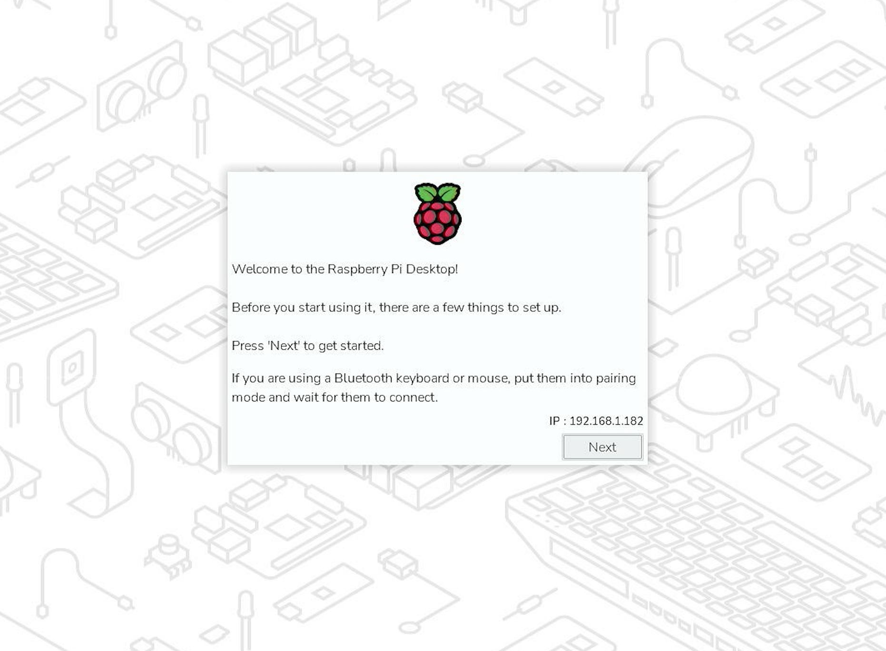

If you're using a Bluetooth keyboard or mouse, your Raspberry Pi searches for pairable devices and connects to the first device it finds for each peripheral. This process works with built-in or external USB Bluetooth adapters. If you're using a USB adapter, plug it in before booting your Raspberry Pi.

.Attempting to pair with a Bluetooth device
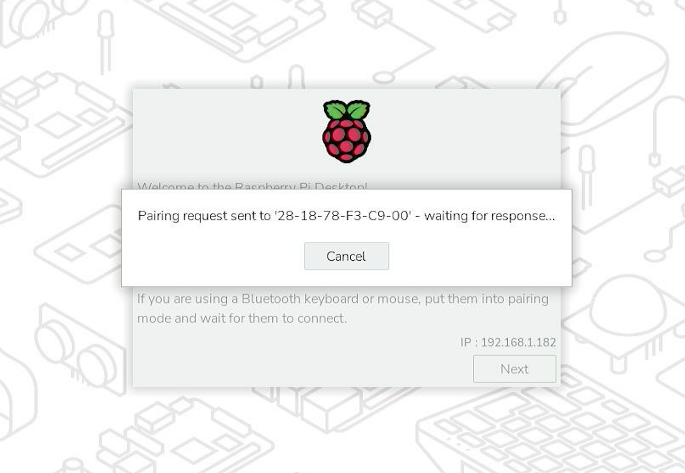

.Success message for Bluetooth pairing
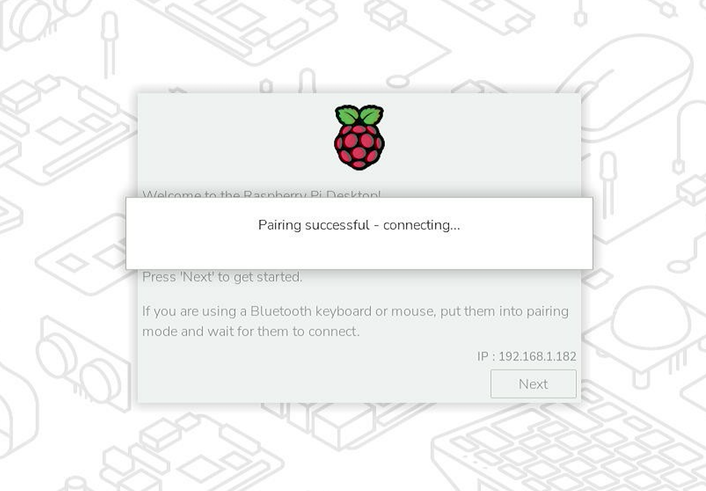

==== Country
Use the dropdown menus to set your country, language, and time zone. Optionally, you can also:

* Select *Use English language* to ensure that the desktop interface is displayed in English, overriding local language default.
* Select *Use US keyboard* to ensure that the OS interprets input from a US-layout keyboard correctly.

.Setting your country window in the configuration wizard
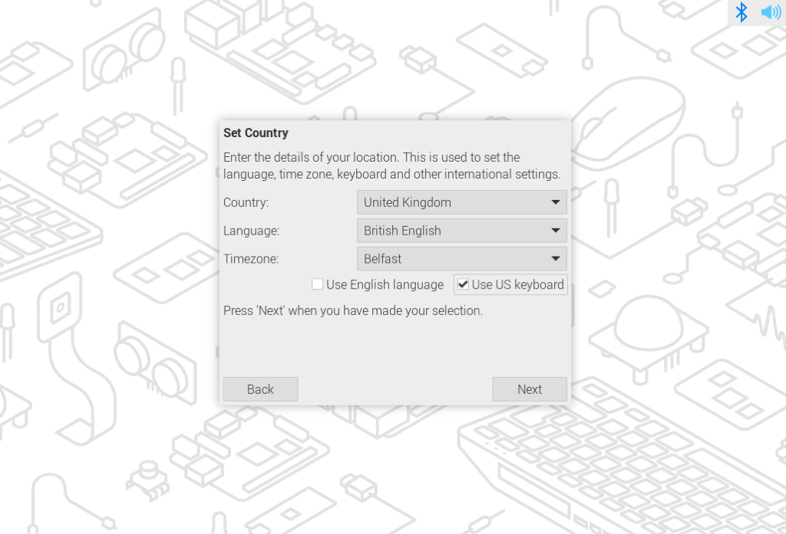

==== User

Configure your username and password for the default user account. Your username must start with a letter and can only contain lowercase letters, numbers, underscores, and hyphens.

.Create User window in the configuration wizard
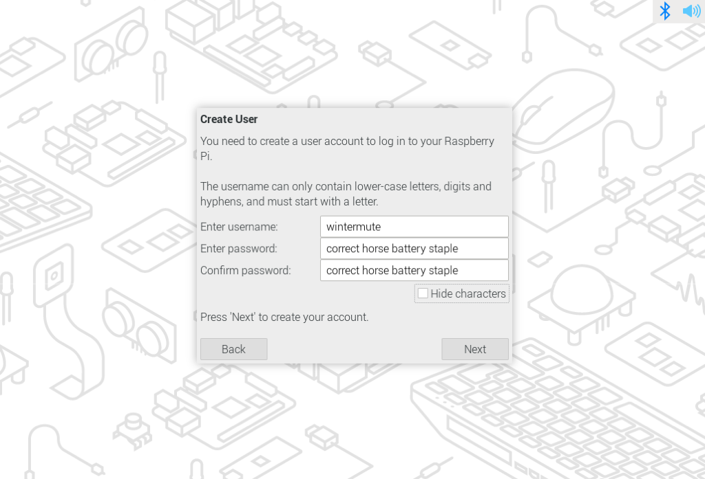

==== Wireless network

Choose your preferred Wi-Fi network from the list. If your network requires a password, you're then prompted to enter it before continuing. You can skip this step if you prefer.

.Selecting a wireless network in the configuration wizard
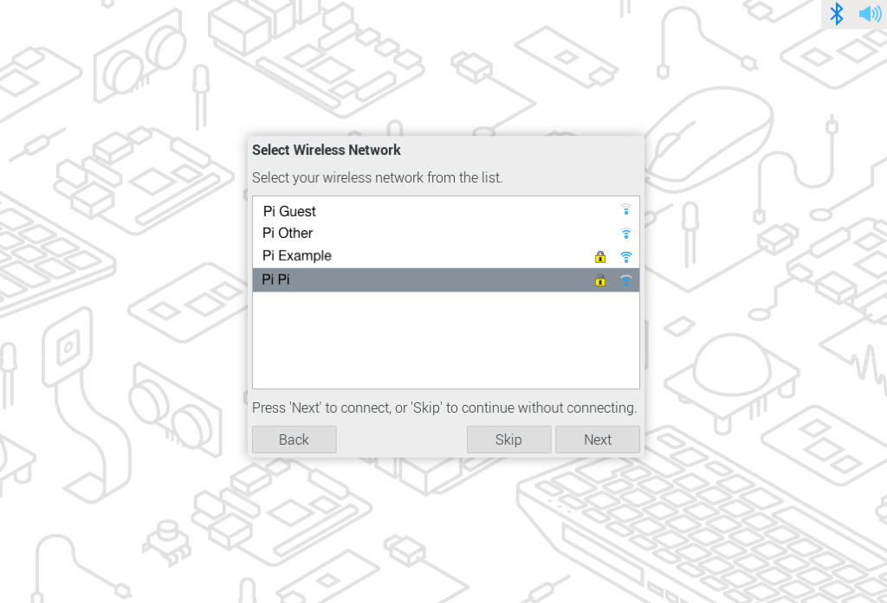

==== Default browser

Select your default internet browser: *Chromium* or *Firefox*. Optionally, to save space on your boot media, uninstall the browser that you don't set as default.

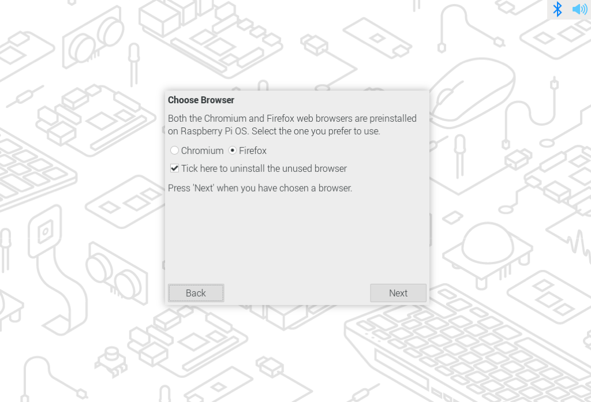

==== Software update

If you configured internet access for your Raspberry Pi, or if your Raspberry Pi is connected to the internet using an Ethernet cable, you can update your OS and software to the latest versions. 

During the software update process, the configuration wizard removes the non-default browser if you opted to uninstall it in the *Browser* step. 

A software update may take up to half an hour, depending on how many updates are available and the speed of your internet connection.

.Updating your software in the configuration wizard
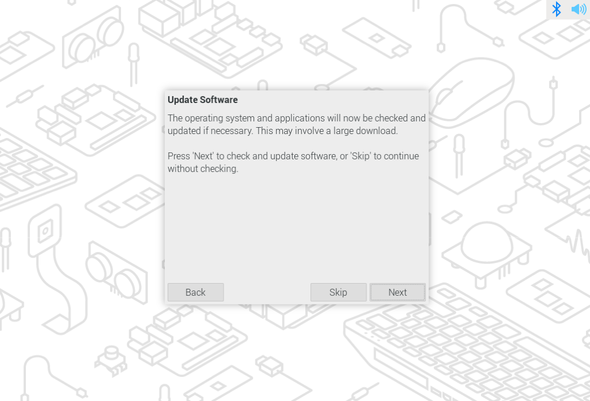

==== Finish

When you've gone through each step of the configuration wizard, a confirmation window stating that your system is set up appears. Select *OK* and then *Launch* (or, if you see *Restart* instead, select this to reboot your Raspberry Pi). Your configuration is applied to your Raspberry Pi, which then boots and loads the graphical desktop environment where you can use windows, icons, and menus, similar to other desktop computers.

.System update success message
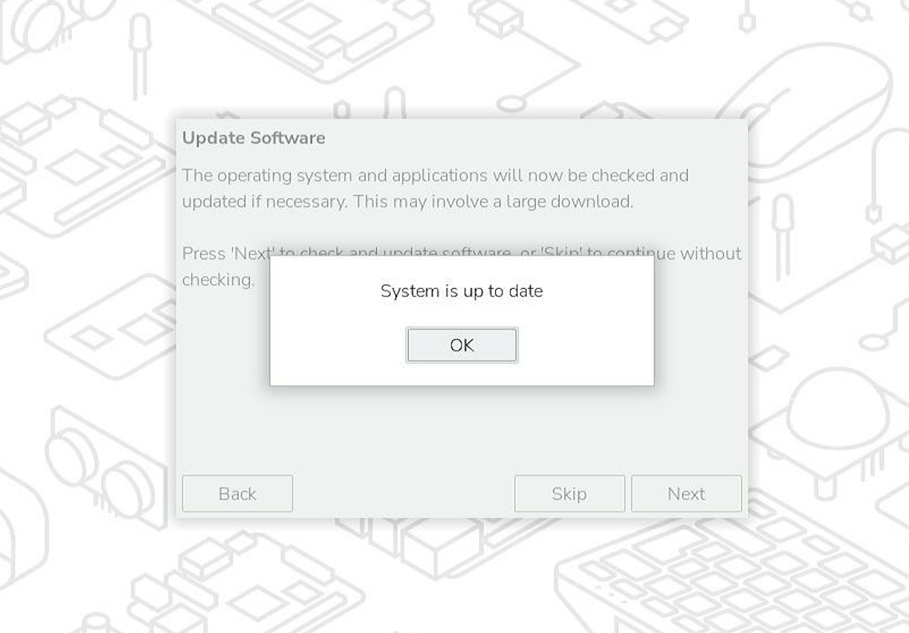

.Setup complete success message
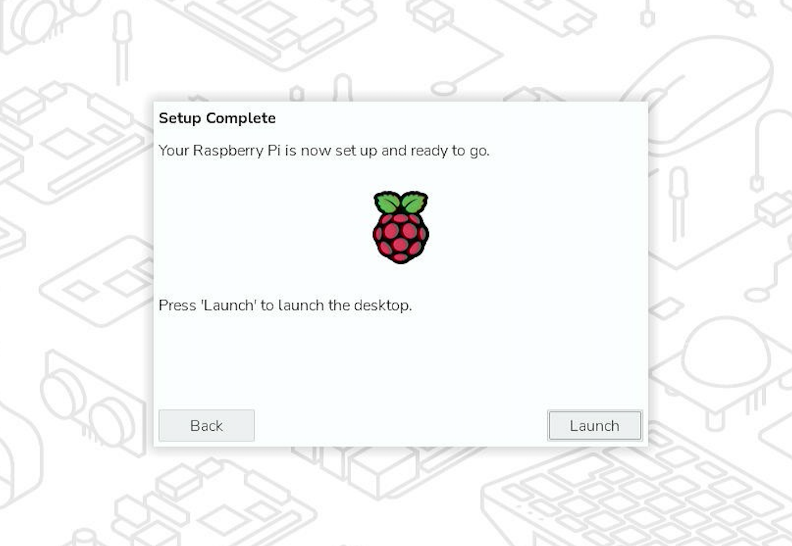

=== Configuration changes
You can reconfigure your Raspberry Pi from the command line or the desktop.

To reconfigure from the desktop, open the Raspberry Pi icon in the top-left corner, then navigate to *Preferences > Control Centre*. 

To reconfigure from the Terminal, enter `sudo raspi-config` to open the *Control Centre*.

For detailed instructions, see xref:configuration.adoc[Configuration].

[[shutdown]]
== Shutdown options
Raspberry Pi OS provides options for safely shutting down, restarting, locking, and signing out of your Raspberry Pi device from the desktop and from the command line.

[[desktop-shutdown]]
=== Desktop shutdown options
The *Shutdown Options* window in the desktop gives you the following options:

* *Shutdown.* Closes all running programs and powers off your Raspberry Pi. Use this option before disconnecting your Raspberry Pi from power.
* *Reboot.* Restarts your system. This is useful after applying updates, changing configurations, and connecting to new hardware.
* *Lock Screen.* Locks your current session to prevent unauthorised access while keeping open programs running. Enter your password to unlock the screen again.
* *Logout.* Signs out of your current user account and closes all running programs without shutting down the system.

=== Open shutdown options from the desktop
To open the *Shutdown Options* window from the desktop, select the Raspberry Pi icon in the top-left corner of the system tray then select *Shutdown*.

The following devices also offer shutdown shortcuts:

* Raspberry Pi 5: Double-press the power button to shut the device down (the *Shutdown Options* window might display briefly).
* Raspberry Pi 5, 500, or 500+: Single press the *power button* to open the *Shutdown Options* window.
* Raspberry Pi 400: Press *Fn* + *F10* to open the *Shutdown Options* window.

.Desktop shutdown option
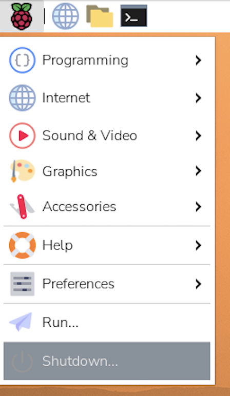

.Desktop shutdown menu
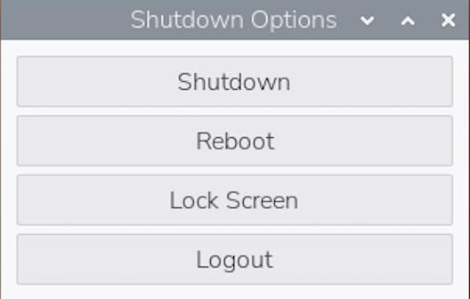

You can use the mouse, or your keyboard cursor keys and *Enter* key, to select from one of the following four options: Shutdown, Reboot, Lock Screen, and Logout, described in <<desktop-shutdown>>. 

To exit the menu without choosing any of these options, select the cross (*×*) icon at the top-right corner or press *Esc*.

[[cmd-shutdown]]
=== Shutdown options from the command line
You can perform most shutdown options from the command line. 

Open a Terminal and then use one of the following commands:

[cols="2,2", options="header"]
|===
| Action | Command

| Shut down your Raspberry Pi
| `sudo poweroff`

| Reboot your Raspberry Pi
| `sudo reboot`

| When in Console mode, sign out of your Raspberry Pi without shutting down the system
| `logout`

|===

[[troubleshooting]]
== Troubleshooting

If your Raspberry Pi doesn't boot within 5 minutes, check the status LED. If the status LED is flashing, check the xref:configuration.adoc#led-warning-flash-codes[LED warning flash codes] to diagnose the problem.

If your Raspberry Pi still doesn't boot and the LED information doesn't help you to resolve the issue, try the following:

* If you used a boot device other than an SD card, try booting from an SD card.
* Re-image your SD card by following the instructions in xref:getting-started.adoc#imager-install[Install using Imager], completing the entire *Verify* step.
* Using Imager on a host computer, xref:raspberry-pi.adoc#bootloader_reflash[reflash the bootloader] on your storage device and then xref:getting-started.adoc#imager-install[re-image your SD card].