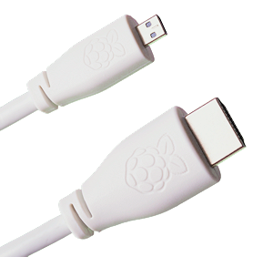
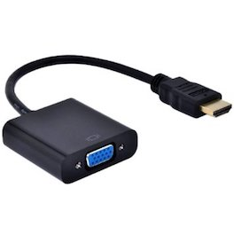

== Connecting a Display

Unless you're setting up your Raspberry Pi to operate xref:configuration.adoc#setting-up-a-headless-raspberry-pi[headless], for regular use you'll want to plug the Raspberry Pi in to a display: either a computer monitor, or a televison.

=== Connecting using HDMI

The Raspberry Pi has an HDMI port which you can connect directly to a monitor or TV with an HDMI cable. This is the easiest solution; some modern monitors and TVs have HDMI ports, some do not, but there are other options.

image::images/hdmi_connector.png[HDMI cable]

NOTE: The Raspberry Pi 4 has two micro HDMI connectors, which require a good-quality micro HDMI cable, especially when using 4K monitors or television. Raspberry Pi sells a https://www.raspberrypi.org/products/micro-hdmi-to-standard-hdmi-a-cable/[suitable cable].

If you're using your Raspberry Pi with a monitor with built-in speakers and are connecting to it using an HDMI cable you can also use it to output sound.

=== Connecting using DVI

For monitors with a DVI port, you can use an HDMI-to-DVI cable, or an HDMI cable with a DVI adapter. 

image::images/dvi_hdmi_cable.png[DVI-HDMI cable]

NOTE: Unlike HDMI the DVI standard does not support audio

=== Connecting using VGA

For monitors with VGA only, you can use an HDMI-to-VGA adapter. Note that VGA does not support audio.

=== Using the Composite Port

Most models of Raspberry Pi have a composite out port for connecting to analog devices, but the type of connector varies depending on the model. The original Raspberry Pi used an RCA connector, and a standard RCA composite video lead will work. Others models (Raspberry Pi B+ and later) combine the audio out and composite out on to the same 3.5mm jackplug. This requires a particular type of lead, with audio left on the tip, audio right on ring 1, ground on ring 2, and video on the sleeve. This is the same as leads used on the Zune, and on Apple devices.

image::images/rca_connector.png[RCA cable]

More information on connecting to a monitor can be found in our https://www.raspberrypi.org/learning/hardware-guide/equipment/[learning resources section].
