[[installing-the-operating-system]]
== Install an operating system

To use your Raspberry Pi, you'll need an operating system. By default, Raspberry Pis check for an operating system on any SD card inserted in the SD card slot.

Depending on your Raspberry Pi model, you can also boot an operating system from other storage devices, including USB drives, storage connected via a HAT, and network storage.

To install an operating system on a storage device for your Raspberry Pi, you'll need:

* a computer you can use to image the storage device into a boot device
* a way to plug your storage device into that computer

Most Raspberry Pi users choose microSD cards as their boot device.

We recommend installing an operating system using xref:getting-started.adoc#raspberry-pi-imager[Raspberry Pi Imager].

If you have no other computer to write an image to a boot device, you may be able to install an operating system xref:getting-started#network-install[directly on your Raspberry Pi from the internet].

[[raspberry-pi-imager]]
=== Imager

Raspberry Pi Imager is a tool that helps you download and write images on macOS, Windows, and Linux. Imager includes many popular operating system images for Raspberry Pi. Imager also supports loading images downloaded directly from https://www.raspberrypi.com/software/operating-systems/[Raspberry Pi] or third-party vendors such as https://ubuntu.com/download/raspberry-pi[Ubuntu]. You can use Imager to preconfigure credentials and remote access settings for your Raspberry Pi.

////
TODO: Update this video for the new Imager look & flow (video::ntaXWS8Lk34[youtube])
////

Imager supports images packaged in the `.img` format as well as container formats like `.zip`.

==== Install Imager

You can install Imager in the following ways:

* Download the latest version from https://www.raspberrypi.com/software/[raspberrypi.com/software] and run the installer.
* Install it from a terminal using your package manager, e.g. `sudo apt install rpi-imager`.

==== Run Imager

Once you've installed Imager, launch the application by clicking the Raspberry Pi Imager icon or running `rpi-imager`.

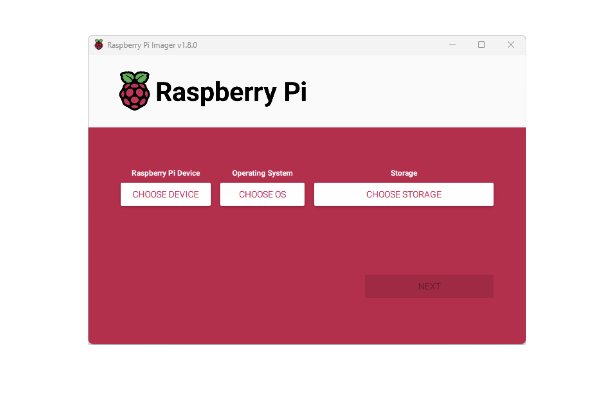

Click **Choose device** and select your Raspberry Pi model from the list.

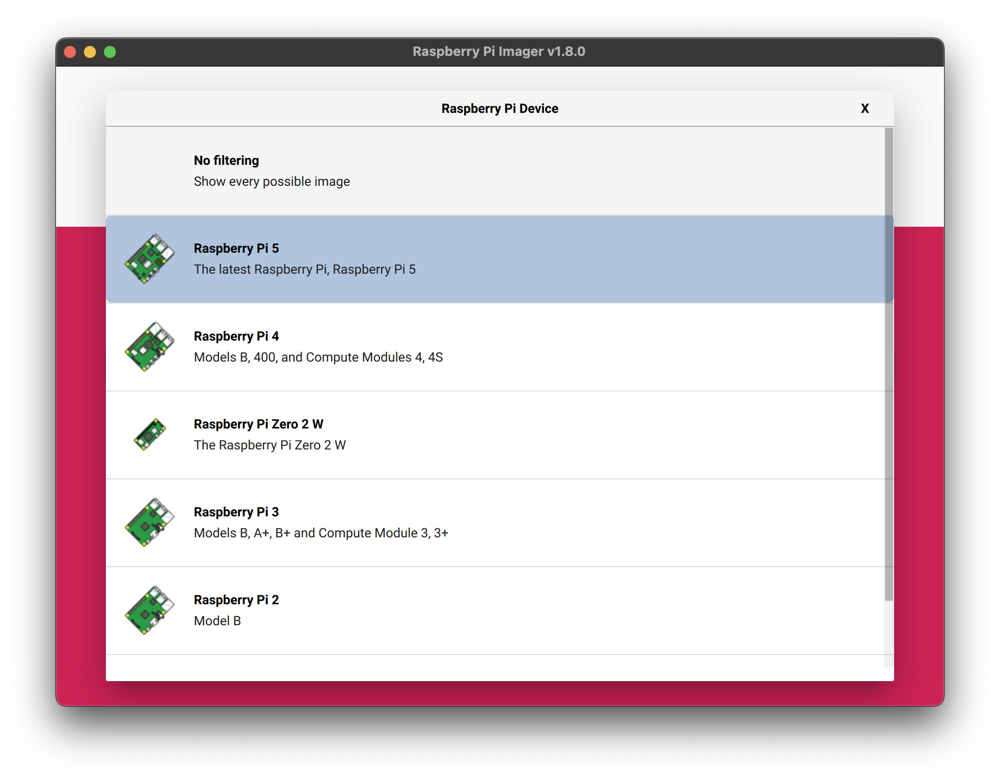

Next, click **Choose OS** and select an operating system to install. Imager always shows the recommended version of Raspberry Pi OS for your model at the top of the list.

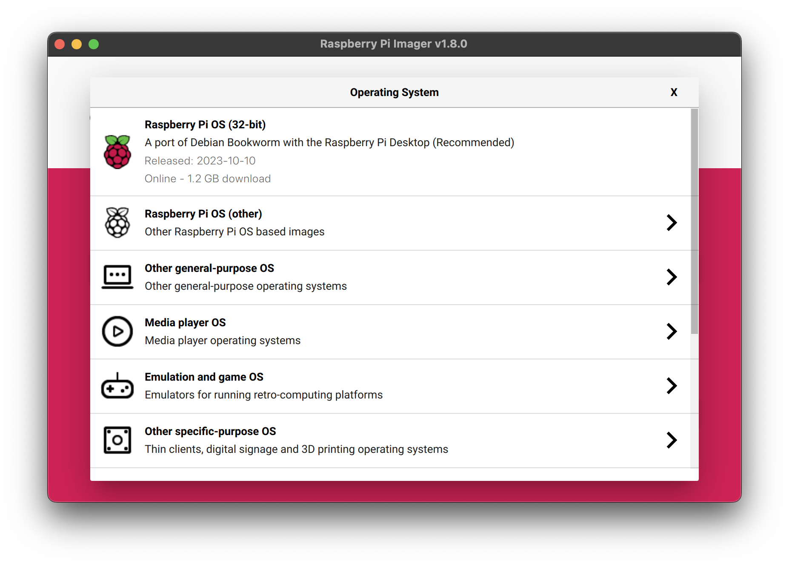

Connect your preferred storage device to your computer. For example, plug a microSD card in using an external or built-in SD card reader. Then, click **Choose storage** and select your storage device.

WARNING: If you have more than one storage device connected to your computer, _be sure to choose the correct device!_ You can often identify storage devices by size. If you're unsure, disconnect other devices until you've identified the device you want to image.

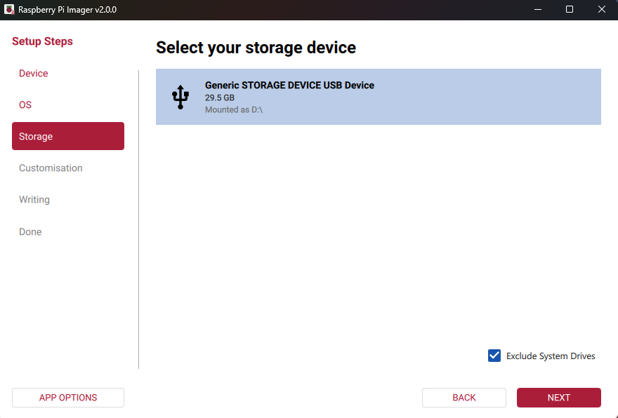

Next, click **Write**.

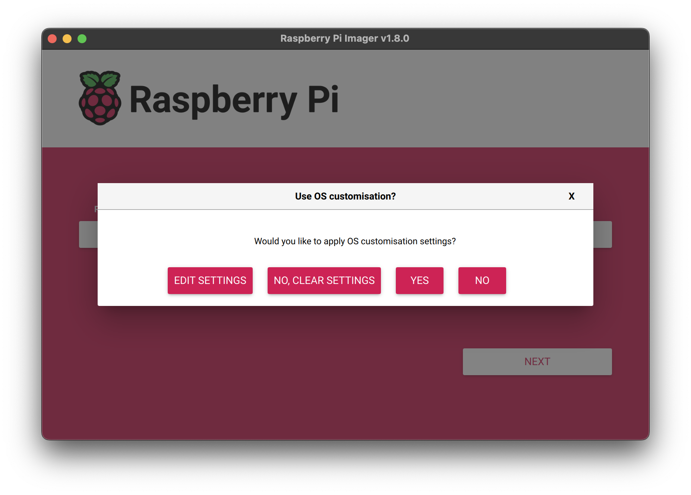

In a popup, Imager will ask you to apply OS customisation. We strongly recommend configuring your Raspberry Pi via the OS customisation settings. Click the **Edit Settings** button to open xref:getting-started.adoc#os-customisation[OS customisation].

If you don't configure your Raspberry Pi via OS customisation settings, Raspberry Pi OS will ask you for the same information at first boot during the xref:getting-started.adoc#configuration-on-first-boot[configuration wizard]. You can click the **No** button to skip OS customisation.

[[advanced-options]]
==== OS customisation

The OS customisation menu lets you set up your Raspberry Pi before first boot. You can preconfigure:

* a username and password
* WiFi credentials
* the device hostname
* the time zone
* your keyboard layout
* remote connectivity

When you first open the OS customisation menu, you might see a prompt asking for permission to load WiFi credentials from your host computer. If you respond "yes", Imager will prefill WiFi credentials from the network you're currently connected to. If you respond "no", you can enter WiFi credentials manually.

The **hostname** option defines the hostname your Raspberry Pi broadcasts to the network using https://en.wikipedia.org/wiki/Multicast_DNS[mDNS]. When you connect your Raspberry Pi to your network, other devices on the network can communicate with your computer using `<hostname>.local` or `<hostname>.lan`.

The **username and password** option defines the username and password of the admin user account on your Raspberry Pi.

The **wireless LAN** option allows you to enter an SSID (name) and password for your wireless network. If your network does not broadcast an SSID publicly, you should enable the "Hidden SSID" setting. By default, Imager uses your the country you're currently in as the "Wireless LAN country". This setting controls the WiFi broadcast frequencies used by your Raspberry Pi. Enter credentials for the wireless LAN option if you plan to run a headless Raspberry Pi.

The **locale settings** option allows you to define the time zone and default keyboard layout for your Pi. 

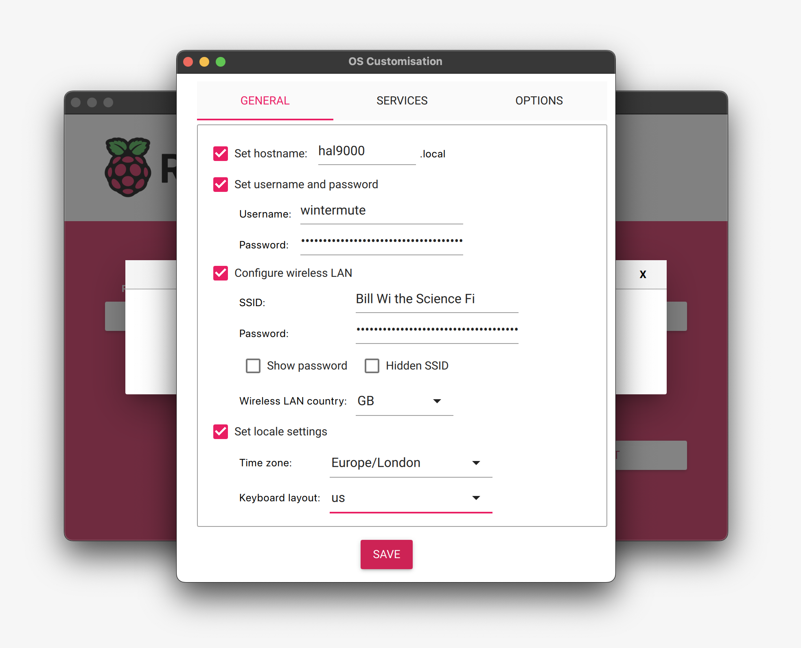

The **Services** tab includes settings to help you connect to your Raspberry Pi remotely.

If you plan to use your Raspberry Pi remotely over your network, check the box next to **Enable SSH**. You should enable this option if you plan to run a headless Raspberry Pi.

* Choose the **password authentication** option to SSH into your Raspberry Pi over the network using the username and password you provided in the general tab of OS customisation.

* Choose **Allow public-key authentication only** to preconfigure your Raspberry Pi for passwordless public-key SSH authentication using a private key from the computer you're currently using. If already have an RSA key in your SSH configuration, Imager uses that public key. If you don't, you can click **Run SSH-keygen** to generate a public/private key pair. Imager will use the newly-generated public key.

image::images/imager/os-customisation-services.png[alt="Services settings in the OS customisation menu."]

OS customisation also includes an **Options** menu that allows you to configure the behaviour of Imager during a write. These options allow you to play a noise when Imager finishes verifying an image, to automatically unmount storage media after verification, and to disable telemetry.

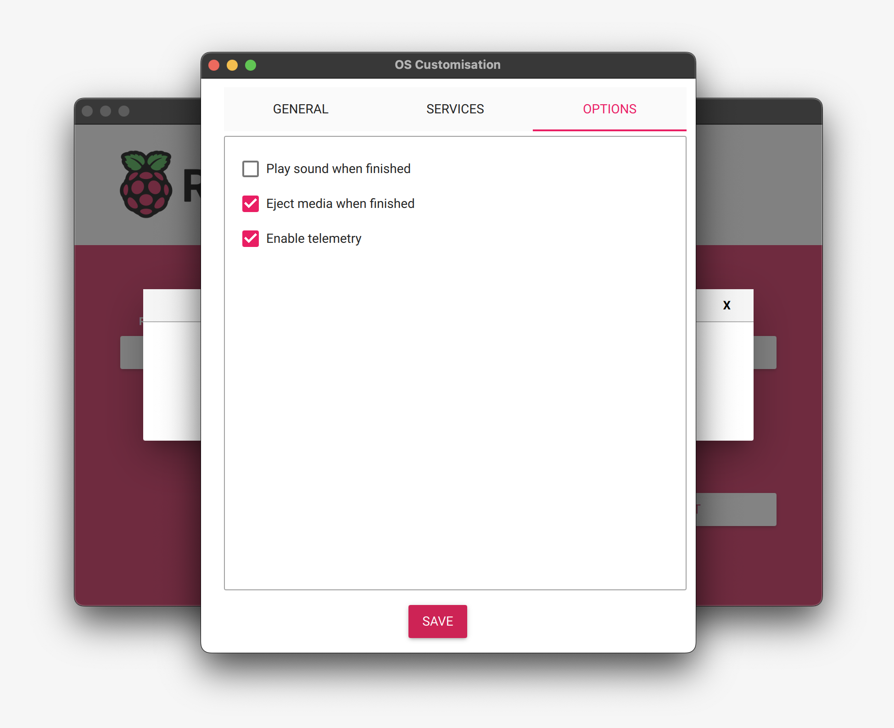

==== Write

When you've finished entering OS customisation settings, click **Save** to save your customisation.

Then, click **Yes** to apply OS customisation settings when you write the image to the storage device.

Finally, respond **Yes** to the "Are you sure you want to continue?" popup to begin writing data to the storage device.

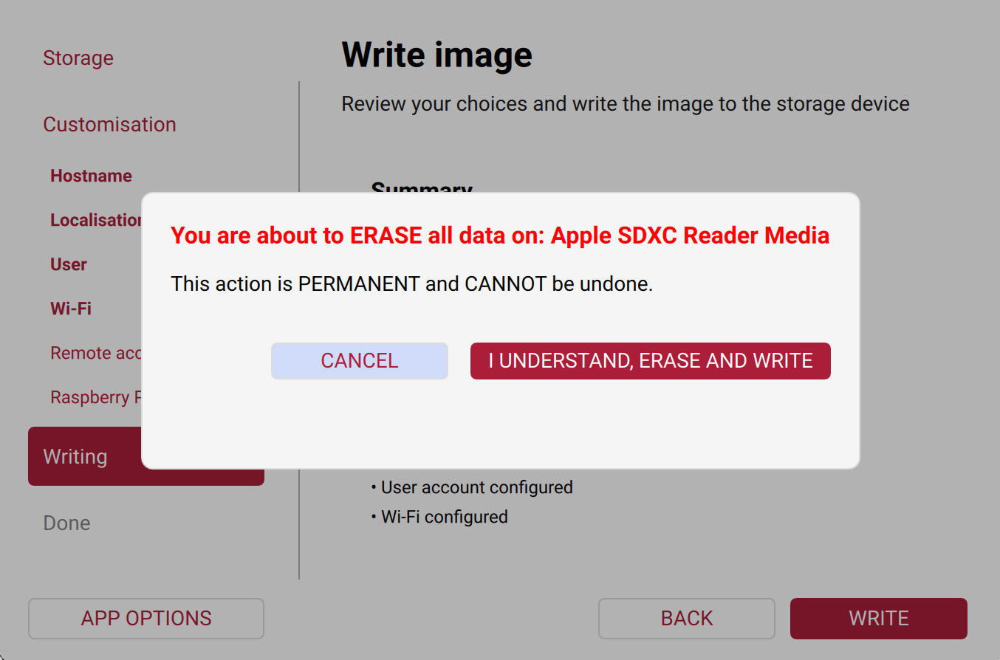

If you see an admin prompt asking for permissions to read and write to your storage medium, it's safe to proceed.

.Grab a cup of coffee or go for a walk. This could take a few minutes.
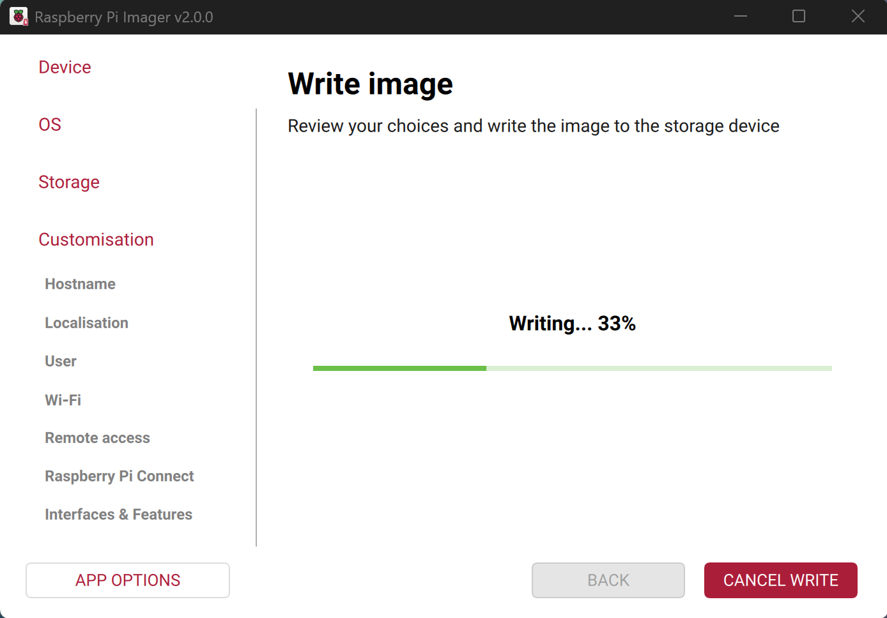

.If you want to live especially dangerously, you can click **cancel verify** to skip the verification process.
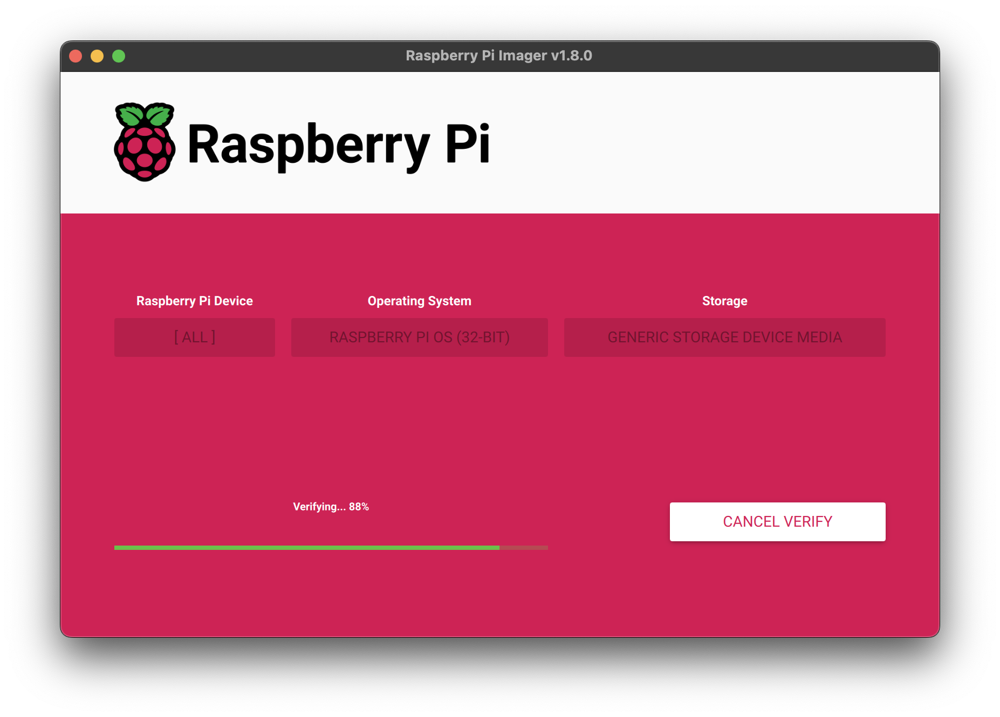

When you see the "Write Successful" popup, your image has been completely written and verified. You're now ready to boot a Raspberry Pi from the storage device!

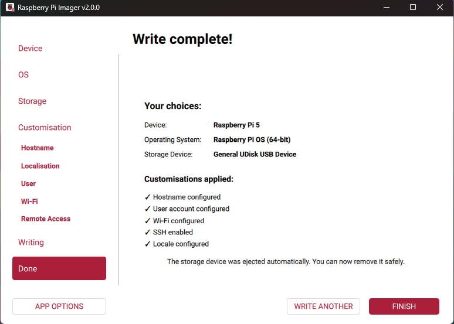

Next, proceed to the xref:getting-started.adoc#configuration-on-first-boot[first boot configuration instructions] to get your Raspberry Pi up and running.

=== Network Install

Network Install enables a Raspberry Pi to install an operating system on a storage device using a version of Raspberry Pi Imager downloaded over the network. With Network Install, you can get an operating system installed on your Raspberry Pi with no separate SD card reader and no computer other than your Raspberry Pi. You can run Network Install on any compatible storage device, including SD cards and USB storage.

Network Install only runs on Raspberry Pi 4, 400. If your Raspberry Pi runs an older bootloader, you may need to xref:raspberry-pi.adoc#update-the-bootloader[update the bootloader] to use Network Install.

IMPORTANT: Currently, Network Install is not available on Raspberry Pi 5. Support will be added in a future bootloader update.

////
TODO: Update this video for the new Imager look & flow video::b1SYVpM9lto[youtube]
////

Network Install requires the following:

* a compatible Raspberry Pi model running firmware that supports Network Install
* a monitor
* a keyboard
* a wired internet connection

To launch Network Install, power on your Raspberry Pi _while pressing and holding the **SHIFT** key_ in the following configuration:

* no bootable storage device
* attached keyboard
* attached compatible storage device, such as an SD card or USB storage

image::images/network-install-1.png[alt="The Network Install screen."]

If you haven't already connected your Raspberry Pi to the internet, connect it with an Ethernet cable.

image::images/network-install-2.png[alt="Starting Network Install."]

Once you're connected to the internet, your Raspberry Pi will download Raspberry Pi installer. If the download fails, you can repeat the process to try again.

image::images/network-install-3.png[alt="Downloading Imager using Network Install."]

Once you finish downloading Raspberry Pi Installer, your Raspberry Pi will automatically start Raspberry Pi Imager. For more information about running Raspberry Pi Imager, see xref:getting-started.adoc#installing-the-operating-system[install an operating system].

image::images/network-install-4.png[alt="Choose a storage device."]

For more information about Network Install configuration, see xref:raspberry-pi.adoc#http-boot[HTTP boot].
