[[installing-the-operating-system]]
== Install an operating system

To use your Raspberry Pi, you'll need an operating system. By default, Raspberry Pi devices check for an operating system on any SD card inserted in the SD card slot.

Depending on your Raspberry Pi model, you can also boot an operating system from other storage devices, including USB drives, storage connected through a HAT, and network storage.

To install an operating system on a storage device for your Raspberry Pi, you'll need:

* A computer you can use to image the storage device into a boot device
* A way to plug your storage device into that computer

Most Raspberry Pi users choose microSD cards as their boot device.

We recommend installing an operating system using xref:getting-started.adoc#raspberry-pi-imager[Raspberry Pi Imager].

If you have no other computer to write an image to a boot device, you may be able to install an operating system xref:getting-started.adoc#install-over-the-network[directly on your Raspberry Pi from the internet].

[[raspberry-pi-imager]]
=== Install using Imager

Raspberry Pi Imager is a tool, available on macOS, Windows, and Linux, that helps you download images and write them to a storage device. Imager includes many popular operating system images for Raspberry Pi. Imager also supports loading images downloaded directly from https://www.raspberrypi.com/software/operating-systems/[Raspberry Pi] or third-party vendors such as https://ubuntu.com/download/raspberry-pi[Ubuntu]. You can use Imager to preconfigure credentials and remote access settings for your Raspberry Pi.

Imager supports images packaged in the `.img` format as well as container formats like `.zip` or `.xz`.

////
TODO: Update this video for the new Imager look & flow (video::ntaXWS8Lk34[youtube,width=80%,height=400px])
////

==== Step 1. Install and launch Imager

Download Raspberry Pi Imager to your computer (Windows, Mac, or Linux):

. Install Imager in one of the following ways:
* On Windows and Mac, download the latest version from https://www.raspberrypi.com/software/[the Raspberry Pi website]. Run the installer.
* On Raspberry Pi OS, run `sudo apt install rpi-imager`.
* On other Linux OSes, download the latest version as an AppImage from https://www.raspberrypi.com/software/[the Raspberry Pi website]. Make the AppImage executable.

. Launch the Raspberry Pi Imager application in one of the following ways:
* Find it in your application menu.
* Select the Raspberry Pi Imager icon on your desktop.
* Run the AppImage file as root. For example, with the command: `sudo ./Raspberry_Pi_Imager-2.0.0-desktop-x86_64.AppImage`

==== Step 2. Configure the fundamentals

Tell Raspberry Pi Imager what combination of hardware and operating system you want to use:

. In the *Device* tab, select your Raspberry Pi model from the list. Select *Next*.
+
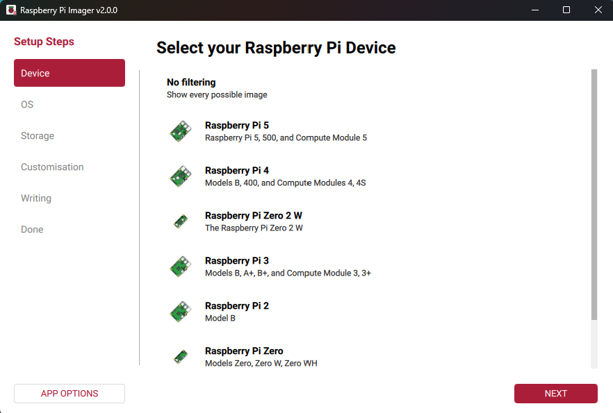

. In the *OS* tab, choose from the available operating systems. Select *Next*.
+
Imager shows the recommended version of Raspberry Pi OS for your device at the top of the list.
To install an operating system from an image on your computer, select the *Use Custom* option.
+
image::images/imager/choose-os.png[alt="Operating system selections in Imager.",width="80%"]

. Connect your preferred storage device to your computer. For example, plug a microSD card in using an external or built-in SD card reader.

. In the *Storage* tab, select the storage device to write the image to. Select *Next*.
+
image::images/imager/choose-storage.png[alt="Storage selection options in Imager.",width="80%"]
+
WARNING: If you have more than one storage device connected to your computer, _be sure to choose the correct device!_ You can often identify storage devices by size. If you're unsure, disconnect other devices until you've identified the device you want to image. Imager warns you if you attempt to overwrite a system drive on your computer.

[[advanced-options]]
==== Step 3. Customise your operating system

Raspberry Pi OS and some third-party operating systems support customisation. If you're installing one of these operating systems, you can use the next set of steps in Imager to customise it. These steps are optional and can be skipped by choosing *Skip customisation*. However, we strongly recommend that you set up your Raspberry Pi before first boot by using the customisation settings in Imager.

You can preconfigure:

* The device hostname
* The time zone
* Your keyboard layout
* A username and password
* Wi-Fi credentials
* Remote connectivity
* Raspberry Pi Connect

If you've already completed the customisation steps previously with Imager, the values you chose are pre-filled in the following steps.

If you don't configure your Raspberry Pi with these OS customisation settings, your operating system asks you for the same information after first boot. For Raspberry Pi OS, this first-boot configuration happens in the xref:getting-started.adoc#configuration-on-first-boot[configuration wizard].

. In the *Customisation > Hostname* tab, enter a host name for your Raspberry Pi that includes only letters, numbers, and hyphens. Select *Next*.
+
Your Raspberry Pi broadcasts this host name to the network using https://en.wikipedia.org/wiki/Multicast_DNS[mDNS]. When you connect your Raspberry Pi to your network, other devices on the network can communicate with your computer using `<hostname>.local` or `<hostname>.lan`.
+
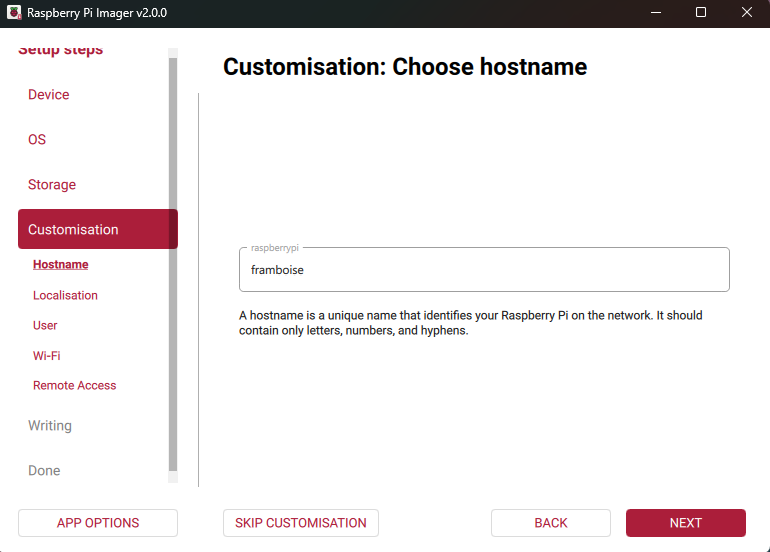

. In the *Customisation > Localisation* tab, choose your capital city. Imager autocompletes the time zone and keyboard layout for that city; you can change these settings. Select *Next*.
+
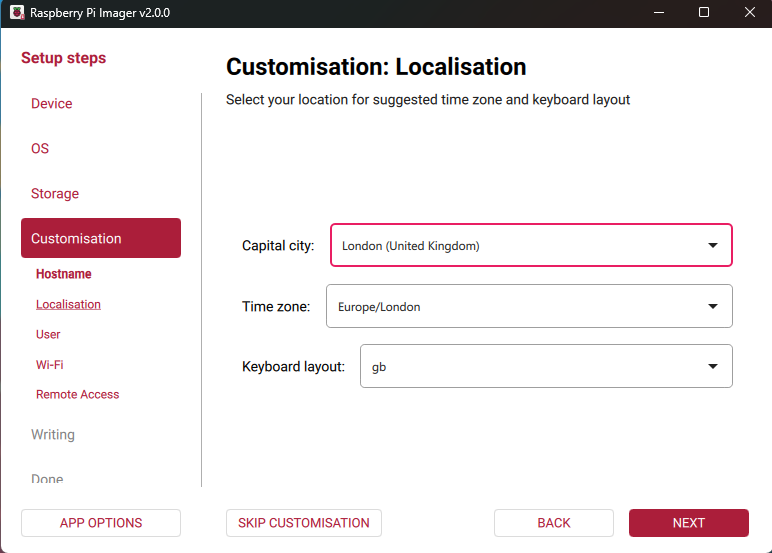

. In the *Customisation > User* tab, enter a username and password for the admin user of your Raspberry Pi. Select *Next*.
+
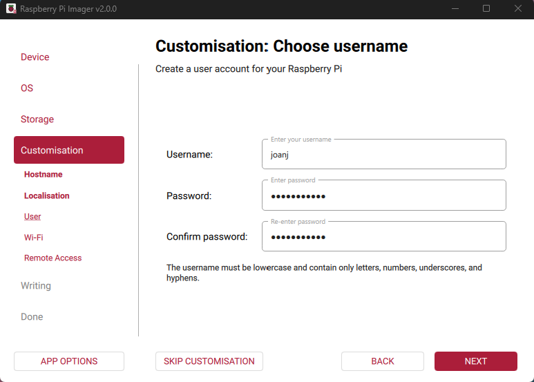

. In the *Customisation > Wi-Fi* tab, on first use, Imager pre-fills the SSID (name) and password of the Wi-Fi network you're currently connected to.
+
.. Select whether to connect to a *Secure network* or an *Open network*.
.. If there's no pre-filled information or if you want to change it, enter the SSID (name) of your wireless network. For secure networks, enter and confirm the password for the network.
.. If your network doesn't broadcast an SSID publicly, enable the *Hidden SSID* setting.
.. Select *Next*.
+
[.clearfix]
--
[.left]
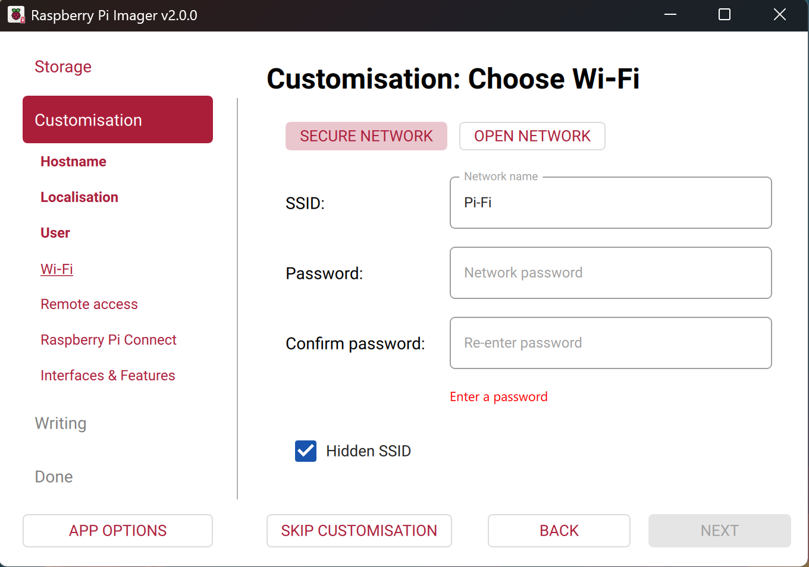
[.left]
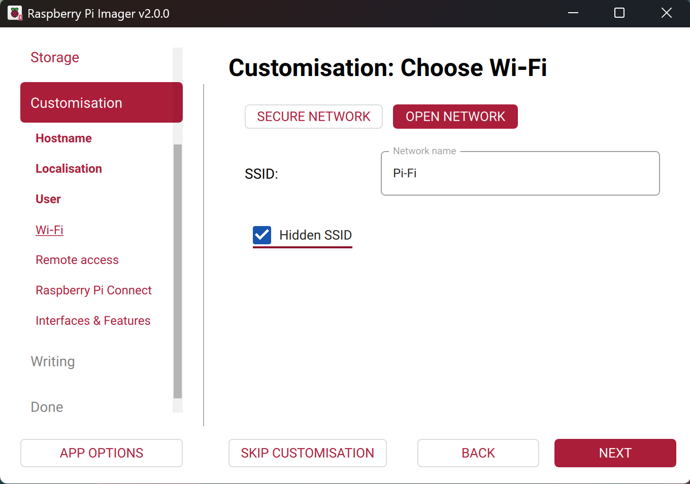
--

. In the *Customisation > Remote Access* tab, configure your SSH settings.
.. To use your Raspberry Pi remotely over your network, toggle the *Enable SSH* switch to the active position.
+
If you plan to run a headless Raspberry Pi, either enable this option or configure Raspberry Pi Connect for your device.
.. If you enable SSH, choose the authentication method to use:
* Choose *Use password authentication* to log in to your Raspberry Pi over the network using the username and password you provided in the *Customisation > User* tab.
* Choose *Use public key authentication* to configure your Raspberry Pi to use SSH key-based authentication. Imager shows a field to provide a public key.
If you already have a public RSA key in your SSH configuration, Imager uses that public key. If you don't, you can copy a public key in to Imager or browse to locate a public key file on your computer.
+
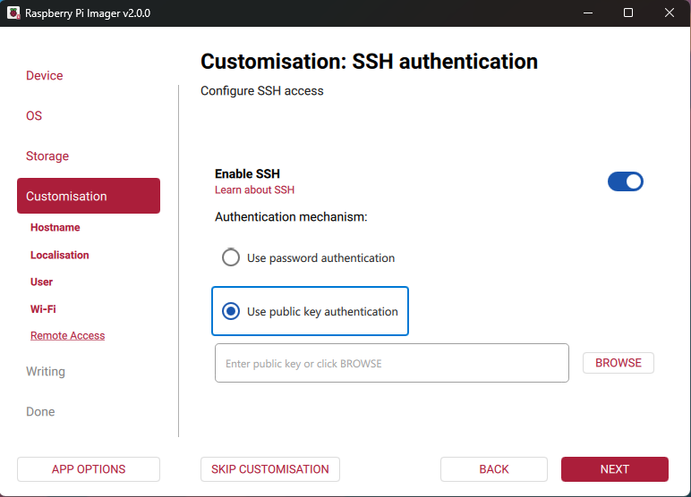

. Some operating systems now show the *Customisation > Raspberry Pi Connect* tab. To link your device to your xref:../services/connect.adoc[Raspberry Pi Connect account], complete the following steps:
.. Toggle the *Enable Raspberry Pi Connect* switch to the active position.
+
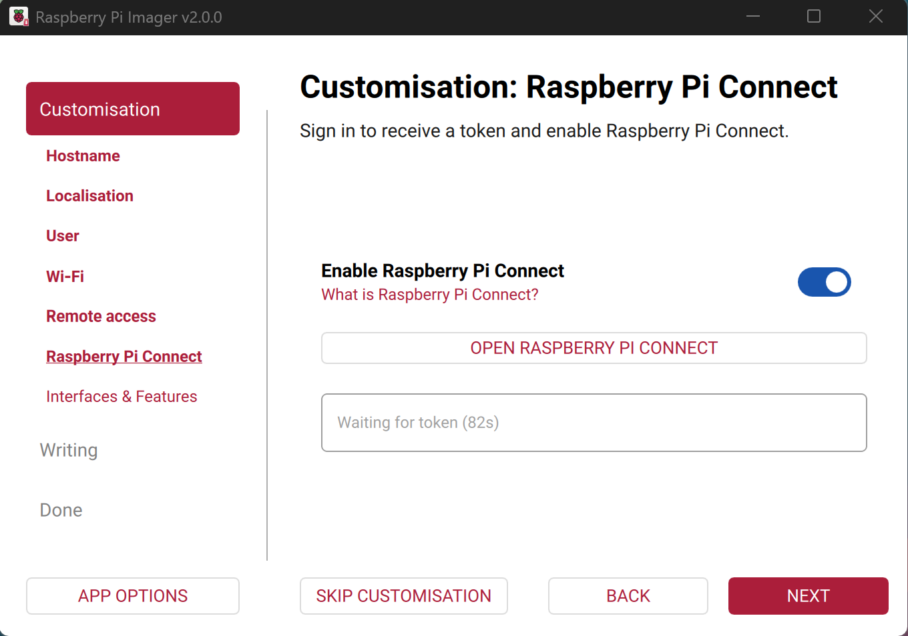
.. Select *Open Raspberry Pi Connect*. The Raspberry Pi Connect website opens in your default browser.
+
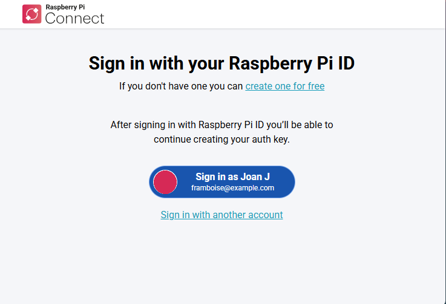
.. Sign in to your Raspberry Pi ID account or, if you don't yet have an account, sign up.
+
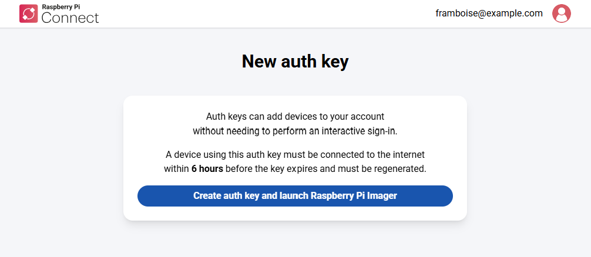
.. On the *New auth key* page, create your auth key.
+
The auth key is a single-use, temporary token. The Raspberry Pi Connect website displays how long after its creation the token expires. To use the token, ensure that you boot your Raspberry Pi and connect it to the internet before the expiry time.
+
*** If your Raspberry Pi ID account isn't a member of any organisations, select *Create auth key and launch Raspberry Pi Imager*.
*** If you are a member of one or more organisations, select the organisation or account to associate the key with. Then select *Create auth key and launch Raspberry Pi Imager*.
.. Your browser might ask you whether you want to allow the site to open Raspberry Pi Imager. Confirm that you want to open Raspberry Pi Imager.
+
Raspberry Pi Imager opens at the *Raspberry Pi Connect* tab. This tab shows a message to confirm that Imager received the authentication token from the browser and a field containing the token.
+
If the token isn't copied across, you can copy it into Imager manually. Open the *Having trouble?* section of the Raspberry Pi Connect web page, copy the token, and paste it into the token field in Imager.
+
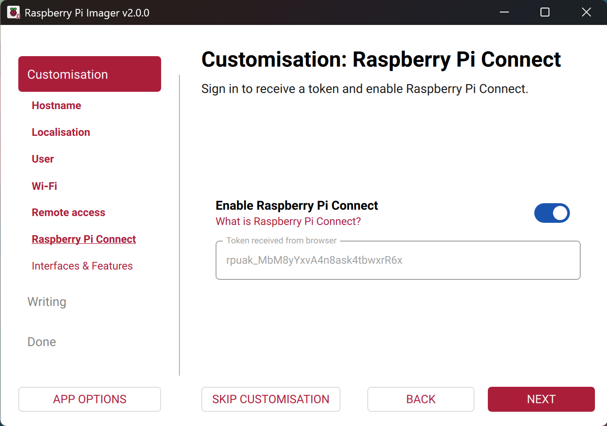
.. Select *Next*.

////
. Some device and operating system combinations now show the *Customisation > Interfaces & Features* tab. On this tab, you can enable the following features:
* Hardware interfaces needed to use your Raspberry Pi with certain peripherals, such as sensors, displays, network controllers, or embedded systems.
* USB Gadget Mode feature. For more information, see https://github.com/raspberrypi/rpi-usb-gadget?tab=readme-ov-file[Raspberry Pi USB Gadget].
+
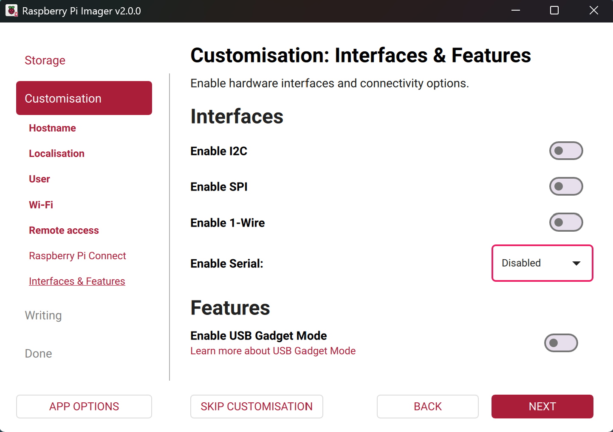
+
After choosing your options, select *Next*.
////

==== Step 4. Set the Imager options

You can choose to configure the behaviour of Imager during a write. Do this at any point before you write the image by selecting *App Options*.

In the *App Options* dialog box you can configure the following options:

* Whether Imager plays an alert sound when the write finishes.
* Whether Imager ejects the storage media when the write finishes.
* Whether Imager sends anonymous telemetry to us about your device and operating system. For more information, see https://github.com/raspberrypi/rpi-imager?tab=readme-ov-file#anonymous-metrics-telemetry[Anonymous metrics (telemetry)].
* Whether Imager shows warnings during the write process.

(Advanced users) The *App Options* dialog box also lets you set a custom repository to retrieve the operating system and devices list from. For more information, see xref:../computers/raspberry-pi.adoc#IMAGER_REPO_URL[Imager repo URL].

image::images/imager/app-options.png[alt="App Options dialog.",width="80%"]

==== Step 5. Write the image to the storage device

After you've gone through the tabs in Imager, it shows a summary page where you can review your choices.

. If you're happy with your choices and want to proceed, select *Write*.
+
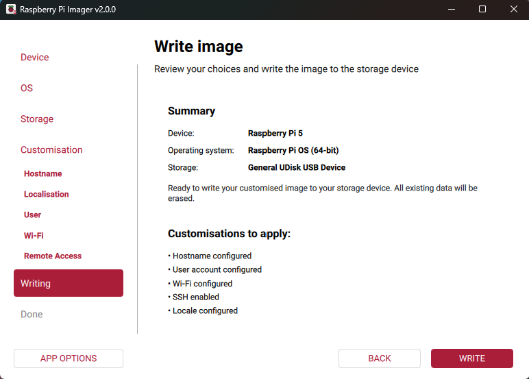

. Imager shows a prompt warning you that you're about to overwrite all data on your storage media. To continue, select *I understand, erase and write*.
+
If you see an admin prompt asking for permissions to read and write to your storage medium, grant Imager the permissions to proceed.
+
image::images/imager/are-you-sure.png[alt="Confirming a reimage of a storage device in Imager.",width="80%"]

Imager begins writing your image to the storage media. This can take a few minutes; grab a cup of coffee while you wait.

.Imager writes to the storage device.
image::images/imager/writing.png[alt="Writing an image to a device in Imager.",width="80%"]

After writing the image, Imager verifies that the image is correctly written. We recommend that you complete the verification step. However, if you want to cancel verification, select *Skip verification*.

.After writing the image, Imager verifies it.
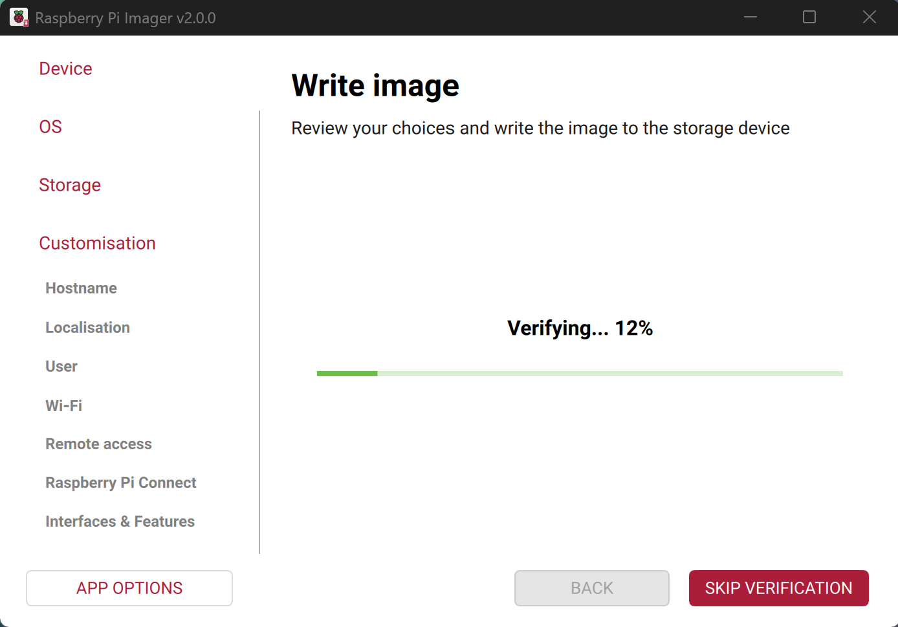

After the image is written and verified, Imager shows the *Done* tab. Select *Finish* to exit Imager.

.The imaging process is complete.
image::images/imager/finished.png[alt="The screen Imager shows when it finishes writing an image to a storage device.",width="80%"]

Next, proceed to the xref:getting-started.adoc#set-up-your-raspberry-pi[Set up your Raspberry Pi] section to get your Raspberry Pi up and running.

=== Install over the network

Network Install enables a Raspberry Pi to install an operating system on a storage device using a version of Raspberry Pi Imager downloaded over the network. With Network Install, you can get an operating system installed on your Raspberry Pi with no separate SD card reader and no computer other than your Raspberry Pi. You can run Network Install on any compatible storage device, including SD cards and USB storage.

Network Install only runs on Flagship models since Raspberry Pi 4B and Keyboard models. If your Raspberry Pi runs an older bootloader, you may need to xref:raspberry-pi.adoc#bootloader_update_stable[update the bootloader] to use Network Install.

////
TODO: Update this video for the new Imager look & flow video::b1SYVpM9lto[youtube,width=80%,height=400px]
////

Network Install requires the following:

* a compatible Raspberry Pi model running firmware that supports Network Install
* a monitor
* a keyboard
* a wired internet connection

To launch Network Install, power on your Raspberry Pi _while pressing and holding the *SHIFT* key_ in the following configuration:

* no bootable storage device
* attached keyboard
* attached compatible storage device, such as an SD card or USB storage

image::images/network-install-1.png[alt="The Network Install screen.",width="80%"]

If you haven't already connected your Raspberry Pi to the internet, connect it with an Ethernet cable.

image::images/network-install-2.png[alt="Starting Network Install.",width="80%"]

Once you're connected to the internet, your Raspberry Pi will download Raspberry Pi installer. If the download fails, you can repeat the process to try again.

image::images/network-install-3.png[alt="Downloading Imager using Network Install.",width="80%"]

Once you finish downloading Raspberry Pi Installer, your Raspberry Pi will automatically start Raspberry Pi Imager. For more information about running Raspberry Pi Imager, see xref:getting-started.adoc#installing-the-operating-system[install an operating system].

image::images/network-install-4.png[alt="Choose a storage device.",width="80%"]

For more information about Network Install configuration, see xref:raspberry-pi.adoc#http-boot[HTTP boot].
