[[install]]
== Install an OS onto boot media

To use your Raspberry Pi, you must first install (flash) an *operating system (OS)* onto your storage device, making it a boot device. By default, Raspberry Pi devices check for an OS on any SD card inserted into the SD card slot. Some Raspberry Pi models allow you to boot an OS from other storage devices, such as USB drives, storage connected through a HAT, and network storage. The following instructions assume that you're using a microSD card.

We recommend installing an OS to your storage device using *Raspberry Pi Imager* on another computer. For instructions, see <<imager-install>>. If you don't have access to another computer for writing an OS image to the storage device, you might be able to install an operating system directly on your Raspberry Pi from the internet. For instructions, see <<network-install>>.

=== Exceptions
Raspberry Pi 500 and some Raspberry Pi desktop and personal computer kits come with a microSD card that's pre-installed with Raspberry Pi OS. Raspberry Pi 500+ also includes an SSD with Raspberry Pi OS pre-installed. In these cases, you don't have to follow the installation instructions on this page. However, we recommend that you update the pre-installed OS to the latest version. For instructions, see xref:../computers/os.adoc#update-software[Update your current Raspberry Pi software].

If you want to reconfigure your Raspberry Pi, you can do so from the menu at the top of the display attached to your Raspberry Pi. For example, you can set or change your wireless network from the Wi-Fi icon in the top-right corner. For instructions, see xref:../computers/configuration.adoc#connect-to-wireless[Connect to a wireless network] in the *Configuration* page.

=== Prerequisites
To install an OS on a storage device, you need:

* A blank storage device to be your boot media, typically a microSD card. For more information, see xref:../computers/getting-started.adoc#boot-media[Boot media].
* A computer you can use to write the OS image onto your storage device so that your Raspberry Pi can boot from it.
* A way to plug your storage device into that computer.

[[imager-install]]
=== Install using Imager

Raspberry Pi Imager is a tool you use to download and write OS images for your Raspberry Pi on Mac, Windows, and Linux. 

Imager includes many popular OS images for Raspberry Pi devices, and supports loading images that have been manually downloaded from either https://www.raspberrypi.com/software/operating-systems/[Raspberry Pi] or third-party vendors such as https://ubuntu.com/download/raspberry-pi[Ubuntu]. 

During configuration with Imager, you can also preconfigure credentials and remote access settings for your Raspberry Pi device.

////
TODO: Update this video for the new Imager look & flow (video::ntaXWS8Lk34[youtube,width=80%,height=400px])
////

==== Step 1. Install and launch Imager

Download and install Raspberry Pi Imager on to your computer (Windows, Mac, or Linux).

. Install imager in of the following ways:
* On Windows and Mac, download the latest version from the https://www.raspberrypi.com/software/[Raspberry Pi website] and run the installer.
* On Raspberry Pi OS, run `sudo apt install rpi-imager`.
* On other Linux operating systems, download the latest version as an AppImage from the https://www.raspberrypi.com/software/[Raspberry Pi website] and make the AppImage executable.

. Launch the Raspberry Pi Imager application in one of the following ways:
* Find Imager in your *Applications* menu.
* Select the Raspberry Pi Imager icon on your computer's desktop.
* From the command line, run the AppImage file as root. For example, with the command: `sudo ./Raspberry_Pi_Imager-<version>-desktop-x86_64.AppImage`, where `<version>` is a number representing the most recent Imager version.

==== Step 2. Configure the fundamentals

Tell Raspberry Pi Imager what combination of hardware and OS you want to use:

. In the *Device* tab, select your Raspberry Pi model from the list and then select *Next*.
+
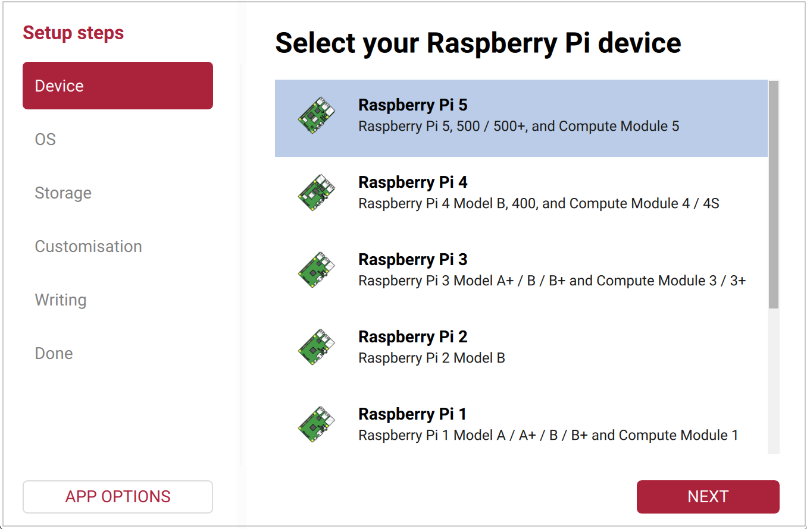

. In the *OS* tab, choose an operating system and then select *Next*.
+
You can either choose an existing OS to install (the recommended OS for your Raspberry Pi model is at the top of the list) or select *Use Custom* to install an OS from an image on your computer.
+
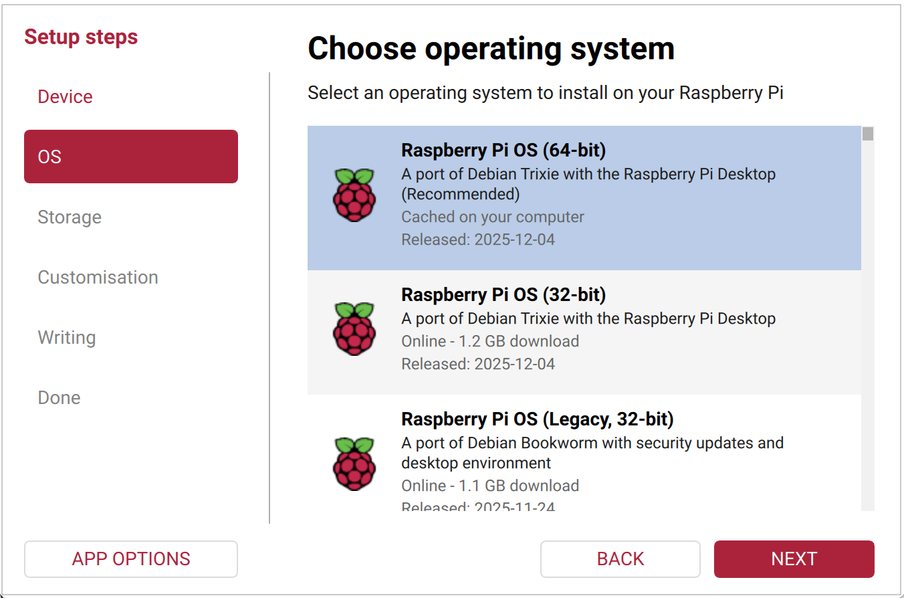

. Connect your storage device to your computer. For example, plug a microSD card into your computer using an external or built-in SD card reader.

. In the *Storage* tab, select your storage device and then select *Next*.
+
If you have more than one storage device connected to your computer, take care to choose the correct storage device. You can often identify the correct storage device by size. If you're unsure, disconnect the other devices until you've identified the device that you want to image.
+
If the OS you're writing is customisable, the *Customisation* tab opens.
+
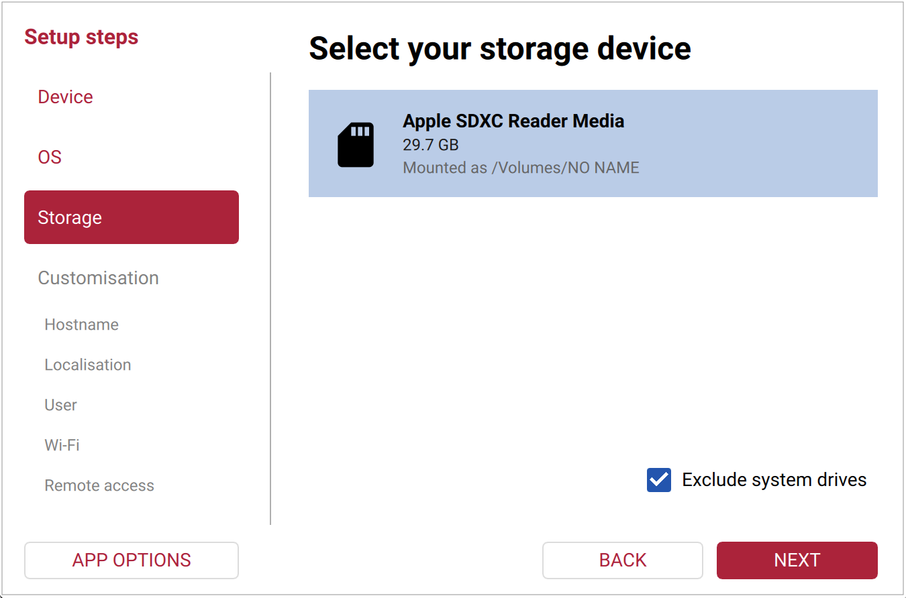
+
WARNING: We strongly recommend that you keep *Exclude system drives* selected. This prevents you from permanently erasing your data and rendering your host computer inoperable.

We recommend that you now follow the instructions in <<customisation>>. If you don't want to do this now, you're asked for the same information again at first boot. For Raspberry Pi OS, this first-boot configuration happens in the xref:getting-started.adoc#first-configuration[configuration wizard].

[[customisation]]
==== Step 3. Customise your operating system (recommended)

Raspberry Pi OS and some third-party operating systems support customisation.

We strongly recommend that you set up your Raspberry Pi now, but you can skip this by choosing *Skip customisation*.

If you don't configure your Raspberry Pi now, the OS asks you for the same information after first boot.

If you're installing an OS that supports customisation, you can preconfigure:

. The device hostname
. The time zone
. A username and password
. Wi-Fi credentials
. Remote connectivity
. Raspberry Pi Connect
+
If you've already completed the customisation steps with Imager, the values for some of these settings might already be filled in.

To customise your operating system, open the *Customisation* tab of Imager and then follow the instructions for each of the following subtabs:

===== Hostname

In the *Hostname* subtab, enter a name for your Raspberry Pi that includes only letters, numbers, and hyphens, then select *Next*.

Your Raspberry Pi broadcasts this hostname to the network using https://en.wikipedia.org/wiki/Multicast_DNS[mDNS]. When you connect your Raspberry Pi to your network, other devices on that network can communicate with your Raspberry Pi using `<hostname>.local` or `<hostname>.lan`.

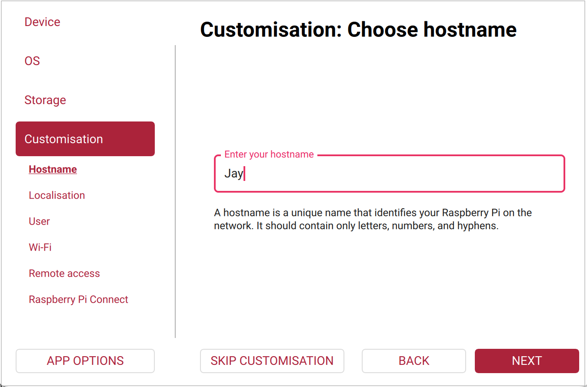

===== Localisation

In the *Localisation* subtab, choose your capital city. Imager autocompletes the time zone and keyboard layout for that city. You can also change these settings independtly of one another.

Your selection also sets the Wi-Fi regulatory domain; the regulatory domain always corresponds to the selected capital city.

When you're done, select *Next*.

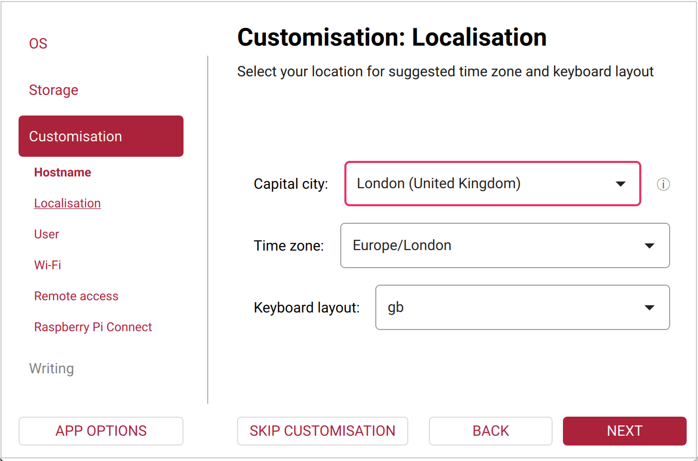

===== User
In the *User* subtab, enter a username and password for the admin user of your Raspberry Pi, then select *Next*.

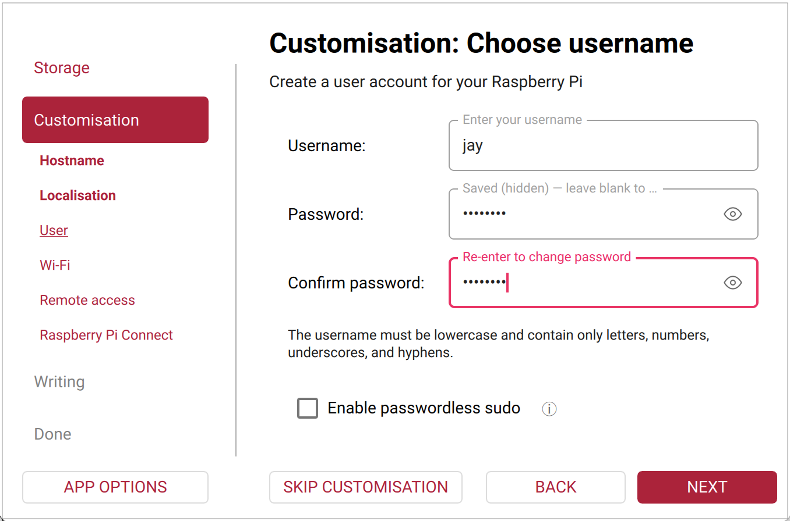

The username must be lowercase and contain only letters, numbers, underscores, and hyphens.

* For a headless setup, your Raspberry Pi uses these credentials to connect to the network on first boot.
* By default, the password you set here is required when running `sudo` commands. If you prefer not to enter a password for these commands, you can turn off this requirement by deselecting *Enable passwordless sudo*. You can also turn this off later. For instructions, see xref:../computers/configuration.adoc#disable-sudo-password[Turn off password for superuser commands] in the *Configuration* page.

Creating a username and password at this stage doesn't require these credentials to be entered whenever you boot your Raspberry Pi. To require a password on boot, turn off Auto Login. For instructions, see xref:../computers/configuration.adoc#auto-login[Require a password from startup].

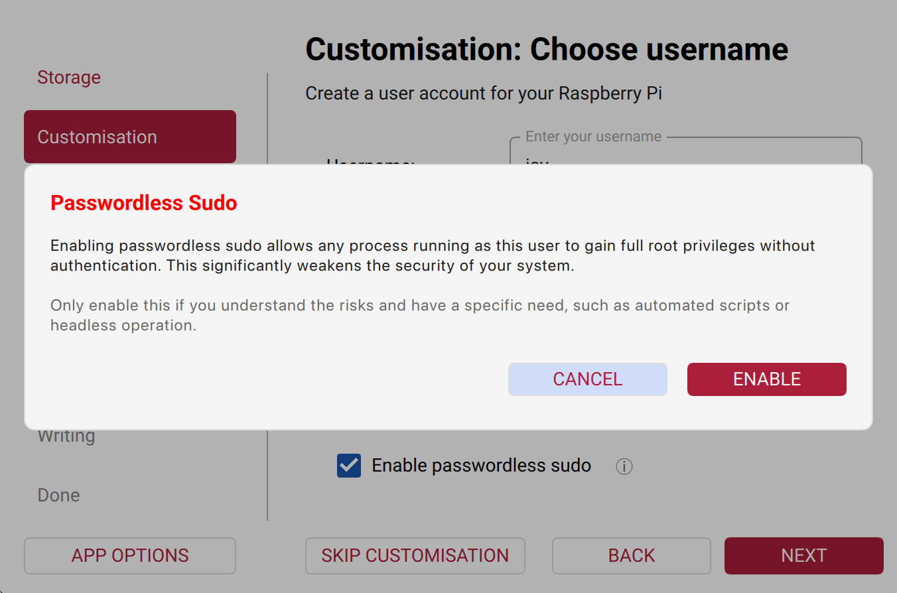

===== Wi-Fi
In the *Wi-Fi* subtab, select whether to connect to a *secure network* or an *open network*. Before this, if you're on a Mac computer, you might be asked whether you'd like to pre-fill the Wi-Fi password from the system keychain. Confirm whether you want to do this and sign in with your Mac computer credentials.

On first use, Imager typically pre-fills the SSID (name) and password of the Wi-Fi network you're currently connected to. If there's no pre-filled information, or if you want to change it, enter the SSID of the appropriate wireless network. For secure networks, enter and confirm the password for the network. If your network doesn't broadcast an SSID publicly, enable the *Hidden SSID* setting so that your OS can find it. Select *Next* when you're done.

If you're setting up a headless Raspberry Pi, it's important that you set up your Wi-Fi connection now because your Raspberry Pi needs to know how to get online the moment it boots.

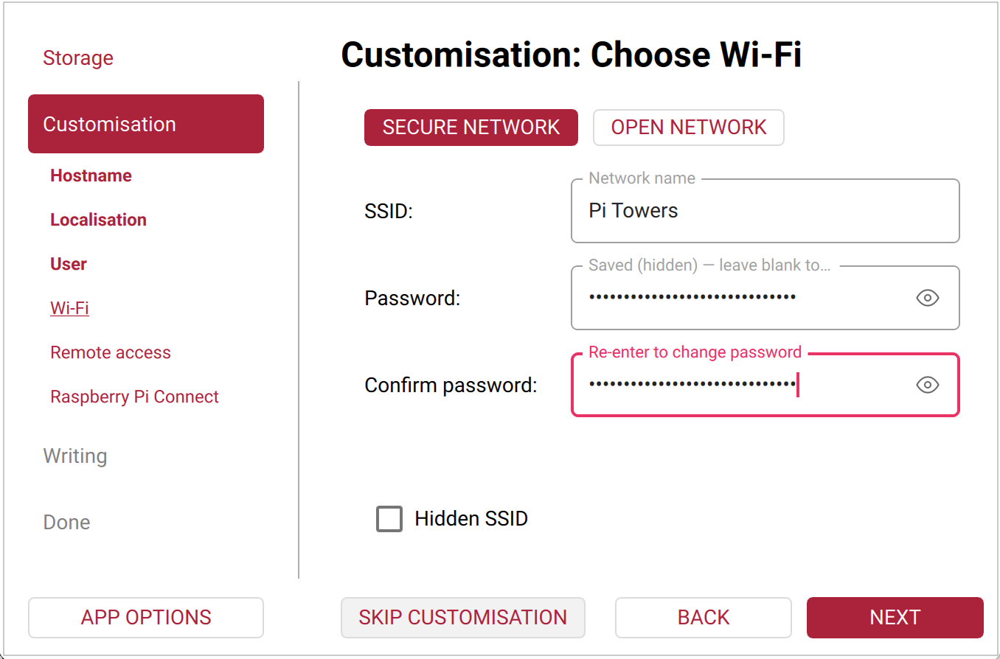

===== Remote Access
In the *Remote Access* subtab, configure your SSH settings and then select *Next*.

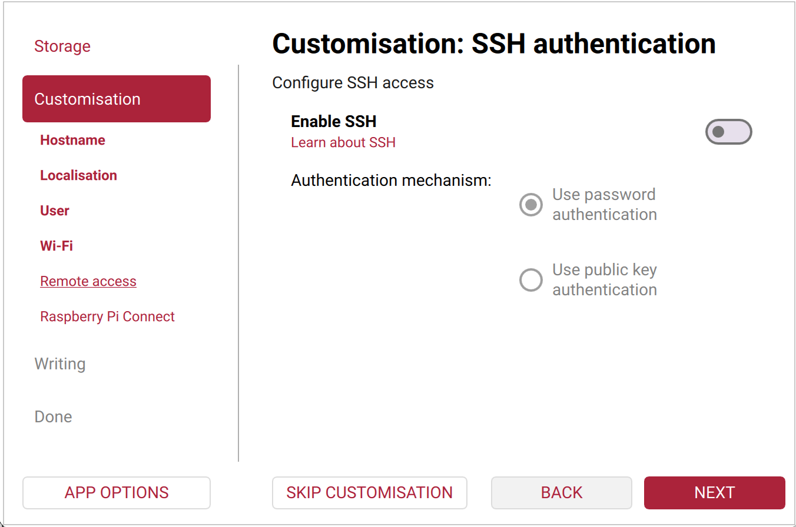

To use your Raspberry Pi remotely over your network, turn on *Enable SSH* using the corresponding toggle.

If you plan to run a headless Raspberry Pi (rather than using it like a desktop computer), you can either turn on SSH, or configure *Raspberry Pi Connect* for your device.

If you enable SSH, choose one of the following authentication methods:

* *Use password authentication*: To sign in to your Raspberry Pi over the network using the username and password you provided in the *Customisation > User* tab.
* *Use public key authentication*: To configure your Raspberry Pi to use SSH key-based authentication. Imager reveals a field to provide a public key. If you already have a public RSA key in your SSH configuration, Imager uses that public key. If you don't you can copy a public key into Imager or select *Browse* to locate a public key file on your computer.

===== Raspberry Pi Connect
Some operating systems also show the *Raspberry Pi Connect* subtab. To link your device to your Raspberry Pi Connect account, complete the following steps:

. Use the toggle to turn on *Enable Raspberry Pi Connect*.
+
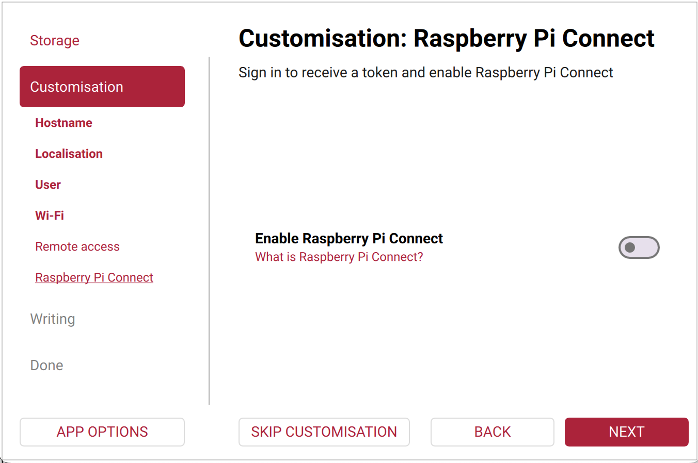
. Select *Open Raspberry Pi Connect*. This opens Raspberry Pi Connect in your default web browser.
+
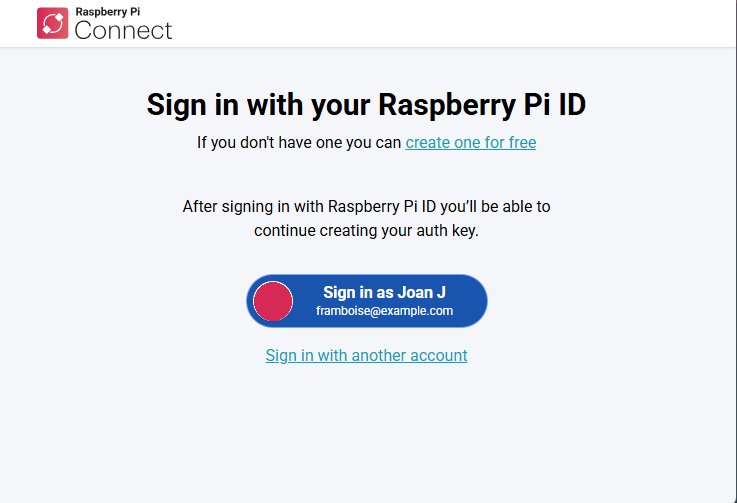
. Sign in to your Raspberry Pi ID account or, if you don't have an account yet, sign up.
. In the *New auth key* page, create your auth key. This is a single-use, temporary token. The Raspberry Pi Connect website displays how long after its creation the token expires. To use the token, boot your Raspberry Pi and connect it to the internet before the expiry time.
+
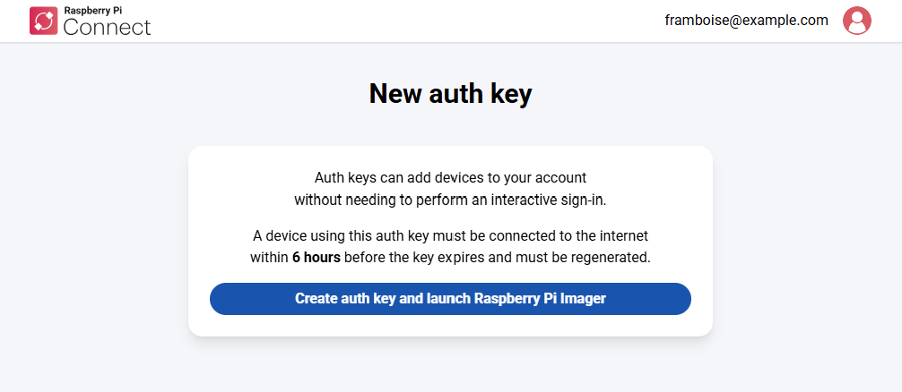
** If you're a member of one or more organisations, select the organisation or account to associate the key with. Then select *Create auth key and launch Raspberry Pi Imager*. 
** If you're a member of one or more organisations, select the organisation or account to associate the key with. Then select Create auth key and launch Raspberry Pi Imager.
. Your browser might ask you whether you want to allow the site to open Raspberry Pi Imager. Confirm that you want to open Raspberry Pi Imager.
** Imager opens at the *Raspberry Pi Connect* tab, which shows a message to confirm that Imager received the authentication token from the browser and a field containing the token.
** If the token isn't copied across, you can copy it into Imager manually. Open the *Having trouble?* section of the Raspberry Pi Connect web page, copy the token, and paste it into the token field in Imager.
. Select *Next* to continue.

////
. Some device and operating system combinations now show the *Customisation > Interfaces & Features* tab. On this tab, you can enable the following features:
* Hardware interfaces needed to use your Raspberry Pi with certain peripherals, such as sensors, displays, network controllers, or embedded systems.
* USB Gadget Mode feature. For more information, see https://github.com/raspberrypi/rpi-usb-gadget?tab=readme-ov-file[Raspberry Pi USB Gadget].
+
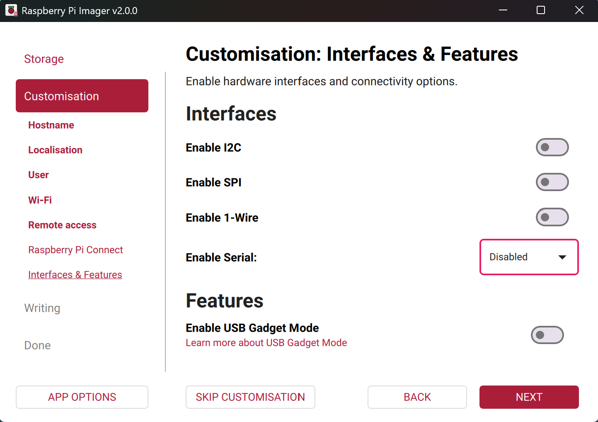
+
After choosing your options, select *Next*.
////

==== Step 4. Set Imager options
You can choose to configure the behaviour of Imager during a write. Select *App Options* in the bottom-left corner of Imager and then use the toggles next to each of the following options in the App Options window to turn them on or off:

* *Play sound when finished* configures Imager to play an alert sound when the write finishes.
* *Eject media when finished* configures Imager to automatically unmount the storage device when the write finishes.
* *Enable anonymous statistics telemetry* configures Imager to send anonymous usage statistics about your device and operating system. For more information, see https://github.com/raspberrypi/rpi-imager?tab=readme-ov-file#anonymous-metrics-telemetry[Anonymous metrics (telemetry)].
* *Disable warnings* configures Imager to suppress warning messages during the write process.

Advanced users can also set a custom *Content Repository* to retrieve the operating system and devices list from. For more information, see xref:../computers/raspberry-pi.adoc#IMAGER_REPO_URL[Imager repo URL].

Select *Save* in the bottom-right corner of the *App Options* window when you're done.

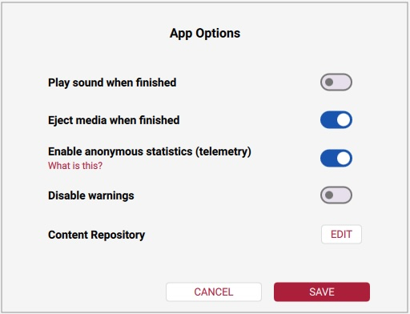

==== Step 5. Write the image to the storage device

After you've gone through the tabs in Imager, you can review a *Summary* of your choices in the *Writing* tab.

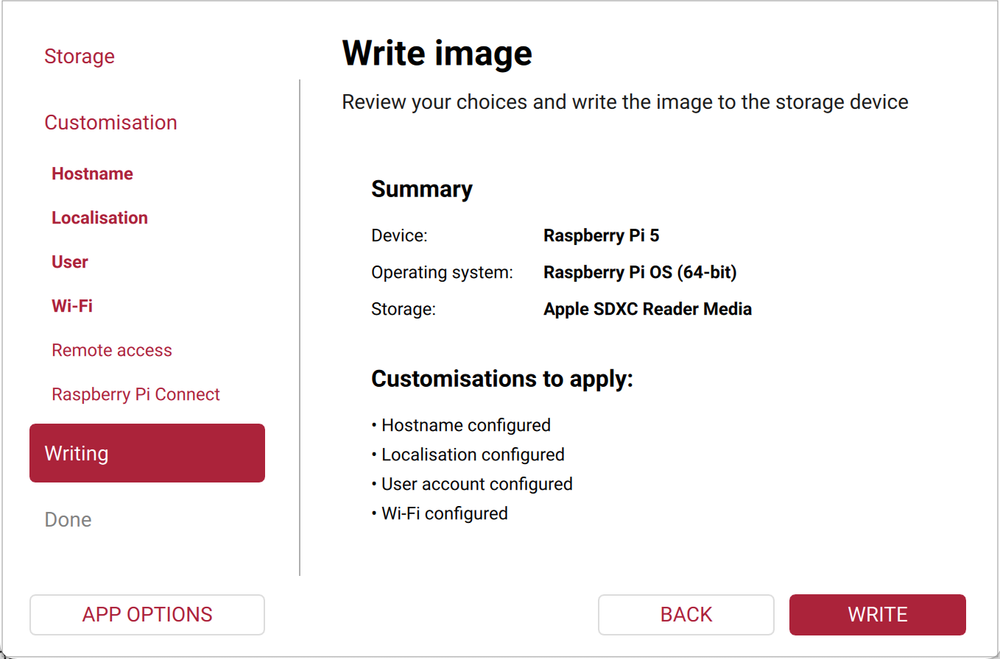

If you're happy with your choices and want to proceed:

. Select *Write* in the bottom-right corner of Imager.
. Imager shows a prompt warning you that you're about to overwrite all data on your storage media. To continue, select *I understand, erase and write*. If you see an admin prompt asking for permissions to read and write to your storage medium, grant Imager the permissions to proceed.
+
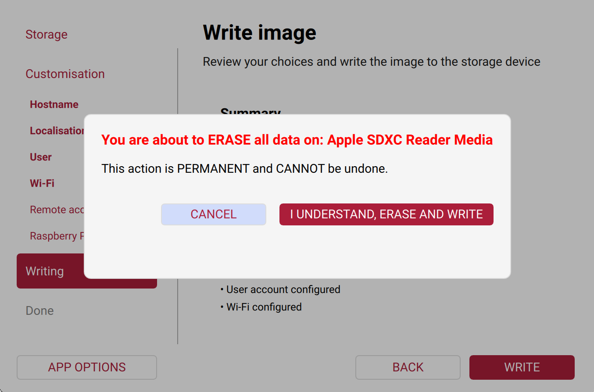
. Imager begins writing your image to the storage device. This can take a few minutes.
. After writing the image, Imager verifies that the image is correctly written. This can also take a few minutes. We recommend that you complete the verification step. However, if you want to cancel verification, select *Skip verification*.
. After the image is written and verified, Imager shows the *Done* tab. Select *Finish* to exit Imager.

You can now follow the instructions for either the xref:getting-started.adoc#desktop-setup[Standard (desktop) setup] or the xref:getting-started.adoc#headless-setup[Headless (remote) setup] to get your Raspberry Pi started according to your needs.

[[network-install]]
=== Install over the network
You can install an OS onto a storage device using a version of Raspberry Pi Imager downloaded over the network. With *Network Install*, you don't need a separate SD card reader or computer other than your Raspberry Pi. You can run Network Install on any compatible storage device including SD cards and USB storage.

If your Raspberry Pi runs an older bootloader, you might need to update the bootloader to use Network Install. For instructions, see xref:../computers/configuration.adoc#update-bootloader-version[Update the bootloader] in the *Configuration* page.

////
TODO: Update this video for the new Imager look & flow video::b1SYVpM9lto[youtube,width=80%,height=400px]
////

==== Prerequisites
Network Install requires the following:

* A compatible Raspberry Pi model running firmware that supports *Network Install*. Network Install only runs on flagship models since Raspberry Pi 4B and Raspberry Pi keyboard computers (400, 500, and 500+).
* A monitor and keyboard physically connected to your Raspberry Pi device.
* A wired internet connection.
* A blank, compatible storage device, such as an SD card or USB drive, attached to your Raspberry Pi device. This is the destination that Network Install writes the OS image to. If the storage device already has an OS (or any bootable system) installed, and if you don't hold down the *Shift* key, your Raspberry Pi boots normally instead of entering into Network Install.

==== Launch Network Install

. Connect a monitor and keyboard to your Raspberry Pi device, then either:
.. Connect a blank (non-bootable) storage device, such as an SD card or USB drive, to your Raspberry Pi device, 
+
or
+
.. Hold down the *Shift* key on the keyboard connected to your Raspberry Pi whilst powering on your Raspberry Pi.
+
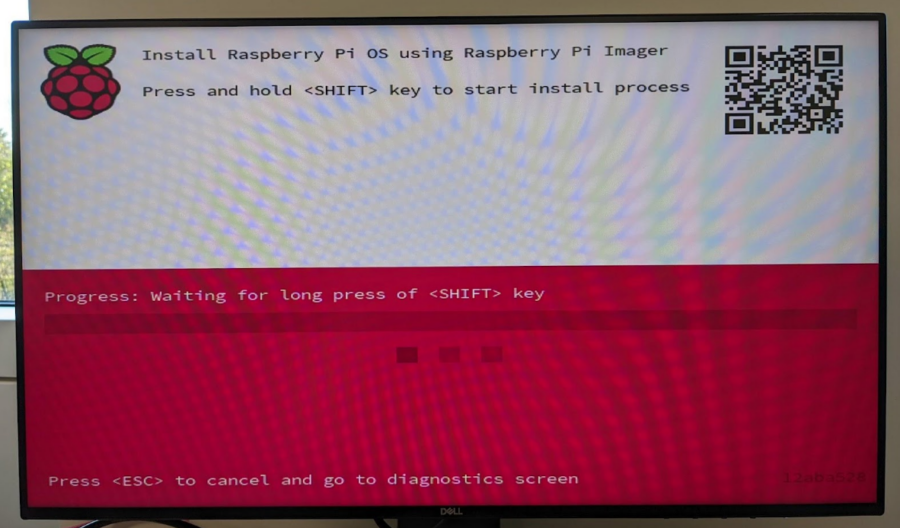
. If not already connected, connect your Raspberry Pi to the internet using an Ethernet cable. When you're connected to the internet, Raspberry Pi downloads the Raspberry Pi installer. If the download fails, repeat the process from the previous step to try again.
+
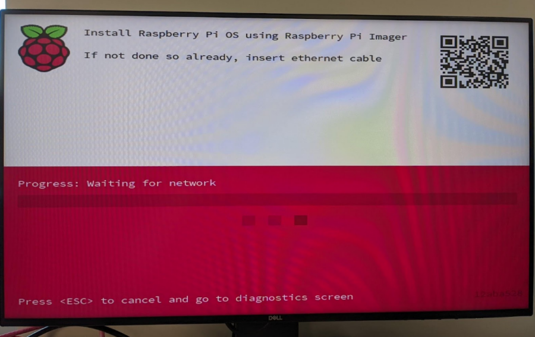
. Wait for the installer to download.
+
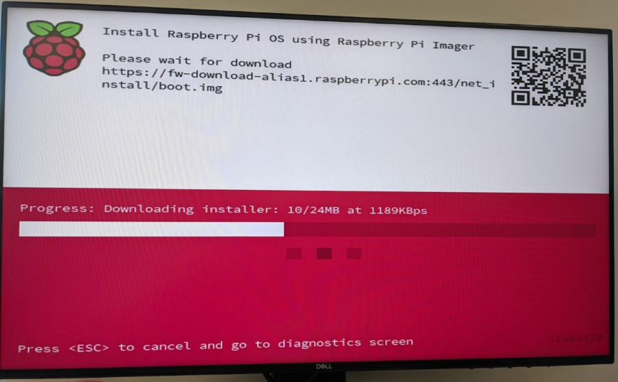
. When Raspberry Pi installer finishes downloading, your Raspberry Pi automatically loads Raspberry Pi Imager. Follow the instructions in <<imager-install>>.
+
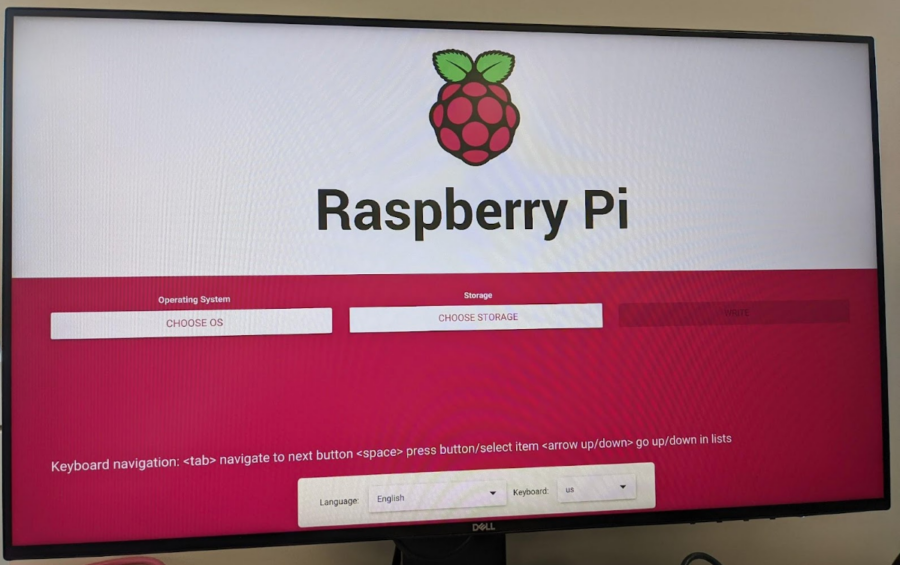

For more information about Network Install configuration, see xref:raspberry-pi.adoc#http-boot[HTTP boot].