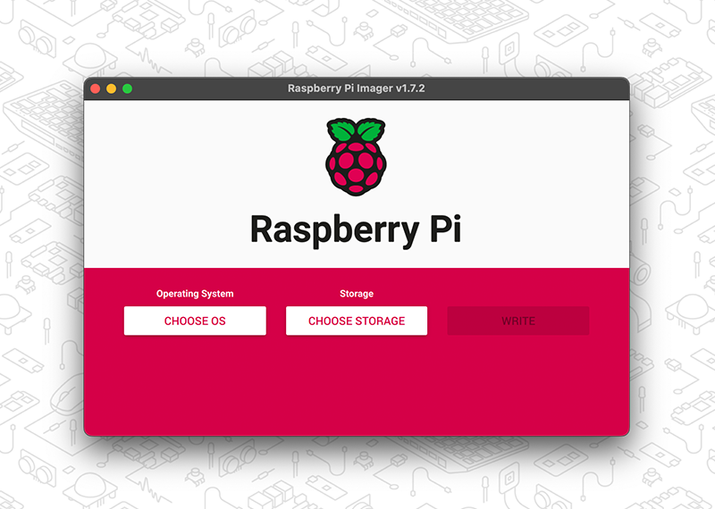
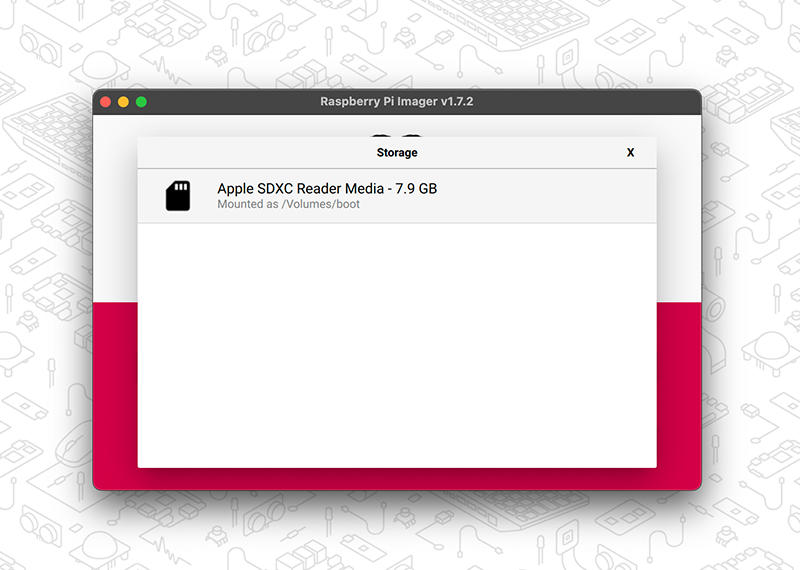
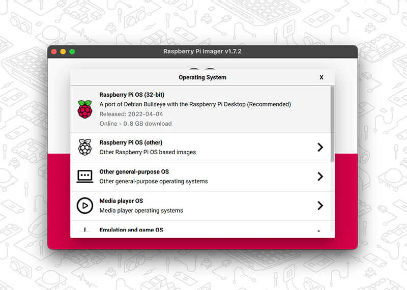

== Installing the Operating System

We recommend using the https://www.raspberrypi.com/software/[Raspberry Pi Imager] to install an operating system on to your SD card. You will need another computer with an SD card reader to install the image. Raspberry Pi Imager can be run on another Raspberry Pi, but also works on Microsoft Windows, Apple macOS, and Linux.

NOTE: Before you start, don't forget to check the xref:getting-started.adoc#sd-cards[SD card requirements].

IMPORTANT: NOOBS (New Out Of the Box Software) was an SD card-based installer for Raspberry Pi computers; we no longer recommend or support using NOOBS. Going forward, please use Raspberry Pi Imager.

=== Using Raspberry Pi Imager

Raspberry Pi offers a free SD card writing tool that works on Mac OS, Ubuntu for x86, Windows, and Raspberry Pi OS called https://www.raspberrypi.com/software/[Raspberry Pi Imager]. This is the easiest installation option for most users since it will download the image automatically and install it to the SD card.

video::ntaXWS8Lk34[youtube]

Download and install the latest version of https://www.raspberrypi.com/software/[Raspberry Pi Imager]. If you want to use Raspberry Pi Imager from a second Raspberry Pi, you can install it from a terminal using `sudo apt install rpi-imager`.

After starting the Raspberry Pi Imager, connect your micro SD card to your computer using an external or built-in SD card reader. If you have more than one mountable storage device connected to your computer, make sure you choose the correct card. 

Next, select the OS you want to install. The current recommended version of Raspberry Pi OS is always at the top of the list.

Review your selections and click *Write* to begin writing data to the SD Card. An admin prompt may display at this point. This is expected behavior and it's safe to continue.

Optionally, you can click the cog wheel icon to open the <<Advanced options>> menu.

NOTE: If using Raspberry Pi Imager on Windows 10 with controlled folder access enabled, you will need to explicitly allow Raspberry Pi Imager permission to write to the SD card. If this is not done, the imaging process will fail with a "failed to write" error.

After the Raspberry Pi OS installation is complete, insert the micro SD card into your Raspberry Pi and connect your monitor, mouse, and keyboard. Finally, connect the power supply to your Raspberry Pi. This should always be the last thing you connect to your device.

The first time your Raspberry Pi boots, a xref:getting-started.adoc#configuration-on-first-boot[configuration wizard] will run so you can set up your Raspberry Pi.

NOTE: Current versions of the Raspberry Pi OS no longer have a default user name and password (`pi` and `raspberry`, respectively). If you are using an older version of the operating system, or are working with an existing installation, these defaults may be present. If you have not already done so, you should change the default password straight away to keep your Raspberry Pi xref:configuration.adoc#securing-your-raspberry-pi[secure].

==== Advanced options

After you have selected the operating system to install, a cog wheel will appear allowing you to open the advanced options menu if it is supported by the operating system. This menu lets you carry out tasks like enabling SSH, or setting your Raspberry Pi's hostname, and configuring the default user before first boot. You can also use this menu to set up a a xref:configuration.adoc#setting-up-a-headless-raspberry-pi[headless] Raspberry Pi.

image::images/rpi_imager_2.png[width="80%"]

If you're using an older version of Raspberry Pi Imager, press `Ctrl-Shift-X` to open the advanced options menu.

NOTE: Using the advanced options to configure your installation will skip the xref:getting-started.adoc#configuration-on-first-boot[configuration wizard] that normally runs on first boot.

WARNING: If you are installing Raspberry Pi OS Lite to run xref:configuration.adoc#setting-up-a-headless-raspberry-pi[headless], you need to create a new user account using the advanced options since you will not have access to the configuration wizard.

=== Downloading an Image

Other software designed to write an operating system to an SD card usually requires you to download the system image first. Official images for Raspberry Pi operating systems are available to download from the Raspberry Pi website https://www.raspberrypi.com/software/operating-systems/#raspberry-pi-os-32-bit[downloads page]. Alternative and unofficial operating systems for Raspberry Pi computers are available from some third-party vendors.

You may need to unzip the downloaded file (`.zip`) to get the image file (`.img`) you need to write to the card.

[NOTE]
====
Raspberry Pi OS with desktop Zip archives are over 4GB in size and use the https://en.wikipedia.org/wiki/Zip_%28file_format%29#ZIP64[ZIP64] format. To uncompress the archive, you need one of the following tools that support ZIP64:

* http://www.7-zip.org/[7-Zip] for Windows.
* http://unarchiver.c3.cx/unarchiver[The Unarchiver] for macOS.
* https://linux.die.net/man/1/unzip[unzip] on Linux.
====