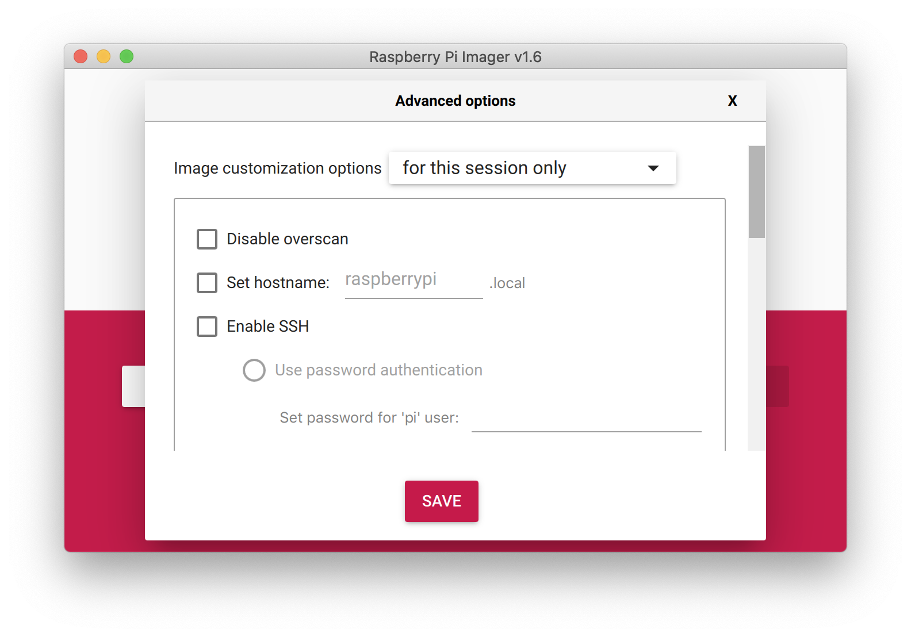
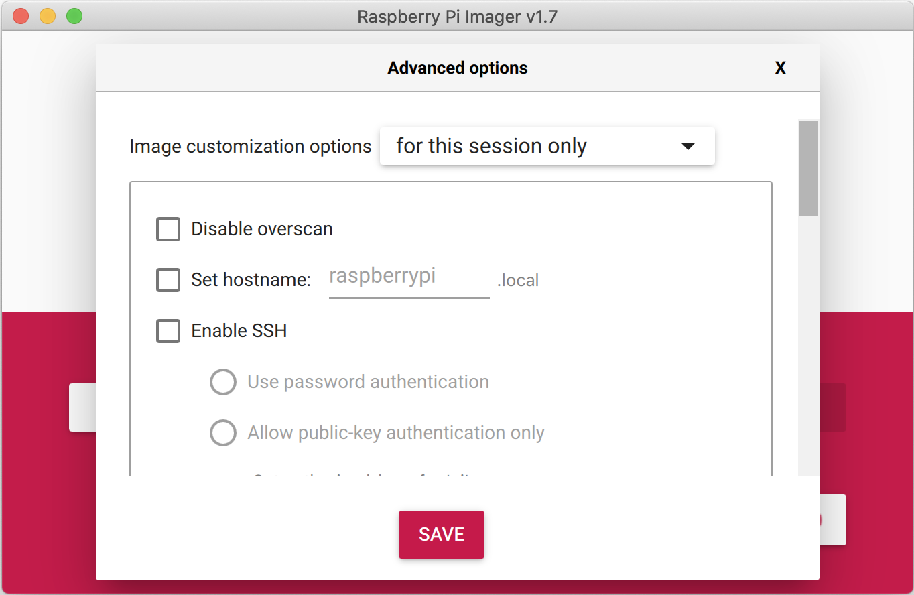

== Installing the Operating System

Raspberry Pi recommend the use of https://www.raspberrypi.com/software/[Raspberry Pi Imager] to install an operating system on your SD card. You will need another computer with an SD card reader to install the image.

NOTE: Before you start, don't forget to check the xref:getting-started.adoc#sd-cards[SD card requirements].

IMPORTANT: NOOBS, or New Out Of the Box Software to give it its full name, was an SD card-based installer for Raspberry Pi computers; we no longer recommend or support using NOOBS. Going forward, please use Raspberry Pi Imager.

=== Using Raspberry Pi Imager

Raspberry Pi have developed a graphical SD card writing tool that works on Mac OS, Ubuntu 18.04, and Windows called https://www.raspberrypi.com/software/[Raspberry Pi Imager]; this is the easiest option for most users since it will download the image automatically and install it to the SD card.

video::ntaXWS8Lk34[youtube]

Download the latest version of https://www.raspberrypi.com/software/[Raspberry Pi Imager] and install it. If you want to use Raspberry Pi Imager from a second Raspberry Pi, you can install it from a terminal using `sudo apt install rpi-imager`. Then:

* Connect an SD card reader with the SD card inside.
* Open Raspberry Pi Imager and choose the required OS from the list presented.
* Choose  the SD card you wish to write your image to.
* Review your selections and click on the `Write` button to begin writing data to the SD Card.

NOTE: If using Raspberry Pi Imager on Windows 10 with controlled folder access enabled, you will need to explicitly allow Raspberry Pi Imager permission to write the SD card. If this is not done, the imaging process will fail with a "failed to write" error.

NOTE: You can see which operating systems are most often downloaded, on our https://rpi-imager-stats.raspberrypi.com/[statistics page].

You can now insert the SD card into the Raspberry Pi and power it up. For Raspberry Pi OS, if you need to manually log in, the default user name is `pi`, with password `raspberry`, and the default keyboard layout is set to https://datasheets.raspberrypi.com/keyboard-mouse/UK-layout.png[United Kingdom (UK)].

You should change the default password straight away to ensure your Raspberry Pi is xref:configuration.adoc#securing-your-raspberry-pi[secure].

==== Advanced Options

When you have the Raspberry Pi Imager open, and after you have selected the operating system to install, a cog wheel will appear allowing you to open an "Advanced Options" menu if it is supported by the operating system. This menu lets you carry out tasks like enabling SSH, or setting your Raspberry Pi's hostname, before first boot.

Amongst other things the Advanced Options menu is useful for when you want to configure a xref:configuration.adoc#setting-up-a-headless-raspberry-pi[headless] Raspberry Pi.

NOTE: In older versions of Imager you should push `Ctrl-Shift-X` to open the "Advanced" menu.

=== Downloading an Image

If you are using a different tool than Raspberry Pi Imager to write to your SD Card, most require you to download the image first, then use the tool to write it to the card. Official images for recommended operating systems are available to download from the Raspberry Pi website https://www.raspberrypi.com/software/operating-systems/#raspberry-pi-os-32-bit[downloads page]. Alternative operating systems for Raspberry Pi computers are https://www.raspberrypi.com/software/operating-systems/#third-party-software[also available] from some third-party vendors.

You may need to unzip the downloaded file (`.zip`) to get the image file (`.img`) you need to write to the card.

NOTE: The Raspberry Pi OS with desktop image contained in the ZIP archive is over 4GB in size and uses the https://en.wikipedia.org/wiki/Zip_%28file_format%29#ZIP64[ZIP64] format. To uncompress the archive, an unzip tool that supports ZIP64 is required. The following zip tools support ZIP64: http://www.7-zip.org/[7-Zip] for Windows, http://unarchiver.c3.cx/unarchiver[The Unarchiver] for macOS, and https://linux.die.net/man/1/unzip[unzip] on Linux.
