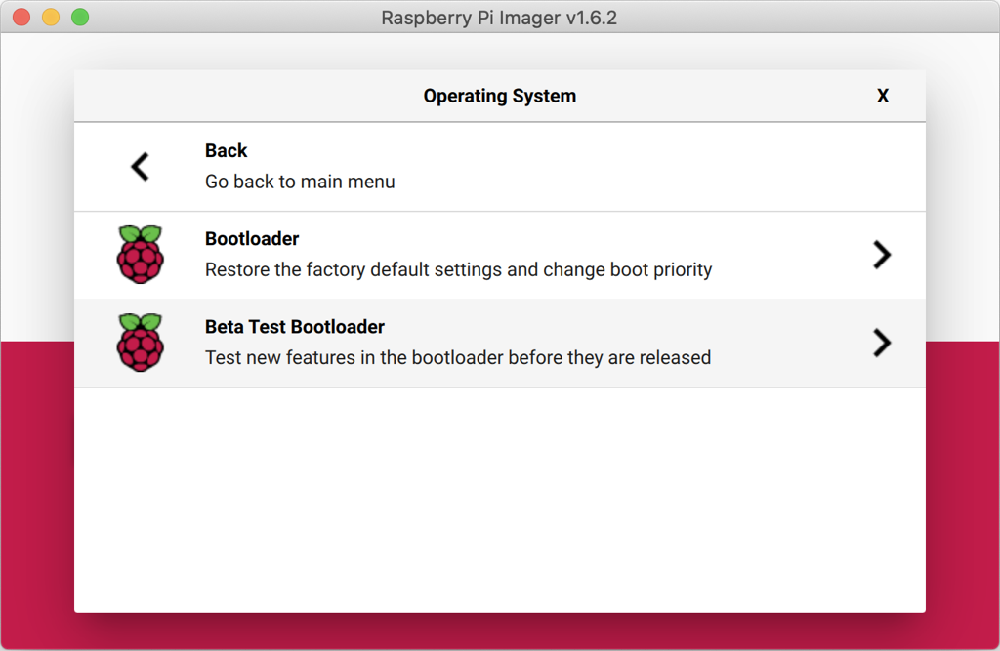
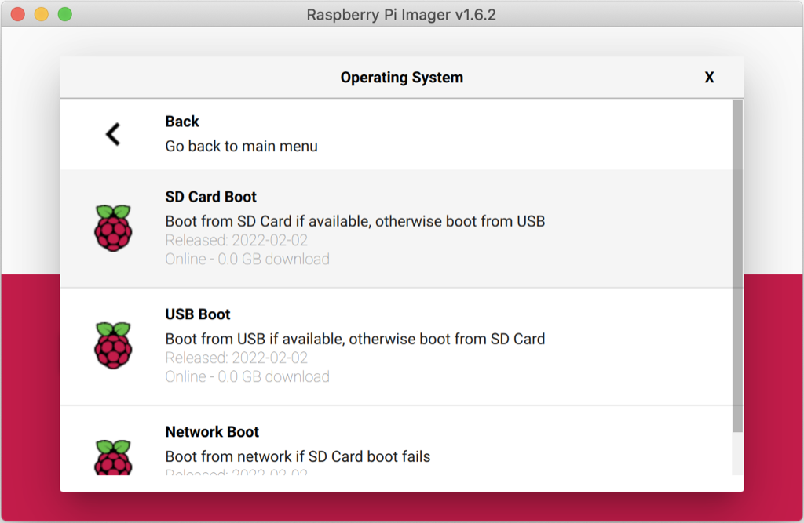

== Installing over the Network (BETA)

WARNING: Network installation is in currently in PUBLIC BETA. Please do not rely on it in production.

When you get a new Raspberry Pi, you also need an SD Card with an operating system installed on it. The easiest way to get the operating system onto the SD Card is to use the https://www.raspberrypi.com/software/[Raspberry Pi Imager] application running on another computer to xref:getting-started.adoc#installing-the-operating-system[to copy it to your SD Card].

But how do you get the operating system onto your SD card if you don’t have another computer?

If you do not have another computer to run Raspberry Pi Imager you can start the application directly on a Raspberry Pi 4 or Raspberry Pi 400 by connecting it to the Internet with an Ethernet cable. This will allow you to install the operating system onto a **blank** SD Card directly from the network without using another computer.

IMPORTANT: Network installation is only supported on Raspberry Pi 4 and Raspberry Pi 400. Additionally, to avoid slowing down “normal boot,” the network instllation feature is only enabled if there’s no bootable media present, and you have xref:raspberry-pi.adoc#usb-mass-storage-boot[USB mass storage boot] in your xref:raspberry-pi.adoc#BOOT_ORDER[boot order].

=== Updating to the BETA bootloader

NOTE: Updating the bootloader will be necessary for existing boards already in circulation. However, once the beta period has ended, we’ll eventually ship Raspberry Pi boards with the new network bootloader installed directly from the factory.

If you want to try out the network installer during the beta period you will have to install a beta version of the bootloader.

WARNING: Installation of the beta bootloader should be fairly safe, but you should keep a spare SD Card to restore the default bootloader in case you run into an issue. See the section on xref:raspberry-pi.adoc#imager[updating the bootloader] for more details.

The easiest way to update the bootloader on your Raspberry Pi 4 or 400 is by using the Raspberry Pi Imager, either running on your Raspberry Pi or another computer, to copy the required software onto an SD card. You’ll need a spare blank SD Card and, if you’re using a Raspberry Pi or another computer that doesn’t have an SD Card slot, a USB to SD Card dongle.

You should be aware that the SD Card you’re using to update your Raspberry Pi’s bootloader will be wiped of any existing data, so you shouldn’t use the SD Card you are currently using with your Raspberry Pi.

In the Imager application, click on the “Choose OS” button and scroll down the “Operating System” list in the pop-up window and select “Misc utility images”, then select “Beta Test Bootloader.”

Next, you need to select the boot order. All of the options are the same but will have a different boot order. Unless you have a reason to do otherwise, you should probably select “SD Card Boot.”

Afterwards, select your media and follow xref:getting-started.adoc#installing-the-operating-system[the normal instructions] to burn the updated bootloader to your SD Card.

When the SD Card has finished burning you should power off your Raspberry Pi and remove the existing SD Card and put it somewhere safe. Insert the card you just flashed with the Imager application into the Raspberry Pi and power it back on. The board LED will flash regularly, and the screen will go green to indicate that flashing the new beta bootloader was successful.

[NOTE]
====
You can reset your device to the default bootloader by running the following command and rebooting,

----
$ sudo rpi-eeprom-update -f $(rpi-eeprom-update -l)
----

or by flashing the top “Bootloader” option instead of the “Beta Test Bootloader” option using the Raspberry Pi Imager.
====

=== Using Network Installation

You will need a keyboard to make use of the network installation feature. While a Raspberry Pi 400 always has a keyboard "attached," if you're using a Raspberry Pi 4 you will need to plug in a USB keyboard.

video::b1SYVpM9lto[youtube]

You should also insert a **blank** SD Card into the Raspberry Pi's SD Card slot.

NOTE: You should make sure there isn't a bootable SD Card, or USB drive, attached to your Raspberry Pi.

Power on your Raspberry Pi. As always it will first look for an SD Card, and then a USB drive, to find bootable media. However if you have a keyboard attached the Raspberry Pi will now show the network installation screen.

image::images/network-install-1.png[width="80%"]

In the background the Raspberry Pi is still looking for a bootable imagem, but you can now start a network installation by holding down the `SHIFT` key for 3 seconds. Confirm that you want to go ahead by pressing `SPACE`, and you will be prompted to connect your Raspberry Pi to the network with an Ethernet Cable. 

image::images/network-install-2.png[width="80%"]

Plug your Raspberry Pi into the network using an Ethernet cable. When it detects a cable has been inserted it should start downloading the Raspberry Pi installer. If the download fails, you can repeat the process to try again.

image::images/network-install-3.png[width="80%"]

Eventually it should start the https://www.raspberrypi.com/software/[Raspberry Pi Imager] application allowing you to install a full operating system to a blank SD Card or a USB Drive.

image::images/network-install-4.png[width="80%"]

NOTE: More information can about using the Raspberry Pi Imager can be found in the section on xref:getting-started.adoc#installing-the-operating-system[installing your operating system].

After installing the operating system onto your blank SD Card you will not longer see the network installation screen on boot. If you do want to run it, you just need to remove any bootable disks. You can re-insert them later when the Raspberry PI Imager is running. But take care not to overwrite any working disks that you want to keep!