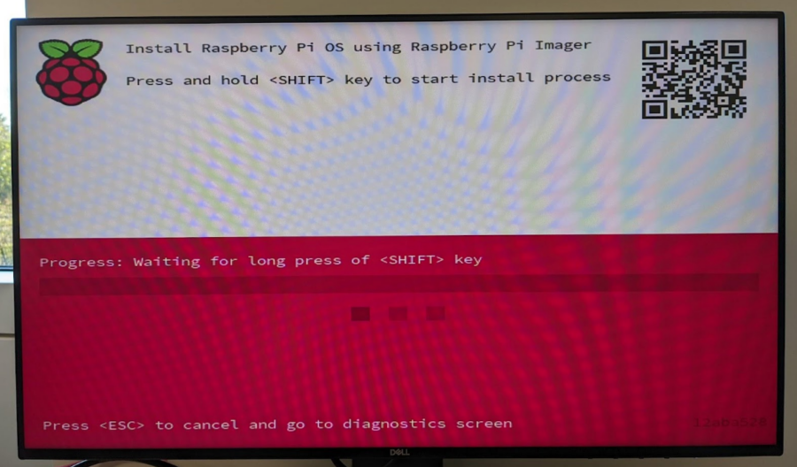
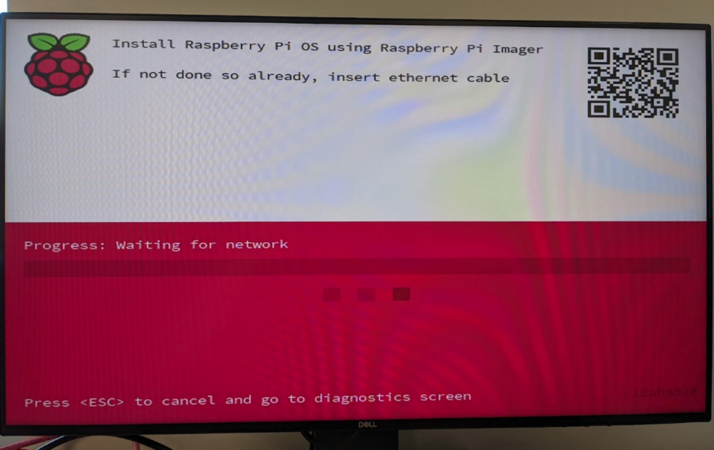
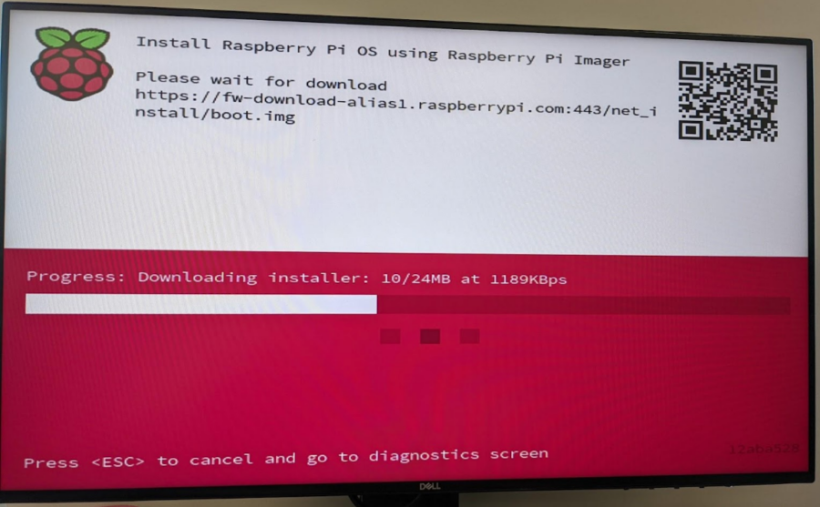
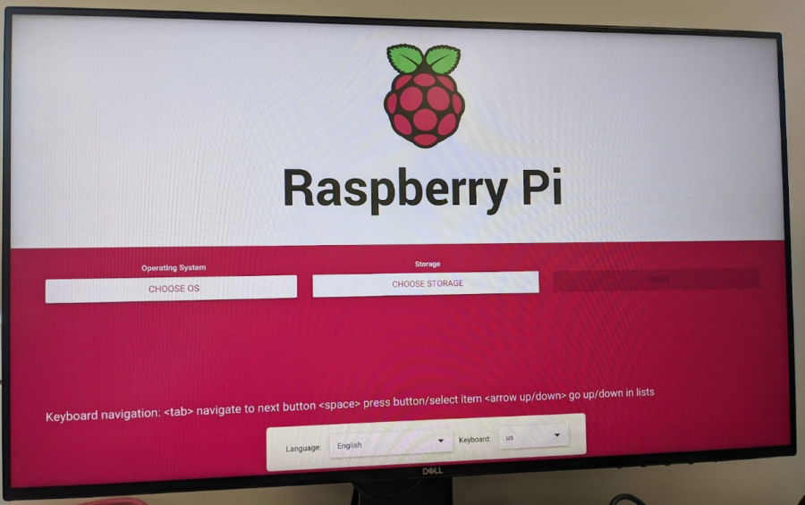

== Installing over the Network

WARNING: Network installation is only enabled by default on Raspberry Pi 4 and Raspberry Pi 400, and only when using the latest supported bootloader. See xref:raspberry-pi.adoc#bootloader_update_stable[Updating to the LATEST / STABLE bootloader] for details of how to update your bootloader.

When you get a new Raspberry Pi, you also need an SD Card with an operating system installed on it. The easiest way to get the operating system onto the SD Card is to use the https://www.raspberrypi.com/software/[Raspberry Pi Imager] application running on another computer to xref:getting-started.adoc#installing-the-operating-system[copy it to your SD Card].

But how do you get the operating system onto your SD card if you don’t have another computer?

If you do not have another computer to run Raspberry Pi Imager you can start the application directly on a Raspberry Pi 4 or Raspberry Pi 400 by connecting it to the Internet with an Ethernet cable. This will allow you to install the operating system onto a **blank** SD Card directly from the network without using another computer.

=== Using Network Installation

You will need a keyboard to make use of the network installation feature. While a Raspberry Pi 400 always has a keyboard "attached", if you're using a Raspberry Pi 4 you will need to plug in a USB keyboard.

video::b1SYVpM9lto[youtube]

Either insert a **blank** SD Card into the SD card slot of your Raspberry Pi, or press and hold the `SHIFT` key.

Power on your Raspberry Pi. As always it will first look for an SD Card, and then a USB drive, to find bootable media. However if you have a keyboard attached, the Raspberry Pi will now show the network installation screen.

In the background the Raspberry Pi is still looking for a bootable image, but you can now start a network installation by holding down the `SHIFT` key. You will then be prompted to connect your Raspberry Pi to the network with an Ethernet Cable.

NOTE: You can also start network install by holding `SHIFT` when powering on the device.

Plug your Raspberry Pi into the network using an Ethernet cable. When it detects a cable has been inserted it should start downloading the Raspberry Pi installer. If the download fails, you can repeat the process to try again.

Eventually it should start the https://www.raspberrypi.com/software/[Raspberry Pi Imager] application allowing you to install a full operating system to a blank SD Card or a USB Drive.

NOTE: More information can about using the Raspberry Pi Imager can be found in the section on xref:getting-started.adoc#installing-the-operating-system[installing your operating system].

After installing the operating system onto your blank SD Card you will no longer see the network installation screen on boot. If you do want to run it, you can hold down the `SHIFT` key while powering on the device. But take care not to overwrite any working SD cards that you want to keep!

See xref:raspberry-pi.adoc#http-boot[HTTP boot] for details about how to configure network install.
