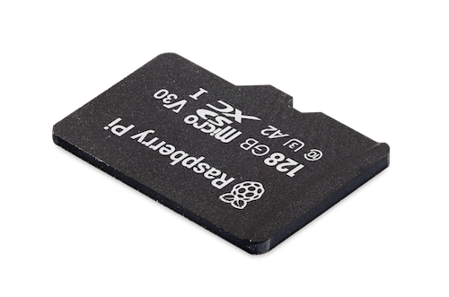
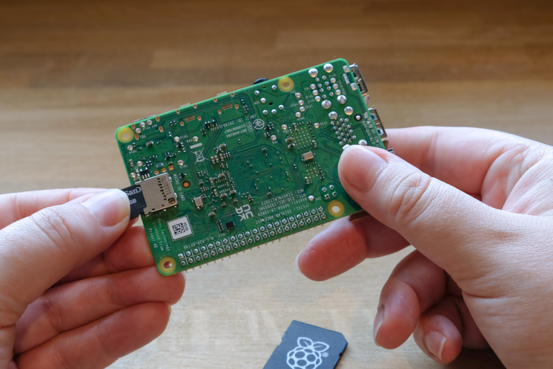
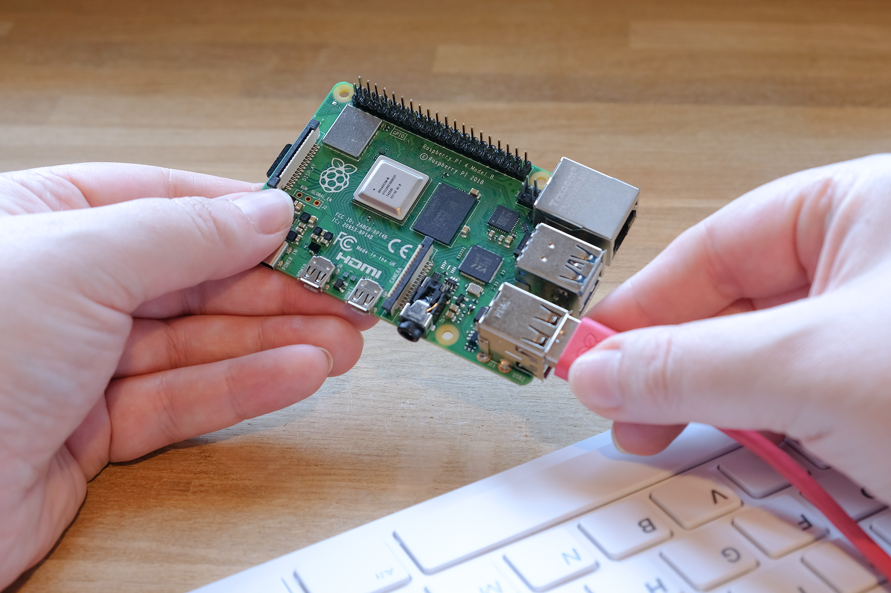
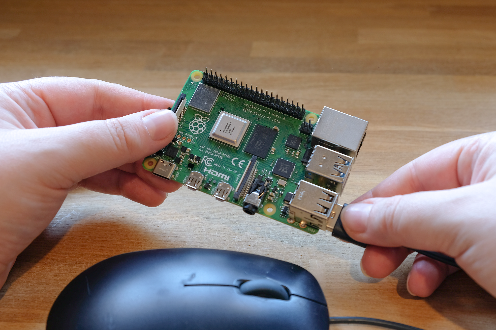
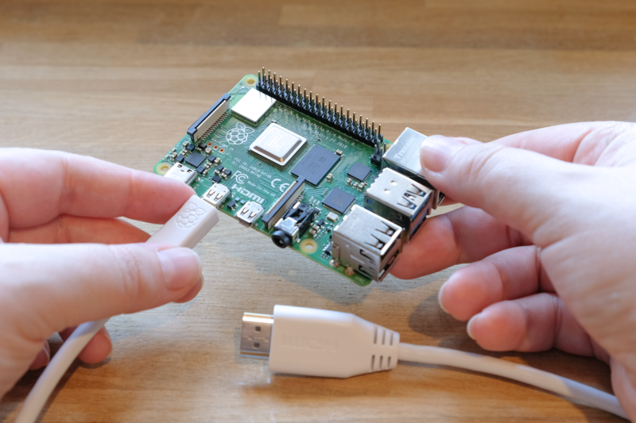
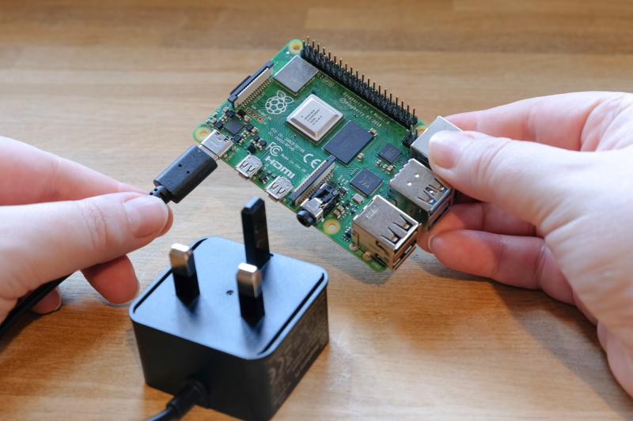
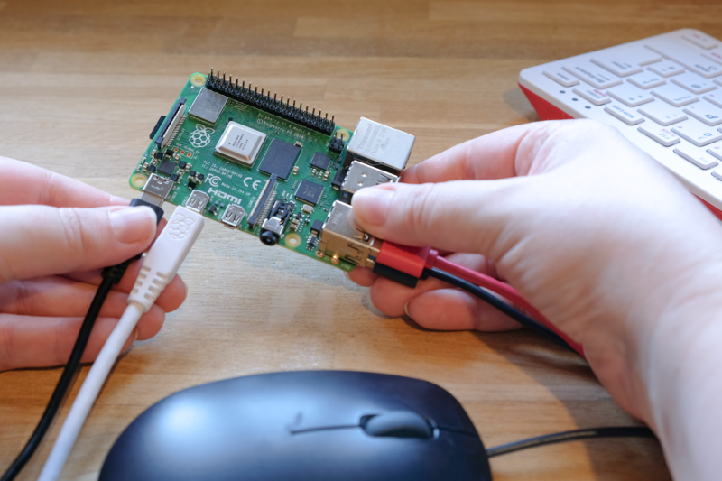
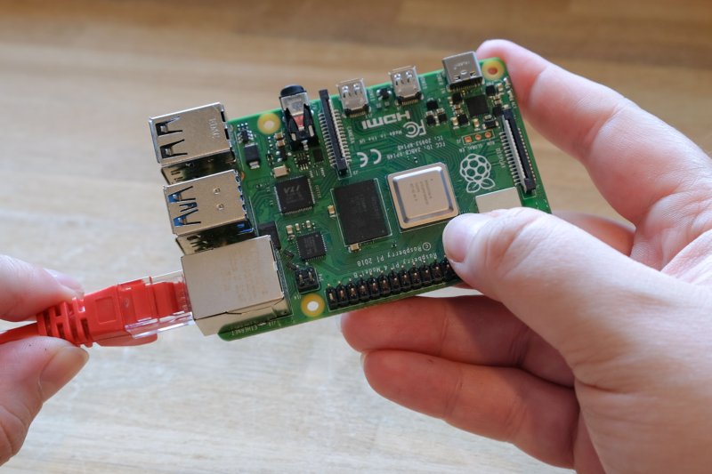

video::CQtliTJ41ZE[youtube,width=80%,height=400px]

A Raspberry Pi device is a compact computer that is commonly used in two main ways: either as a *desktop computer* or as a *headless (remote) computer*. For more information about these options, see <<setup>>.

Raspberry Pi devices are available in several series:

* *Raspberry Pi single-board computers (SBC).* Classic or 'flagship' Raspberry Pi devices that you can connect to a monitor, keyboard, and mouse like a desktop computer.
* *Raspberry Pi Zero.* A smaller version of flagship Raspberry Pi devices with fewer USB ports and lower power consumption.
* *Raspberry Pi keyboard computers.* Devices that have the computer built into a keyboard case, designed to be plugged into a monitor and mouse.
* *Raspberry Pi compute modules.* Small system-on-module versions of Raspberry Pi computers designed for industrial and embedded applications.
* *Raspberry Pi Pico.* A microcontroller board that uses Raspberry Pi microcontrollers (RP2040 or RP2350).

This page focuses on *flagship SBCs*, but much of the information also applies to Raspberry Pi *Zero* and *keyboard computers*. For detailed information about the full range of Raspberry Pi computer devices, see xref:../computers/raspberry-pi.adoc[Raspberry Pi computer hardware].

== Hardware prerequisites

To set up a Raspberry Pi device, you need the following hardware. These components are prepared and assembled in the order listed:

* <<boot-media>> with an OS installed on it.
* For a desktop setup, input and output peripherals, listed in <<equipment>>.
* For a headless setup, another computer and a network connection.
* A power supply. For guidance, see <<power>>.

Additionally, you can use:

* A Raspberry Pi case. This helps to protect your Raspberry Pi device from damage or from short-circuiting if it's placed on a metal surface.
* An Ethernet (RJ45) cable to connect your Raspberry Pi to a wired network. You don't need this to connect to a wireless network. You can connect to Wi-Fi with its SSID and password instead.

[[boot-media]]
=== Boot media

To function as a computer, your Raspberry Pi requires non-volatile storage containing an *operating system (OS) image*. This storage is called *boot media*, and the most common type is a *microSD card*. Some newer Raspberry Pi models can boot from other media, such as *USB Mass Storage*, *network boot (PXE)*, and *NVMe storage through PCIe*.

You must configure your boot media before you assemble your Raspberry Pi, unless you are using a network install on Raspberry Pi 4B, 5, 500, or 500+, in which case you use the Raspberry Pi itself to configure the boot media.

Whichever storage device you choose for your boot media, it must have enough storage and speed to act as a hard-drive that holds your OS image. An OS image is pre-packaged software that, when installed onto your boot image, transforms your Raspberry Pi from a blank board into a working computer.

For step-by-step guidance on configuring the boot media for your Raspberry Pi, see xref:../computers/getting-started.adoc#install[Install an OS onto boot media].

Faster storage devices with higher read and write speeds improve your Raspberry Pi's overall performance, making it run more smoothly. If you're unsure which SD card to buy, consider an https://www.raspberrypi.com/products/sd-cards/[official Raspberry Pi microSD card]. You might also need an SD card reader so that you can connect your microSD card to your computer to install an OS.

.An official 128 GB Raspberry Pi microSD card

All models since Raspberry Pi Model B+ have a microSD card slot; these Raspberry Pi devices automatically boot from an inserted microSD card with a valid OS image.

If you have a Raspberry Pi keyboard computer (Raspberry Pi 400, 500, or 500+), or if you have a Raspberry Pi computer as part of a kit, your OS is already configured. You can change your configuration from the *Control Centre* or using `raspi-config` from the Terminal. For instructions, see xref:../computers/configuration.adoc[Configuration].

[[recommended-capacity]]
==== Recommended minimum storage requirements

The boot media storage that you need depends on how much software is included in the OS version you install. The following recommendations are enough to get started based on your chosen OS, but we recommend choosing more storage space to allow room to grow:

* For *Raspberry Pi OS* (desktop with basic software), we recommend using an SD card with at least 32 GB of storage.
* For *Raspberry Pi OS Full* (desktop with basic software and recommended applications), we recommend using an SD card with at least 32 GB of storage.
* For *Raspberry Pi OS Lite* (a command-line-only version for headless setups), we recommend using an SD card with at least 8 GB of storage.

==== Maximum supported capacity

You can use any SD card with a capacity of less than 2 TB. Cards with capacities above 2 TB aren't supported because they exceed the limitations of the Master Boot Record (MBR). MBR is a partitioning system used on the SD card that tells your Raspberry Pi where to find the OS so that it can start up.

Some older Raspberry Pi devices can only boot from a boot partition of 256 GB or less. These include:

* Raspberry Pi Zero.
* The first flagship Raspberry Pi device.
* Early Raspberry Pi 2 models with the BCM2836 SoC.

Other operating systems might have different storage requirements. Always check the documentation for the OS you plan to install.

==== Inserting a microSD card
You must configure your microSD card before inserting it into your Raspberry Pi. For step-by-step guidance on configuring the boot media for your Raspberry Pi, see xref:../computers/getting-started.adoc#install[Install an OS onto boot media].

When you've configured your microSD card with an OS, insert it into the microSD slot with the label facing away from the Raspberry Pi. 

.Inserting a microSD card into a Raspberry Pi

For Raspberry Pi 3 and later, and for all Raspberry Pi Zero models, the microSD card slides in and stops without a click, and is removed by gently pulling on it. Older models require you to first push the microSD card to unlock it.

[[equipment]]
=== Equipment

A *headless setup* only requires another computer with a network connection. For more information, see <<headless-setup>>.

Depending on your device and use case, most *desktop setups* require input and output peripherals (like a keyboard, mouse, and monitor). You must also have the appropriate cables for connecting these peripherals to your Raspberry Pi.

To connect to a monitor, Raspberry Pi 4B, 400, 5, 500, and 500+ need a micro-HDMI-to-HDMI cable; Raspberry Pi Zero and Zero 2 need a mini-HDMI-to-HDMI cable. You can also use an adapter.

[[input-peripherals]]
==== Input peripherals (keyboard and mouse)

You can use any of the USB ports on your Raspberry Pi to connect a https://www.raspberrypi.com/products/raspberry-pi-keyboard-and-hub/[wired keyboard] and a https://www.raspberrypi.com/products/raspberry-pi-mouse/[wired mouse]. If you want to save the high-speed USB 3.0 (blue) ports for other, high-speed accessories, use the USB 2.0 (black) ports on your Raspberry Pi for your peripherals.

[.clearfix]
--
.Plugging a keyboard into a Raspberry Pi
[.left]

.Plugging a mouse into a Raspberry Pi
[.left]

--

If you're using an official Raspberry Pi keyboard or a Raspberry Pi keyboard computer, you can connect a wired mouse to one of the USB ports at the back. This keeps more USB ports available on your Raspberry Pi device.

===== Raspberry Pi Zero USB devices

Raspberry Pi Zero models use micro USB instead of full-size USB, and so require a micro USB OTG adapter. One of the micro-USB ports is labelled PWR IN and is reserved for power input only, but you can use any of those labelled USB.

Raspberry Pi Zero devices don't supply enough power for both a keyboard and a mouse (unless the keyboard has a built-in touchpad). For this reason, you need to plug a powered USB hub into the micro USB OTG adapter connected to your Raspberry Pi Zero. You can then plug a mouse into the USB hub.

NOTE: Plugging in a USB device to a Raspberry Pi Zero after it has booted can cause the voltage to droop enough that it causes the CPU to reboot. We therefore recommend that you use a powered USB hub, or that you connect USB devices before booting up

===== Wireless input devices

If you want to use a wireless keyboard or mouse, we recommend setting this up after you've configured and assembled your Raspberry Pi for the first time with a wired keyboard and mouse. You can then either use:

* A keyboard or mouse with a USB Bluetooth receiver. Plug the USB dongle for the keyboard or mouse into a USB port on your Raspberry Pi to connect it.
* A keyboard or mouse with built-in Bluetooth to connect to your Raspberry Pi. If your Raspberry Pi model supports Bluetooth, pair the keyboard with your Raspberry Pi.

For instructions, see xref:../computers/configuration.adoc#bt[Connect Bluetooth peripherals] in the *Configuration* page. For a list of Raspberry Pi models that come with Bluetooth, see <<networking>>.

[[output-peripherals]]
==== Output peripherals (display and audio)
If you're setting your Raspberry Pi up as a desktop computer, it needs a display so that you can see what you're doing. Additionally, you can connect speakers or headphones for audio output. If you're using an official https://www.raspberrypi.com/products/raspberry-pi-monitor/[Raspberry Pi Monitor], you can connect speakers or headphones through the 3.5 mm audio jack at the back of the display.

===== Displays
You can use the display outputs available on your Raspberry Pi to connect monitors. If your Raspberry Pi has more than one HDMI port, plug your primary monitor into the port marked *HDMI0*.

NOTE: Displays typically require their own source of power. If you're using an official Raspberry Pi Monitor, you can connect your monitor to power through a USB power cable connected to your Raspberry Pi. When you power on your Raspberry Pi, it then provides power to the Raspberry Pi monitor.

On Raspberry Pi 4 and later, both HDMI outputs support up to 4K resolution, though at different refresh rates depending on model.

.Plugging a micro HDMI cable into a Raspberry Pi
 

While newer Raspberry Pi models use micro HDMI, and Raspberry Pi Zero models use mini HDMI, most displays use full-size HDMI. You can use a https://www.raspberrypi.com/products/micro-hdmi-to-standard-hdmi-a-cable/[micro-HDMI-to-HDMI cable] or https://www.raspberrypi.com/products/standard-hdmi-a-male-to-mini-hdmi-c-male-cable/[mini-HDMI-to-HDMI cable] (or an https://www.raspberrypi.com/products/mini-hdmi-c-male-to-standard-hdmi-a-female-adapter/[mini-HDMI-to-HDMI adaptor]) to connect these models to an HDMI display. If your display doesn't have an HDMI connector, use an adapter cable to convert the HDMI end into a DVI-D, DisplayPort or VGA connector.

The following table lists the available display outputs and recommended cable adapters for different Raspberry Pi models.

.Available display outputs and cable adapters
[cols="1,2,2", options="header"]
|===
| Model | Display outputs | Cables and adapters for displays using full-size HDMI

| Raspberry Pi 5, 400, 500, and 500+
| Two micro-HDMI ports for dual display support.
| Use a micro-HDMI-to-HDMI cable; connect the larger (full HDMI) end of the cable to your display.

| Raspberry Pi 4 Model B
| Two micro-HDMI ports, plus a 3.5 mm https://en.wikipedia.org/wiki/Phone_connector_(audio)#TRRS_standards[TRRS] jack for audio and composite video.
| Use a micro-HDMI-to-HDMI cable; connect the larger (full HDMI) end of the cable to your display.

| Raspberry Pi 3 (all models)
| HDMI port plus a 3.5 mm https://en.wikipedia.org/wiki/Phone_connector_(audio)#TRRS_standards[TRRS] jack for audio and composite video.
| Use a standard HDMI cable.

| Raspberry Pi 2 Model B
| HDMI port plus a 3.5 mm https://en.wikipedia.org/wiki/Phone_connector_(audio)#TRRS_standards[TRRS] jack for audio and composite video.
| Use a standard HDMI cable.

| Raspberry Pi 1 Model A+ and B+
| HDMI port plus a 3.5 mm https://en.wikipedia.org/wiki/Phone_connector_(audio)#TRRS_standards[TRRS] jack for audio and composite video.
| Use a standard HDMI cable.

| Raspberry Pi 1 Model A and B
| HDMI port plus a 3.5 mm https://en.wikipedia.org/wiki/Phone_connector_(audio)#TRRS_standards[TRRS] jack for audio, and https://en.wikipedia.org/wiki/RCA_connector[phono] jack for composite video.
| Use a standard HDMI cable.

| Raspberry Pi Zero (all models)
| Mini HDMI port.
| Use a mini-HDMI-to-HDMI cable; connect the larger (full HDMI) end of the cable to your display.

|===

NOTE: No Raspberry Pi models support video over USB-C (DisplayPort Alt Mode). No USB-C port on a Raspberry Pi can be used to connect a monitor.

If your display has more than one HDMI connector, check the number of the port that you connect to. This number represents the input that you need to switch to in order to see what your Raspberry Pi is displaying.

===== Audio

Depending on your Raspberry Pi model, you can output audio over HDMI, USB, Bluetooth, or 3.5 mm jack. You can also connect to audio through the 3.5 mm jack at the back of an official Raspberry Pi Monitor.

* All Raspberry Pi models with HDMI, micro HDMI, or mini HDMI support audio output over HDMI.
* All Raspberry Pi models support audio over USB.
* All Raspberry Pi models that are equipped with Bluetooth support Bluetooth audio.
* All variants of Raspberry Pi 1, 2, 3, and 4 include a 3.5 mm auxiliary https://en.wikipedia.org/wiki/Phone_connector_(audio)#TRRS_standards[TRRS] jack, which might require amplification for sufficient output volume. The TRRS jack provides line-level output, not amplified speaker-level output.

[[power]]
=== Power supply
Connecting your Raspberry Pi to power is the last step in setting up your hardware. We recommend using an official Raspberry Pi power supply suitable for the Raspberry Pi model you're powering. Your Raspberry Pi turns on as soon as you connect it to power.

==== Recommended power supply
We recommend using an official Raspberry Pi power supply.

Different Raspberry Pi models require different amounts of power to run properly. The following table lists which USB Power Delivery mode is required for each model.

.Recommended power supply depending on Raspberry Pi model
[cols="1,1,1", options="header"]
|===
| Model | Recommended voltage at current | Recommended Raspberry Pi power supply

| Raspberry Pi 500+
| 5 V at 5 A
| https://www.raspberrypi.com/products/27w-power-supply/[27 W USB-C power supply]

| Raspberry Pi 5 and Raspberry Pi 500
| 5 V at 5 A; 5 V at 3 A limits peripherals to 600 mA
| https://www.raspberrypi.com/products/27w-power-supply/[27 W USB-C power supply]

| Raspberry Pi 4 Model B and Raspberry Pi 400
| 5 V at 3 A
| https://www.raspberrypi.com/products/type-c-power-supply/[15 W USB-C power supply]

| Raspberry Pi 3 (all models)
| 5 V at 2.5 A
| https://www.raspberrypi.com/products/micro-usb-power-supply/[12.5 W Micro USB power supply]

| Raspberry Pi 2 Model B
| 5 V at 2.5 A
| https://www.raspberrypi.com/products/micro-usb-power-supply/[12.5 W Micro USB power supply]

| Raspberry Pi 1 (all models)
| 5 V at 2.5 A
| https://www.raspberrypi.com/products/micro-usb-power-supply/[12.5 W Micro USB power supply]

| Raspberry Pi Zero (all models)
| 5 V at 2.5 A
| https://www.raspberrypi.com/products/micro-usb-power-supply/[12.5 W Micro USB power supply]

|===

==== Connecting to power
Before powering on your Raspberry Pi you must flash (write) the operating system (OS) image onto the storage for your device, otherwise your Raspberry Pi won't start. For more information, see <<boot-media>>.

After configuring your boot media, inserting it into your Raspberry Pi, and assembling all the necessary peripherals, plug your power supply into the port on your Raspberry Pi labelled either *POWER IN*, *PWR IN*, or *PWR*. Some Raspberry Pi models, such as the Zero series, have output USB ports with the same form factor as the power port. Use the correct port on your Raspberry Pi. Then, plug the other end of the power supply into an electrical socket and turn it on.

The Raspberry Pi then powers on, indicated by the power or status LED lighting up. It then shows you an information screen with the Raspberry Pi logo on it. Next, your Raspberry Pi loads its operating system from your boot media.

.Plugging a power supply into a Raspberry Pi

[[networking]]
== Networking
The following table lists Raspberry Pi models that come with Wi-Fi and Bluetooth connectivity, and specifies which of these also come with an Ethernet port.

If your Raspberry Pi device doesn't have an Ethernet port, you can still connect to a wired internet connection using a USB-to-Ethernet adapter.

Similarly, if your Raspberry Pi device doesn't have built-in Wi-Fi, you can still connect to a wireless internet connection using a USB-to-Wi-Fi adapter.

.Ethernet availability on wireless Raspberry Pi models
[cols="2,2", options="header"]
|===
| Wireless models | Ethernet

| Flagship models since Raspberry Pi 3 Model B. Raspberry Pi 5 includes Gigabit Ethernet and dual-band Wi-Fi (2.4/5 GHz).
| Model A: No; Model B: Yes

| All keyboard computers (Raspberry Pi 400, 500, and 500+)
| Yes

| Raspberry Pi Zero W and Zero 2 W (where 'W' means 'Wireless')
| No

| Raspberry Pi Pico W and Pico 2 W (where 'W' means 'Wireless')
| No

| Compute modules configured with wireless, available since Compute Module 4 (CM4)
| No, unless the carrier board adds it.

|===

[[setup]]
== Set up your Raspberry Pi
A Raspberry Pi is commonly used in two ways:

* *As a desktop computer.* An interactive system with a desktop environment. This setup requires a display, a cable to connect your Raspberry Pi to the display, a keyboard, and a mouse. For information about these accessories, see <<equipment>>.
* *As a headless computer.* A system that operates without traditional peripherals (display, keyboard, and mouse). You access it through Raspberry Pi Connect or from another computer on the same network using SSH over Wi-Fi or Ethernet. You can preconfigure the hostname, user account, network connection, and SSH access when you install an operating system.

[[desktop-setup]]
=== Standard (desktop) setup

Broadly, a desktop setup for your Raspberry Pi involves boot media, peripherals, and power, implemented in order. Network connection is optional.

==== Step 1. Prepare your boot media

Use Raspberry Pi Imager to install the OS onto your boot media. This is a prerequisite for using your Raspberry Pi and is where you configure most of its key settings for the first time, including hostname, localisation, user credentials, Wi-Fi connection, and remote access. 

Other settings can be configured later. For instructions, see xref:../computers/getting-started.adoc#install[Install an OS onto boot media].

After installing an OS onto your boot media, connect it into your Raspberry Pi. On newer models, this is typically a microSD card inserted into the slot on the underside of the device. If you installed the OS on any other storage device, you can connect it to your Raspberry Pi using other compatible connectors.

==== Step 2. Connect peripherals

To use your Raspberry Pi as a desktop computer, you can connect the following peripherals:

* <<input-peripherals, Input peripherals>>:
** *Keyboard.* Required for a desktop computer using a flagship Raspberry Pi or Raspberry Pi Zero; not required if your Raspberry Pi is a keyboard computer (Raspberry Pi 400, 500, or 500+).
** *Mouse.* Required for a desktop computer.
* <<output-peripherals, Output peripherals>>:
** *Display.* Required for a desktop computer.
** *Audio.* Optional.

.Connecting peripherals to a Raspberry Pi

==== Step 3. Connect to power
After connecting your peripherals, plug the power supply onto the USB-C (or micro USB on older models) power port on your Raspberry Pi. Ensure that your power supply meets the voltage and current requirements of your Raspberry Pi model. For more information, see <<power>>.

When your Raspberry Pi powers on, a status LED lights up, and if your Raspberry Pi is connected to a monitor, a boot screen appears. This can take a few minutes.

==== Step 4. Connect to a network (optional)
After you've installed an OS onto your boot media and inserted it into your Raspberry Pi, you can set up network connectivity. This can be a wired (Ethernet) connection or a wireless (Wi-Fi) connection.

===== Connect to a wireless network
Connecting to a wireless network typically happens during boot media configuration. For instructions on configuring your boot media, see xref:../computers/getting-started.adoc#install[Install an OS onto boot media]. You can also configure a wireless network later from the desktop or from the command line. For instructions, see xref:../computers/configuration.adoc#connect-to-wireless[Connect to a wireless network] in the *Configuration* page. 

Some wireless adapters and some Raspberry Pi models don't support 5 GHz networks; check the link:https://www.raspberrypi.com/products/[Raspberry Pi Product page] for your wireless module to ensure compatibility with your preferred network. For information about which Raspberry Pi models support wireless networks, see <<networking>>.

===== Connect to a wired network
To connect your Raspberry Pi to a wired network, insert an Ethernet cable into your Raspberry Pi device's Ethernet port until you hear a click. You can use a USB Ethernet adapter if your Raspberry Pi model doesn't include an Ethernet port.

Connect the other end of the cable to a port in your network hub, switch, or router. Raspberry Pi OS automatically connects to the network.

To remove the Ethernet cable, press on the clip at the bottom of the connector and gently slide the cable out from the port.

.Plugging an Ethernet cable into a Raspberry Pi

[[headless-setup]]
=== Headless (remote) setup
A headless Raspberry Pi operates without a monitor, keyboard, or mouse. You control it remotely from another computer over a network. For this, you need:

* A network connection (Ethernet or Wi-Fi).
* A remote access method, typically SSH. The following guidance provides instructions for SSH.

After you've connected over SSH, you can set up xref:../services/connect.adoc[Raspberry Pi Connect], which provides remote access to your Raspberry Pi desktop and Terminal with no manual network configuration. Alternatively, you can xref:remote-access.adoc#vnc[enable VNC] if you prefer a graphical desktop environment.

VNC and Raspberry Pi Connect can be enabled from the desktop and using the interactive `raspi-config` tool. For instructions, see xref:configuration.adoc#remote[Remote access] in the *Configuration* page.

==== Step 1. Prepare your boot media
The recommended way to set up a headless computer is during the installation process using Imager, where you can configure the networking, remote access, and user credentials (username and password) required for a headless setup. For instructions, see xref:../computers/getting-started.adoc#install[Install an OS onto boot media].

Because a headless setup doesn't have a desktop, we recommend choosing *Raspberry Pi OS Lite* as your operating system.

After installing an OS onto your boot media, insert it into your Raspberry Pi. On newer models, this is typically a microSD card inserted into the slot on the underside of the device. If you installed the OS on any other storage device, you can connect it to your Raspberry Pi using other compatible connectors.

==== Step 2. Connect to power

After preparing your boot media and connecting it to your Raspberry Pi, attach the Ethernet cable.

Plug the power supply into the USB-C (or micro USB on older models) power port on your Raspberry Pi. Ensure that your power supply meets the voltage and current requirements of your Raspberry Pi model. For more information, see <<power>>.

When your Raspberry Pi powers on, a status LED lights up. This can take a few minutes.

==== Step 3. Connect to a network
After you've installed an OS onto your boot media, inserted it into your Raspberry Pi, and connected your Raspberry Pi to power, you can set up network connectivity so that it can communicate with your computer. This can be a wired (Ethernet) connection or a wireless (Wi-Fi) connection.

===== Connect to a wireless network
If configured during installation using Imager, your Raspberry Pi attempts to connect to the wireless network on first boot. Enter the SSID and password for your wireless network.

Some wireless adapters and some Raspberry Pi models don't support 5 GHz networks; check the documentation for your wireless module to ensure compatibility with your preferred network. For information about which Raspberry Pi models support wireless networks, see <<networking>>.

NOTE: Previous versions of Raspberry Pi OS made use of a `wpa_supplicant.conf` file, which could be placed into the boot folder to configure wireless network settings. This functionality isn't available from Raspberry Pi OS *Bookworm* and onwards.

===== Connect to a wired network
Plug an Ethernet cable into your Raspberry Pi and your router. 

Attach an Ethernet cable into your Raspberry Pi device's Ethernet port until you hear a click. Use a USB Ethernet adapter if your Raspberry Pi model doesn't include an Ethernet port. 

Connect the other end of the cable to a port in your router. Raspberry Pi OS automatically connects to the network.

To remove the Ethernet cable, press on the clip at the bottom of the connector and gently slide the cable out from the port.

.Plugging an Ethernet cable into a Raspberry Pi

==== Step 4. Access your Raspberry Pi
A headless setup requires a remote access method. On first boot, the only remote access option is SSH or Raspberry Pi Connect. 

The recommended way to enable SSH is during installation using Imager, as described in xref:../computers/getting-started.adoc#install[Install an OS onto boot media].

If you didn't customise the image during installation you can instead set up remote access manually. On your boot media's `bootfs` partition:

. Create an empty file named `ssh`.
. Create a file named `userconf.txt` with a single line of text: `<username>:<enrcypted-password>`.

Replace `<username>` with your username and `<enrcypted-password>` with an *encrypted* representation of your password.

* *Username.* Your username must start with a letter and may only contain lowercase letters, digits, underscores, and hyphens. Your username can be a maximum of 31 characters.
* *Encrypted password.* Use https://www.openssl.org[OpenSSL] on another computer to generate an encrypted password. From the command line, run `openssl passwd -6` and then, when prompted, enter your password and verify it. This command outputs an encrypted version of the supplied password.

For more detailed information, see xref:../computers/remote-access.adoc#ssh[Access a remote terminal with SSH].
