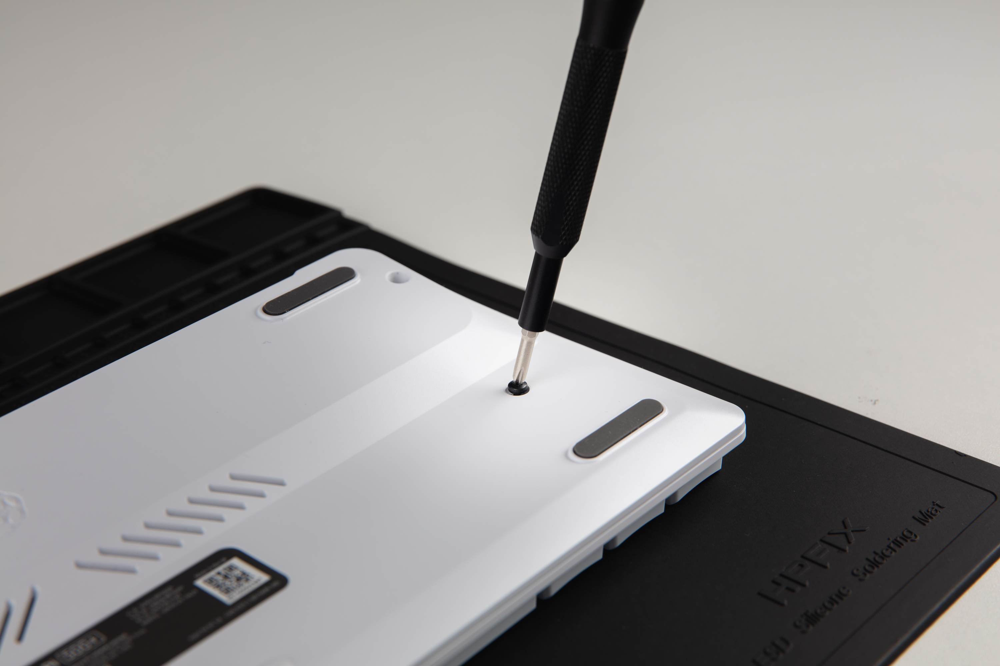
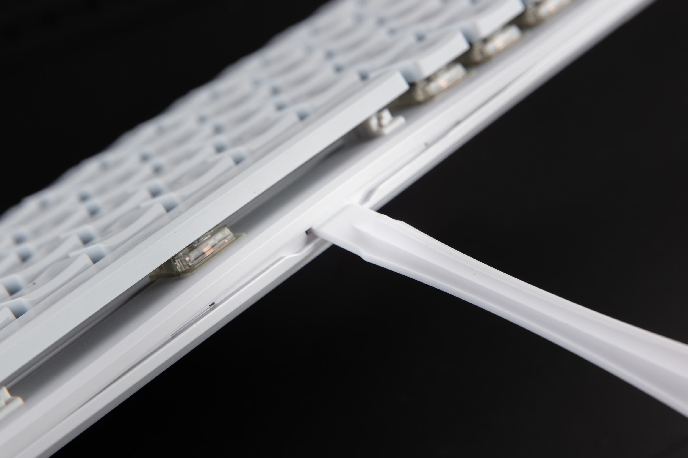
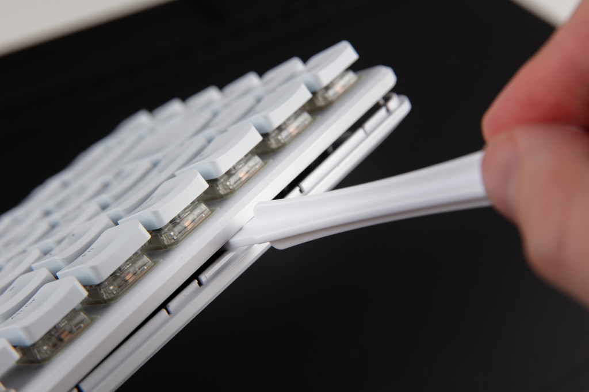
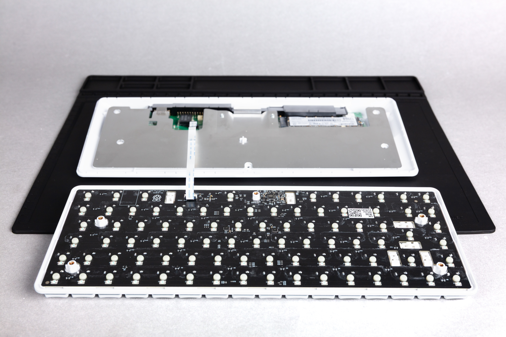
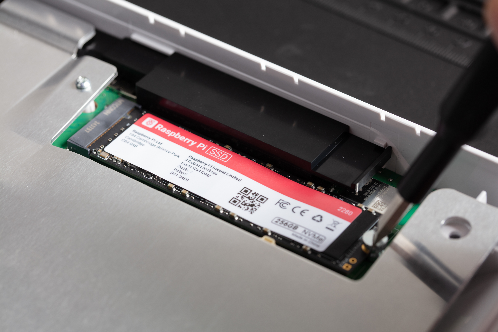
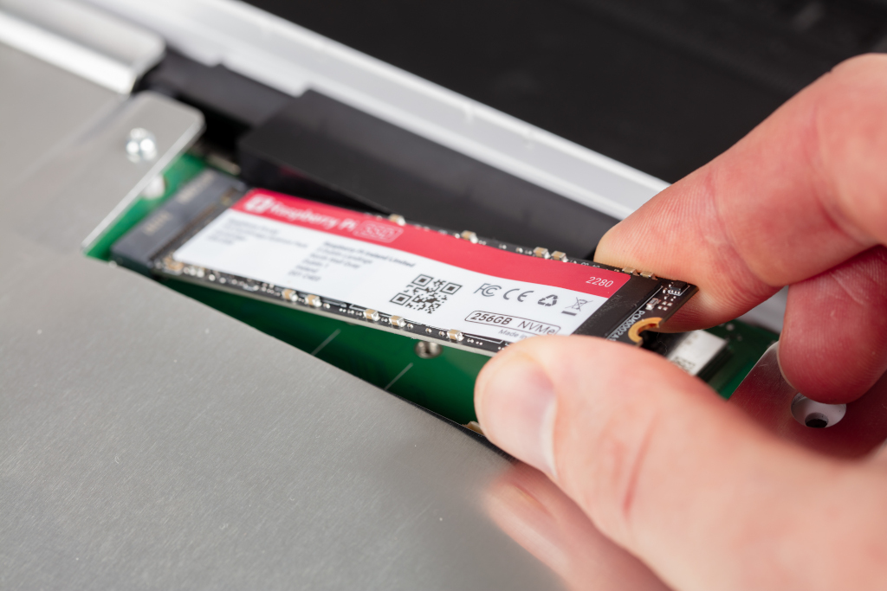

Raspberry Pi keyboard computers are complete personal computers built into a keyboard. They include the same system-on-chip (SoC) as Raspberry Pi single-board computers (SBC). Raspberry Pi offers three keyboard computers:

* *Raspberry Pi 400*, based on Raspberry Pi 4 (4 GB), released 2020.
* *Raspberry Pi 500*, based on Raspberry Pi 5 (8 GB), released 2024.
* *Raspberry Pi 500+*, based on Raspberry Pi 5 (16 GB), released 2025.

Raspberry Pi keyboard computers come in different regional variants affecting keyboard layout and required power supply.

== Features

The features of your Raspberry Pi keyboard computer depend on the model.

*Raspberry Pi 500* and *Raspberry Pi 500+* are faster than *Raspberry Pi 400* due to the Cortex-A76 CPU, increased RAM, and upgraded GPU. The main differences between the Raspberry Pi 400 keyboard computer and the Raspberry Pi 500 and 500+ keyboard computers are:

* *Processor.* Raspberry Pi 400 uses Cortex-A72 at 1.8 GHz; both Raspberry Pi 500 and 500+ use Cortex-A76 at 2.4 GHz, providing higher performance and efficiency.
* *Memory (RAM).* Raspberry Pi 400 includes 4 GB of RAM; Raspberry Pi 500 includes 8 GB of RAM; Raspberry Pi 500+ includes 16 GB of RAM, providing smoother multitasking and support for more demanding applications.
* *GPU.* Raspberry Pi 400 includes VideoCore VI at 500 MHz; both Raspberry Pi 500 and 500+ include VideoCore VII at 910 MHz, providing faster graphics and improved video decoding.
* *HDR video.* All Raspberry Pi keyboard computers include two micro-HDMI ports, providing 4K displays, but Raspberry Pi 500 and 500+ also support HDR on HDMI outputs.
* *Power button.* Raspberry Pi 400 doesn't have a power button and is instead turned on and off with a combination of key presses; both Raspberry Pi 500 and 500+ do have a power button.
* *SoC.* Raspberry Pi 400 includes the Broadcom chip, BCM2711; both Raspberry Pi 500 and 500+ use the Broadcom chip, BCM2712, in combination with the RP1 I/O controller.

Raspberry Pi 500+ offers additional features, including:

* Mechanical keys with customisable RGB LEDs and replaceable keycaps. For more information, see <<mechanical-keys, Raspberry Pi 500+ mechanical keys>>. For instructions, see <<backlighting, Customise your backlighting>> and <<replace-keycaps, Change your keycaps>>.
* Internal 256 GB M.2 SSD, which is replaceable. This SSD comes installed with Raspberry Pi OS. For instructions, see <<replace-m2, Replace your M.2 SSD>>.
* More RAM (16 GB). For a comparison, see the following table.

[cols="1,1,1,1", options="header"]
|===
|  |Raspberry Pi 400 |Raspberry Pi 500 |Raspberry Pi 500+

| *Dimensions*
| 286 × 122 × 23 mm
| 286 × 122 × 23 mm
| 312 × 123 × 35 mm

| *Keys*
| 78, 79, or 83 membrane keys depending on regional variant
| 78, 79, or 83 membrane keys depending on regional variant
| 84, 85, or 88 mechanical keys depending on regional variant

| *Processor*
| Quad-core 64-bit Arm processor (Cortex-A72 at 1.8 GHz)
| Quad-core 64-bit Arm processor (Cortex-A76 at 2.4 GHz)
| Quad-core 64-bit Arm processor (Cortex-A76 at 2.4 GHz)

| *SoC and I/O controller*
| BCM2711 SoC
| BCM2712 SoC and RP1 I/O controller
| BCM2712 SoC and RP1 I/O controller

| *Memory (RAM)*
| 4 GB synchronous dynamic RAM (SDRAM)
| 8 GB synchronous dynamic RAM (SDRAM)
| 16 GB synchronous dynamic RAM (SDRAM)

| *GPU*
| VideoCore VI at 500 MHz
| VideoCore VII at 910 MHz
| VideoCore VII at 910 MHz

| *Video output*
| Two micro-HDMI ports that provide either a single 4K display at 60 Hz or two 4K displays at 30Hz
| Two micro-HDMI ports that provide 4K displays at 60 Hz plus HDR support
| Two micro-HDMI ports that provide 4K displays at 60 Hz plus HDR support

| *Thermal control*
| Aluminium integrated heatsink
| Aluminium integrated heatsink
| Aluminium integrated heatsink

| *Wireless connectivity*
| Dual-band Wi-Fi and BLE
| Dual-band Wi-Fi and BLE
| Dual-band Wi-Fi and BLE

| *USB ports*
| Two USB 3.0 ports; one USB 2.0 port
| Two USB 3.0 ports; one USB 2.0 port
| Two USB 3.0 ports; one USB 2.0 port

| *Gigabit Ethernet*
| Yes
| Yes
| Yes

| *GPIO*
| Horizontal 40-pin GPIO header
| Horizontal 40-pin GPIO header
| Horizontal 40-pin GPIO header

| *Storage*
| microSD card slot
| microSD card slot
| microSD card slot and M.2 SSD drive

| *Power input*
| 5 V at 3 A (15 W) through USB-C
| 5 V at 5 A (25 W) through USB-C
| 5 V at 5 A (25 W) through USB-C

| *Power button*
| Key combination (*Fn* + *F10*)
| Dedicated button
| Dedicated button

| *Customisability*
|
| Key remapping
| Key remapping; RGB backlighting; ability to change keycaps
|===

== Keyboard computer kits

Raspberry Pi keyboard computers are available as standalone keyboards or as part of a kit, including basic accessories to get started.

=== Raspberry Pi 400 kit

* Raspberry Pi 400 keyboard computer.
* 15 W Raspberry Pi USB-C power supply.
* Raspberry Pi USB mouse.
* 16 GB microSD card, pre-programmed with Raspberry Pi OS.
* micro-HDMI cable.
* _Beginner's Guide_ book.

=== Raspberry Pi 500 kit

* Raspberry Pi 500 keyboard computer.
* 27 W Raspberry Pi USB-C power supply.
* Raspberry Pi USB mouse.
* 32 GB A2-class microSD card, pre-programmed with Raspberry Pi OS.
* micro-HDMI cable.
* _Beginner's Guide_ book.

=== Raspberry Pi 500+ kit

* Raspberry Pi 500+ keyboard computer, including an SSD pre-programmed with Raspberry Pi OS.
* 27 W Raspberry Pi USB-C power supply.
* Raspberry Pi USB mouse.
* micro-HDMI cable.
* Spudger (opening tool) for access to the M.2 SSD (also provided with the standalone keyboard).
* Keycap puller for removing keycaps (also provided with the standalone keyboard).
* _Beginner's Guide_ book.

== Getting started

To get up and running with your Raspberry Pi keyboard computer, you can follow the instructions at xref:../computers/getting-started.adoc#setting-up-your-raspberry-pi[Getting started with your Raspberry Pi].

If you have a Raspberry Pi 500+ or got your 400 or 500 as part of a kit that includes a microSD card pre-programmed with Raspberry Pi OS, you can skip ahead in the instructions to xref:../computers/getting-started.adoc#set-up-your-raspberry-pi[Set up your Raspberry Pi].

[[mechanical-keys]]
== Raspberry Pi 500+ mechanical keys

Each key on Raspberry Pi 500+ has its own mechanical switch underneath the keycap that registers a key press. Raspberry Pi 500+ uses Gateron KS-33 low-profile mechanical switches. By default, Gateron KS-33 switches use coloured stems to indicate switch type (clicky, tactile, or linear). Raspberry Pi 500+ uses clicky Gateron KS-33 switches with a custom grey stem.

Keycaps attach to the cross-shaped stem on top of the Gateron switches. These switches have Cherry MX-compatible, cross-shaped stems, which is the industry standard. For guidance and instructions on removing and replacing keycaps on your Raspberry Pi 500+, see <<replace-keycaps, Change your keycaps>> on this page.

== Raspberry Pi 500+ customisation

Raspberry Pi 500+ is the most recent keyboard computer. It offers the following customisation options:

* Replaceable M.2 SSD storage. For instructions, see <<replace-m2, Replace your M.2 SSD>>.
* Keycap set changes. For instructions, see <<replace-keycaps, Change your keycaps>>.
* Backlighting presets, colours, and brightness. For instructions, see <<backlighting, Customise your backlighting>>.

For more advanced users, Raspberry Pi 500+ also allows:

* LED configuration beyond the built-in presets.
* On-the-fly key remapping.

For more information, see <<advanced, Advanced software settings>>.

[[replace-m2]]
=== Replace your M.2 SSD

You can expand storage capacity by replacing the M.2 SSD in your Raspberry Pi 500+. You can also use this slot to install a different PCIe peripheral. The Raspberry Pi 500+ supports devices that use the M.2 M key edge connector in the form factors 2230, 2242, 2260, and 2280.

To complete this procedure, you need a cross head screwdriver, a flat head screwdriver, and the provided plastic opening tool (spudger).

1. *Unscrew the keyboard.* Locate the five screws on the bottom of the keyboard and unscrew them using a cross head screwdriver. Keep the screws in a safe place.
+

2. *Loosen the top of the keyboard from the bottom of the keyboard.* Position the spudger into the indentation at the front of the keyboard and then angle the spudger upwards to start splitting the keyboard.
+

3. *Detach the top of the keyboard from the bottom of the keyboard.* Wedge and swipe the spudger along the opening groove at the front of the keyboard to detach the top of the keyboard from the bottom.
+

4. *Open the keyboard.* Place the bottom of the keyboard on a flat surface and fold (don't lift) the top of the keyboard over to lay it face down on the same surface. Be careful not to pull the top and bottom parts away from each other entirely because they're attached with a flexible cable.
+

5. *Release the M.2 SSD.* By hand or with a flat head screwdriver, turn the screw on the right side of the M.2 SSD anticlockwise to loosen it. Remove the screw and keep it in a safe place. The M.2 SSD springs up when you remove the screw.
+

6. *Pull out the M.2 SSD.* Pull the M.2 SSD away from and then out of the keyboard.
+

7. *Add a new M.2 SSD.* Insert another M.2 SSD by sliding it into the slot at the left side. The SSD card fits in only one orientation. Hold the newly inserted M.2 SSD down and replace the screw on the right side of it, turning the screw clockwise to tighten.
8. *Close the keyboard.* Fold the top of the keyboard back onto the bottom of the keyboard and click it back into place.
9. *Screw the keyboard shut.* Place and turn the five screws back into place with your cross head screwdriver.

[[replace-keycaps]]
=== Change your keycaps

You can swap out the default keycaps on your Raspberry Pi 500+ for custom sets. Because the Gateron KS-33 switches on Raspberry Pi 500+ use the industry standard Cherry MX stem shape, most third-party keycaps that are designed for Cherry MX are compatible. Avoid taller profiles that could hit the keyboard frame or produce too much noise. For more guidance on choosing alternative keycaps, see <<layout, Keyboard layout>>, <<profiles, Keycap profiles>>, and <<lighting, Lighting>> in this section.

To remove a keycap:

1. Insert the prongs of the keycap puller on opposite sides of a keycap that you want to remove or replace. Allow the prongs to fall below the keycap.
2. Press the sides of the prongs to grip the keycap, ensuring equal pressure on both sides.
3. Gently pull the keycap straight up off of the keyboard. Avoid pulling at an angle.

NOTE: You can also remove keycaps to allow you to clean underneath them.

You can now replace the keycap with another one, or reinstall the same keycap in its original place:

1. Align the keycap by lining up its cross-shaped stem underneath it with the cross-shaped stem on the corresponding switch.
2. Press the keycap down gently but firmly until the keycap is fully seated and feels secure.

[[layout]]
==== Keyboard layout

Keycaps are available in various languages, with US layouts being the most widely available, followed by UK layouts. Other languages can be harder to source.

The Raspberry Pi 500+ keyboard has a modified 75% layout, which means that some keys are non-standard and might not have matching keycaps in typical sets:

* *Power key.* The power key in the top-right corner of the keyboard might not be included in other keycap sets.
* *Lighting labels.* The lighting labels on the *F4*, *F5*, and *F6* keys of Raspberry Pi 500+ are non-standard.
* *Volume labels.* The volume labels on the *F10*, *F11*, and *F12* keys of Raspberry Pi 500+ are non-standard.
* *System Request key.* The *SysRq* key on Raspberry Pi 500+ is non-standard.
* *Insert key.* The *Ins* key on Raspberry Pi 500+ is non-standard.
* *Command key.* The *Cmd* key typically says *Win* on keycap sets, and third-party keycap sets don't include the Raspberry Pi logo.

[[profiles]]
==== Keycap profiles

The low-profile keycaps included on Raspberry Pi 500+ perform like traditional mechanical keys while also keeping the keyboard compact. We recommend *DSA* or *Cherry* profiles for replacement keycaps:

* *DSA* keycaps have a flat profile and can be swapped across rows.
* *Cherry* keycaps are generally compatible, but have different sculpted profiles for ergonomics. This means that each row can have a slightly different height or angle. For a consistent feel, check row alignment.

NOTE: *XDA*, *OEM*, and *SA* keycaps aren't recommended because they're taller, and can therefore produce more noise or come into contact with the keyboard frame.

[[lighting]]
==== Lighting

The LEDs on the Raspberry Pi 500+ keyboard light the top half of the keycaps, which means that fully opaque keycaps might block illumination.

[[backlighting]]
=== Customise your backlighting

Raspberry Pi 500+ has most backlighting turned off by default. The only lighting that's enabled by default includes:

* The activity LED behind the power button when the Raspberry Pi 500+ keyboard is on. This LED:
    - Is red when Raspberry Pi 500+ is receiving power but is turned off.
    - Is green when Raspberry Pi 500+ is turned on.
    - Blinks with SD card activity.
* The rainbow lighting animation that travels through the keys when you start up the Raspberry Pi 500+ keyboard. Advanced users can turn this off for particular backlighting presets using the configuration software. For more information, see <<startup, Change preset startup animation>> in <<advanced, Advanced software settings>>.
* The Caps Lock indicator that lights up when active.

Raspberry Pi 500+ supports other RGB backlighting presets, powered by https://github.com/raspberrypi/vial-qmk[Vial QMK firmware]. For instructions, see <<choose-presets, Choose backlight preset>>.

[[choose-presets]]
==== Choose backlight preset

Raspberry Pi 500+ comes with seven presets, which are the saved lighting profiles on your Raspberry Pi 500+ keyboard. To cycle forwards through these presets, press *Fn* + *F4* on the keyboard; to cycle backwards through these presets, press *Fn* + *Shift* + *F4* on the keyboard.

[cols="1,5,16", options="header"]
|===

|  |Preset name |Description

| *0*
| *Off*
| The default preset that only lights the power key, the startup animation, and the Caps Lock indicator.

| *1*
| *Solid Colour White*
| Solid white backlight.

| *2*
| *Solid Colour*
| Solid colour backlight, which you can change using *Fn* + *F3*.

| *3*
| *Gradient Left Right*
| Fixed rainbow backlight.

| *4*
| *Cycle Pinwheel*
| Animated rainbow backlight, where the keys cycle through different colours in a rainbow pattern across the keyboard.

| *5*
| *Typing Heatmap*
| The more you press a key, the closer to red it gets and the more the keys around it light up.

| *6*
| *Solid Reactive Simple*
| Reactive keyboard, where the keys light up when you press them. You can choose which colour using *Fn* + *F3*.
|===

[[backlight-controls]]
==== Backlight controls

You can customise the RGB backlighting colour (depending on the preset) and brightness using the following keyboard shortcuts:

* *Change colour.* Press *Fn* + *F3* to cycle forwards through 16 backlight colours; press *Fn* + *Shift* + *F3* to cycle backwards through the colours.
* *Adjust brightness.* Press *Fn* + *F5* to reduce the brightness; press *Fn* + *F6* to increase the brightness.

NOTE: The *Shift* key on your keyboard either cycles backwards through available options, or inverts the key function. For example, *Fn* + *Shift* + *F5* increases the brightness instead of decreasing it.

[[advanced]]
== Advanced software settings

Raspberry Pi offers firmware that controls the built-in keyboard on Raspberry Pi 500 and 500+. With this tool, you can:

* Enable and configure advanced LED settings for Raspberry Pi 500+. For more information, see <<advanced-led, Advanced led settings>>.
* Remap keys on both Raspberry Pi 500 and 500+. For more information, see <<remapping, Remap keys on your keyboard>>.
* Play a Flappy Bird-style game on Raspberry Pi 500+. For information, see <<flappy-bird, Flappy Bird game>>.

For more information and options beyond those described in this page, see the https://github.com/raspberrypi/rpi-keyboard-config/blob/main/README.md[README for the configurator tool] on GitHub.

=== Firmware setup

To use software-controlled lighting and to remap keys, you must first update the keyboard firmware and install the configuration tool:

. Install the firmware update package. Run the following command: `sudo apt install rpi-keyboard-fw-update`.
. Update to the latest keyboard firmware update, which checks for and installs the firmware required for advanced functionality. Run the following command: `sudo rpi-keyboard-fw-update`.
. Install the configuration tool, which allows you to adjust LEDs and remap keys. Run the following command: `sudo apt install rpi-keyboard-config`.

You can see the keyboard firmware source code in the https://github.com/raspberrypi/vial-qmk[Vial QMK] repository on GitHub.

=== Basic information commands

Use the following commands as appropriate to view the current state of your keyboard computer before customising its lighting or remapping its keys.

[cols="3,5", options="header"]
|===
|Command|Description

| `rpi-keyboard-config info --ascii`|View keyboard model, lock status, and layout diagram. If you don't need the layout diagram, remove `--ascii` from the command.

| `rpi-keyboard-config help`|List all available commands with brief descriptions.

| `rpi-keyboard-config list-effects`|List all available lighting effects, which can be applied temporarily or to a preset.

|`rpi-keyboard-config preset get`|List all current presets, numbered 0 to 6.

|===

[[advanced-led]]
=== Advanced LED settings

Advanced users can customise Raspberry Pi 500+ backlighting beyond the basic presets. Specifically, the `rpi-keyboard-config` software allows you to:

* Add other lighting effects to your Raspberry Pi 500+, temporarily or as presets. For information, see <<effects, Lighting effects>>.
* Set a different startup animation for each preset. For information, see <<startup, Change preset startup animation>>.
* Add speed, saturation, and hue parameters to an effect or preset. For information, see <<parameters, Effect and preset parameters>>.
* Control global hue and brightness. For information, see <<global-lighting, Global lighting controls>>.
* Control individual LED lighting by configuring and then applying the `direct` effect. For information, see <<direct, Individual LED controls>>.

NOTE: Advanced LED settings are only available for Raspberry Pi 500+ because only this model of keyboard computer has backlit keys.

[[effects]]
==== Lighting effects

You can control Raspberry Pi 500+ backlighting through various effects and parameters. With the exception of the power button, which is unaffected by any effect, keyboard lighting effects are controlled through the configuration software. With this software, you can:

* Temporarily apply an effect to the keyboard until you shut down and restart the keyboard, or until you start to cycle through the presets again. Cycling through the presets continues from the last preset before you applied a temporary effect.
* Assign an effect to one of the seven keyboard presets. The default presets are listed in <<choose-presets, Choose backlight preset>>. You can also add parameters and startup animations to presets.

Use the following commands to choose, apply, and view a temporary effect on your keyboard.

[cols="2,3", options="header"]
|===
|Command|Description

| `rpi-keyboard-config list-effects`|List available lighting effects.

| `rpi-keyboard-config effect "effect-name"`|Temporarily apply an effect, replacing `effect-name` with the name of the effect, as listed in the output of the previous command.

| `rpi-keyboard-config effect`|View the currently active effect.

|===

You can also adjust the following parameters for an effect: speed, saturation, and hue. For example, the following command changes the speed of the `"Cycle Spiral"` effect to 42.

[source,console]
----
$ rpi-keyboard-config effect "Cycle Spiral" --speed 42
----

Any parameter you add must be a number between 0 and 255. For more information about these parameters, including when they are and aren't useful to add, see <<parameters, Effect and preset parameters>>.

[[view-presets]]
==== View presets

You can use the configuration software to check which preset you're on, move between them, or see details about each one. Each preset has an index number between 0 and 6, representing the seven available slots.

[cols="1,1,1", options="header"]
|===
|Command|Description|Example (assuming default presets)

| `rpi-keyboard-config preset index`|Show the index of the current preset.|If you're currently on the *Gradient Left Right* preset, this command tells you that you're on preset 3.

| `rpi-keyboard-config preset index X`|Skip to a different position in the preset cycle, where `X` is the index of the preset (a number between `0` and `6`).|The following command takes you to the *Typing Heatmap* preset:
`rpi-keyboard-config preset index 5`.

| `rpi-keyboard-config preset get`|List all current presets.|This command lists the seven presets, numbered 0 to 6. Default presets are summarised in <<choose-presets, Choose backlight preset>>.

| `rpi-keyboard-config preset get X`|Show details about a specific preset, where `X` is the index of the preset (a number between `0` and `6`). |The following command tells you that preset 5 is the *Typing Heatmap* preset:
`rpi-keyboard-config preset get 5`.

|===

[[reassign]]
==== Reassign presets

You can reassign presets to use different effects. For information about effects, including how to obtain a list of available effects, see <<effects, Lighting effects>>.

NOTE: Changes you make to presets persist every time you restart your Raspberry Pi 500+. You can reset your presets to default at any time using the instructions in <<reset-presets, Reset presets and LED customisations>>.

The following example changes the *Gradient Left Right* (`3`) preset to an effect that you specify in the quotation marks.

[source,console]
----
$ rpi-keyboard-config preset set 3 "effect-name"
----

While reassigning a preset, you can add one or more of the following parameters: speed, hue, or saturation. You can also set a specific startup animation for that preset. For information about these options, see <<parameters, Effect and preset parameters>> and <<startup, Change preset startup animation>>.

For example, the following command replaces the default *Gradient Left Right* preset with the *Rainbow Beacon* effect at a speed of 140. It would also replace the default startup animation for that preset so that the startup animation finishes on white LEDs and then fades into the *Rainbow Beacon* effect.

[source,console]
----
$ rpi-keyboard-config preset set 3 "Rainbow Beacon" --speed 140 --startup-animation "START_ANIM_W_FADE_SAT"
----

[[startup]]
==== Change preset startup animation

For each preset, you can specify a startup animation with the following command:

[source,console]
----
$ --startup-animation "name_of_animation"
----

Replace `name_of_animation` with one of the following five possible startup animations:

[cols="1,3", options="header"]
|===
|Startup animation name|Description

|`START_ANIM_NONE`|No startup animation.

|`START_ANIM_B_NO_FADE`|Pulsing rainbow animation followed by blank LEDs and then immediately into the chosen effect.

|`START_ANIM_B_FADE_VAL`|Pulsing rainbow animation followed by blank LEDs fading into the chosen effect. This is the *default* startup animation.

|`START_ANIM_W_NO_FADE`|Pulsing rainbow animation followed by white LEDs and then immediately into the chosen effect.

|`START_ANIM_W_FADE_SAT`|Pulsing rainbow animation followed by white LEDs fading into the chosen effect.

|===

For example, the following command would replace the startup animation for preset 3 with a pulsing rainbow animation that finishes on white LEDs and then fades into the preset:

[source,console]
----
$ rpi-keyboard-config preset set 3 --startup-animation "START_ANIM_W_FADE_SAT"
----

[[parameters]]
==== Effect and preset parameters

You can add the following speed, saturation, and hue parameters to any effect or preset:

* *Speed.* To set the speed, add `--speed X` to the command, where `X` is a number between 0 and 255. If you don't add the speed parameter, the default speed is 128.
* *Saturation.* To set the saturation, add `--sat X` to the command, where `X` is a number between 0 and 255. If you don't add the saturation parameter, the default is 255 (maximum saturation).
* *Hue.* To set the hue, add `--hue X` to the command, where `X` is a number between 0 and 255. If you don't set a hue, the default is to use the global hue of the keyboard, which is set with *Fn + F3* on the keyboard. For more information, see <<backlight-controls, Backlight controls>>.

Some effects and presets are unaffected by some parameters. For example, a solid colour is a static effect and so isn't affected by a speed change.

[[global-lighting]]
==== Global lighting controls

Hue and brightness are managed on a range of 0 to 255. You can view and set the hue and brightness of your Raspberry Pi 500+ by adding `hue` and `brightness` to the `rpi-keyboard-config` command.

[cols="2,3", options="header"]
|===
|Command|Description

| `rpi-keyboard-config hue`|Show the current global hue (colour) of your Raspberry Pi 500+.

| `rpi-keyboard-config hue X`|Set the global hue, where `X` is a number between 0 and 255.

| `rpi-keyboard-config brightness`|Show the current lighting brightness of your Raspberry Pi 500+.

| `rpi-keyboard-config brightness X`|Set the lighting brightness, where `X` is a number between 0 and 255.
|===

[[direct]]
==== Individual LED controls

You can customise the backlighting of individual LEDs on your Raspberry Pi 500+. This is useful for precise visual tweaks and for creating unique backlight patterns.

All the individual LED customisations that you can make are applied to an effect called `direct`. You then apply the `direct` effect either:

* Temporarily using the instructions in <<effects, Lighting effects>>.
* By assigning it to a preset using the instructions on <<reassign, Reassign presets>>.

If the `direct` effect is not already applied by one of the preceding methods, it is automatically temporarily applied when running any of the individual LED customisations.

The following table lists commands to set LED colours (globally or for each LED), and save and load LED configurations.

[cols="2,3", options="header"]
|===
|Command|Description

| `rpi-keyboard-config leds clear`|Turn off all LEDs except the power button.

| `rpi-keyboard-config leds set --colour <colour>`|Specify the colour of all the LEDs. Replace `<colour>` with either with the common colour name (for example, `red`), HSV numbers ranging from 0 to 255 in quotation marks (for example, `"0,255,255"`), or RGB numbers in quotation marks (for example, `"rgb(255,0,0)"`).

| `rpi-keyboard-config led set "<row>,<column>" --colour <colour>`|Specify the colour of a specific LED, where the LED is the row and column co-ordinates (`"<row>,<column>"`). You can check the LED row and column co-ordinates, as well as what each of the keys is currently set to, with the following command: `rpi-keyboard-config info --ascii`.

|`rpi-keyboard-config leds save`|Save your LED configuration. To use the saved configuration, you can then either assign the `direct` effect to a preset using the instructions in <<reassign, Reassign presets>>, or load the configuration directly using the `load` command, below.

|`rpi-keyboard-config leds load`|Temporarily apply the `direct` effect to load the saved LED configuration. This is useful if you haven't assigned the `direct` effect to a preset.

|===

In the following example, the specific LED referenced by the row and column co-ordinates (`"2,6"`) is set to green with hue-saturation-value (HSV) numbers (`"85,255,255"`):

[source,console]
----
$ rpi-keyboard-config led set "2,6" --colour "85,255,255"
----

[[reset-presets]]
==== Reset presets and LED customisations

The following command resets your presets to the default settings and clears your saved LED customisations:

[source,console]
----
$ rpi-keyboard-config reset-presets
----

[[remapping]]
=== Remap keys on your keyboard

Advanced users can remap the keys on both a Raspberry Pi 500 and 500+, allowing you to customise your keyboard layout to match your workflow or gaming needs.

Use the `rpi-keyboard-config` software to:

* List all keycodes available for remapping. For information, see <<keycodes, List keycodes>>.
* Check the current keymap. For information, see <<keymap, View keymap>>.
* Remap the keys on your keyboard. For information, see <<remap, Remap keys>>.
* Watch key presses in the configuration software. For information, see <<watch, Watch key presses>>.
* Edit up to four key-mapping layers. For information, see <<layers, Manage layers>>.
* Reset your keyboard to the default key mapping. For information, see <<reset-keymap, Reset to default keyboard layout>>.

The Raspberry Pi 500 and 500+ are compatible with https://get.vial.today/[Vial]. You can use the Vial web UI to remap your keys. For information, see <<vial, Remap keys with Vial>>.

[[keycodes]]
==== List keycodes

To remap your keyboard, you need to know the keycodes for the keys you want to assign on your Raspberry Pi 500 or 500+. The following command lists all possible keycodes:

[source,console]
----
$ rpi-keyboard-config list-keycodes
----

You can also list only the keycodes in a specific category using `--category`. For example, the following command lists all the keycodes for the `basic` category:

[source,console]
----
$ rpi-keyboard-config list-keycodes --category basic
----

[[keymap]]
==== View keymap

Use the following command to see how keys are currently mapped on all positions on your keyboard:

[source,console]
----
$ rpi-keyboard-config key get-all
----

Use the following command to see the keycode for a specific key at a position that you specify with the key's row and column co-ordinates. Replace `<row>` and `<column>` with the appropriate numbers:

[source,console]
----
$ rpi-keyboard-config key get <row> <column>
----

NOTE: You can check a key's row-column co-ordinates using `rpi-keyboard-config info --ascii`. This provides a layout diagram of the keyboard.

For example, to get the keycode for the *Q* key (with the row-column co-ordinates `2 2`) on your keyboard:

[source,console]
----
$ rpi-keyboard-config key 2 2
----

[[remap]]
==== Remap keys

Use the following command to set a different keycode at a position that you specify with the key's row and column. Replace `<row>` and `<column>` with the appropriate numbers, and replace `<keycode>` with the keycode that you want to map to the specified key.

[source,console]
----
$ rpi-keyboard-config key set <row> <column> <keycode>
----

NOTE: You can check a key's row-column co-ordinates using `rpi-keyboard-config info --ascii`. You can check a key's keycode using `rpi-keyboard-config list-keycodes`.

For example, if you wanted to remap *Q* (with the row-column co-ordinates `2 2`) on your keyboard as *R* (with the keycode `KC_R`):

[source,console]
----
$ rpi-keyboard-config key set 2 2 KC_R
----

[[watch]]
==== Watch key presses

You can read the state of keys to monitor key activity inside the configuration tool to tell you which keys are pressed and released. Before you can do this, you must unlock the keyboard.

To check the lock status of your keyboard:

[source,console]
----
$ rpi-keyboard-config info
----

To unlock your keyboard so that you can then watch key presses:

[source,console]
----
$ rpi-keyboard-config unlock
----

The configuration tool guides you through holding down specific keys until a countdown completes. By default, the keys are *Enter* + *Escape*, which light up in red to guide you. If you've remapped these keys, the unlock sequence uses the physical positions of those keys, not their new labels; the command tells you which remapped keys to press for your setup.

When the keyboard is unlocked, you can monitor key activity with the following command:

[source,console]
----
$ rpi-keyboard-config key watch
----

This prints to the terminal whenever a key is pressed or released. For LED feedback, the keys on the keyboard also light up red as you press them. To remove the light-up functionality while watching key presses, add `--no-leds` to the above command:

[source,console]
----
$ rpi-keyboard-config key watch --no-leds
----

Lock your keyboard when you're done. The following `lock` command doesn't require any confirmation; it locks the keyboard immediately.

[source,console]
----
$ rpi-keyboard-config lock
----

[[layers]]
==== Manage layers

You can set different key mappings on different layers. There are four layers that you can edit, numbered 0–3; the default layer is 0. By default, the *Fn* key changes the keyboard from layer 0 to layer 1. You can add `--layer` to any of the following commands, as appropriate:

* `rpi-keyboard-config key get-all`
* `rpi-keyboard-config key get`
* `rpi-keyboard-config key set`

[[reset-keymap]]
==== Reset to default keyboard layout

The following command resets your keyboard layout to the default key mappings, including resetting all layers:

[source,console]
----
$ rpi-keyboard-config reset-keymap
----

[[vial]]
==== Remap keys with Vial

Vial works with your keyboard firmware to configure your keyboard in real time.

. On your Raspberry Pi 500 or 500+, go to https://vial.rocks/[Vial web interface].
. In the window that appears, select your keyboard and click **Connect**.
. Use the Vial web interface to change your key mappings.

For information about how to use Vial, see the https://get.vial.today/[Vial documentation].

NOTE: We recommend that you use Vial only for working with the key mapping and not for customising the RGB LEDs.

=== Return to default settings

Your software-controlled preferences are saved in flash memory and persist after reboot and firmware updates. To reset your backlight settings and keyboard layout, wipe the flash area that they're stored in with the following command:

[source,console]
----
$ sudo rpi-keyboard-fw-update -w -i
----

This clears all customisations and restores the keyboard to default backlighting and key mapping.

If the keyboard layout has been misconfigured to the extent that input on the Raspberry Pi 500+ is no longer possible, you can still complete a reset to default settings by connecting an external USB keyboard to one of the available USB ports and entering the command from that device instead.

[[flappy-bird]]
=== Flappy Bird game

For a bit of fun, the following command allows you to use the keyboard backlighting to play a basic Flappy Bird-style game on Raspberry Pi 500+:

[source,console]
----
$ rpi-keyboard-config game
----

The game uses your keyboard backlighting as the "screen", and the lights flash in patterns to represent the bird and pipes. Your goal is to keep the bird from hitting pipes, similar to the original Flappy Bird. Press the space bar to fly over pipes (lit-up LEDs). Your "bird" continues to drop until you press the space bar. Your score is determined by the number of pipes you've successfully passed, which is indicated by the number of purple LEDs along the top of the keyboard.

To exit the game, press *Q* on your keyboard.
