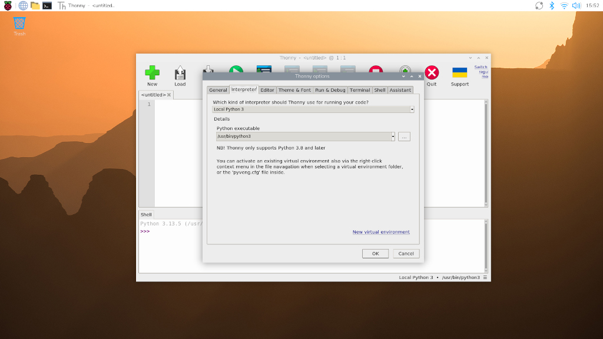

== Use Python on a Raspberry Pi

Raspberry Pi OS comes with Python 3 pre-installed. Interfering with the system Python installation can cause problems for your operating system. When you install third-party Python libraries, always use the correct package-management tools.

On Linux, you can install `python` dependencies in two ways:

* use `apt` to install pre-configured system packages
* use `pip` to install libraries using Python's dependency manager _in a virtual environment_
+
IMPORTANT: Starting in Raspberry Pi OS _Bookworm_, you can only use `pip` to install into a Python Virtual Environment (`venv`). This change was introduced by the Python community, not by Raspberry Pi: for more information, see https://peps.python.org/pep-0668/[PEP 668].

=== Install Python packages using `apt`

Packages installed via `apt` are packaged specifically for Raspberry Pi OS. These packages usually come pre-compiled, so they install faster. Because `apt` manages dependencies for all packages, installing with this method includes all of the sub-dependencies needed to run the package. And `apt` ensures that you don't break other packages if you uninstall.

For instance, to install the Python 3 library that supports the Raspberry Pi xref:../accessories/build-hat.adoc[Build HAT], run the following command:

[source,console]
----
$ sudo apt install python3-build-hat
----

To find Python packages distributed with `apt`, xref:os.adoc#search-for-software[use `apt search`]. In most cases, Python packages use the prefix `python-` or `python3-`: for instance, you can find the `numpy` package under the name `python3-numpy`.

=== Install Python libraries using `pip`

[[python-on-raspberry-pi]]

==== _Bookworm_ changes to `pip` installation

In older versions of Raspberry Pi OS, you could install libraries directly into the system version of Python using `pip`. Since Raspberry Pi OS _Bookworm_, users cannot install libraries directly into the system version of Python.

Instead, xref:os.adoc#use-pip-with-virtual-environments[install libraries into a virtual environment (`venv`)]. To install a library at the system level for all users, xref:os.adoc#install-python-packages-using-apt[install it with `apt`].

Attempting to install a Python package system-wide outputs an error similar to the following:

[source,console]
----
$ pip install buildhat
error: externally-managed-environment

× This environment is externally managed
╰─> To install Python packages system-wide, try apt install
  python3-xyz, where xyz is the package you are trying to
  install.

  If you wish to install a non-Debian-packaged Python package,
  create a virtual environment using python3 -m venv path/to/venv.
  Then use path/to/venv/bin/python and path/to/venv/bin/pip. Make
  sure you have python3-full installed.

  For more information visit http://rptl.io/venv

note: If you believe this is a mistake, please contact your Python installation or OS distribution provider. You can override this, at the risk of breaking your Python installation or OS, by passing --break-system-packages.
hint: See PEP 668 for the detailed specification.
----

Python users have long dealt with conflicts between OS package managers like `apt` and Python-specific package management tools like `pip`. These conflicts include both Python-level API incompatibilities and conflicts over file ownership.

Starting in Raspberry Pi OS _Bookworm_, packages installed via `pip` _must be installed into a Python virtual environment_ (``venv``). A virtual environment is a container where you can safely install third-party modules so they won't interfere with your system Python.

==== Use `pip` with virtual environments

To use a virtual environment, create a container to store the environment. There are several ways you can do this depending on how you want to work with Python:

[tabs]
======
per-project environments::
+
Many users create separate virtual environments for each Python project. Locate the virtual environment in the root folder of each project, typically with a shared name like `env`. Run the following command from the root folder of each project to create a virtual environment configuration folder:
+
[source,console]
----
$ python -m venv env
----
+
Before you work on a project, run the following command from the root of the project to start using the virtual environment:
+
[source,console]
----
$ source env/bin/activate
----
+
You should then see a prompt similar to the following:
+
[source,console?prompt=(env) $]
----
(env) $
----
+
When you finish working on a project, run the following command from any directory to leave the virtual environment:
+
[source,console?prompt=(env) $]
----
(env) $ deactivate
----

per-user environments::
+
Instead of creating a virtual environment for each of your Python projects, you can create a single virtual environment for your user account. **Activate that virtual environment before running any of your Python code.** This approach can be more convenient for workflows that share many libraries across projects.
+
When creating a virtual environment for multiple projects across an entire user account, consider locating the virtual environment configuration files in your home directory. Store your configuration in a https://en.wikipedia.org/wiki/Hidden_file_and_hidden_directory#Unix_and_Unix-like_environments[folder whose name begins with a period] to hide the folder by default, preventing it from cluttering your home folder.
+
Use the following command to create a virtual environment in a hidden folder in the current user's home directory:
+
[source,console]
----
$ python -m venv ~/.env
----
+
Run the following command from any directory to start using the virtual environment:
+
[source,console]
----
$ source ~/.env/bin/activate
----
+
You should then see a prompt similar to the following:
+
[source,console?prompt=(.env) $]
----
(.env) $
----
+
To leave the virtual environment, run the following command from any directory:
+
[source,console?prompt=(.env) $]
----
(.env) $ deactivate
----
======

===== Create a virtual environment

Run the following command to create a virtual environment configuration folder, replacing `<env-name>` with the name you would like to use for the virtual environment (e.g. `env`):

[source,console]
----
$ python -m venv <env-name>
----

TIP: Pass the `--system-site-packages` flag before the folder name to preload all of the currently installed packages in your system Python installation into the virtual environment.

===== Enter a virtual environment

Then, execute the `bin/activate` script in the virtual environment configuration folder to enter the virtual environment:

[source,console]
----
$ source <env-name>/bin/activate
----

You should then see a prompt similar to the following:

[source,console?prompt=(<env-name>) $]
----
(<env-name>) $
----

The `(<env-name>)` command prompt prefix indicates that the current terminal session is in a virtual environment named `<env-name>`.

To check that you're in a virtual environment, use `pip list` to view the list of installed packages:

[source,console?prompt=(<env-name>) $]
----
(<env-name>) $ pip list
Package    Version
---------- -------
pip        23.0.1
setuptools 66.1.1
----

The list should be much shorter than the list of packages installed in your system Python. You can now safely install packages with `pip`. Any packages you install with `pip` while in a virtual environment only install to that virtual environment. In a virtual environment, the `python` or `python3` commands automatically use the virtual environment's version of Python and installed packages instead of the system Python.

===== Exit a virtual environment

To leave a virtual environment, run the following command:

[source,console?prompt=(<env-name>) $]
----
(<env-name>) $ deactivate
----

=== Use the Thonny editor

We recommend https://thonny.org/[Thonny] for editing Python code on the Raspberry Pi.

By default, Thonny uses the system Python. However, you can switch to using a Python virtual environment by clicking on the **interpreter menu** in the bottom right of the Thonny window. Select a configured environment or configure a new virtual environment with `Configure interpreter...`.

