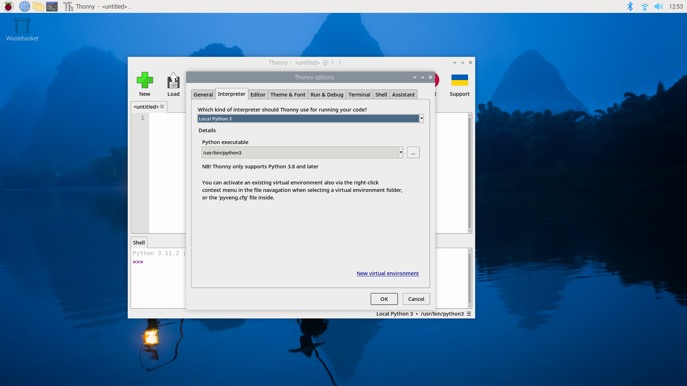

== Python on Raspberry Pi

Python 3 is installed by default on Raspberry Pi OS and is used for many important functions. Interfering with the system Python installation can cause problems for your operating system, so it's important that if you install third-party Python libraries, you use the correct package-management tools.

There are two routes to installing libraries into the default `python` distribution. You can use `apt` and install pre-configured system packages, or you can use `pip` to install packages which are not distributed as part of Raspberry Pi OS.

IMPORTANT: From _Bookworm_ onwards, packages installed via `pip` must be installed into a Python Virtual Environment using `venv`. This has been introduced by the Python community, not Raspberry Pi; see https://peps.python.org/pep-0668/[PEP 668] for more details.

=== Installing Python packages using apt

IMPORTANT: Installing packages using `apt` is the preferred method for installing Python libraries on Raspberry Pi OS. 

Packages installed via `apt` are tested, are usually pre-compiled so they install faster, and are designed for Raspberry Pi OS. They won't break your system. Installing via this route also means that all required dependencies are also installed, and a log of installation is maintained by the OS so installation can be easily rolled back (uninstalled) if needed.

For instance, to install the Python 3 library to support the Raspberry Pi xref:../accessories/build-hat.adoc[Build HAT] you would:

[source,bash]
----
$ sudo apt install python3-build-hat
----

...to install the pre-built library. 

Using `apt` makes installing larger packages, like `numpy` (which has many native dependencies including a Fortran compiler), much simpler than installing individual packages using Python's own package-management system.

If you want to install a Python library called "foobar" you can use `apt search foobar` to find the exact package name. In most cases, you'll find that the required package is going to be called `python-foobar` or `python3-foobar`.

=== About Python virtual environments

In previous versions of the operating system, it was possible to install libraries directly, system-wide, using the package installer for Python, commonly known as `pip`. You'll find the following sort of command in many tutorials online.

[source,bash]
----
$ pip install buildhat
----

In newer versions of Raspberry Pi OS, and other operating systems, this is disallowed. If you try and install a Python package system-wide you'll receive an error similar to this:

[source,bash]
----
$ pip install buildhat
error: externally-managed-environment

× This environment is externally managed
╰─> To install Python packages system-wide, try apt install
  python3-xyz, where xyz is the package you are trying to
  install.

  If you wish to install a non-Debian-packaged Python package,
  create a virtual environment using python3 -m venv path/to/venv.
  Then use path/to/venv/bin/python and path/to/venv/bin/pip. Make
  sure you have python3-full installed.

  For more information visit http://rptl.io/venv

note: If you believe this is a mistake, please contact your Python installation or OS distribution provider. You can override this, at the risk of breaking your Python installation or OS, by passing --break-system-packages.
hint: See PEP 668 for the detailed specification.
----

This error is generated because you're trying to install a third-party package into the system Python. A long-standing practical problem for Python users has been conflicts between OS package managers like `apt` and Python-specific package management tools like `pip`. These conflicts include both Python-level API incompatibilities and conflicts over file ownership.

Therefore from _Bookworm_ onwards, packages installed via `pip` must be installed into a Python virtual environment using `venv`. A virtual environment is a container where you can safely install third-party modules so they won't interfere with, or break, your system Python.

=== Using pip with virtual environments

To use a virtual environment you will need to create a container to store the environment. There are several ways you can do this depending on how you want to work with Python.

==== Using a separate environment for each project

One way you can proceed is to create a new virtual environment for each Python project you make. Here, you'll create a directory to hold your own code along with a virtual environment directory: 

[source,bash]
----
$ mkdir my_project
$ cd my_project
$ python -m venv env
----

If you now look inside the `my_project` directory you'll see a directory called `env`.

[source,bash]
----
$ ls -la
total 12
drwxr-xr-x  3 pi pi 4096 Oct  3 14:34 .
drwx------ 20 pi pi 4096 Oct  3 14:34 ..
drwxr-xr-x  5 pi pi 4096 Oct  3 14:34 env
$
----

NOTE: If you want to inherit the currently installed packages from the system Python, you should create your virtual environment using `python -m venv --system-site-packages env`.

Inside this directory is a full Python distribution. To activate your virtual environment and make that version of Python the one you're currently using, you should type:

[source,bash]
----
$ source env/bin/activate
(env) $
----

You'll see that your prompt is now prepended with `(env)` to indicate that you're no longer using the system Python. Instead, you're using the version of Python contained inside your virtual environment. Any changes you make here won't cause problems for your system Python; nor will any new modules you install into your environment.

[source,bash]
----
(env) $ which python
/home/pi/my_project/env/bin/python
----

If you install a third-party package, it'll install into the Python distribution in your virtual environment:

[source,bash]
----
(env) $ pip install buildhat
Looking in indexes: https://pypi.org/simple, https://www.piwheels.org/simple
Collecting buildhat
  Downloading https://www.piwheels.org/simple/buildhat/buildhat-0.5.12-py3-none-any.whl (57 kB)
     ━━━━━━━━━━━━━━━━━━━━━━━━━━━━━━━━━━━━━━━━ 57.8/57.8 kB 2.8 MB/s eta 0:00:00
Collecting gpiozero
  Downloading https://www.piwheels.org/simple/gpiozero/gpiozero-2.0-py3-none-any.whl (150 kB)
     ━━━━━━━━━━━━━━━━━━━━━━━━━━━━━━━━━━━━━━━ 150.5/150.5 kB 6.9 MB/s eta 0:00:00
Collecting pyserial
  Downloading https://www.piwheels.org/simple/pyserial/pyserial-3.5-py2.py3-none-any.whl (90 kB)
     ━━━━━━━━━━━━━━━━━━━━━━━━━━━━━━━━━━━━━━━━ 90.6/90.6 kB 7.5 MB/s eta 0:00:00
Collecting colorzero
  Downloading https://www.piwheels.org/simple/colorzero/colorzero-2.0-py2.py3-none-any.whl (26 kB)
Requirement already satisfied: setuptools in ./env/lib/python3.11/site-packages (from colorzero->gpiozero->buildhat) (66.1.1)
Installing collected packages: pyserial, colorzero, gpiozero, buildhat
Successfully installed buildhat-0.5.12 colorzero-2.0 gpiozero-2.0 pyserial-3.5
(env) $
----

Now, if you `pip list`, you'll see that your current version of Python includes your new modules. 

[source,bash]
----
(env) $ pip list
Package    Version
---------- -------
buildhat   0.5.12
colorzero  2.0
gpiozero   2.0
pip        23.0.1
pyserial   3.5
setuptools 66.1.1
----

After writing your code, you can run it from the command line inside the virtual environment as you'd expect, by invoking Python as usual.

[source,bash]
----
(env) $ ls -la
total 12
drwxr-xr-x  3 pi pi 4096 Oct  3 14:34 .
drwx------ 20 pi pi 4096 Oct  3 14:34 ..
drwxr-xr-x  5 pi pi 4096 Oct  3 14:34 env
-rw-r--r--  1 pi pi    0 Oct  3 14:45 my_code.py
(env) $ python my_code.py
Hello World!
(env) $
----

You can leave your virtual environment and return to using the system Python by typing:

[source,bash]
----
(env) $ deactivate
$
----

...and demonstrate to yourself you've done so by checking the installed packages using `pip list`. 

==== Using a separate environment for each user

An alternative method to creating a virtual environment for each of your Python projects is to create a single virtual environment for your user account, and then activate that environment before running any of your Python code. This approach may be preferred if you commonly install the same set of modules for each project, and don't want to have to bother creating individual Python environments for each project, essentially just duplicating your environment.

[source,bash]
----
$ python -m venv ~/.env
$ source ~/.env/bin/activate
(.env) $
----

You can again check you're in a separate environment by using `pip list`,

[source,bash]
----
(.env) $ pip list
Package    Version
---------- -------
pip        23.0.1
setuptools 66.1.1
----

and leave it using `deactivate`.

[source,bash]
----
(.env) $ deactivate
$
----

=== Using the Thonny editor

https://thonny.org/[Thonny] is our recommended editor when you're working with Python on the Raspberry Pi. By default Thonny uses the system Python. However, you can switch to using a Python virtual environment by clickin on the interpreter menu located at the bottom right of the Thonny window. Clicking on this will offer you a menu to select a configured interpreter or to `Configure interpreter…`. 

Selecting this will open a popup allowing you to create a new virtual environment.