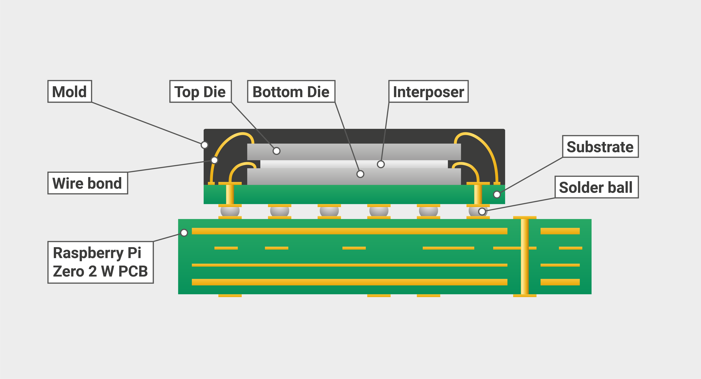

== RP3A0

The Raspberry Pi RP3A0 is our first System-in-Package (SiP) consisting of a Broadcom BCM2710A1 — which is the silicon die packaged inside the Broadcom xref:processors.adoc#bcm2837[BCM2837] chip which is used on the xref:raspberry-pi.adoc#raspberry-pi-3-model-b-2[Raspberry Pi 3] — along with 512MB of DRAM. 

It is used by the xref:raspberry-pi.adoc#raspberry-pi-zero-2-w[Raspberry Pi Zero 2 W].

The RP3A0 is a Quad-core 64-bit Arm Cortex A53 CPU clocked at 1 GHz, although with a heat sink or other cooling solution in place, the chip can be potentially overclocked to 1.2 GHz.

Please refer to the following BCM2836 document for details on the ARM peripherals specification, which also applies to the BCM2837 and RP3A0.

* https://datasheets.raspberrypi.com/bcm2836/bcm2836-peripherals.pdf[BCM2836 ARM-local peripherals]
* https://developer.arm.com/documentation/ddi0500/latest/[Cortex-A53 MPCore Processor Technical Reference Manual]

[NOTE]
====
The original xref:raspberry-pi.adoc#raspberry-pi-zero[Raspberry Pi Zero] uses Package-on-Package (PoP) DRAM, where the DRAM is soldered directly on top of the xref:processors.adoc#bcm2835[BCM2835] chip. 
====
