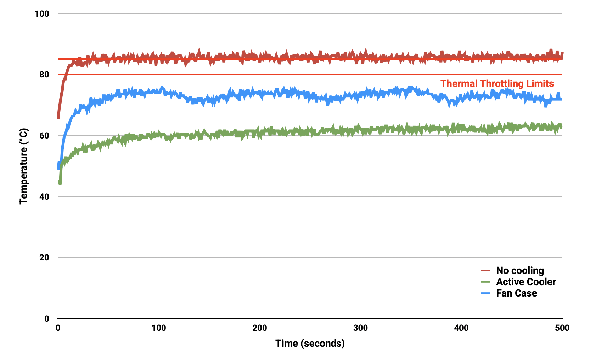

== Cooling Raspberry Pi 5

Raspberry Pi 5 has been designed to handle typical client workloads, uncased, with no active cooling. For heavier loads there are two official options when it comes to cooling your Raspberry Pi 5. Both of these plug into the four-pin JST-SH PWM fan connector located in the upper right of the board, between the 40-pin GPIO header and the USB 2 ports.

Both of the available official accessories are actively managed by the Raspberry Pi firmware. As the temperature of the Raspberry Pi increases, the fan reacts in the following way:

* below 50°C, the fan does not spin at all (0% speed)
* at 50°C, the fan turns on at a low speed (30% speed)
* at 60°C, the fan speed increases to a medium speed (50% speed)
* at 67.5°C, the fan speed increases to a high speed (70% speed)
* at 75°C the fan increases to full speed (100% speed)

The same mapping of temperature ranges to fan speeds applies to temperature decreases as well, with a 5°C **hysteresis**; fan speed decreases when the temperature drops to 5°C below each of the above thresholds.

NOTE: The USB ports and fan connector both pull from the same 1.6A current limit.

At boot the fan is turned on, and the tacho input is checked to see if the fan is spinning. If it is, then the `cooling_fan` device tree overlay is enabled. This overlay is in `bcm2712-rpi-5-b.dtb` by default, but with `status=disabled`.

=== Fan Case

.The official Case for Raspberry Pi 5
image::images/case.jpg[alt="Case with integrated fan for Raspberry Pi 5",width="70%"]

The official Case for Raspberry Pi 5 comes with an integrated fan. HATs can be fitted directly on top of Raspberry Pi 5 by removing the fan, or on top of the fan by use of 14mm high standoffs and a 19mm GPIO extender. These are available separately from Authorised Resellers.

The integrated 2.79 (max) CFM fan has fluid dynamic bearings selected for low noise and an extended operating lifetime. Air is drawn in through a 360° slot under the lid, and blown over a heatsink attached to the BCM2712. It is then exhausted through connector apertures and vents in the base.

=== Active Cooler

.The Active Cooler for Raspberry Pi 5
image::images/active-cooler.jpg[alt="Active Cooler for Raspberry Pi 5",width="70%"]

The Active Cooler is a single-piece anodised aluminium heatsink with an integrated blower. It has pre-applied thermal pads for heat transfer, and is mounted to the Raspberry Pi 5 board directly using spring-loaded push pins. It connects to the same four-pin JST-SH connector as the case fan.

A radial blower, again selected for low noise and extended operating lifetime, pushes air through an extruded and milled aluminium heatsink. The cooling performance of the Active Cooler is somewhat superior to the Fan Case, making it particularly suitable for overclockers.

NOTE: Blowers are electromechanical systems that direct air towards a specific direction using a fan and designated channels. While fans displace large volumes of air and promote circulation within a designated area, blowers provide a degree of air pressurisation to drive it out and forward.

The Active Cooler has not been designed to be repeatedly removed from the Raspberry Pi 5.

=== Thermals

A stress test was started on all four cores of the Raspberry Pi 5 to load the CPU. Two main thermal management regimes were examined during the test: no cooling, and managed active cooling. The managed active cooling tests were run using both the Active Cooler, and the Raspberry Pi Case for Raspberry Pi 5. 

.Graph of CPU temperature against time. 

With no cooling, we see an idle temperature of approximately 65°C, with a maximum temperature above 85°C during extended testing leading to sustained thermal throttling after the temperature reported by the processor rises above throttling limits. 

Thanks to the passive heatsink that is fitted with the Active Cooler, we see a much lower idle temperature, at around 45°C. During extended testing under load, the fan of the Cooler spins up at low speed to stabilise the CPU temperature at 60°C, with maximum temperatures of 62 to 63°C being seen during the tests.

Using the fan case we see idle temperatures a couple of degrees hotter than with the Active Cooler on its own, at around 48°C. With the lid removed we see a maximum temperature of approximately 72°C under sustained load, and with the lid in place we see a marginally higher maximum of around 74°C under load. While temperature under load is higher than with the Active Cooler, the maximum temperature under load is still well below the 80 and 85°C throttling temperatures.

Raspberry Pi 5 has been designed to handle typical client workloads, uncased, with no active cooling. For normal use adding cooling is optional, although performance may improve with active cooling. However a heavy continuous load, such as rebuilding the Linux kernel, will force the new Raspberry Pi 5 into thermal throttling. For heavy loads thermal throttling can extend processing times, and passive cooling is probably insufficient thermal management. 

However, cooling of any type isn't mandatory, and no harm will come to the Raspberry Pi if left uncooled.

=== Pinout

The fan connector is a 1mm pitch JST-SH socket containing the following four pins:

[cols="1,2,2",width="50"%"]
|===
| Pin | Function | Wire colour
| 1 | +5V | Red
| 2 | PWM | Blue
| 3 | GND | Black
| 4 | Tach | Yellow
|===

The official fan is a Coolcox https://www.coolcox.com/products/pdf/CC3007.pdf[CC3007H05S] part.
