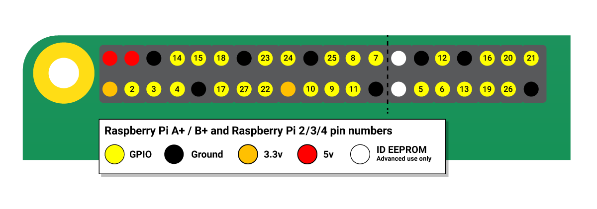

== Raspberry Pi and GPIO

Using the https://gpiozero.readthedocs.io/[GPIO Zero] library makes it easy to get started with controlling GPIO devices with Python. The library is comprehensively documented at https://gpiozero.readthedocs.io/[gpiozero.readthedocs.io].

More information about using the GPIO pins on Raspberry Pi can be found xref:raspberry-pi.adoc#gpio-and-the-40-pin-header[elsewhere in the documentation].