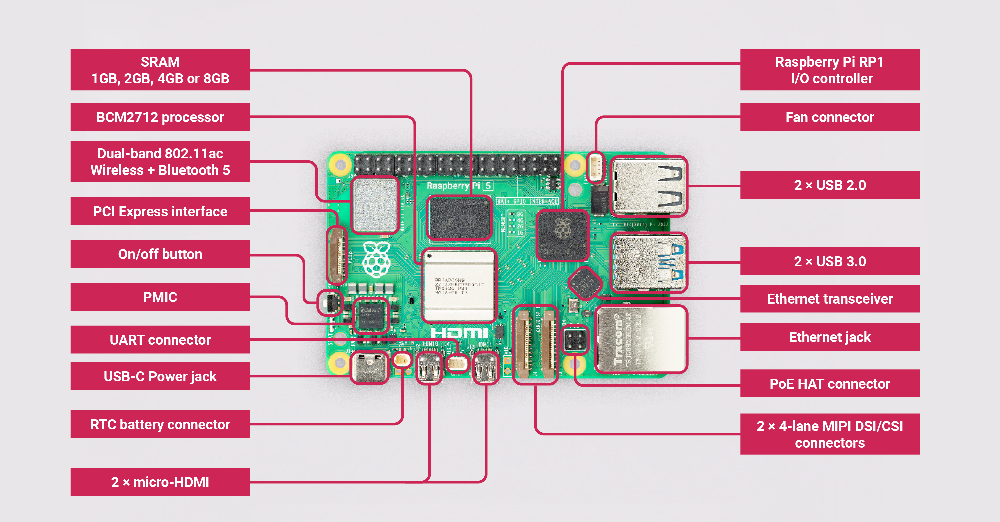

== Introduction

.Raspberry Pi 5

Featuring a 64-bit quad-core Arm Cortex-A76 processor running at 2.4GHz, Raspberry Pi 5 delivers a ×2 to ×3 increase in CPU performance relative to Raspberry Pi 4. Alongside a substantial uplift in graphics performance from an 800MHz VideoCore VII GPU; dual 4Kp60 display output over HDMI; and state-of-the-art camera support from a rearchitected Raspberry Pi Image Signal Processor, it provides a smooth desktop experience for consumers, and opens the door to new applications for industrial customers.

For the first time, this is a full-size Raspberry Pi computer using silicon built in-house at Raspberry Pi. The RP1 provides the bulk of the I/O capabilities for Raspberry Pi 5, and delivers a step change in peripheral performance and functionality. Aggregate USB bandwidth is more than doubled, yielding faster transfer speeds to external UAS drives and other high-speed peripherals; the dedicated two-lane 1Gbps MIPI camera and display interfaces present on earlier models have been replaced by a pair of four-lane 1.5Gbps MIPI transceivers, tripling total bandwidth, and supporting any combination of up to two cameras or displays; peak SD card performance is doubled, through support for the SDR104 high-speed mode; and for the first time the platform exposes a single-lane PCI Express 2.0 interface, providing support for high-bandwidth peripherals.

=== Key features

Key features include:

* Quad Arm Cortex-A76 @ 2.4GHz
* 512KB per-core L2 caches
* 2MB L3 cache
* 4GB or 8GB LPDDR4X-4267 SDRAM
* Dual 4kp60 HDMI display output with HDR support
* 4kp60 HEVC decoder
* VideoCore VII graphics, with OpenGL-ES 3.1, Vulkan 1.2
* Raspberry Pi Image Sensor Pipeline (ISP)
* Raspberry Pi connector for PCIe (1 x 2.0 port, additional HAT required)
* 802.11ac dual-band Wi-Fi
* Bluetooth 5.0 (with BLE support)
* Gigabit Ethernet
* 2x USB 3.0 (capable of simultaneous full throughput)
* 2x USB 2.0
* PoE support (additional HAT required)
* Dual 4-lane MIPI CSI/DSI transceivers, supporting
** 2x display; or
** 2x camera; or
** 1x display + 1x camera
* Raspberry Pi 40-pin GPIO header
* Fan connector
* Real Time Clock (RTC)
** RTC battery connector
* Power button

=== Power button

The Raspberry Pi 5 has a power button. However, when you plug your Raspberry Pi into power it will automatically turn on without having to push the button. 

While your Raspberry Pi is running you can initiate a clean shutdown by pressing the Power Button, and then releasing it. If you want to force a hard shutdown, you should press and hold the Power Button.

If the Raspberry Pi board is powered, but turned off, pressing the power button will restart the board.

Default shutdown wattage is around 1 to 1.4W, this can be decreased by manually editing the EEPROM configuration, `sudo rpi-eeprom-config -e` and change the settings to:

[source]
----
BOOT_UART=1
POWER_OFF_ON_HALT=1
BOOT_ORDER=0xf416
----

This should drop the shutdown power consumption to around 0.01W.

=== Updating your firmware

While firmware updates are rare, if you run into a problem with your Raspberry Pi you may want to check to see if one is available. You can do so as below:

[source,bash]
----
sudo apt update
sudo apt upgrade
sudo rpi-eeprom-update -a
----
