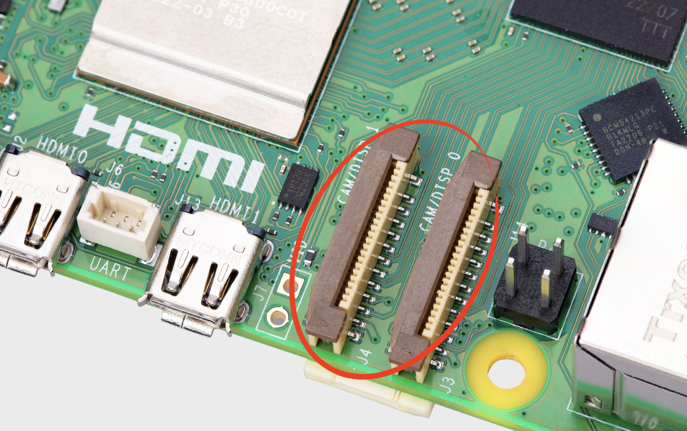

== MIPI CSI/DSI connectors

.The two MIPI connectors

The CSI and DSI ports found on previous models of Raspberry Pi have been combined into two dual-purpose CSI/DSI (MIPI) ports. To fit onto the board these now use a denser connector pinout, previously only found on Raspberry Pi Zero and the CM4IO board. You can connect two displays, two cameras, or one camera and one display to these ports.

=== Attaching cameras

There is no configuration necessary for Raspberry Pi devices like xref:../accessories/camera.adoc[cameras]. If you plug a camera into either MIPI connector you will get an appropriate CSI connection, and your camera will be made available to the OS.

==== Camera cables

.Camera cables
image::images/camera-cables.jpg[alt="Camera cables",width="70%"]

There are three Flat Flexible Cables (FFC) available to connect CSI cameras to the Raspberry Pi 5:

* 200 mm camera cable standard to mini
* 300 mm camera cable standard to mini
* 500 mm camera cable standard to mini

NOTE: The Compute Module cable adapters, see https://datasheets.raspberrypi.com/cmcda/cmcda-schematics.pdf[schematics] and https://datasheets.raspberrypi.com/cmcda/RPi-CMCDA-1P1.zip[design files], can be used to connect standard cables to the higher-density mini connectors.

=== Attaching a display

If you are using our xref:../accessories/display.adoc[7-inch Touch Display] with Raspberry Pi 5, it will not automatically be configured. You will need to add one of the following two lines to your `/boot/firmware/config.txt` file. Attaching the display to the `CAM/DISP 1` connector you should add:

[source,bash]
----
dtoverlay=vc4-kms-dsi-7inch
----

alternatively, attaching it to the `CAM/DISP 0` connector you can add the following line:

[source,bash]
----
dtoverlay=vc4-kms-dsi-7inch,dsi0
----

WARNING: At the time of writing, to get touch support on the 7-inch Touch Display you will need to `rpi-update` to get a newer kernel.

==== Available display cables

.Display cables
image::images/display-cables.jpg[alt="Display cables",width="70%"]

There are three Flat Flexible Cables (FFC) available to connect DSI displays to the Raspberry Pi 5:

* 200 mm display cable standard to mini
* 300 mm display cable standard to mini
* 500 mm display cable standard to mini

=== Using non-Raspberry Pi devices

If you are using a non-Raspberry Pi MIPI device — either a camera, or a display — it will not be automatically configured for your Raspberry Pi 5. Instead you will need to add a `dtoverlay` setting into the `/boot/firmware/config.txt` file to correctly configure the right port for the right camera or display.

These `dtoverlay` settings should be provided by the manufacturer of your device. For example, adding `dtoverlay=ov9281` would configure an Omnivision OV9281-based camera on CSI/DSI1, while adding `dtoverlay=ov9281,cam0` would add the same camera to CSI/DSI0.
