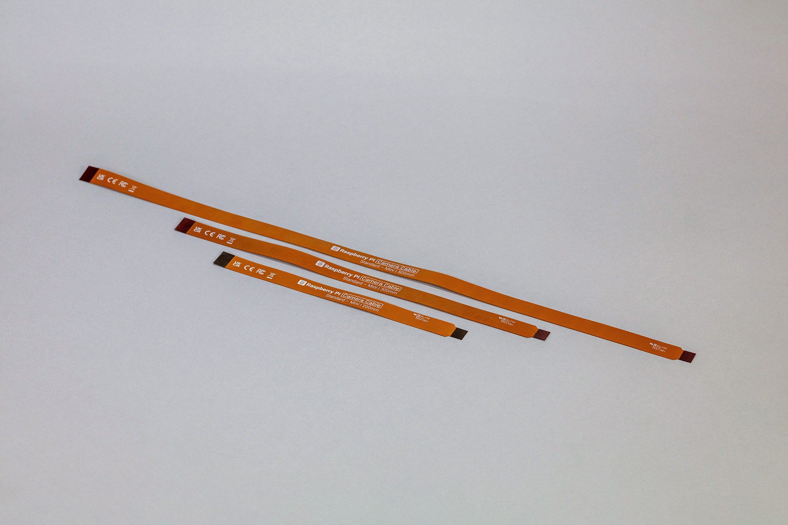
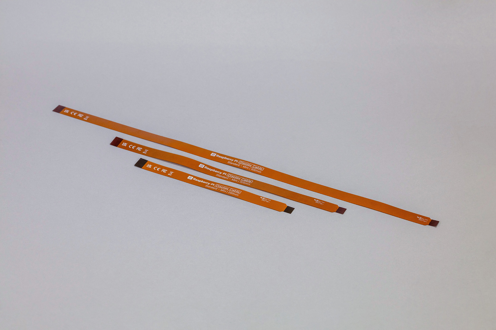

== MIPI CSI/DSI connectors

.The two MIPI connectors
image::images/mipi-connectors.png[alt="The two MIPI connectors",width="70%"]

The CSI and DSI ports found on previous models of Rasbpberry Pi have been combined into two multi-purpose CSI/DSI (MIPI) ports. To fit onto the board these now using the denser connector pinout prevously only found on Raspberry Pi Zero and the CM4IO board. You can connect either two displays, or two cameras (or one camera and one display) to these ports.

NOTE: The Compute Module cable adaptors, see https://datasheets.raspberrypi.com/cmcda/cmcda-schematics.pdf[schematics] and https://datasheets.raspberrypi.com/cmcda/RPi-CMCDA-1P1.zip[design files], can be used to connect standard cables to the higher density "mini" connectors.

There is no configuration necessary for Raspberry Pi devices. If you plug in a camera or disaply into the MIPI connector you get an appropriate CSI or DSI connection and the device will be available to the OS.

=== Non-Raspberry Pi devices

If you are using a non-Raspberry Pi MIPI device with the Raspberry Pi 5 it will not be automatically configured. Instead you will need to add a `dtoverlay` setting into the `/boot/firmware/config.txt` file to correctly configure the right port for the right camera or display.

These `dtoverlay` settings should be provided by the manufactuer of your device, but will be along the lines of adding `dtoverlay=ov9281` would add an Omnivision OV9281 based camera to CSI/DSI1, or `dtoverlay=ov9281,cam0` for CSI/DSI0.

=== Camera cables

.Camera cables

There are three Flat Flexible Cable (FFC) available to connect CSI cameras to the Raspberry Pi 5:

* 200 mm camera cable Standard to Mini
* 300 mm camera cable Standard to Mini
* 500 mm camera cable Standard to Mini

=== Display cables

.Display cables

There are three Flat Flexible Cable (FFC) available to connect DSI displays to the Raspberry Pi 5:

* 200 mm display cable Standard to Mini
* 300 mm display cable Standard to Mini
* 500 mm display cable Standard to Mini