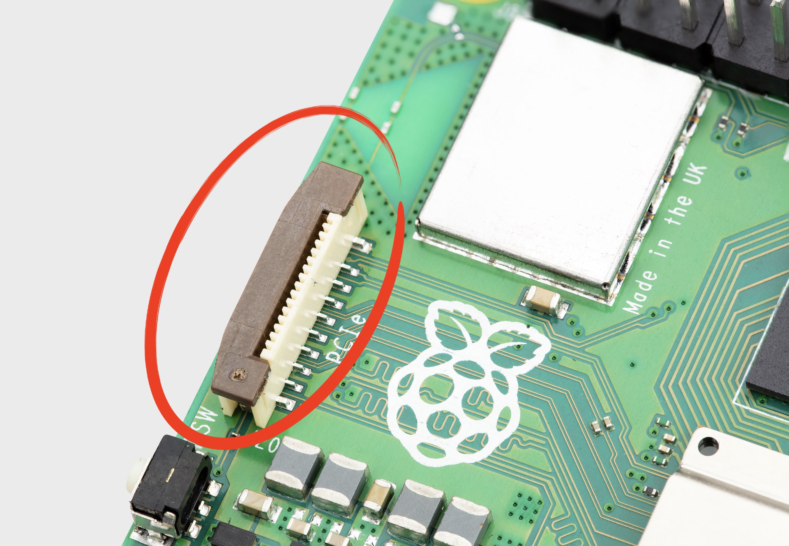

== Raspberry Pi connector for PCIe

.Raspberry Pi connector for PCIe

Raspberry Pi 5 has an FPC connector on the right-hand side of the board. This connector breaks out PCIe Gen 2.0 x1 interface for fast peripherals. 

NOTE: An M.2 HAT which provides an M.2 connector to allow the use of NVMe drives is still in prototype, and has not yet been released.

More information around the PCIe FPC connector pin out, and other details needed to create third-party devices, accessories, and HATs, see the https://datasheets.raspberrypi.com/pcie/pcie-connector-standard.pdf[Raspberry Pi Connector for PCIe] standards document. It should be read alongside the new https://datasheets.raspberrypi.com/hat/hat-plus-specification.pdf[Raspberry Pi HAT+ Specification].

=== Enabling PCIe

By default the PCIe connector is not enabled. To enable it you should add the following option into `/boot/firmware/config.txt` and reboot:

[source]
----
# Enable the PCIe External connector.
dtparam=pciex1
----

A more memorable alias for `pciex1` exists, so you can alternatively add `dtparam=nvme` to the `/boot/firmware/config.txt` file.

NOTE: Enumeration of PCIe devices behind a switch is https://github.com/raspberrypi/firmware/issues/1833[not currently supported].

=== PCIe Gen 3.0

The connection is certified for Gen 2.0 speeds (5 GT/sec), but you can force it to Gen 3.0 (10 GT/sec) if you add the following lines to your `/boot/firmware/config.txt`.

[source]
----
# Enable the PCIe external connector
dtparam=pciex1

# Force Gen 3.0 speeds
dtparam=pciex1_gen=3
----

WARNING: The Raspberry Pi 5 is not certified for Gen 3.0 speeds, and connections to PCIe devices at these speeds may be unstable. 

You should then reboot your Raspberry Pi for these settings to take effect.

=== Booting from PCIe

Once enabled, and after you reboot, an NVMe disk attached via the PCIe should be visible. However, your Raspberry Pi won't try to boot off the NVMe drive. If you wish to enable boot support you will need to change the `BOOT_ORDER` in the bootloader configuration. Edit the EEPROM configuration by,

[source]
----
sudo rpi-eeprom-config --edit
----

and change the `BOOT_ORDER` line to be as below.

[source]
----
BOOT_ORDER=0xf416
----

If you are booting from a non-HAT+ device you should also add,

[source]
----
PCIE_PROBE=1
----

to the EEPROM configuration. This is not needed if your NVMe device is https://datasheets.raspberrypi.com/hat/hat-plus-specification.pdf[a HAT+].

IMPORTANT: For boards that follow the new https://datasheets.raspberrypi.com/hat/hat-plus-specification.pdf[HAT+ standard], you will not need to modify either the `config.txt` file or the EEPROM configuration.

After saving your changes, reboot your Raspberry Pi to update the EEPROM.

NOTE: Your Raspberry Pi will not boot from an attached NVMe drive unless you have the external PCIe port enabled, and there's an NVMe drive with a valid boot partition attached to the PCIe bus.
