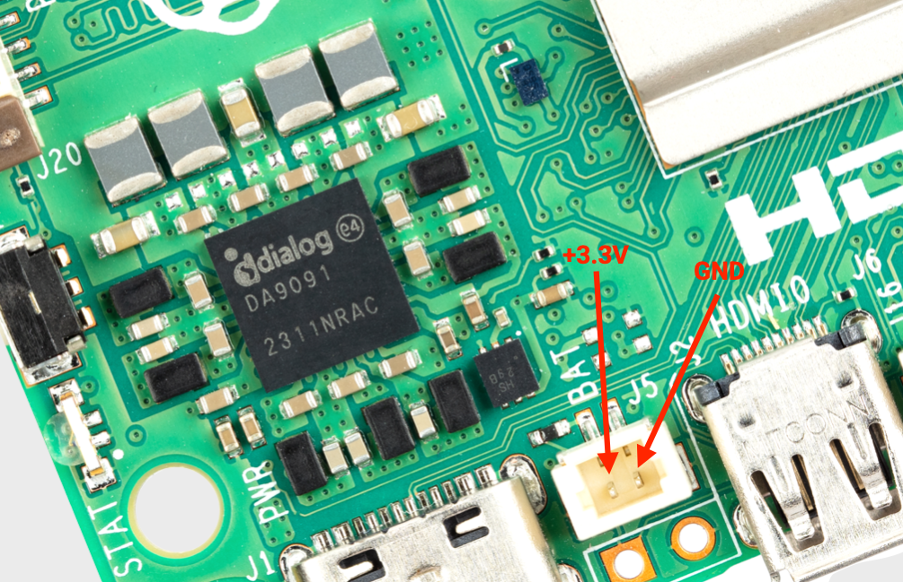
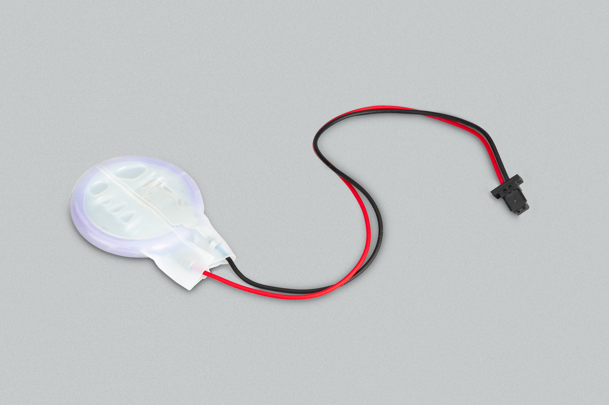

== Real Time Clock (RTC)

The Raspberry Pi 5 includes an RTC module. This can be battery powered via the J5 (BAT) connector on the board located to the right of the USB-C power connector. 

.The J5 battery connector

You can set a wake alarm which will switch the board to a very low-power state (approximately 3mA). When the alarm time is reached, the board will power back on. This can be useful for periodic jobs like time-lapse imagery.

To support the low-power mode for wake alarms you should edit the bootloader config:

[source,bash]
----
sudo -E rpi-eeprom-config --edit
----

adding the following two lines.

[source, bash]
----
POWER_OFF_ON_HALT=1
WAKE_ON_GPIO=0
----

You can test the functionality with:

[source,bash]
----
echo +600 | sudo tee /sys/class/rtc/rtc0/wakealarm
sudo halt
----

That will halt the board into a very low-power state, then wake and restart after 10 minutes.

The RTC also provides the time on boot e.g. in `dmesg`:

[source,bash]
----
[    1.295799] rpi-rtc soc:rpi_rtc: setting system clock to 2023-08-16T15:58:50 UTC (1692201530)
----

...which may be useful if you don't have an internet connection for getting time through NTP.

NOTE: The RTC is still usable even when there is no backup battery attached to the J5 connector. 

=== Adding a backup battery

WARNING: We do not recommend using a primary lithium cell for the RTC, as it has a trickle charge circuit which is disabled by default. If enabled, this will kill the cell quickly. 

.Lithium-manganese rechargeable RTC battery

The official battery part is a rechargeable lithium manganese coin cell, with a pre-fitted two-pin JST-SH plug and an adhesive mounting pad. This is suitable for powering the Raspberry Pi 5 RTC when the main power supply for the board is disconnected, with a power-off current draw measuring in single-digit µA, giving a retention time that can be measured in months.

=== Enabling trickle charging

Trickle charging of the battery is disabled by default. There are `sysfs` files that show the current trickle charging voltage and limits:

[source,bash]
----
/sys/devices/platform/soc/soc:rpi_rtc/rtc/rtc0/charging_voltage:0
/sys/devices/platform/soc/soc:rpi_rtc/rtc/rtc0/charging_voltage_max:4400000
/sys/devices/platform/soc/soc:rpi_rtc/rtc/rtc0/charging_voltage_min:1300000
----

If you add https://github.com/raspberrypi/firmware/blob/master/boot/overlays/README#L279[`rtc_bbat_vchg`] to `/boot/firmware/config.txt`:

[source,bash]
----
dtparam=rtc_bbat_vchg=3000000
----

...and reboot, you'll see:

[source,bash]
----
/sys/devices/platform/soc/soc:rpi_rtc/rtc/rtc0/charging_voltage:3000000
/sys/devices/platform/soc/soc:rpi_rtc/rtc/rtc0/charging_voltage_max:4400000
/sys/devices/platform/soc/soc:rpi_rtc/rtc/rtc0/charging_voltage_min:1300000
----

The battery will be trickle charging. Remove the `dtparam` line from `config.txt` to stop the trickle charging.
