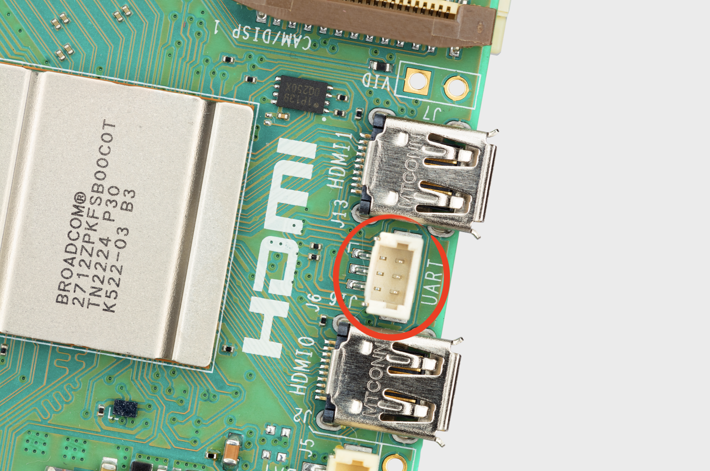
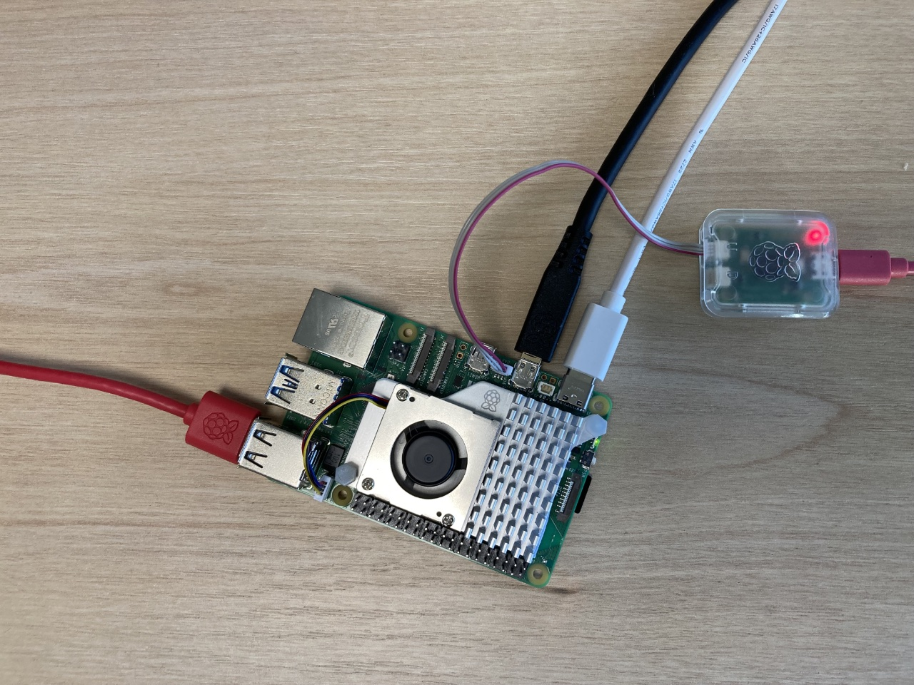
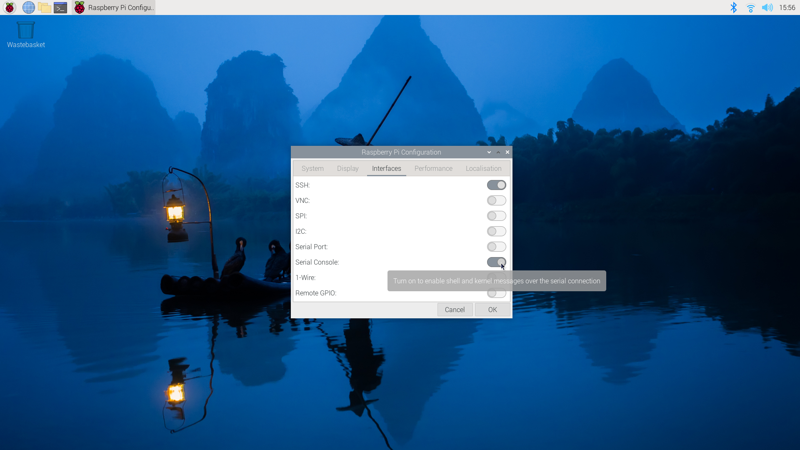

== UART connector

The Raspberry Pi 5 has a dedicated debug UART connector. It has a maximum baud rate of 921,600bps, which can be configured with an EEPROM parameter. It is always active and enabled, and provides direct access to early boot and firmware information; as well as a Linux console after boot.

.The three-pin UART connector

The UART connector is a three-pin header compatible with the Raspberry Pi Debug Connector https://rptl.io/debug-spec[specification]. A cable terminating in an appropriate JST connector allowing you to connect to the UART is provided with the xref:../microcontrollers/debug-probe.adoc[Debug Probe].

.The Raspberry Pi Debug Probe connected to Raspberry Pi 5

By default it offers a 115,200 baud 8N1 connection on `/dev/ttyAMA0` (aliased to `/dev/serial0`).

=== Creating a serial console

.Enabling a serial console

Unlike previous Raspberry Pi models, where you could enable a serial console on GPIO14 and 15, enabling a serial console from `raspi-config` will enable a serial console on the new UART connector on `/dev/ttyAMA0` on Raspberry Pi 5.

