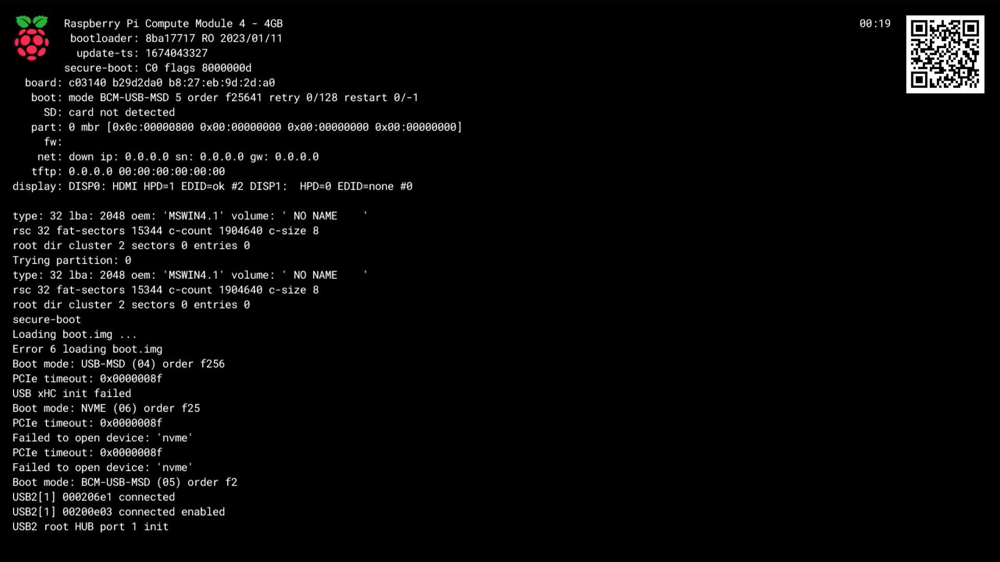

== Boot Diagnostics on the Raspberry Pi 4

Starting with version 2020-04-16 of the Raspberry Pi 4 bootloader, diagnostic information can be displayed at boot time on an HDMI display. To see this diagnostic information, power down the Raspberry Pi 4, remove the SD card, then power back up. A diagnostic display similar to below should appear on the attached display.

This diagnostics page will also appear if the bootloader is unable to boot from an inserted SD card, or is unable to network boot; for example, if there is no bootable image on the card, or it is defective, or the network boot parameters are incorrect.

Once the diagnostics page is displayed, a reboot is only possible by power cycling the device (i.e. unplug then re-plug the power supply).

The top line describes the model of Raspberry Pi and its memory capacity. The QR code is a link to the https://www.raspberrypi.com/software/[Downloads Page].

The diagnostic information is as follows:

|===
| Line: | Information

| bootloader
| Bootloader git version - RO (if EEPROM is write protected) - software build date

| update-ts
| The timestamp corresponding to when the EEPROM configuration was updated.  This timestamp is checked in xref:raspberry-pi.adoc#ENABLE_SELF_UPDATE[self-update] mode to avoid updating to an old configuration.

| secure-boot
| If xref:raspberry-pi.adoc#secure-boot[secure-boot] is enabled then the processor revision (B0/C0) and xref:configuration.adoc#part4[signed-boot status flags] are displayed. Otherwise, this line is blank.

| board
| xref:raspberry-pi.adoc#raspberry-pi-revision-codes[Board revision] - Serial Number - Ethernet MAC address

| boot
| *mode* (current boot mode name and number) *order* (the xref:raspberry-pi.adoc#BOOT_ORDER[BOOT ORDER] configuration) *retry* (retry count in the current boot mode) *restart* (number of cycles through the list of boot modes).

| SD
| The SD card detect status (detected / not detected).

| part
| Master Boot Record primary partitions type:LBA.

| fw
| Filename for start.elf and fixup.dat if present (e.g. start4x.elf, fixup4x.dat).

| net
| Network boot: - Link status (up/down) client IP address (ip), Subnet (sn), Default gateway (gw)

| tftp
| Network boot: TFTP server IP address

| display
| Indicates whether hotplug was detected (`HPD=1`) and if so whether the EDID was read successfully (`EDID=ok`) for each HDMI output.
|===

This display can be disabled using the `DISABLE_HDMI` option, see xref:raspberry-pi.adoc#raspberry-pi-4-bootloader-configuration[Bootloader Configuration].

NOTE: This is purely for diagnosing boot failures; it is not an interactive bootloader. If you require an interactive bootloader, consider using a tool such as U-Boot.
