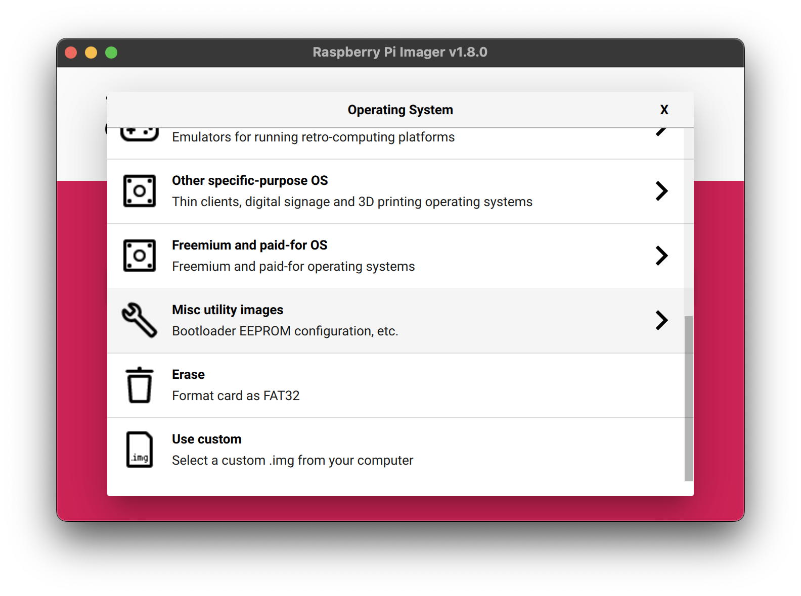
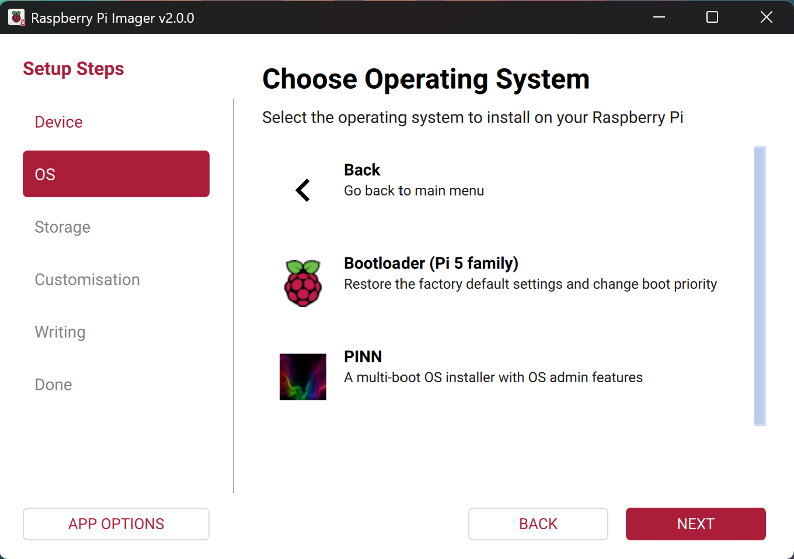
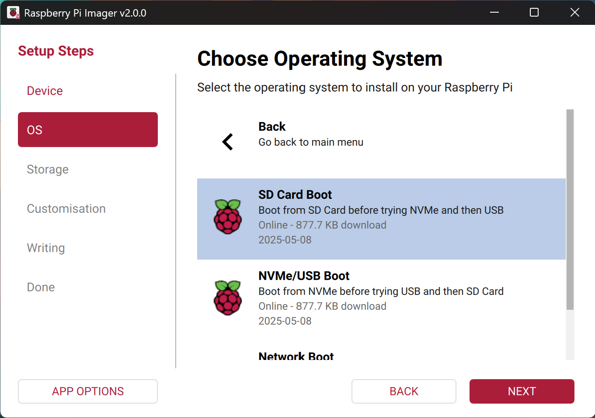

== Raspberry Pi 4 Boot EEPROM

Raspberry Pi 4, 400, Compute Module 4, and Compute Module 4S computers use an EEPROM to boot the system. All other models of Raspberry Pi computer use the `bootcode.bin` file located in the boot filesystem.

NOTE: The scripts and pre-compiled binaries used to create the `rpi-eeprom` package which is used to update the Raspberry Pi 4 bootloader and VLI USB controller EEPROMs is available https://github.com/raspberrypi/rpi-eeprom/[on Github].

=== Boot Diagnostics

If an error occurs during boot then an xref:configuration.adoc#led-warning-flash-codes[error code] will be displayed via the green LED. Newer versions of the bootloader will display a xref:raspberry-pi.adoc#boot-diagnostics-on-the-raspberry-pi-4[diagnostic message] which will be shown on both HDMI displays.

[[bootloader_update_stable]]
=== Update the Bootloader

There are multiple ways to update the bootloader of your Raspberry Pi.

==== Raspberry Pi 4 and Raspberry Pi 400

Raspberry Pi OS automatically updates the bootloader for critical bug fixes. The recommended methods for manually updating the bootloader or changing the boot modes are https://www.raspberrypi.com/software/[Raspberry Pi Imager] and xref:configuration.adoc#raspi-config[raspi-config]

[[imager]]
==== Using Raspberry Pi Imager to update the bootloader

Raspberry Pi Imager provides a GUI for updating the bootloader and selecting the boot mode.

. Download https://www.raspberrypi.com/software/[Raspberry Pi Imager]
. Select a spare SD card (bootloader images overwrite the entire card)
. Launch Raspberry Pi Imager
. Select **Choose OS**
. Select **Misc utility images**
+ 

. Select **Bootloader** for your Raspberry Pi device version (Pi 400 is part of the 4 family)
+ 

. Select a boot mode: **SD** (recommended), **USB** or **Network**
+ 

. Select **SD card** and then **Write**
. Click **Yes** to continue
. Boot the Raspberry Pi with the new image and wait for at least 10 seconds
. When the green activity LED blinks with a steady pattern and the HDMI display shows a green screen, you have successfully written the bootloader
. Power off the Raspberry Pi and remove the SD card

[[raspi-config]]
==== Using raspi-config to update the bootloader

To change the boot-mode or bootloader version from within Raspberry Pi OS run xref:configuration.adoc#raspi-config[raspi-config]

. xref:os.adoc#updating-and-upgrading-raspberry-pi-os[Update] Raspberry Pi OS to get the latest version of the `rpi-eeprom` package
. Run `sudo raspi-config`
. Select `Advanced Options`
. Select `Bootloader Version`
. Select `Default` for factory default settings or `Latest` for the latest stable bootloader release
. Reboot

=== Updating the EEPROM Configuration

The default version of the bootloader is only updated for critical fixes and major releases. The `LATEST/STABLE` bootloader updates more often to include the latest fixes and improvements.

Advanced users can switch to the `LATEST / STABLE` bootloader to get the latest functionality.
Open a command prompt and start `raspi-config`.

----
sudo raspi-config
----

Navigate to `Advanced Options` and then `Bootloader Version`. Select `Latest` and choose `Yes` to confirm. Select `Finish` and confirm you want to reboot. After the reboot, open a command prompt again and update your system:

----
sudo apt update
----

If you run `rpi-eeprom-update`, you should see that a more recent version of the bootloader is available and it's the `stable` release.

----
*** UPDATE AVAILABLE ***
BOOTLOADER: update available
   CURRENT: Tue 25 Jan 14:30:41 UTC 2022 (1643121041)
    LATEST: Thu 19 Oct 11:57:12 UTC 2022 (1646913432)
   RELEASE: stable (/lib/firmware/raspberrypi/bootloader/stable)
            Use raspi-config to change the release.
----

Now you can update your bootloader.

----
sudo rpi-eeprom-update -a
sudo reboot
----

Reboot, then run `rpi-eeprom-update`. You should now see that the `CURRENT` date has updated to the latest version of the bootloader:

----
BOOTLOADER: up to date
   CURRENT: Thu 19 Oct 11:57:12 UTC 2023 (1646913432)
    LATEST: Thu 19 Oct 11:57:12 UTC 2023 (1646913432)
   RELEASE: stable (/lib/firmware/raspberrypi/bootloader/stable)
            Use raspi-config to change the release.
----

==== Reading the current EEPROM configuration

To view the configuration used by the current bootloader during the last boot, run one of the following:

* `rpi-eeprom-config`
* `vcgencmd bootloader_config`

==== Reading the configuration from an EEPROM image

To read the configuration from an EEPROM image:

[,bash]
----
rpi-eeprom-config pieeprom.bin
----

==== Editing the current bootloader configuration

The following command loads the current EEPROM configuration into a text editor. When the editor is closed, `rpi-eeprom-config` applies the updated configuration to latest available EEPROM release and uses `rpi-eeprom-update` to schedule an update when the system is rebooted:

[,bash]
----
sudo -E rpi-eeprom-config --edit
sudo reboot
----

If the updated configuration is identical or empty then no changes are made.

The editor is selected by the `EDITOR` environment variable.

==== Applying a saved configuration

The following command applies `boot.conf` to the latest available EEPROM image and uses `rpi-eeprom-update` to schedule an update when the system is rebooted.

----
sudo rpi-eeprom-config --apply boot.conf
sudo reboot
----

[[automaticupdates]]
=== Automatic Updates

The `rpi-eeprom-update` `systemd` service runs at startup and applies an update if a new image is available, automatically migrating the current bootloader configuration.

To disable automatic updates:

[,bash]
----
sudo systemctl mask rpi-eeprom-update
----

To re-enable automatic updates:

[,bash]
----
sudo systemctl unmask rpi-eeprom-update
----

NOTE: If the xref:raspberry-pi.adoc#FREEZE_VERSION[FREEZE_VERSION] bootloader EEPROM config is set then the EEPROM update service will skip any automatic updates. This removes the need to individually disable the EEPROM update service if there are multiple operating systems installed or when swapping SD-cards.

==== `rpi-eeprom-update`

Raspberry Pi OS uses the `rpi-eeprom-update` script to implement an <<automaticupdates,automatic update>> service. The script can also be run interactively or wrapped to create a custom bootloader update service.

Reading the current EEPROM version:

[,bash]
----
vcgencmd bootloader_version
----

Check if an update is available:

[,bash]
----
sudo rpi-eeprom-update
----

Install the update:

----
sudo rpi-eeprom-update -a
sudo reboot
----

Cancel the pending update:

[,bash]
----
sudo rpi-eeprom-update -r
----

Installing a specific bootloader EEPROM image:

[,bash]
----
sudo rpi-eeprom-update -d -f pieeprom.bin
----

The `-d` flag instructs `rpi-eeprom-update` to use the configuration in the specified image file instead of automatically migrating the current configuration.

Display the built-in documentation:

----
rpi-eeprom-update -h
----

[[bootloader-release]]
=== Bootloader Release Status

The firmware release status corresponds to a particular subdirectory of bootloader firmware images (`+/lib/firmware/raspberrypi/bootloader/...+`), and can be changed to select a different release stream.

* `default` - Updated for new hardware support, critical bug fixes and periodic update for new features that have been tested via the `latest` release.
* `latest` - Updated when new features have been successfully beta tested.
* `beta` - New or experimental features are tested here first.

Since the release status string is just a subdirectory name, then it is possible to create your own release streams e.g. a pinned release or custom network boot configuration.

N.B. `default` and `latest` are symbolic links to the older release names of `critical` and `stable`.

==== Changing the bootloader release

NOTE: You can change which release stream is to be used during an update by editing the `/etc/default/rpi-eeprom-update` file and changing the `FIRMWARE_RELEASE_STATUS` entry to the appropriate stream.

==== Updating the bootloader configuration in an EEPROM image file

The following command replaces the bootloader configuration in `pieeprom.bin` with `boot.conf` and writes the new image to `new.bin`:

[,bash]
----
rpi-eeprom-config --config boot.conf --out new.bin pieeprom.bin
----

==== recovery.bin

At power on, the BCM2711 ROM looks for a file called `recovery.bin` in the root directory of the boot partition on the SD card. If a valid `recovery.bin` is found then the ROM executes this instead of the contents of the EEPROM. This mechanism ensures that the bootloader EEPROM can always be reset to a valid image with factory default settings.

See also xref:raspberry-pi.adoc#raspberry-pi-4-boot-flow[Raspberry Pi 4 boot-flow]

==== EEPROM update files

[cols="1,1"]
|===
| Filename
| Purpose

| recovery.bin
| bootloader EEPROM recovery executable

| pieeprom.upd
| Bootloader EEPROM image

| pieeprom.bin
| Bootloader EEPROM image - same as pieeprom.upd but changes recovery.bin behaviour

| pieeprom.sig
| The sha256 checksum of bootloader image (pieeprom.upd/pieeprom.bin)

| vl805.bin
| The VLI805 USB firmware EEPROM image - ignored on 1.4 and later board revisions which do not have a dedicated VLI EEPROM

| vl805.sig| The sha256 checksum of vl805.bin
|===

* If the bootloader update image is called `pieeprom.upd` then `recovery.bin` is renamed to `recovery.000` once the update has completed, then the system is rebooted. Since `recovery.bin` is no longer present the ROM loads the newly updated bootloader from EEPROM and the OS is booted as normal.
* If the bootloader update image is called `pieeprom.bin` then `recovery.bin` will stop after the update has completed. On success the HDMI output will be green and the green activity LED is flashed rapidly. If the update fails, the HDMI output will be red and an xref:configuration.adoc#led-warning-flash-codes[error code] will be displayed via the activity LED.
* The `.sig` files contain the hexadecimal sha256 checksum of the corresponding image file; additional fields may be added in the future.
* The BCM2711 ROM does not support loading `recovery.bin` from USB mass storage or TFTP. Instead, newer versions of the bootloader support a self-update mechanism where the bootloader is able to reflash the EEPROM itself. See `ENABLE_SELF_UPDATE` on the xref:raspberry-pi.adoc#raspberry-pi-4-bootloader-configuration[bootloader configuration] page.
* The temporary EEPROM update files are automatically deleted by the `rpi-eeprom-update` service at startup.

For more information about the `rpi-eeprom-update` configuration file see `rpi-eeprom-update -h`.

==== EEPROM write protect

Both the bootloader and VLI EEPROMs support hardware write protection.  See the xref:raspberry-pi.adoc#eeprom_write_protect[eeprom_write_protect] option for more information about how to enable this when flashing the EEPROMs.
