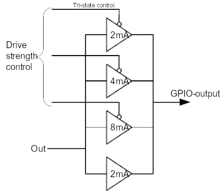

== GPIO pads control

GPIO drive strengths do not indicate a maximum current, but a maximum current under which the pad will still meet the specification. You should set the GPIO drive strengths to match the device being attached in order for the device to work correctly.

=== Control drive strength

Inside the pad are a number of drivers in parallel. If the drive strength is set low (`0b000`), most of these are tri-stated so they do not add anything to the output current. If the drive strength is increased, more and more drivers are put in parallel. The diagram shows that behaviour.

WARNING: On 4-series devices, the current level is half the value shown in the diagram.

=== Current value

The current value specifies the maximum current under which the pad will still meet the specification.

Current value is _not_ the current that the pad will deliver, and is _not_ a current limit.

The pad output is a voltage source:

* If set high, the pad will try to drive the output to the rail voltage (3.3V)
* If set low, the pad will try to drive the output to ground (0V)

The pad will try to drive the output high or low. Success will depend on the requirements of what is connected. If the pad is shorted to ground, it will not be able to drive high. It will try to deliver as much current as it can, and the current is only limited by the internal resistance.

If the pad is driven high and it is shorted to ground, in due time it will fail. The same holds true if you connect it to 3.3V and drive it low.

Meeting the specification is determined by the guaranteed voltage levels. Because the pads are digital, there are two voltage levels, high and low. The I/O ports have two parameters which deal with the output level:

* V~OL~, the maximum low-level voltage (0.14V at 3.3V VDD IO)
* V~OH~, the minimum high-level voltage (3.0V at 3.3V VDD IO)

V~OL~=0.14V means that if the output is Low, it will be \<= 0.14V.
V~OH~=3.0V means that if the output is High, it will be >= 3.0V.

As an example, a drive strength of 16mA means that if you set the pad high, you can draw up to 16mA, and the output voltage is guaranteed to be >=V~OH~. This also means that if you set a drive strength of 2mA and you draw 16mA, the voltage will *not* be V~OH~ but lower. In fact, it may not be high enough to be seen as high by an external device.

There is more information on the xref:raspberry-pi.adoc#gpio[physical characteristics] of the GPIO pins. 

NOTE: On the Compute Module devices, it is possible to change the VDD IO from the standard 3.3V. In this case, V~OL~ and V~OH~ will change according to the table in the xref:raspberry-pi.adoc#gpio[GPIO] section.

The Raspberry Pi 3.3V supply was designed with a maximum current of ~3mA per GPIO pin. If you load each pin with 16mA, the total current is 272mA. The 3.3V supply will collapse under that level of load. Big current spikes will happen, especially if you have a capacitive load. Spikes will bounce around all the other pins near them. This is likely to cause interference with the SD card, or even the SDRAM behaviour.

=== Safe current

All the electronics of the pads are designed for 16mA. This is a safe value under which you will not damage the device. Even if you set the drive strength to 2mA and then load it so 16mA comes out, this will not damage the device. Other than that, there is no guaranteed maximum safe current.

=== GPIO addresses

* 0x 7e10 002c PADS (GPIO 0-27)
* 0x 7e10 0030 PADS (GPIO 28-45)
* 0x 7e10 0034 PADS (GPIO 46-53)

|===
| Bits | Field name | Description | Type | Reset

| 31:24
| PASSWRD
| Must be 0x5A when writing; accidental write protect password
| W
| 0

| 23:5
|
| *Reserved* - Write as 0, read as don't care
|
|

| 4
| SLEW
| Slew rate; 0 = slew rate limited; 1 = slew rate not limited
| RW
| 0x1

| 3
| HYST
| Enable input hysteresis; 0 = disabled; 1 = enabled
| RW
| 0x1

| 2:0
| DRIVE
| Drive strength, see breakdown list below
| RW
| 0x3
|===

Beware of Simultaneous Switching Outputs (SSO) limitations which are device-dependent as well as dependent on the quality and layout of the PCB, the amount and quality of the decoupling capacitors, the type of load on the pads (resistance, capacitance), and other factors beyond the control of Raspberry Pi.

=== Drive strength list

* 0 = 2mA
* 1 = 4mA
* 2 = 6mA
* 3 = 8mA
* 4 = 10mA
* 5 = 12mA
* 6 = 14mA
* 7 = 16mA
